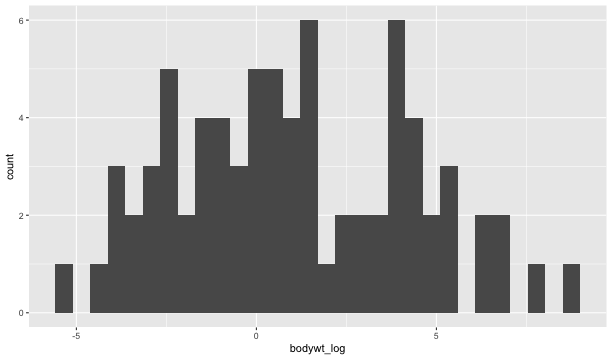
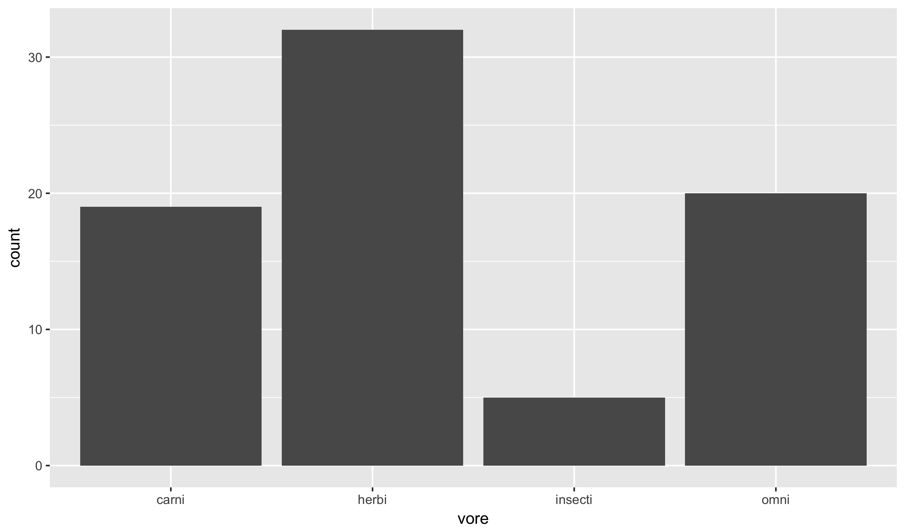
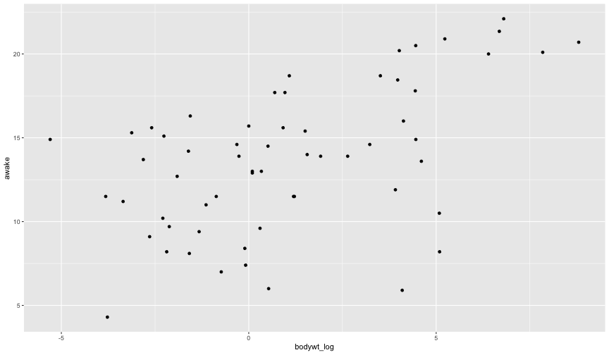
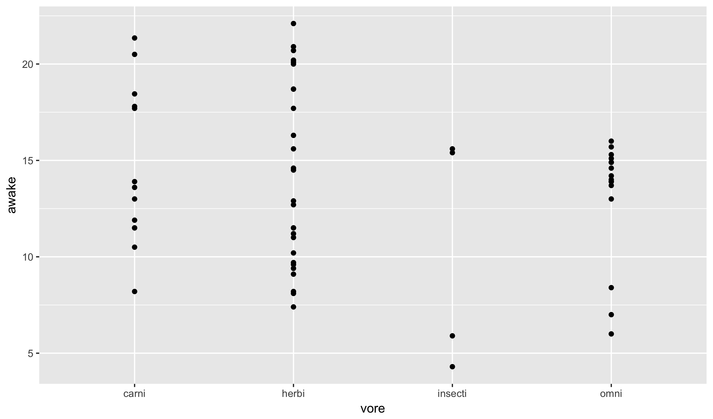
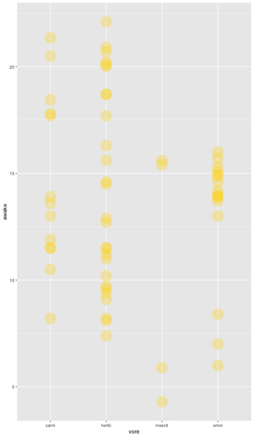

## Basic R

### Markdown

Now, I want to throw you all into the format for the class and
get you started with how assignments will work. This document,
as well as all of your assignments, is written in a format
called **Rmarkdown**. At the moment we are looking at the
source code; if you are familiar with markdown, it is just a
specific flavor of the basic standard.

Plain markdown is just a very simple format for marking up
texts. Unlike write text in a word editor, there is nothing
hidden in a markdown file. If you want something to be in
italics, surround it in single stars like *this*. For bold,
use **two**. Links use the following format:
[site name](http://www.wheretogo.com). If you want to make
something look like code in the output, you can enclose
text in back ticks: `print("Hello!")`.

We can turn markdown into a number of other formats. If I
hit the *preview* button above, it will display what the
HTML version of the document looks like. I'll usually
export this HTML version and put it on the class website
as it is slightly cleaner than the raw format here.

The most powerful feature of **Rmarkdown** is that we can
intermix code into the document and actually run it in real
time. To do this, we enclose code blocks with three backticks,
and preface the first one with r in squiggly brackets. Every
code block will get run in sequence if when we hit the Preview
or Knit buttons, but we can also run just this block by hitting
the play button to the right of the block. Here, let's add
1 and 1 together:


1 + 1



## [1] 2


The output is written directly to the document. This is the
reason I'll often use the raw format in class; it allows us
to modify the code and see the changes as they run.

Note that there are shortcuts for running a chunk of code.
To see them for your platform, look at the menu under the
Run button.

### Packages

In addition to the basic R functions that exist on start-up,
there are thousands of user-contributed packages the implement
various add-ons. To install these packages, we use the function
`install.packages`:


install.packages("readr")


Once a package is installed, we also need to load it. While
installing the package only needs to be done once, we have to
load it each and every time we restart R (notice up above that
I included the option `eval = FALSE` in the code block so that
my computer does not constantly reinstall it):


library(readr)


Once, loaded we can run commands from the **readr** package.
We will do this in just a moment.

### Loading Data

Let's load in three libraries that will be important for
us throughout the semester. Note that I'll turn off messages
as the packages produce quite a bit of verbose output that
we do not need to worry about. Also note that re-loading the
**readr** package has no ill-effects.


library(readr)
library(ggplot2)
library(dplyr)


Next, let's load in a small dataset to work with today.
This data consists of the average number of hours per
day that various species are awake. We'll read the data
set, like most of those in this class, directly from
my website:


msleep <- read_csv("https://statsmaths.github.io/ml_data/msleep.csv")


Once this code has been run, you should see the dataset
pop up in the upper right hand corner of the screen.
Clicking on it opens up a spreedsheet-like view of the
data.

Particularly important are the first three columns, as
most datasets that we work with this semester will have
these columns as well. The meaning

- the first column is just an id; don't lose it!
- the second indicates whether this is a sample where
you know the response or if have to predict the response
- the third column gives the response of interest; it
is missing wheneve the second column is equal to "test"

### qplot

We will use the function `qplot` to produce simple plots
based on our data. In its most basic form, we give `qplot`
the name of the variable we want to plot and the name of
the dataset in which the variable resides.


qplot(bodywt_log, data = msleep)


The function is quite smart and will choose by default the
most appropriate plot to use. Here is creating a *histogram*
because we gave it one numeric variable. Appling `qplot` to
a categorical variable gives a bar plot:


qplot(vore, data = msleep)


We can also give `qplot` two variable. For instance, if we
use two continuous variables the function will construct a
scatter plot:


qplot(bodywt_log, awake, data = msleep)



## Warning: Removed 16 rows containing missing values (geom_point).


The missing values that we are warned about are those points
where we need to produce predictions.

There is not a special name for the plot with a continuous
variable plotted versus a categorical one, but the point
should be clear:


qplot(vore, awake, data = msleep)



## Warning: Removed 16 rows containing missing values (geom_point).


Finally, one can plot two categorical variables, but it is
rarely useful due to overplotting.

### Best-fit line

It seems like there is a positive relationship between body
weight and hours spent awake. We can add a best-fit line to
the plot to model this relationship. Adding things to a
`qplot` graphic literally involves using the `+` sign and
adding the results of other functions.
Here we use `geom_smooth`
with an option to make the smooth strictly linear:


qplot(bodywt_log, awake, data = msleep) +
  geom_smooth(method = "lm")



## Warning: Removed 16 rows containing non-finite values (stat_smooth).



## Warning: Removed 16 rows containing missing values (geom_point).


We can fit the exact some model analytically, rather than graphically,
by calling the `lm` function directly. Here we use an R formula: the
response variable (thing we want to predict), followed by the `~`
sign, followed by the predictor variable. As with the graphics command,
we need to indicate which dataset is being used. The output shows
the slope and intercept of the best-fit-line.


model <- lm(awake ~ bodywt_log, data = msleep)
model



## 
## Call:
## lm(formula = awake ~ bodywt_log, data = msleep)
## 
## Coefficients:
## (Intercept)   bodywt_log  
##     12.9716       0.7128


The function `predict` will give us the predicted values implied
by this line:


predict(model, newdata = msleep)



##         1         2         3         4         5         6         7 
## 15.759974 12.448491 13.185538 10.146737 17.531120 13.932490 15.124130 
##         8         9        10        11        12        13        14 
## 14.852654 14.892262 15.474529 12.745366 14.082221 12.353315 10.966345 
##        15        16        17        18        19        20        21 
## 12.971635  9.195199 13.864556 13.742704 13.349847 18.561589 10.282913 
##        22        23        24        25        26        27        28 
## 17.430492 16.700168 12.785345 14.612829 11.086328 13.822617 11.824490 
##        29        30        31        32        33        34        35 
## 17.820116 17.736168 16.138186 13.659508 15.913297 13.337156 19.246055 
##        36        37        38        39        40        41        42 
## 12.262971 14.337944 10.877925 11.460394 10.582169 10.251230  9.689248 
##        43        44        45        46        47        48        49 
## 12.027755 13.211460 11.859266 10.423121 13.624732 15.834358 15.790665 
##        50        51        52        53        54        55        56 
## 16.600355 16.254023 16.595670 15.272594 13.039569 16.146522 15.803923 
##        57        58        59        60        61        62        63 
## 13.039569 15.889926 12.159491 10.745279 12.759903 11.125393 11.609874 
##        64        65        66        67        68        69        70 
## 12.912204 11.337534 11.842090 16.148591 14.043684 11.411218 16.774314 
##        71        72        73        74        75        76 
## 12.896539 11.358397 16.646061 13.465684 13.839690 13.999581


### Accessing and adding new variables

Columns of the dataset `msleep` can be referenced by
using the dataset name followed by a dollar sign and
the name of the variable. So, for example, here are the
hours spent awake:


msleep$awake



##  [1] 11.90  7.00  9.60    NA 20.00    NA    NA 13.90    NA 18.70 14.60
## [12] 14.00 11.50 13.70 15.70 14.90    NA 18.70  6.00 20.10  4.30    NA
## [23] 20.90 13.90    NA  9.10 11.50 14.20 22.10 21.35 17.80 17.70 16.00
## [34] 14.50 20.70    NA 13.90    NA  9.70 11.20 11.50    NA  9.40 13.00
## [45] 16.30    NA 15.60 20.20    NA  8.20 13.60 10.50 14.60 13.00 20.50
## [56] 18.45 12.90  5.90 11.00 15.30    NA 15.60 12.70  7.40 10.20  8.10
## [67] 14.90 15.40  8.20    NA  8.40 15.10    NA 17.70 11.50    NA


The `NA`'s correspond to the missing values we want to predict.
Similarly, we can add a new variable by simply referencing it
with the `$` and assigning it to something. Here, we add those
predictions back into the msleep dataset:


msleep$awake_pred <- predict(model, msleep)


Click on the msleep dataset again to verify that there is a
new column of predictions. Notice that these are filled in
for all values.

### Prediction solutions

Now, we use the `select` function to pick just a few
variables from `msleep` and save this as a new dataset.
The select function takes the name of the dataset first,
followed by whatever variable names we want to keep. Here
we include just the observation id and our prediction:


submit <- select(msleep, obs_id, awake_pred)


Look at the `submit` dataset and verify that it is what
you would expect.

Finally, the `write_csv` function will save a dataset
to a file. Each of the columns will be seperated by a
comma (that's what the 'c' stands for in csv) and the
rows will be seperated by a new line:


write_csv(submit, "class01_submit.csv")


This is the kind of file I expect you to produce for
each class assignment. Notice that we've created predictions
for all of the data, even though we already know some of the
values. It is often easier to do this and avoids the mistake
of predicting on the wrong set. Of course, I'll only grade
you on the set that you were not able to see.

## GitHub Classroom

Now you should be familiar with the basics of using R to read
data, create visualizations, and produce predictions. Let's go
through and show how to put these together to produce and subit
your daily labs. I will do this interactively, but here are
the steps in case you are returning to these notes at a later
time:

1. I will send a link to your e-mail that you should follow
and accept. Assuming you have a valid GitHub account, this
will set up a repository where all of your labs for this semester
should be posted.
2. Select the lab you would like to work on (`lab01.Rmd` here)
and click on the link.
3. Now, click on the **Raw** button. This should take you to
the raw notebook file. Download this through your browser somewhere
on your computer.
4. Open this file in RStudio and work through the questions.
5. When you are finished, select the `Knit to HTML` button. This
should create an html file in the same location that you saved
the Rmd file. You should also have a file `class01_submit.csv`
in the same location.
6. Return to GitHub and drag and drop the three files into your
respository. Commit these to the repository with the **Commit changes**
button and then you are done! If dragging and dropping does not work
(only officially support on Chrome I believe), select **Upload files**
and do so manually.
7. There should already be a `lab02.Rmd` for you to work on for the
next class. New labs will show up automatically as we proceed through
the semester.

Remember that labs are due online 90 minutes before class starts
(noon on Tuesdays and Thursdays).

