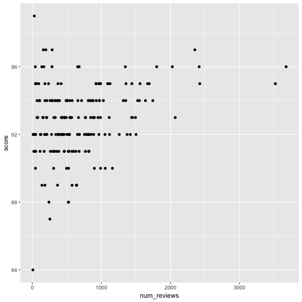
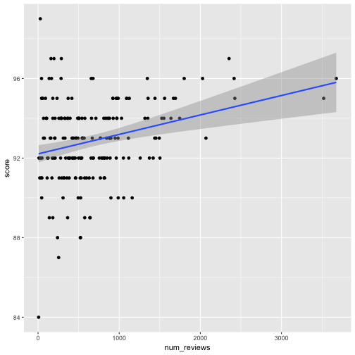


library(readr)
library(ggplot2)
library(dplyr)


## tea


tea <- read_csv("~/files/ml_data/tea.csv")



qplot(num_reviews, score, data = tea)



qplot(num_reviews, score, data = tea) +
  geom_smooth(method = "lm")


$$ \text{mean} (Y_i) = \alpha + \beta * X_i $$

$$ Y_i = \alpha + \beta * X_i + \epsilon_i, \quad mean(\epsilon_i) = 0 $$

$$ \alpha, \beta \in \arg\min \left\{ \left. \sum_i \left(y_i - a - b x_i \right)^2 \quad \right| \quad a, b \in \mathbb{R} \right\} $$


tea$score_pred <- 89 + tea$num_reviews * 0.002
qplot(num_reviews, score, data = tea) +
  geom_line(aes(num_reviews, score_pred), color = "orange") +
  geom_segment(aes(xend = num_reviews, yend = score_pred), alpha = 0.5)



model <- lm(score ~ num_reviews, data = tea)
model



## 
## Call:
## lm(formula = score ~ num_reviews, data = tea)
## 
## Coefficients:
## (Intercept)  num_reviews  
##   9.221e+01    9.781e-04



summary(model)



## 
## Call:
## lm(formula = score ~ num_reviews, data = tea)
## 
## Residuals:
##     Min      1Q  Median      3Q     Max 
## -8.2165 -1.2108  0.0613  1.3108  6.7629 
## 
## Coefficients:
##              Estimate Std. Error t value Pr(>|t|)    
## (Intercept) 9.221e+01  2.221e-01 415.109  < 2e-16 ***
## num_reviews 9.781e-04  2.479e-04   3.945 0.000112 ***
## ---
## Signif. codes:  0 '***' 0.001 '**' 0.01 '*' 0.05 '.' 0.1 ' ' 1
## 
## Residual standard error: 1.998 on 188 degrees of freedom
##   (48 observations deleted due to missingness)
## Multiple R-squared:  0.07646,	Adjusted R-squared:  0.07155 
## F-statistic: 15.57 on 1 and 188 DF,  p-value: 0.0001124



tea$score_pred <- predict(model, newdata = tea)



qplot(num_reviews, score, data = tea) +
  geom_point(aes(num_reviews, score_pred), color = "orange")



sqrt(mean((tea$score - tea$score_pred)^2, na.rm = TRUE))



## [1] 1.987864



sqrt(mean((tea$score - mean(tea$score, na.rm = TRUE))^2, na.rm = TRUE))



## [1] 2.068521



table(tea$train_id)



## 
##  test train valid 
##    48   142    48



model <- lm(score ~ num_reviews, data = tea,
            subset = train_id == "train")
tea$score_pred <- predict(model, newdata = tea)
model



## 
## Call:
## lm(formula = score ~ num_reviews, data = tea, subset = train_id == 
##     "train")
## 
## Coefficients:
## (Intercept)  num_reviews  
##    92.14752      0.00102



sqrt(tapply((tea$score - tea$score_pred)^2, tea$train_id, mean))



##     test    train    valid 
##       NA 2.021110 1.887916


$$ Y_i = \alpha + \beta * X_i + \gamma * Z_i + \epsilon_i, \quad mean(\epsilon_i) = 0 $$


model <- lm(score ~ num_reviews + price, data = tea,
            subset = train_id == "train")
tea$score_pred <- predict(model, newdata = tea)
model



## 
## Call:
## lm(formula = score ~ num_reviews + price, data = tea, subset = train_id == 
##     "train")
## 
## Coefficients:
## (Intercept)  num_reviews        price  
##   91.560658     0.001289     0.017157



sqrt(tapply((tea$score - tea$score_pred)^2, tea$train_id, mean))



##     test    train    valid 
##       NA 1.973621 1.737290



tea$num_reviews_square <- tea$num_reviews^2
model <- lm(score ~ num_reviews + num_reviews_square,
            data = tea,
            subset = train_id == "train")
tea$score_pred <- predict(model, newdata = tea)
model



## 
## Call:
## lm(formula = score ~ num_reviews + num_reviews_square, data = tea, 
##     subset = train_id == "train")
## 
## Coefficients:
##        (Intercept)         num_reviews  num_reviews_square  
##          9.229e+01           6.115e-04           1.580e-07



sqrt(tapply((tea$score - tea$score_pred)^2, tea$train_id, mean))



##     test    train    valid 
##       NA 2.017692 1.873515



tea$is_masters <- as.numeric(tea$type == "masters")
model <- lm(score ~ num_reviews + is_masters,
            data = tea,
            subset = train_id == "train")
tea$score_pred <- predict(model, newdata = tea)
model



## 
## Call:
## lm(formula = score ~ num_reviews + is_masters, data = tea, subset = train_id == 
##     "train")
## 
## Coefficients:
## (Intercept)  num_reviews   is_masters  
##   91.865239     0.001236     2.486103



sqrt(tapply((tea$score - tea$score_pred)^2, tea$train_id, mean))



##     test    train    valid 
##       NA 1.942309 1.696377



qplot(num_reviews, score, data = tea) +
  geom_point(aes(num_reviews, score_pred), color = "orange")



submit <- select(tea, obs_id, score_pred)
write_csv(submit, "class02_submit.csv")


NOTES: Brute force algorithm for OLS?
