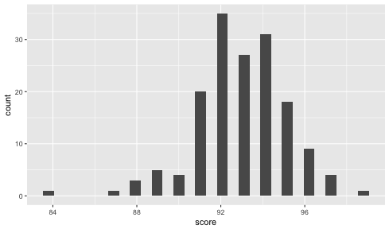
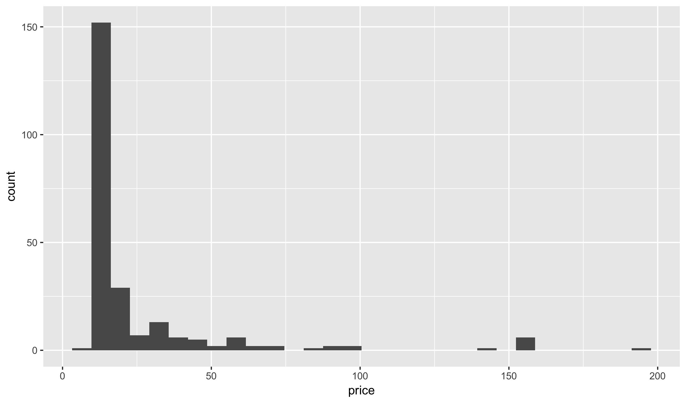
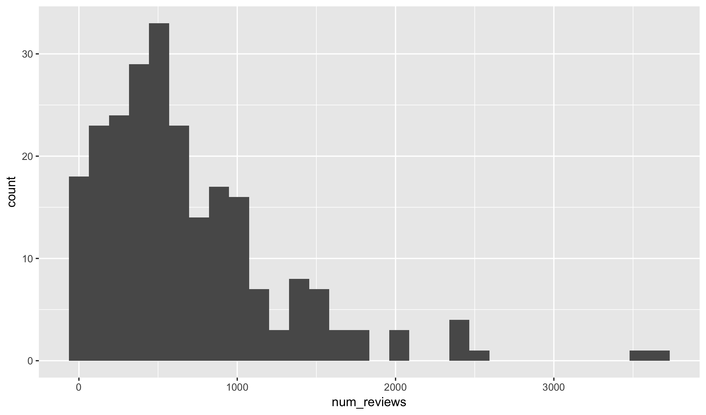
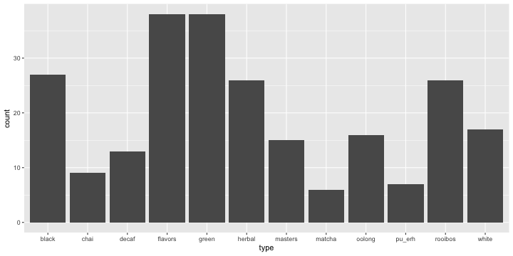
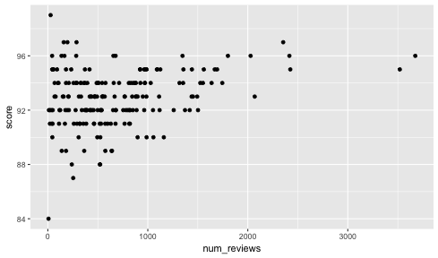
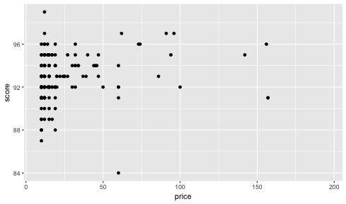
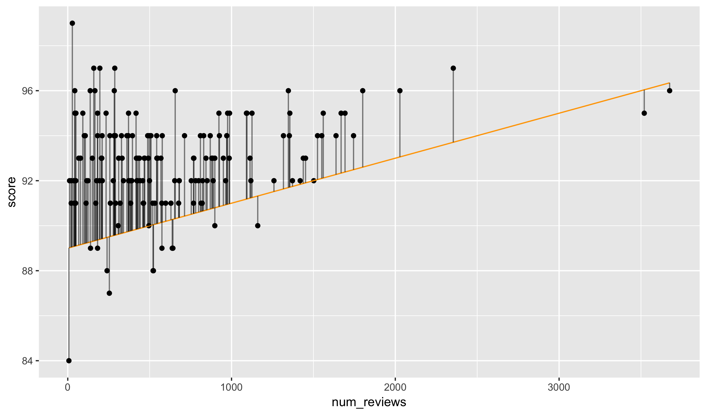
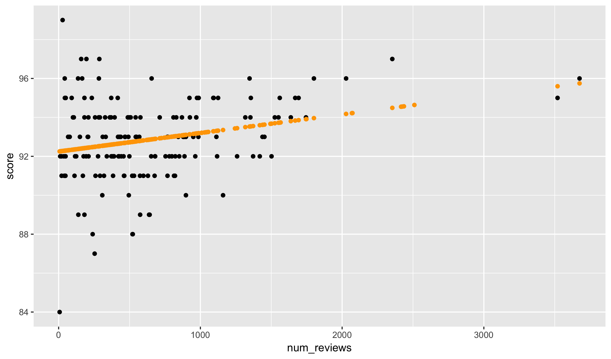


library(readr)
library(ggplot2)
library(dplyr)


## Tea Reviews

Today we are going to fill in some of the gaps left from the
last class about building exploratory graphics and linear 
models. The title for this class comes from an experiment
described in the 1935 text *The Design of Experiments* by
Sir Ronald Fisher, one of the founding fathers of modern
statistics. 

We are going to look at a different dataset of teas. Specifically,
tea reviews from the [Adagio Tea](http://www.adagio.com/) website.
I collected this dataset about 12 months ago, so it should be
similar but not exactly the same as what is one the site today.
Let's read the data into R from my website as we have done with
the mammals and abalone datasets:


tea <- read_csv("~/files/ml_data/tea.csv")


Opening the data in the data viewer, we see the required first
two columns and the response of interest: the average score
assigned to the tea by customers. 

Variables available to predict the output are the type of tea,
the number of reviews received the price of the tea. The latter
is given in estimated cents per cup as reported on the site.
We also have the full name of the tea.

## Exploratory analysis

### Univariate plots

Before doing anything else, let's try to understand the distribution
of each of the variables.


qplot(score, data = tea)



## `stat_bin()` using `bins = 30`. Pick better value with `binwidth`.


The score values are generally very high, with most of them above 88.
All of the scores are whole integers, and the most common values are
between 92 and 95.


qplot(price, data = tea)



## `stat_bin()` using `bins = 30`. Pick better value with `binwidth`.


The price variable is heavily skewed, with a few very expensive teas.
Most are well under a quarter per cup.


qplot(num_reviews, data = tea)



## `stat_bin()` using `bins = 30`. Pick better value with `binwidth`.


The number of reviews also have a bit of skew, but not nearly as
strongly as the price variable.


qplot(type, data = tea)


There are twelve types of tea, with some having only a few samples
and others having over thirty.

### Bivariate plots

Now, we can proceed to bivariate plots showing the relationship
between each variable and the response.


qplot(num_reviews, score, data = tea)


There seems to be a slight positive relationship between the number of
reviews and the score.


qplot(price, score, data = tea)


Given the skew of the plot, it is hard to figure out the exact relationship
between price and score.

## Linear Models

Last time I used the `geom_smooth` function to put what I 
called a best-fit line onto the plot. We then used the `lm`
function to estimate the slope and intercept of this line
numerically. Let's try to formalize this concept now.

The classical linear regression model assumes that the 
average value, or mean, of the response Y is a linear
function of X. Symbollically, with the index i representing
the i'th sample, this gives:

$$ \text{mean} (Y_i) = \alpha + \beta * X_i $$

Similarly, we can write that Y is equal to a fixed linear
effect dependent on X plus a random variable epsilon with
zero mean.

$$ Y_i = \alpha + \beta * X_i + \epsilon_i, \quad mean(\epsilon_i) = 0 $$

The estimation task here is to find reasonable estimates for
the alpha and beta components given pairs of observations (X, Y).
There are many ways of doing this but by far the most common is
to use what is known as **Ordinary Least Squares** or OLS.
This selects the alpha and beta that minimize the squared errors
implied by the linear model. As before, let's write this down
symbolically:

$$ \alpha, \beta \in \arg\min \left\{ \left. \sum_i \left(y_i - a - b x_i \right)^2 \quad \right| \quad a, b \in \mathbb{R} \right\} $$

A natural question is to ask why we are interested in the squared
errors. We could just as likely ask for the minimizer of the
absolute value of the errors or the minimizer of the maximum 
errors. 

I can offer two justifications of the squared error, one numerical
and one statistical. Using the squared error, unlike the absolute
errors or maximum errors, produces a smooth function. That is, a 
function that has an infinite number of deriviates at every point
(although, all derivates after 2 are equal to zero). This makes it
easier to find a solution to the linear equation. Secondly, if the
errors are distributed as a normal random variable the OLS estimator
is equivalent to the maximum likelihood estimator (MLE). 

## Linear Models - Visually

In order to better understand linear models, it helps to see a
picture. Below I have drawn a line through our dataset and 
indicated the errors (also known as residuals) that the oridinary
least squares is concerned with minimizing. Note: don't worry
much about the code producing this graphic, concentrate just on 
the output for now.


tea$score_pred <- 89 + tea$num_reviews * 0.002
qplot(num_reviews, score, data = tea) +
  geom_line(aes(num_reviews, score_pred), color = "orange") +
  geom_segment(aes(xend = num_reviews, yend = score_pred), alpha = 0.5)


Notice that this line under-guesses most of the score of teas, particularly
if the number of reviews is low.

## Brute Force

How can we figure out what the best alpha and beta are for this
model? The most straightforward way would be to just try a large
number of values and see which one minimizes the response. This
is largely impractical but useful to see in this small example.
It will also let you see some more involved R code.

To start, we construct variables to hold the best sum of squares,
alpha, and beta values. We then create a double loop cycling
over all combinations of alpha and beta and testing whether the
given configuration gives a better sum of squares compared to
our current best value.


best_ss <- Inf
best_a <- Inf
best_b <- Inf
for (a in seq(75, 120)) {
  for (b in seq(0.0001, 0.01, by = 0.0001)) {
    tea$score_pred <- a + tea$num_reviews * b
    ss <- sum((tea$score_pred - tea$score)^2, na.rm = TRUE)
    if (ss < best_ss) {
      best_a <- a
      best_b <- b
      best_ss <- ss
    }
  }
}
sprintf("best sum of squares=%03.02f at alpha=%03.01f and beta=%0.03f",
        best_ss, best_a, best_b) 



## [1] "best sum of squares=754.67 at alpha=92.0 and beta=0.001"


## Using lm

Now, let's compare the brute force algorithm with the lm function:


model <- lm(score ~ num_reviews, data = tea)
model



## 
## Call:
## lm(formula = score ~ num_reviews, data = tea)
## 
## Coefficients:
## (Intercept)  num_reviews  
##   9.221e+01    9.781e-04


Our brute-force solution is actually quote close to this! Of
course, it depended on me knowing approximately what the right
slope and intercept should be. In this case that was easy 
graphically, but in more complex example it is a much more
challenging task.

Let's use the predict function again to fit this model
to our data:


tea$score_pred <- predict(model, newdata = tea)


And now plot the fitted values. Does it visually
correspond to where you would expect the best fit
line to run?


qplot(num_reviews, score, data = tea) +
  geom_point(aes(num_reviews, score_pred), color = "orange")


## Evaluating models

How should be evaluate the predictive ability of a model?
The method of oridinary least squares suggests that we 
should consider the sum of squared errors. A challenge with
this is that the value of a sum will grow in proportion to
how many observations there are. This makes it hard to compare
results across data sources and subsets. A simple solution
is to use the average value of the squared errors, known as
the mean squared error or MSE:


mean((tea$score - tea$score_pred)^2, na.rm = TRUE)



## [1] 3.951604


This works as a general measurment of error, but the units
are a bit strange as they are given in squared scores. A
simple solution to this exists by taking the square root
of the MSE, resulting in the root mean squared error (RMSE):


sqrt(mean((tea$score - tea$score_pred)^2, na.rm = TRUE))



## [1] 1.987864


You'll find references to the RMSE through the literature on
machine learning as it is by far the most common measurment
for predictiveness of continuous responses.

How good of a result is our RMSE of 1.99? It's hard to say
for sure, but one easy thing to do is to compare it to the
simpliest possible model: the one that predicts every score
will be equal to the average score. The RMSE of this estimator
is given by:


sqrt(mean((tea$score - mean(tea$score, na.rm = TRUE))^2, na.rm = TRUE))



## [1] 2.068521


So, we have improved on the baseline model, but not by a large
amount. Note: if you are familiar with the standard error, the
RMSE of the mean is *almost* equal to the standard error of 
the response.

## Validation Sets

One potential difficulty with the approach above is that we are
using the same data to validate models that we used to construct
them. In this simple case it is unlikely to cause problems, but
it will be a huge problem going forward as we look towards more
complex prediction schemes. 

So far, I have discuss that the observations are split into two
groups: those where we know the response and those where we need
to predict the responses. Looking at a table of the `train_id`
variable we see that their are actual three subsets of data:


table(tea$train_id)



## 
##  test train valid 
##    48   142    48


The response is missing only on the 48 observations labels with
the test flag. What is the purpose of the validation label? When
building models, we should only train using the training set.
The validation set then can be used to *validate* how good the
model is working. We can use it to make decisions about which of
the various models we want to use for our final prediction.

In order to only using the training set when fitting a model with
the `lm` function, we add an option called `subset`:


model <- lm(score ~ num_reviews, data = tea,
            subset = train_id == "train")
tea$score_pred <- predict(model, newdata = tea)
model



## 
## Call:
## lm(formula = score ~ num_reviews, data = tea, subset = train_id == 
##     "train")
## 
## Coefficients:
## (Intercept)  num_reviews  
##    92.14752      0.00102


Notice that the exact values for the linear model have changed slighty,
though as mentioned previously in this simple case we would not expect
the parameters to change much when removing the validation set.

Now, we will update our RMSE code to produce the RMSE on each training
id type; the testing variable will be missing (`NA`) for you, but when
I run this code on the full data I will be able to see how well you 
did on the hidden data. Don't worry about the specifics of the function
`tapply` here. I suggest just copying this code whenever you need it
and changing the response and dataset names as appropriate:


sqrt(tapply((tea$score - tea$score_pred)^2, tea$train_id, mean))



##     test    train    valid 
##       NA 2.021110 1.887916


Notice here that the training dataset actually has a worse RMSE than
the validation data. This is a common phenomenon with small and medium
sized datasets but often strikes students as very confusing. Shouldn't
the model do better on data it was trained with compared to data it
was not trained on?

The explanation is simply that, due to random chance, the validation
data is noisier than the training data. So, naturally the RMSE of a
simple model is lower on the validation set regardless of which 
chunk the model was fit on.

## Multivariate linear regression

The linear regression model I just introduced is known
as simple linear regresssion because there is only one
explanatory variable. We can easy consider multivariate
models; for instance, we can be write a two variable
model mathematically as follows:

$$ Y_i = \alpha + \beta * X_i + \gamma * Z_i + \epsilon_i, \quad mean(\epsilon_i) = 0 $$

The geometric interpretation of this is that we have plane
in place of the line in the simple linear regression model.

When I teach an applied statistics course, we spend a lot
of time working up to multivariate regression models. The
interpretation of multivariate models can quickly become
quite complex. However, using multivariate models in 
statistical learning is much easier to understand: each
slope coefficent (beta and gamma here) corresponds to a
weight placed on how much the response changes with each
predictor variable.

Fitting multivariate models is also quite easy with the
`lm` function. Simply add the variables together that
you would like to use for prediction. Here we use both
the number of reviews and the price of the tea (from
now on, unless otherwise specified, we will only use
the training data to fit models):


model <- lm(score ~ num_reviews + price, data = tea,
            subset = train_id == "train")
tea$score_pred <- predict(model, newdata = tea)
model



## 
## Call:
## lm(formula = score ~ num_reviews + price, data = tea, subset = train_id == 
##     "train")
## 
## Coefficients:
## (Intercept)  num_reviews        price  
##   91.560658     0.001289     0.017157


Let's take a look at the RMSE of this new model:


sqrt(tapply((tea$score - tea$score_pred)^2, tea$train_id, mean))



##     test    train    valid 
##       NA 1.973621 1.737290


Notice that the predictiveness of the model has been
greatly improved over the simple linear regression from
before.

## Multivariate regression with categorical data

We can just as easily add categorical data into our
model. Next week we will cover the specifics of what
is internally being done here, but for now let's just
see what adding the `type` variable to the model does
to the output:


model <- lm(score ~ num_reviews + type + price,
            data = tea,
            subset = train_id == "train")
tea$score_pred <- predict(model, newdata = tea)
model



## 
## Call:
## lm(formula = score ~ num_reviews + type + price, data = tea, 
##     subset = train_id == "train")
## 
## Coefficients:
## (Intercept)  num_reviews     typechai    typedecaf  typeflavors  
##   92.408787     0.001258    -0.338052     0.487030    -1.670747  
##   typegreen   typeherbal  typemasters   typematcha   typeoolong  
##   -0.229196    -0.288081     2.121468    -1.871282     0.362241  
##  typepu_erh  typerooibos    typewhite        price  
##   -0.998772    -0.480457    -0.785548    -0.001596


Notice that it appears that we now have a seperate term for
each type of tea. If you look more carefully you'll see that
there is no mention of black tea in the list. We will see why
this is next week as well.

The RMSE of this new model makes improvements on both the
training and validation sets:


sqrt(tapply((tea$score - tea$score_pred)^2, tea$train_id, mean))



##     test    train    valid 
##       NA 1.824072 1.702487


However, notice that the training set improved significantly
more than the validation set. We are starting to see the effects
of what is known as *overfitting*, where the model starts
predicting random noises in the training data that do not generalize
into the validation set. This will be a major theme throughout
the entire semester.

