
library(readr)
library(ggplot2)
library(dplyr)
library(viridis)


## Cars Dataset

Today we are going to look at another classic datasets in statistics
featuring data about a number of automobiles.


cars <- read_csv("https://statsmaths.github.io/ml_data/mpg.csv")


Our goal today is to estimate the city fuel efficency of each car.
The variable is fairly concentrated around a few values without any
extreme outliers:


qplot(cty, data = cars)


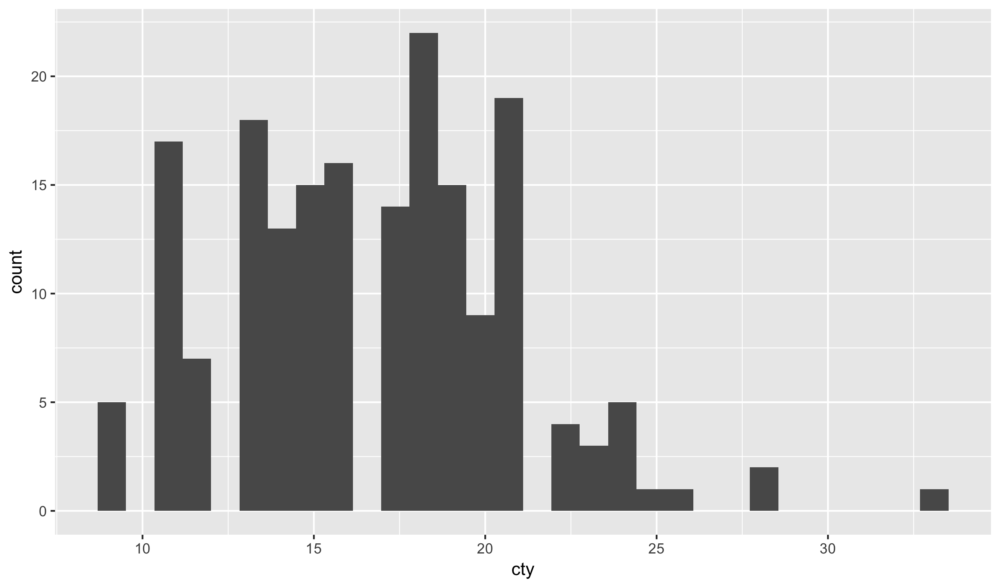

The variable `displ` is negatively related to the fuel efficency
of the car, as we can see in the following plot:


qplot(displ, cty, data = cars, size = I(6))


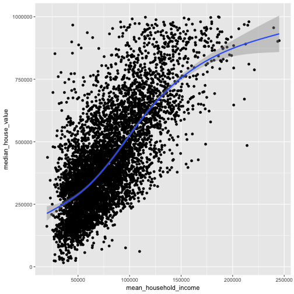

Within this plot, we can mark the classes of cars.


qplot(displ, cty, data = cars, color = class, size = I(5))


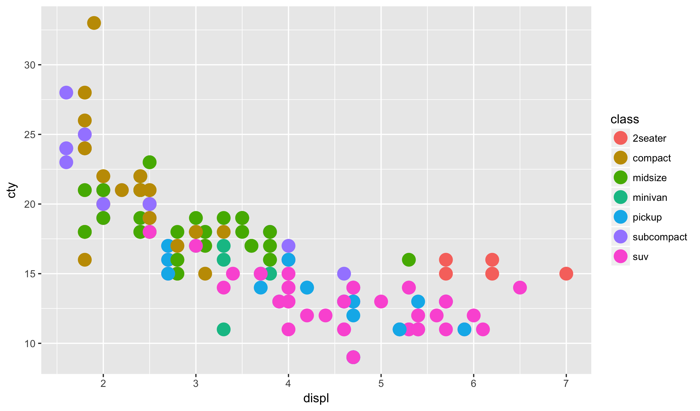

Do the car classes generally seem to be where you would expect them?

## Multivariate regression with categorical data

It would be reasonable to start with a regression model
that uses `displ` to predict the response variable.
We can just as easily add categorical data into our
model. Next week we will cover the specifics of what
is internally being done here, but for now let's just
see what adding the `class` variable to the model does
to the output:


model <- lm(cty ~ displ + class,
            data = cars)
cars$score_pred <- predict(model, newdata = cars)
model



## 
## Call:
## lm(formula = cty ~ displ + class, data = cars)
## 
## Coefficients:
##     (Intercept)            displ     classcompact     classmidsize  
##          27.236           -1.921           -2.566           -2.903  
##    classminivan      classpickup  classsubcompact         classsuv  
##          -5.015           -5.862           -2.190           -5.256


Notice that it appears that we now have a separate term for
each class of car. If you look more carefully you'll see that
there is no mention of "2seater" in the list. This value is
excluded because otherwise we would have perfect collinearity
between the variables (a violation of the model assumptions)

The model created here can be thought of as a set of parallel
lines, one for each class of car. We can see that here:


ggplot(cars, aes(displ, cty_pred)) +
  geom_line(aes(color = class)) +
  geom_point(aes(color = class))



## Error in eval(expr, envir, enclos): object 'cty_pred' not found


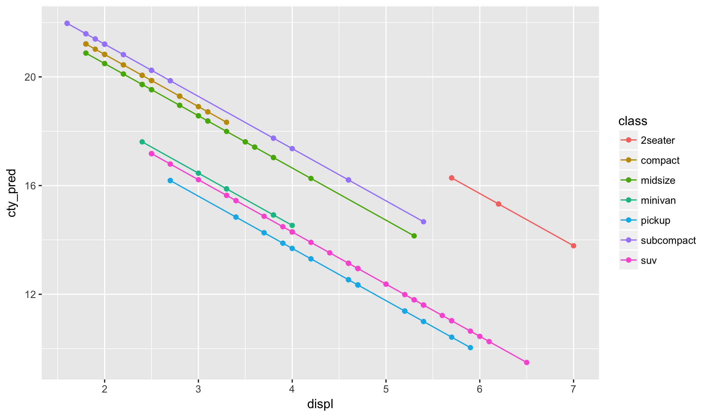

Notice, for example, that compact and midsize have very close
estimates in the regression model and very close lines on the
plot.

Here, we have different offsets for each class but the same slope.
It is possible, easy in fact, to have different slopes and the same
intercept. We simply use the `:` sign instead of the `+` sign in
the formula specification.


model <- lm(cty ~ displ:class,
            data = cars)
cars$cty_pred <- predict(model, newdata = cars)
model



## 
## Call:
## lm(formula = cty ~ displ:class, data = cars)
## 
## Coefficients:
##           (Intercept)     displ:class2seater     displ:classcompact  
##                24.267                 -1.433                 -1.849  
##    displ:classmidsize     displ:classminivan      displ:classpickup  
##                -1.874                 -2.499                 -2.538  
## displ:classsubcompact         displ:classsuv  
##                -1.748                 -2.377


Here, the model gives the difference between each classes slope and
the baseline slope.


ggplot(cars, aes(displ, cty_pred)) +
  geom_line(aes(color = class)) +
  geom_point(aes(color = class))


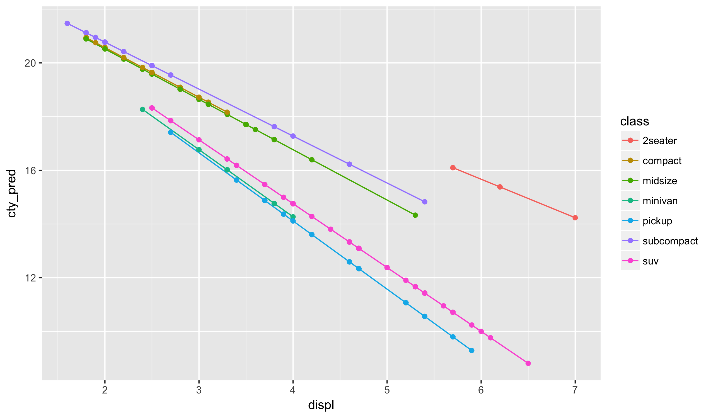

Finally, we could use a `*` in place of the `:` to have different slopes
and intercepts.

## Validation Sets

One potential difficulty with our approach so far is that we are
using the same data to validate models that we used to construct
them. In this simple case it is unlikely to cause problems, but
it will be a huge problem going forward as we look towards more
complex prediction schemes.

So far, I have discussed that the observations are split into two
groups: those where we know the response and those where we need
to predict the responses. Looking at a table of the `train_id`
variable we see that their are actual three subsets of data:


table(cars$train_id)



## 
##  test train valid 
##    47   140    47


The response is missing only on the 47 observations labels with
the test flag. What is the purpose of the validation label? When
building models, we should only train using the training set.
The validation set then can be used to *validate* how good the
model is working. We can use it to make decisions about which of
the various models we want to use for our final prediction.

In order to only using the training set when fitting a model with
the `lm` function, we add an option called `subset`:


model <- lm(cty ~ displ + class, data = cars,
            subset = train_id == "train")
cars$score_pred <- predict(model, newdata = cars)
model



## 
## Call:
## lm(formula = cty ~ displ + class, data = cars, subset = train_id == 
##     "train")
## 
## Coefficients:
##     (Intercept)            displ     classcompact     classmidsize  
##          27.533           -1.970           -2.345           -2.677  
##    classminivan      classpickup  classsubcompact         classsuv  
##          -5.271           -5.915           -2.258           -5.382


Notice that the exact values for the linear model have changed slightly,
though as mentioned previously in this simple case we would not expect
the parameters to change much when removing the validation set.

Now, we will update our RMSE code to produce the RMSE on each training
id type; the testing variable will be missing (`NA`) for you, but when
I run this code on the full data I will be able to see how well you
did on the hidden data. Don't worry about the specifics of the function
`tapply` here. I suggest just copying this code whenever you need it
and changing the response and dataset names as appropriate:


sqrt(tapply((cars$cty - cars$score_pred)^2, cars$train_id, mean))



##     test    train    valid 
##       NA 2.105202 1.984305


Notice here that the training dataset actually has a worse RMSE than
the validation data. This is a common phenomenon with small and medium
sized datasets but often strikes students as very confusing. Shouldn't
the model do better on data it was trained with compared to data it
was not trained on?

The explanation is simply that, due to random chance, the validation
data is noisier than the training data. So, naturally the RMSE of a
simple model is lower on the validation set regardless of which
chunk the model was fit on.

Now, let's try to add the manufacturer of each car to the model:


model <- lm(cty ~ displ + class + manufacturer, data = cars,
            subset = train_id == "train")
cars$score_pred <- predict(model, newdata = cars)
model



## 
## Call:
## lm(formula = cty ~ displ + class + manufacturer, data = cars, 
##     subset = train_id == "train")
## 
## Coefficients:
##            (Intercept)                   displ            classcompact  
##                22.2082                 -1.8521                  0.1239  
##           classmidsize            classminivan             classpickup  
##                -1.1580                 -2.9684                 -4.2115  
##        classsubcompact                classsuv   manufacturerchevrolet  
##                -1.3561                 -4.0894                  4.6007  
##      manufacturerdodge        manufacturerford       manufacturerhonda  
##                 2.6190                  3.4267                  7.5465  
##    manufacturerhyundai        manufacturerjeep  manufacturerland rover  
##                 2.2037                  4.4440                  1.3452  
##    manufacturerlincoln     manufacturermercury      manufacturernissan  
##                 3.2158                  2.9933                  4.1827  
##    manufacturerpontiac      manufacturersubaru      manufacturertoyota  
##                 2.9136                  3.3426                  4.0637  
## manufacturervolkswagen  
##                 3.0164


The RMSE of this new model makes improvements on both the
training and validation sets:


sqrt(tapply((cars$cty - cars$score_pred)^2, cars$train_id, mean))



##     test    train    valid 
##       NA 1.724223 1.810576


However, notice that the training set improved significantly
more than the validation set. We are starting to see the effects
of what is known as *overfitting*, where the model starts
predicting random noises in the training data that do not generalize
into the validation set. This will be a major theme throughout
the entire semester.

## Solving OLS

Let's now return to calculating the solution to the linear regression
model. I want to illustrate two general techniques that will help us
understand the more complex models we'll cover in the upcoming weeks.

Recall that we are assuming that data are distributed as:

$$ y_i = \alpha + x_i \beta $$

We can define the OLS estimator by giving a name to the sum
of squares:

$$ f(\alpha, \beta) = \sum_i (y_i - \alpha - x_i \beta )^2 $$

Then, the OLS estimator is given by an optimization problem:

$$ \widehat{\alpha}, \widehat{\beta} \in \arg\min_{a,b \in \mathbb{R}}
  \left\{ f(a, b) \right\} $$

This is a very useful formulation because most ML algorithms
are written as optimization problems. It will be helpful to
compute the partial derivaties of f with respect to alpha and
beta:

$$\begin{align} \frac{\partial f}{\partial \alpha}
  &=\sum_i 2 \cdot (y_i - \alpha - x_i \beta) \cdot (-1)\\
  &= - \sum_i 2 \cdot (y_i - \alpha - x_i \beta)
  \end{align}
$$

And

$$\begin{align} \frac{\partial f}{\partial \beta}
  &=\sum_i 2 \cdot (y_i - \alpha - x_i \beta) \cdot (-x_i)\\
  &= - \sum_i 2 x_i \cdot (y_i - \alpha - x_i \beta)
  \end{align}
$$

Putting these together, the gradient of f is just:

$$ \nabla f = \left( \begin{array}{cc} \frac{\partial f}{\partial \alpha} \\
                                \frac{\partial f}{\partial \beta} \end{array} \right)
            = -1 \cdot \left( \begin{array}{cc}\sum_i 2 \cdot (y_i - \alpha - x_i \beta)  \\
                                \sum_i 2 x_i \cdot (y_i - \alpha - x_i \beta) \end{array} \right)
$$

Of course, one way to solve this equation would be to set both derivatives
equal to zero. The ability to do this is a privilege of the OLS model and
will not generalize to other models. Instead, lets use the gradient and
partial derivatives to iteratively solve the equation. There are two basic
techniques for doing this, both useful in different situations.

## Coordinate descent

The idea of Coordinate descent is to cycle through the variables,
optimizing our function univariately one variable at a time. Doing
this many times seems like a reasonable approach to minimizing the
function.

So, if we start with alpha, how would we update alpha given a fixed
beta? We just set the partial derivative to zero:

$$ \begin{align} 0
  &= \sum_i (y_i - \alpha - x_i \beta) \\
  \sum_i \alpha &= \sum_i (y_i - x_i \beta) \\
  n \alpha &= \sum_i (y_i - x_i \beta) \\
  \alpha &\leftarrow \frac{1}{n} \cdot \sum_i(y_i - x_i \beta)
  \end{align}
$$

Similarly, if we have a fixed alpha, to update beta we set the partial
derivative to zero:

$$ \begin{align} 0
  &= \sum_i x_i \cdot (y_i - \alpha - x_i \beta) \\
  \beta \sum_i x_i^2 &= \sum_i   y_i x_i - \alpha x_i) \\
  \beta &\leftarrow \frac{\sum_i y_i x_i - \alpha x_i}{\sum_i x_i^2} \\
  \end{align}
$$

Let's implement this in R, saving our results as we go:


y <- cars$cty[cars$train_id == "train"]
x <- cars$displ[cars$train_id == "train"]
n <- length(y)
iter <- 100

alpha_vals <- rep(0, iter)
beta_vals <- rep(0, iter)

for (i in 2:iter) {
  # update alpha
  alpha_vals[i] <- (1 / n) * sum(y - x * beta_vals[i-1])

  # update beta
  beta_vals[i] <- sum(y * x - alpha_vals[i] * x) / sum(x^2)
}

df <- data_frame(iter = rep(1:iter, each = 2),
                 alpha = rep(alpha_vals, each = 2),
                 beta = lag(rep(beta_vals, each = 2), 1, default = 0))


The somewhat complex code at the end comes from my desire to
save each individual step as its own row in the dataset `df`
in order to plot exactly what is going on.


co <- coef(lm(cty ~ displ, data = cars, subset = train_id == "train"))
qplot(alpha, beta, data = df[-1,], geom = c("point", "line")) +
  annotate("point", x = co[1], y = co[2], col = 'red', size = I(5)) +
  theme_minimal()


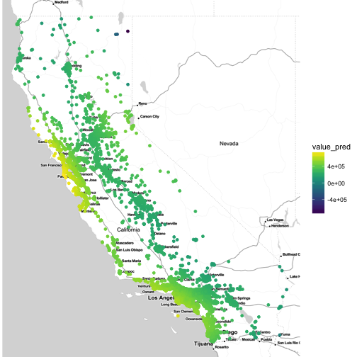

## Gradient descent

Coordinate descent forces us to iterate parallel to the axes of
the data. It is like being constrained to moving along blocks in
NYC rather than cutting across by more direct diagonals. Gradient
descent modifies this approach by moving a small amount in the
direction (or opposite direction, in the case of minimization) of
the gradient of the function f. Specifically, we iteratively
update according to:

$$ x_{new} = x - \rho \cdot \nabla f, \quad \rho > 0 $$

Where rho is some fixed tuning parameter that determines how long
each step is. It will be useful to write our algorithm for solving
OLS via gradient descent as a function. Functions in R are blocks of
code that we can automate with modified parameters. For example, the
following adds the first input to twice the second input:


myfun <- function(first_num, second_num) {
  return(first_num + second_num * 2)
}
myfun(1,1)



## [1] 3



myfun(1,2)



## [1] 5



myfun(2,1)



## [1] 4


We'll write a function to fit gradient descent:


grad_descent <- function(x, y, iter, rho) {
  alpha_vals <- rep(0, iter)
  beta_vals <- rep(0, iter)
  n <- length(y)

  for (i in 2:iter) {
    # compute gradient
    grad <- -2 * c(sum(y - alpha_vals[i-1] - x * beta_vals[i-1]),
                   sum(y*x - alpha_vals[i-1]*x - x^2 * beta_vals[i-1]))

    # take a step in the direction of the negative gradient
    alpha_vals[i] <- alpha_vals[i-1] - (rho / n) * grad[1]
    beta_vals[i] <- beta_vals[i-1] - (rho / n) * grad[2]
  }

  df <- data_frame(iter = 1:iter,
                   alpha = alpha_vals,
                   beta = beta_vals)
  return(df)
}


Then, we will apply this function to your dataset with
an initial guess at the value rho:


x <- cars$displ[cars$train_id == "train"]
y <- cars$cty[cars$train_id == "train"]

df <- grad_descent(x, y, iter = 100, rho = 0.01)
df



## # A tibble: 100 x 3
##     iter     alpha     beta
##    <int>     <dbl>    <dbl>
##  1     1 0.0000000 0.000000
##  2     2 0.3347143 1.096943
##  3     3 0.5849454 1.855850
##  4     4 0.7763544 2.379569
##  5     5 0.9267962 2.739656
##  6     6 1.0486938 2.985902
##  7     7 1.1506911 3.152948
##  8     8 1.2388025 3.264899
##  9     9 1.3172128 3.338525
## 10    10 1.3888337 3.385495
## # ... with 90 more rows


And, similar to the coordinate descent, we will plot the path of the
algorithm:


co <- coef(lm(cty ~ displ, data = cars, subset = train_id == "train"))
qplot(alpha, beta, data = df[-1,], geom = c("point", "line")) +
  annotate("point", x = co[1], y = co[2], col = 'red')


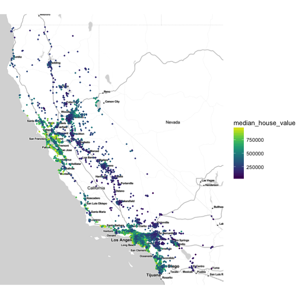

Notice that the algorithm takes a few steps to get a good ratio between alpha
and beta and then slowly marches towards the optimizer at the red dot. The final
solution is still far away, however, and we need to go more iterations in order
to be more precise:


df <- grad_descent(x, y, iter = 1000, rho = 0.01)
qplot(alpha, beta, data = df, geom = c("point", "line")) +
  annotate("point", x = co[1], y = co[2], col = 'red')


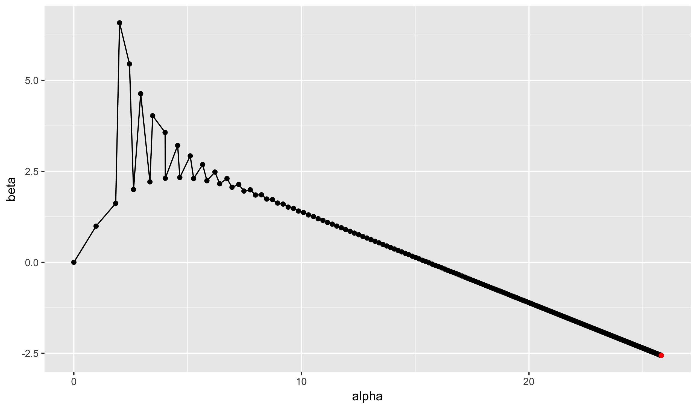

Even 1000 steps has a noticeable error rate, let's increase it to 10k:


df <- grad_descent(x, y, iter = 10000, rho = 0.01)
qplot(alpha, beta, data = df, geom = c("point", "line")) +
  annotate("point", x = co[1], y = co[2], col = 'red')


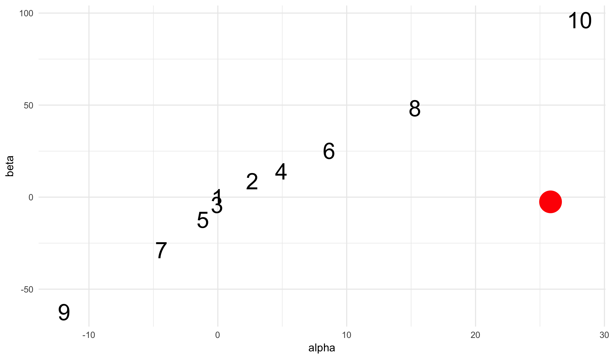

Now, at least at this scale, the optimization task approachs the optimal
value. In case you are wondering about why the path takes a seemingly
circuitous route, we can plot the objective function to understand its
overall shape:


grid <- expand.grid(seq(-2, 40, length.out = 30),
                    seq(-10, 8, length.out = 30))
grid <- data_frame(alpha = grid[,1], beta = grid[,2])
grid$se <- mapply(function(u, v) sum((y - u - v * x)^2), grid$alpha, grid$beta)
df <- grad_descent(x, y, iter = 10000, rho = 0.01)

qplot(alpha, beta, data = grid, color = -sqrt(se),
      size = I(10)) +
  scale_color_viridis() +
  geom_line(data = df, color = "salmon", size = 2.5) +
  theme_minimal()


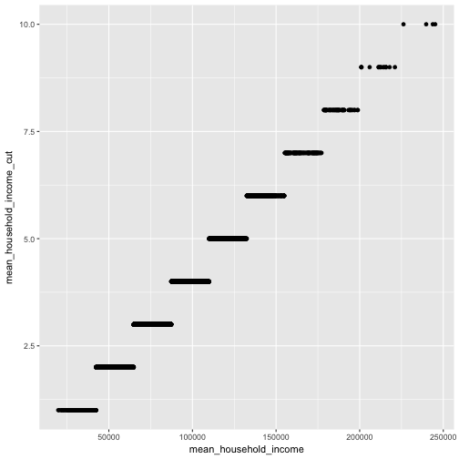

Of course, one way of approaching the optimal value faster is to
increase the learning rate rho. By setting it to 0.06, we visually converge
around step 500:


df <- grad_descent(x, y, iter = 500, rho = 0.06)
qplot(alpha, beta, data = df, geom = c("point", "line")) +
  annotate("point", x = co[1], y = co[2], col = 'red')


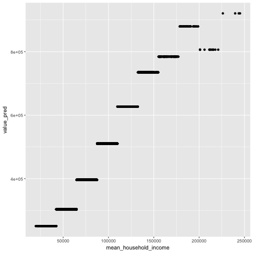

Now, you may wonder why we do not just set the learning rate very high. Let's
try to set it to 0.08 (not too much higher than the 0.06 above). I'll set the
number of iterations to just 10 and label the actual steps on the plot:


df <- grad_descent(x, y, iter = 10, rho = 0.08)
qplot(alpha, beta, data = df, label = iter, size = I(8), geom = c("text")) +
  annotate("point", x = co[1], y = co[2], col = 'red', size = 10) +
  theme_minimal()


Something strange is going on here; the larger learning rate is moving the points *away* from
the optimum. If we go out a few hundred iterations, the algorithm will actual run into numerical
overflow. The issue that with this new step size we are moving in the correct direction by taking
a step that is more than twice the distance to the minimum in the direction of the gradient.

Of course, there are fixes we can put into the iteration to fix this problem. For example, we
could try several different step sizes at each point and only take the minimum (a simple version
of a line search). We could also, in this case, use the second derivative to better estimate how
large of a step to take. We'll cover these variations and more throughout the next few weeks.

