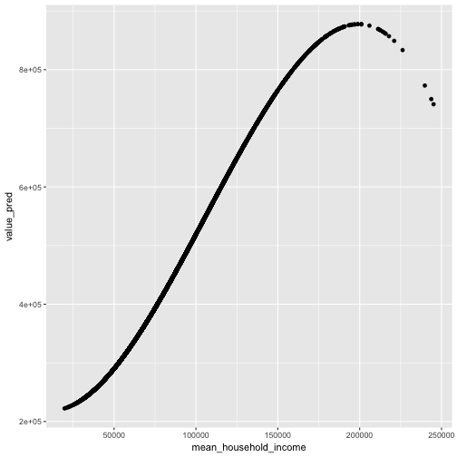
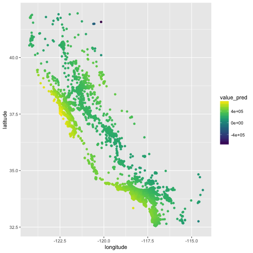
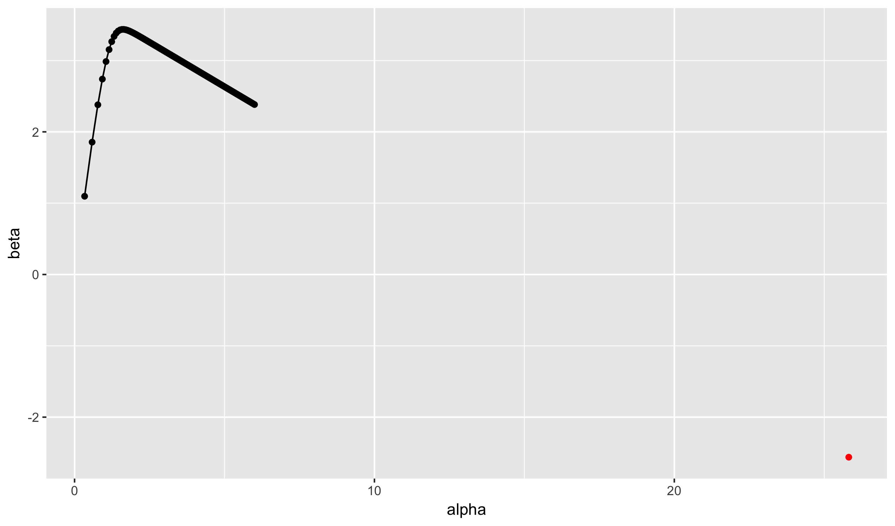
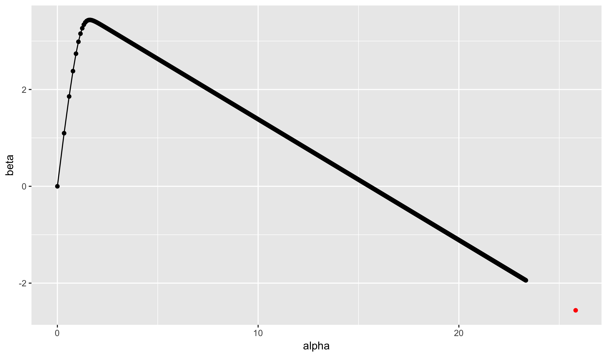


library(readr)
library(ggplot2)
library(dplyr)



ca <- read_csv("~/files/ml_data/ca_house_price.csv")



avg <- mean(ca$median_house_value, na.rm = TRUE)
sqrt(tapply((ca$median_house_value - avg)^2,
            ca$train_id, mean))



##     test    train    valid 
##       NA 198343.4 203487.0



qplot(mean_household_income, median_house_value, data = ca) +
  geom_smooth(method = "lm")



qplot(mean_household_income, median_house_value, data = ca) +
  geom_smooth()



model <- lm(median_house_value ~ poly(mean_household_income, 3),
            subset = train_id == "train",
            data = ca)
ca$value_pred <- predict(model, newdata = ca)
qplot(mean_household_income, value_pred, data = ca)



sqrt(tapply((ca$median_house_value - ca$value_pred)^2,
            ca$train_id, mean))



##     test    train    valid 
##       NA 137440.3 138633.9



model <- lm(median_house_value ~ poly(mean_household_income, 15),
            subset = train_id == "train",
            data = ca)
ca$value_pred <- predict(model, newdata = ca)
qplot(mean_household_income, value_pred, data = ca)



sqrt(tapply((ca$median_house_value - ca$value_pred)^2,
            ca$train_id, mean))



##     test    train    valid 
##       NA 137251.2 138451.0


$$ Y_i = f(X_i) + g(Z_i) + \epsilon_i, \quad mean(\epsilon_i) = 0 $$


model <- lm(median_house_value ~ poly(mean_household_income, 3) +
              poly(median_household_income, 3),
            subset = train_id == "train",
            data = ca)
ca$value_pred <- predict(model, newdata = ca)
sqrt(tapply((ca$median_house_value - ca$value_pred)^2,
            ca$train_id, mean))



##     test    train    valid 
##       NA 134635.4 135243.2


$$ Y_i = f(X_i, Z_i) + \epsilon_i, \quad mean(\epsilon_i) = 0 $$


model <- lm(median_house_value ~
               poly(mean_household_income, median_household_income,
                    degree = 3),
            subset = train_id == "train",
            data = ca)
model



## 
## Call:
## lm(formula = median_house_value ~ poly(mean_household_income, 
##     median_household_income, degree = 3), data = ca, subset = train_id == 
##     "train")
## 
## Coefficients:
##                                                         (Intercept)  
##                                                              317644  
## poly(mean_household_income, median_household_income, degree = 3)1.0  
##                                                            12988874  
## poly(mean_household_income, median_household_income, degree = 3)2.0  
##                                                            -9567618  
## poly(mean_household_income, median_household_income, degree = 3)3.0  
##                                                            -1618524  
## poly(mean_household_income, median_household_income, degree = 3)0.1  
##                                                            -6387193  
## poly(mean_household_income, median_household_income, degree = 3)1.1  
##                                                           817671980  
## poly(mean_household_income, median_household_income, degree = 3)2.1  
##                                                           234873162  
## poly(mean_household_income, median_household_income, degree = 3)0.2  
##                                                            -1002996  
## poly(mean_household_income, median_household_income, degree = 3)1.2  
##                                                          -422189888  
## poly(mean_household_income, median_household_income, degree = 3)0.3  
##                                                             4147020



ca$value_pred <- predict(model, newdata = ca)
sqrt(tapply((ca$median_house_value - ca$value_pred)^2,
            ca$train_id, mean))



##     test    train    valid 
##       NA 134068.0 135014.9



# change degree from 6 => 10 => 12
model <- lm(median_house_value ~
               poly(mean_household_income, median_household_income,
                    degree = 12),
            subset = train_id == "train",
            data = ca)
ca$value_pred <- predict(model, newdata = ca)
sqrt(tapply((ca$median_house_value - ca$value_pred)^2,
            ca$train_id, mean))



##     test    train    valid 
##       NA 132167.4 394899.8



model <- lm(median_house_value ~
               poly(latitude, longitude,
                    degree = 6),
            subset = train_id == "train",
            data = ca)
ca$value_pred <- predict(model, newdata = ca)
sqrt(tapply((ca$median_house_value - ca$value_pred)^2,
            ca$train_id, mean))



##     test    train    valid 
##       NA 157151.3 161607.1



qplot(longitude, latitude, data = ca, color = value_pred) +
  viridis::scale_color_viridis()



library(ggmap)
qmplot(longitude, latitude, data = ca, color = value_pred) +
  viridis::scale_color_viridis()



ca$mean_household_income_cut <- cut(ca$mean_household_income, 10, labels = FALSE)
qplot(mean_household_income, mean_household_income_cut, data = ca)



model <- lm(median_house_value ~ factor(mean_household_income_cut),
            subset = train_id == "train",
            data = ca)
ca$value_pred <- predict(model, newdata = ca)
qplot(mean_household_income, value_pred, data = ca)



model



## 
## Call:
## lm(formula = median_house_value ~ factor(mean_household_income_cut), 
##     data = ca, subset = train_id == "train")
## 
## Coefficients:
##                         (Intercept)   factor(mean_household_income_cut)2  
##                              250649                                52805  
##  factor(mean_household_income_cut)3   factor(mean_household_income_cut)4  
##                              145676                               259605  
##  factor(mean_household_income_cut)5   factor(mean_household_income_cut)6  
##                              376251                               484219  
##  factor(mean_household_income_cut)7   factor(mean_household_income_cut)8  
##                              533675                               628803  
##  factor(mean_household_income_cut)9  factor(mean_household_income_cut)10  
##                              555621                               669918



library(smodels)
ca$mean_household_income_bin <- bin(ca$mean_household_income, 10)
qplot(mean_household_income, mean_household_income_bin, data = ca)


## California House Prices


ca <- read_csv("~/files/ml_data/ca_house_price.csv")



library(smodels)
ca$latitude_bin <- cut(ca$latitude, 5, label = FALSE)
ca$longitude_bin <- cut(ca$longitude, 5, label = FALSE)
ca$lat_long_bin <- ca$latitude_bin + ca$longitude_bin * 10



library(ggmap)
model <- lm(median_house_value ~  factor(lat_long_bin), data = ca)
ca$value_pred <- predict(model, newdata = ca)
qmplot(longitude, latitude, data = ca, color = value_pred) +
  viridis::scale_color_viridis()



acs <- read_csv("~/files/ml_data/tract_median_income.csv")
ma <- filter(acs, state %in% c("MA"), !is.na(cbsa_name))
ma <- arrange(ma, median_income)



count(ma, cbsa_name)



## # A tibble: 8 x 2
##                        cbsa_name     n
##                            <chr> <int>
## 1            Barnstable Town, MA    56
## 2 Boston-Cambridge-Newton, MA-NH   893
## 3            Greenfield Town, MA    18
## 4                 Pittsfield, MA    39
## 5      Providence-Warwick, RI-MA   125
## 6                Springfield, MA   137
## 7             Vineyard Haven, MA     4
## 8               Worcester, MA-CT   170



model <- lm(median_income ~ cbsa_name, data = ma)
model



## 
## Call:
## lm(formula = median_income ~ cbsa_name, data = ma)
## 
## Coefficients:
##                             (Intercept)  
##                                 62252.6  
## cbsa_nameBoston-Cambridge-Newton, MA-NH  
##                                 16750.3  
##            cbsa_nameGreenfield Town, MA  
##                                 -5121.2  
##                 cbsa_namePittsfield, MA  
##                                 -8451.2  
##      cbsa_nameProvidence-Warwick, RI-MA  
##                                 -4393.2  
##                cbsa_nameSpringfield, MA  
##                                 -6607.7  
##             cbsa_nameVineyard Haven, MA  
##                                   882.9  
##               cbsa_nameWorcester, MA-CT  
##                                  4223.3


ADD GAM EXAMPLE

