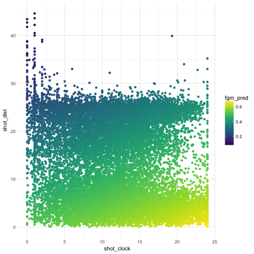
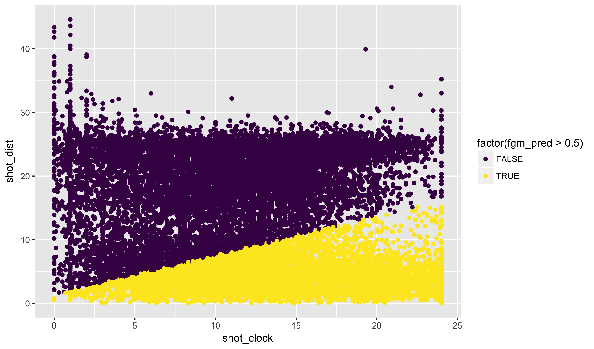
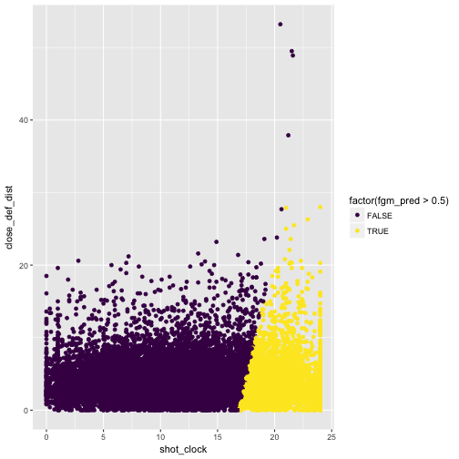
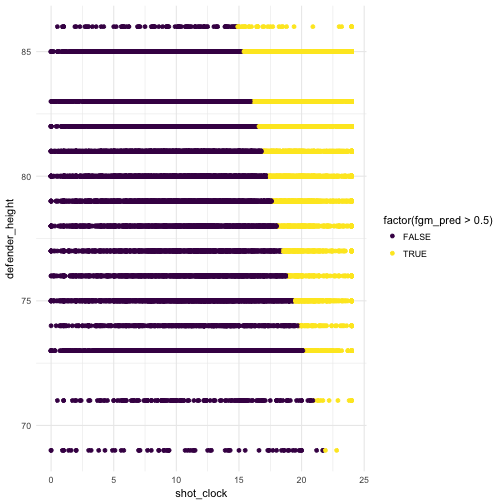
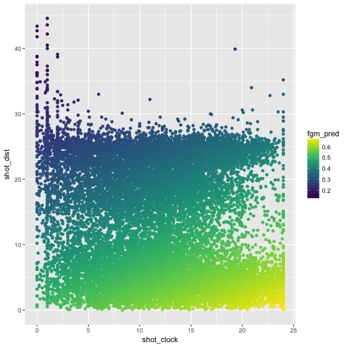
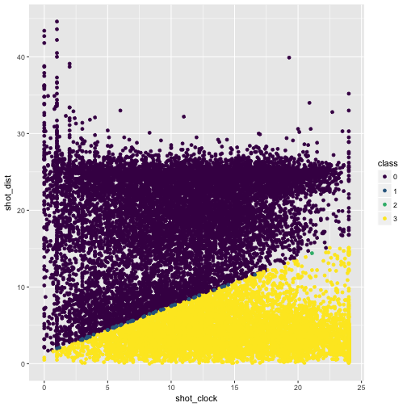
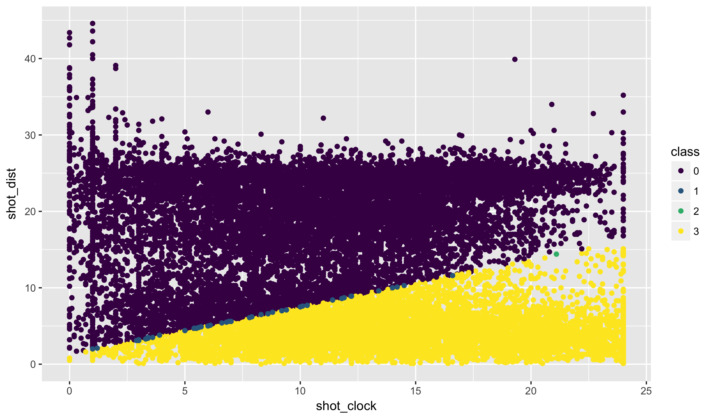
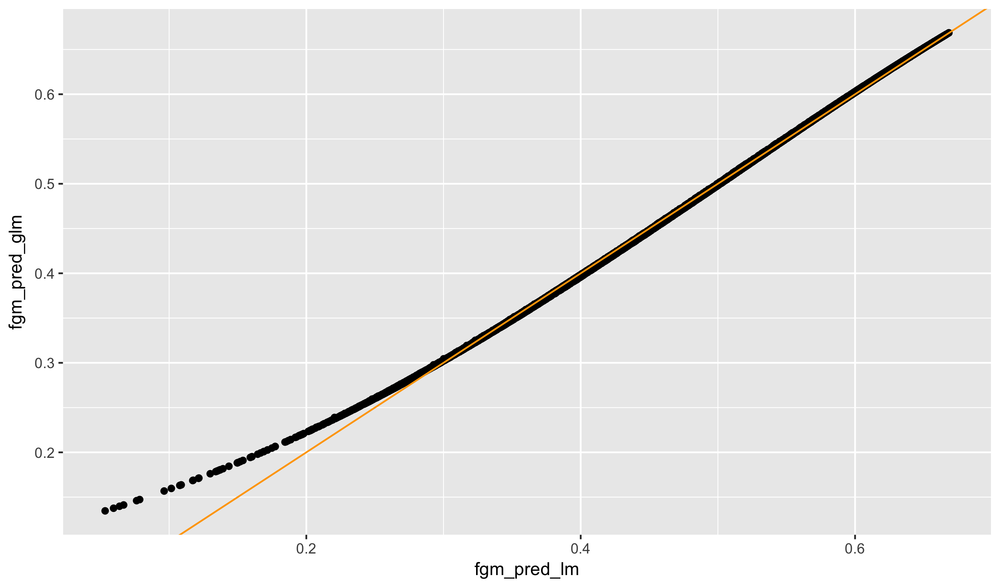
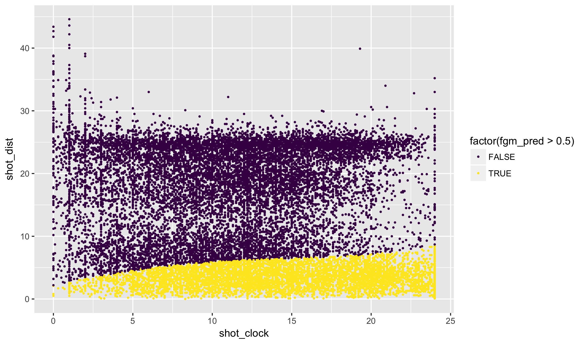
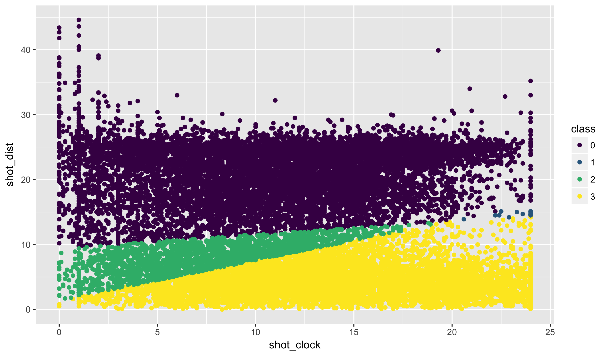


library(readr)
library(ggplot2)
library(dplyr)


## NBA Dataset

Today we are going to look at a dataset based on attempted
shots in the NBA. Specifically, using features based on when
and where the shot was taken, we want to predict whether or
not the shot was successful.


nba <- read_csv("https://statsmaths.github.io/ml_data/nba_shots.csv")


Notice that the response of interest is coded as either `0` (shot missed)
or `1` (shot made).

### Linear Regression

We can apply a simple linear regression to this prediction task.
To start, I will use only the variables `shot_clock` and `shot_dist`
and will not include any interactions.


model <- lm(fgm ~ shot_clock + shot_dist,
            data = nba,
            subset = train_id == "train")
nba$fgm_pred <- predict(model, newdata = nba)


Plotting the predicted values we see a reasonable pattern:


qplot(shot_clock, shot_dist, data = nba, color = fgm_pred) +
  viridis::scale_color_viridis() +
  theme_minimal()


Shots taken from farther away have a higher value as do shots taken
with more time on the clock.

Think for a moment about exactly what the predicted value might mean
here. If it is 1, the model predicts that the shot will be made and
if 0 the model preidcts it will not be made. What about 0.5? Here, it
seems like there is an equal chance of the shot missing or being
made. Extrapolating, we can see the predicted value as a predicted
probability.

We can change the plot to show exactly where we believe a shot is more
likely to miss versus where it is more likely to be made:


qplot(shot_clock, shot_dist, data = nba, color = factor(fgm_pred > 0.5)) +
  viridis::scale_color_viridis(discrete = TRUE)


Notice that, because this is a linear model, the seperation between the
two regions is given by a straight line.

We can draw a similar diagram with other features. Here we have `shot_clock`
and the distance of the closest defender:


model <- lm(fgm ~ shot_clock + close_def_dist,
            data = nba, subset = train_id == "train")
nba$fgm_pred <- predict(model, newdata = nba)
qplot(shot_clock, close_def_dist, data = nba, color = factor(fgm_pred > 0.5)) +
  viridis::scale_color_viridis(discrete = TRUE) +
  theme_minimal()


Again, the general trend seems as expected. Finally, we will repeat with
the `shot_clock` and the height of the nearest defender.


model <- lm(fgm ~ shot_clock + defender_height,
            data = nba, subset = train_id == "train")
nba$fgm_pred <- predict(model, newdata = nba)
qplot(shot_clock, defender_height, data = nba, color = factor(fgm_pred > 0.5)) +
  viridis::scale_color_viridis(discrete = TRUE) +
  theme_minimal()


And again, the pattern matches the relationship we would expect and
shows how the two regions are seperated by a straight line.

### Classification rate

The variable we are trying to predict here is quite different from all
of our previous examples. It takes on only one of two values. In cases
like this (such as a spam classifier or cancer detection algorithm),
as we have just seen, it is possible to ignore this distinction when
fitting a model by treating one category as a `0` and the other category
as a `1`. Next time, we'll see what to do when we have more than two
categories.

When our response takes on only a small set of values, particularly if
these are unordered, we say that we are doing **classification**.
Somewhat confusingly, the complement of classification is often called
**regression**. I try to avoid this later term because it can become
confusing with the more general notion of regression models.

It is possible to use RMSE to measure how well our predicted probabilities
fit the data. Often though, we ultimately do not care much about the
probabilities, and simple want to make the binary guess of our model
be correct as often as possible. Here, we would only allow for predictions
to be either `0` or `1`. The best metric for measuring this is the
*classification rate*, the proportion of guesses that were correct. We
can measure that here fairly quickly:


nba$fgm_pred <- as.numeric(nba$fgm_pred > 0.5)

tapply(nba$fgm_pred == nba$fgm, nba$train_id, mean)



##      test     train     valid 
##        NA 0.5624167 0.5750000


Here, we have a classification rate of 57.5% on the validation set.
Unless otherwise noted, classification rate will be used for assessing
classification models throughout the semester.

## Generalized Linear Models

While we can apply linear regression to classification problems, the
model assumptions of linear regression do not hold for classification.
For one thing, if we have:

$$ \text{mean} (Y) = X \beta $$

This implies that it is possible, with extreme values of X, for some
inputs to have a mean that is less than 0 or greater than 1. As the
mean of a binary variable corresponds to the probability that it is
equal to 1, this does not make sense.

Generalized linear models (GLMs) extend the linear model assumptions to
allow for a more complex relationship between Y and X. The linear
part that is preserved, is that X is always multiplied (as a matrix)
by the unknown parameters beta. The most commonly seen GLM relates
the *log odds ratio* to the linear predictor:

$$ \log \left( \frac{\mathbb{P}[Y_i = 1]}{1 - \mathbb{P}[Y_i = 1]} \right) = X \beta $$

The left-hand side here can be written equivalently using the
logit function, which is simply defined to be equivalent to
the log odds ratio:

$$ \text{logit}(\mathbb{P}[Y_i = 1]) = X \beta $$

There are a number of justifications for using the log odds. The
easiest to explain is that the odds ratio can be any non-negative
value and therefore the logarithm of the odds ratio can be any
real number. This makes it reasonable to assume that the log odds
could be represented by X beta. There are more technical reasons
for using this particular function, the logit, having to do with
the theory of exponential families.

A GLM using the logit function is so common that it
has its own name: *logistic regression*.

Once we have learned the regression vector in logistic regression,
we can get predicted probabilities using the inverse logit function:

$$ \mathbb{P}[Y_i = 1] = \text{logit}^{-1} (X \beta) $$

### GLMs in R

To git a generalized linear model in R, we replace the `lm` function
for the `glm` function. With no other changes, the learned model parameters
will be exactly the same as before. If we set the `family` parameter to
`binomial` with a logit link, we will get logistic regression:


model <- glm(fgm ~ shot_clock + shot_dist,
            data = nba, subset = train_id == "train",
            family = binomial(link = "logit"))
model



## 
## Call:  glm(formula = fgm ~ shot_clock + shot_dist, family = binomial(link = "logit"), 
##     data = nba, subset = train_id == "train")
## 
## Coefficients:
## (Intercept)   shot_clock    shot_dist  
##     0.05324      0.02720     -0.04352  
## 
## Degrees of Freedom: 11999 Total (i.e. Null);  11997 Residual
## Null Deviance:	    16520 
## Residual Deviance: 15960 	AIC: 15970


You could leave off the link specification, as logit is the default.

When using the `predict` function, you need to be careful to select
the option `type = "response"`. Otherwise, R will return the values
X beta, without applying the inverse logit function.


nba$fgm_pred <- predict(model, newdata = nba, type = "response")


The predicted values seem very similar to those given by the linear
regression from before:


qplot(shot_clock, shot_dist, data = nba, color = fgm_pred) +
  viridis::scale_color_viridis()


And the two classes seem virtually the same as before as well:


qplot(shot_clock, shot_dist, data = nba, color = factor(fgm_pred > 0.5)) +
  viridis::scale_color_viridis(discrete = TRUE)


### GLM and LM comparison

Visually, it looks liks the output of the GLM and LM are not
very different. Let's formalize that here by saving the
predicted classes from both:


model <- lm(fgm ~ shot_clock + shot_dist,
            data = nba, subset = train_id == "train")
nba$fgm_pred_lm <- as.numeric(predict(model, newdata = nba, type = "response") > 0.5)

model <- glm(fgm ~ shot_clock + shot_dist,
            data = nba, subset = train_id == "train",
            family = binomial)
nba$fgm_pred_glm <- as.numeric(predict(model, newdata = nba, type = "response") > 0.5)


Here we see that only a handful of point right on the boundary
differ between the models:


nba <- arrange(nba, fgm_pred_lm != fgm_pred_glm)
qplot(shot_clock, shot_dist, data = nba,
      color = factor(fgm_pred_lm + 2 * fgm_pred_glm)) +
  viridis::scale_color_viridis(discrete = TRUE) +
  labs(color = "class")


Similarly, even the predicted probabilities seem very similar. Saving
these from both models:


model <- lm(fgm ~ shot_clock + shot_dist,
            data = nba, subset = train_id == "train")
nba$fgm_pred_lm <- predict(model, newdata = nba, type = "response")

model <- glm(fgm ~ shot_clock + shot_dist,
            data = nba, subset = train_id == "train",
            family = binomial)
nba$fgm_pred_glm <- predict(model, newdata = nba, type = "response")


And plotting them:


qplot(fgm_pred_lm, fgm_pred_glm, data = nba) +
  geom_abline(aes(intercept = 0, slope = 1), color = "orange")


We see that the greatest difference comes from very low probability
shots. This is a general categorization of the difference between
logistic and linear regression for classification tasks. Typically
the only differences arise when we have extreme probabilities. If
most of the predicted values fall within the same range, the linear
model provides a good approximation. In most cases, I do not see a
large difference between the two models from a predictive standpoint.
In some cases, particularly when dealing with relatively rare events,
logistic regression offers better predictions. However, this comes
at a cost of a slower run time.

### Non-linear regions

It should not be much of a stretch to think about what happens to
the prediction regions when we allow for a basis expansion of the
predictor variables. Here, we will had third-order polynomial
terms:


model <- lm(fgm ~ poly(shot_clock, 3) + poly(shot_dist, 3),
            data = nba, subset = train_id == "train")
nba$fgm_pred <- as.numeric(predict(model, newdata = nba) > 0.5)


Notice that the prediction regions now have a non-linear prediction
boundary:


qplot(shot_clock, shot_dist, data = nba, color = factor(fgm_pred > 0.5),
      size = I(0.5)) +
  viridis::scale_color_viridis(discrete = TRUE)


The same behavior would occur if we did a basis expansion using logistic
regression.

Also, remember the generalized additive models (GAM) package **gam** from last
week? The generalized in the name of that function refers to the same
generalized as in GLM. You can use the family function in `gam` to fit
generalized additive models with a logistic link. Feel free to try this
in the next few labs.

## Support vector machines

The seperation between classes in the LM, GLM, and GAM models
is a result of trying to predict class probabilities. I want
to briefly introduce a fourth model known as support vector
machines (SVMs). We won't cover these in detail, but the basic
idea is to eschew the prediction of probabilities and to calculate
the best seperating hyperplane (generalization of the line we saw
in our example to higher dimensions) directly.

To use SVMs, we need to create a model matrix as we learned last
week:


y <- nba$fgm
X <- as.matrix(select(nba, shot_clock, shot_dist))

X_train <- X[nba$train_id == "train", ]
y_train <- y[nba$train_id == "train"]


The `svm` function from the package **e1071** accepts the model
matrix, the response vector, and a description of the *kernel*.
The linear kernel most directly mimics the linear seperating
plane we had above:


library(e1071)
model <- svm(X_train, factor(y_train), kernel = "linear")
nba$fgm_pred_svm <- as.numeric(predict(model, newdata = X, type = "response") > 0.5)



## Warning in Ops.factor(predict(model, newdata = X, type = "response"), 0.5):
## '>' not meaningful for factors



nba$fgm_pred_lm <- as.numeric(nba$fgm_pred_lm > 0.5)


Plotting the difference between these two models shows
quite a bit of points where the classification has changed:


nba <- arrange(nba, fgm_pred_lm != fgm_pred_svm)
qplot(shot_clock, shot_dist, data = nba,
      color = factor(fgm_pred_lm + 2 * fgm_pred_svm)) +
  viridis::scale_color_viridis(discrete = TRUE) +
  labs(color = "class")



## Error: length(Lab) == 3L is not TRUE


If we change the *kernel* option, other choices are "radial",
"sigmoid", and "polynomial", this will do something akin to
a basis expansion.

In this case, the SVM does a better job with the classification
task:


tapply(nba$fgm_pred_lm == nba$fgm, nba$train_id, mean)



##    test   train   valid 
##      NA 0.60300 0.60425



tapply(nba$fgm_pred_svm == nba$fgm, nba$train_id, mean)



##  test train valid 
##    NA    NA    NA


Please feel free to play around with the SVM in the next labs,
particularly adjusting the kernel and the tuning parameters
`degree`, `gamma`, and `coef0` (read the help pages to understand
what this is doing). Generally though, I find that the GAMs or
GLMs with basis expansion and regularization (next week) perform
better or equally as well as a SVM with less work and computation
time.

