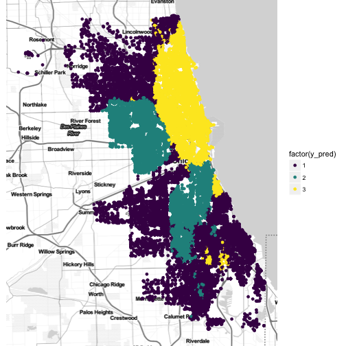


library(readr)
library(ggplot2)
library(dplyr)


> Well the South side of Chicago
> Is the baddest part of town
> And if you go down there
> You better just beware
> Of a man named Leroy Brown


crimes <- read_csv("~/files/ml_data/chi_crimes_3.csv")



temp <- crimes[crimes$crime_type %in% c("theft", "narcotics"),]
temp$y <- as.numeric(temp$crime_type == "theft")
model <- lm(y ~ latitude + longitude,
            data = temp, subset = train_id == "train")
temp$y_pred <- predict(model, newdata = temp)



library(ggmap)
qmplot(longitude, latitude, data = temp, color = factor(y_pred > 0.5)) +
  viridis::scale_color_viridis(discrete = TRUE)



model <- lm(y ~ poly(latitude, 4) + poly(longitude, 4),
            data = temp, subset = train_id == "train")
temp$y_pred <- predict(model, newdata = temp)
qmplot(longitude, latitude, data = temp, color = factor(y_pred > 0.5)) +
  viridis::scale_color_viridis(discrete = TRUE)



library(FNN)
X <- scale(as.matrix(select(temp, longitude, latitude)))
y <- temp$y
X_train <- X[temp$train_id == "train",]
y_train <- y[temp$train_id == "train"]

temp$y_pred <- as.numeric(FNN::knn(train = X_train, test = X, cl = y_train, k = 200))

qmplot(longitude, latitude, data = temp, color = factor(y_pred)) +
  viridis::scale_color_viridis(discrete = TRUE)



crimes$y <- as.numeric(factor(crimes$crime_type))

library(FNN)
X <- scale(as.matrix(select(crimes, longitude, latitude)))
y <- crimes$y
X_train <- X[crimes$train_id == "train",]
y_train <- y[crimes$train_id == "train"]

crimes$y_pred <- as.numeric(FNN::knn(train = X_train, test = X, cl = y_train, k = 500))

qmplot(longitude, latitude, data = crimes, color = factor(y_pred)) +
  viridis::scale_color_viridis(discrete = TRUE)



library(nnet)
library(ggmap)
library(smodels)
crimes$h6 <- as.numeric(cut(crimes$hour, 6, label = FALSE))
model <- multinom(crime_type ~ poly(longitude, latitude, h6, degree = 3),
                  data = crimes)



## # weights:  63 (40 variable)
## initial  value 26366.694928 
## iter  10 value 24896.378326
## iter  20 value 24883.414708
## iter  30 value 24883.213170
## iter  40 value 24854.673644
## iter  50 value 24641.284099
## iter  60 value 24582.742235
## iter  70 value 24582.546365
## iter  80 value 24491.211277
## iter  90 value 24467.248880
## iter 100 value 24467.185539
## final  value 24467.185539 
## stopped after 100 iterations



crimes$y_pred <- predict(model, newdata = crimes)
qplot(longitude, latitude, data = crimes, color = factor(y_pred)) +
  viridis::scale_color_viridis(discrete = TRUE) +
  facet_wrap(~h6)


