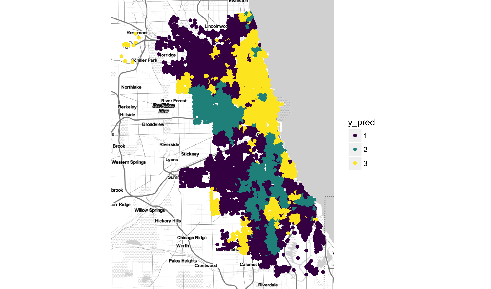
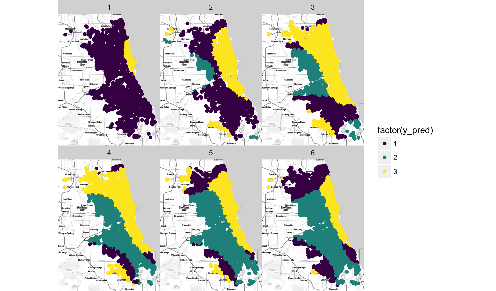


library(readr)
library(ggplot2)
library(dplyr)


## Chicago Crimes

Our dataset for today contains observations of reported crimes
from the city of Chicago. Our prediction task is to figure out,
given details of when and where the crime occured, what the
mostly likely type of crime was commited. Loading in the dataset
see that the crime type is given as a number from 1 to 3:


crimes <- read_csv("https://statsmaths.github.io/ml_data/chi_crimes_3.csv")


The corresponding crime names are:


crime_names <- c("criminal_damage", "narcotics", "theft")


Notice that this dataset has been *balanced*. That is,
there are an approximately equal number of each crime type
in both the training and validation sets (also in the
test set, but you cannot see that here):


table(crimes$crime_type, crimes$train_id)



##    
##     test train valid
##   1    0  6013  2039
##   2    0  6029  1976
##   3    0  5958  1985


This has been done by *down-sampling*. These crimes do not
occur with equal probabilities in the raw data; I have taken
a subset of the data in such a way that the probabilities are
equal. This makes building models easier and is a common trick
that I will generally do for you on the lab data.

### Multivariate prediction

Now that we have three categories, if we were to fit a linear
regression on the response this would no longer make sense. The
model would be assuming that the second category is somehow
in-between the other two categories. We could modify the
procedure in two ways:

- *one-vs-one*: take each pair of crimes and fit a LM or GLM
seperating these two groups. Final predictions use every model
to determine, head to head, which class each testing point should
belong to.
- *one-vs-all*: build a seperate model for each class, trying
to seperate each class from the rest.

With only a small number of classes, both of these can work
well. When the number of categories is large, the first takes
a lot of computational resource to compare all pairs of models.
The second becomes hard because it has a tendency to make every
point look like the "all" (since it dominates any individual
group).

We could implement either of these strategies ourselves. Some
models, such as GAMs, don't directly implement any other way
of doing multi-class prediction and that would be the only
approach if we wanted to use them. The **e1071** package will
do the *one-vs-one* when given multiple classes (so be
carefuly giving it too many classes). Today we will see a
package that does a tweak on the *one-vs-many* for logistic
regression and an entirely different way of approaching the
problem that avoids the multiclass issue in its entirety.

## Multinomial regression

The **nnet** package provides a function `multinom` that
generalizes the logistic regression in the `glm` function.
It requires almost no special settings; just supply a
formula as usual but with a categorical response. The
function will print out verbose information letting you
know how quickly it converges.


library(nnet)
model <- multinom(crime_type ~ poly(longitude, latitude, degree = 3),
                  data = crimes)



## # weights:  33 (20 variable)
## initial  value 26366.694928 
## iter  10 value 25491.235282
## iter  20 value 25472.801010
## iter  30 value 25472.552858
## iter  40 value 25398.449574
## iter  50 value 25191.828655
## iter  60 value 25191.277334
## iter  70 value 25191.171933
## iter  80 value 25180.456887
## iter  90 value 25122.465513
## iter 100 value 25120.012891
## final  value 25120.012891 
## stopped after 100 iterations


The predicted values from the predict function give, by default,
the class predictions:


crimes$y_pred <- predict(model, newdata = crimes)


We could, if needed, get the predicted probabilities for each
class by setting the `type` option to "probs". The output is
a matrix with one column per class. We will see uses for these
in the future:


head(predict(model, newdata = crimes, type = "probs"))



##           1         2         3
## 1 0.2962009 0.4837351 0.2200640
## 2 0.2923040 0.4543063 0.2533897
## 3 0.2831502 0.2675520 0.4492978
## 4 0.3047145 0.3285162 0.3667693
## 5 0.2969050 0.4745688 0.2285262
## 6 0.3013706 0.4368505 0.2617789


### Confusion Matrix

The classification rate that we saw last time still work as a
good measurment of how well our predictions run. Remember though
that with more classes, even "good" classification rates will
generally be lower. Random guessing in the two class model yields
a 50% rate; here it gives a 33% rate.


tapply(crimes$y_pred == crimes$crime_type, crimes$train_id, mean)



##      test     train     valid 
##        NA 0.4601111 0.4643333


With more than two classes, there is more than one kind of error.
Which crimes, for example, are we having trouble distinguishing?
The confusion matrix shows


table(y = crimes$crime_type, y_pred = crimes$y_pred)



##    y_pred
## y      1    2    3
##   1 2867 2881 2304
##   2 1995 4500 1510
##   3 2198 2044 3701


So, criminal damage and narcotics seem harder to distinguish
based on location along. These types of metric will be very
useful going forward.

### Neural networks?

You might wonder why we are using a neural network package for
fitting multinomial models. This is a very old package; I can't
find the exact original publication date but I believe it was
pre version 2.0 of R (2004-10-04). The neural networks here do
not have the functions that you might be familiar with from
another class or research project. However, there is a close
relationship between neural networks and regression theory.
We will ook at this in just a couple of weeks.

## Nearest Neighbors

Now, we can look at an entirely different approach to prediction.
As I mentioned in the course introduction, I think of models as
coming in two categories: local and global. Everything we have
seen is inherently global, though we have tried to create
local effects through non-linearities and basis expansion
techniques.

The nearest neighbor classification algorithm does something very
simple: categorize each point with whatever category is more
prominent within the nearest k training points. The package we
will use for this is **FNN**, for fast nearest neighbors.


library(FNN)


In order to use nearest neighbors, we need to create a model
matrix. FNN does not accept a formula input.


X <- as.matrix(select(crimes, longitude, latitude))
y <- crimes$crime_type
X_train <- X[crimes$train_id == "train",]
y_train <- y[crimes$train_id == "train"]


Once we have the data, the `knn` function is used
to run the nearest neighbors algorithm. We have only
to set the parameter `k`; here set to 100.


crimes$y_pred <- knn(train = X_train, test = X,
                     cl = y_train, k = 100)


The classification can be investigated and we see that
it is better in this case than the linear model.


tapply(crimes$y_pred == crimes$crime_type, crimes$train_id, mean)



##      test     train     valid 
##        NA 0.5277222 0.4993333


Plotting the data, we can see just how local the model actually
is:


library(ggmap)
qmplot(longitude, latitude, data = crimes,
       color = y_pred) +
  viridis::scale_color_viridis(discrete = TRUE)


The nearest neighbors algorithm is of course very sensitive to
the choice of k. You can tune it using the validation set.
Also, the function `knn.reg` can be used to do nearest neighbors
for prediction of a continuous response (notice the use of
"regression" to contrast with "classification").

### Scale

A main problem with the nearest neighbors algorithm is defining
what "near" means. This will be an ongoing issue, but for now
notice that if we build a model matrix with very different
variables (such as, time, latitude, and income) the algorithm
will basically ignore any variables that have a very different
scale. By default `knn` just uses ordinary Euclidean distances.

One simple fix is to use the `scale` function on the data
matrix `X`:


X <- scale(X)
X_train <- X[crimes$train_id == "train",]


It does not change much here because latitude and longitude
have different scales. In other applications it drastically
changes the fit.

## Spatial-temporal plots

I wanted to show you an interesting plot of the predictions
for the Chicago crime data. In order to make the plot most
readable, lets cut time into six buckets:


crimes$h6 <- as.numeric(cut(crimes$hour, 6, label = FALSE))


Now, I'll fit a multinomial model interacting longitude,
latitude, and time.


model <- multinom(crime_type ~ poly(longitude, latitude, h6, degree = 3),
                  data = crimes)



## # weights:  63 (40 variable)
## initial  value 26366.694928 
## iter  10 value 24958.814394
## iter  20 value 24940.603824
## iter  30 value 24940.391270
## iter  40 value 24898.447973
## iter  50 value 24636.616310
## iter  60 value 24616.746591
## iter  70 value 24616.034670
## iter  80 value 24506.612973
## iter  90 value 24478.634633
## iter 100 value 24478.583671
## final  value 24478.583671 
## stopped after 100 iterations



crimes$y_pred <- predict(model, newdata = crimes)


The resulting plot shows how the propensity for each crime
type changes throughout the day and over the city.


qmplot(longitude, latitude, data = crimes, color = factor(y_pred)) +
  viridis::scale_color_viridis(discrete = TRUE) +
  facet_wrap(~h6)


This is a good example of how predictive modelling can be
used for meaninful data analysis.

