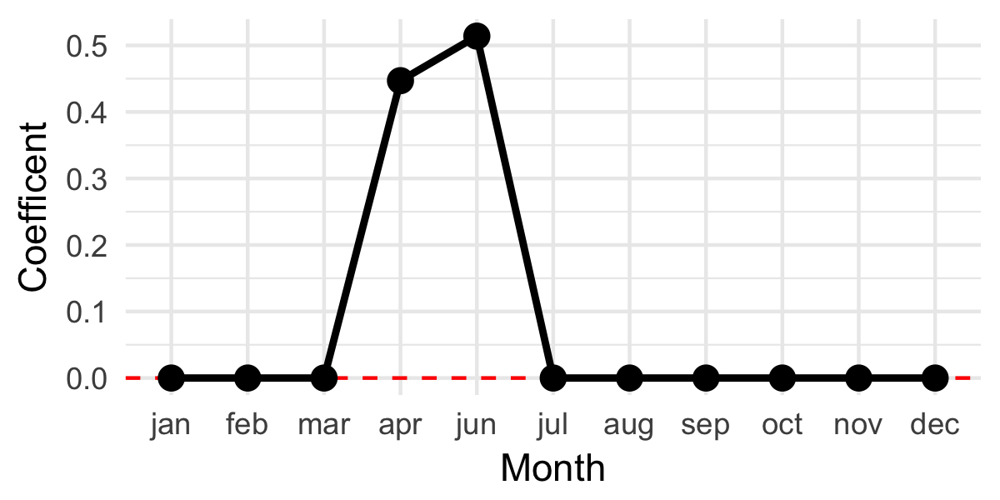
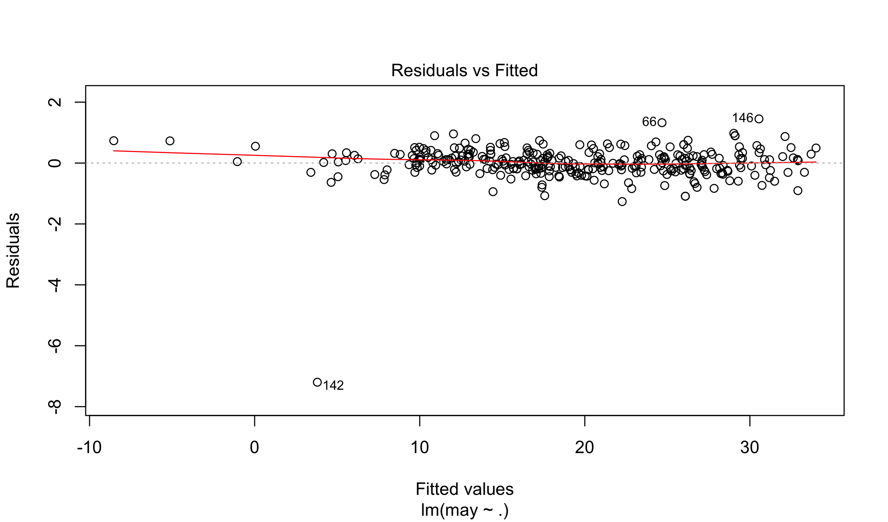


library(readr)
library(ggplot2)
library(methods)
library(dplyr)


## City Tempurature Data

Today we will start by looking at a small dataset of tempuratures
from 327 cities across the world.


temps <- read_csv("https://statsmaths.github.io/ml_data/city_temps_yr.csv")


Our goal is to predict the average daily high tempurature for the
month of May using the average daily tempuratures for the other
elevent months of the year. This is not particularly hard but will
be a great illustration of linear regression regularization.

The format of the data is the same as others we have looked at, but
all of the data is in the training set.

### Ordinary regression

We can start by predicting the average daily high in May as a
function of all of the other eleven months:


model <- lm(may ~ ., data = temps[,c(3,6:16)])
model



## 
## Call:
## lm(formula = may ~ ., data = temps[, c(3, 6:16)])
## 
## Coefficients:
## (Intercept)          jan          feb          mar          apr  
##   -0.076406     0.062431    -0.105036    -0.096585     0.670794  
##         jun          jul          aug          sep          oct  
##    0.567104    -0.045415    -0.008928    -0.091287     0.156858  
##         nov          dec  
##   -0.204448     0.104115


We can understand these coefficents best by plotting them over the
course of the year:

As you might expect, April and Jun have the largest coefficents.
You may not have thought that other months would have negative
weights. What is going on here? These variables have fairly high
correlations, so we can get a fairly predictive model by combining
positive weights on some variables and negative weights on others.

### An analogy

In the article "The relationship between jaw, arm and leg size in
three ethnic groups" (DOI: 10.1002/aja.1001360211), it is established
that the length of the average human leg is roughly 20% larger than
the length of their arms. We know that the length between someone's
left arm and their right arm are very highly correlated (virtually
the same, depending on your precision). If we collected data and
tried to predict the length of left legs as a function of right arms
and left arms we would have several different choices that seem
to given essentially the same fit.

We could put all of the model weight on the left arm:

$$ \text{left_leg} = \text{left_arm} \cdot 1.2 + \text{right_arm} \cdot 0.0 $$

All on the right arm:

$$ \text{left_leg} = \text{left_arm} \cdot 0.0 + \text{right_arm} \cdot 1.2 $$

Split it between both arms:

$$ \text{left_leg} = \text{left_arm} \cdot 0.6 + \text{right_arm} \cdot 0.6 $$

Or, do something quite a bit more complex:

$$ \text{left_leg} = \text{left_arm} \cdot 101.2 - \text{right_arm} \cdot 100 $$

If our measurements for left arms and right arms were *exactly* the same,
there would be no way of distinguishing this infinite set of choices. This
would then be a *rank deficent* model. If just one person has a different
left and right arm measurment (perhaps an old injury or we are using very
precise measuring tool), there will be a best model in the ordinary least
squares sense. However, this may not match what the best model should be
for future predictions.

### Regularization: Ridge regression

The tendency of linear regression to overfit the data in the presense of
highly-correlated variables or sets of variables is a major issue in
predictive modelling. So far our only option has been to control this
by limiting the number of variables in a model, either directly or by
limiting the number of interactions or basis expansion terms.

Regularization is a more direct approach to limiting the complexity of
a model. Ridge regression solves this problem by modifying the ordinary
least squares optimization task. It add a penalty term that penalizes
the model for having coefficents that are too large. Specifically, we
have:

$$ \widehat{\beta}_{ridge} \in \arg\min \left\{\frac{1}{2n} \cdot || y - X \beta||_2^2 + \lambda \cdot || \beta ||_2^2, \quad b \in \mathbb{R}^p \right\}, \quad \lambda > 0 $$

Where

$$ || a ||_2^2 = \sum_i a_i^2 $$

The tuning parameter lambda sets the level of penalization. If
lambda is very large, the best model will have no coefficents.
As lambda approaches zero, the ridge vector will limit towards
the ordinary least squares solution. The term in from of the
sum of squares makes such that lambda does not have to scale
with the sample size (the sum of squares growns with larger
samples). It is the same reason we use RMSE instead of MSE to
compare our models.

The **glmnet** package provides a function for fitting the ridge
regression model. It requires that we provide a matrix form of
our data.


X <- as.matrix(temps[,6:16])
y <- temps$may


To run ridge regression, we will use the function `cv.glmnet` and
set `alpha` equal to zero. I want us to understand what this model
is doing before returning to some of the details later today.


library(glmnet)
model <- cv.glmnet(X, y, alpha = 0)


The output vector is given in a different type of R object than
from the `lm` function, but the printed output looks similar:


coef(model)



## 12 x 1 sparse Matrix of class "dgCMatrix"
##                        1
## (Intercept) -0.487836661
## jan          0.007122714
## feb          0.029077469
## mar          0.085917533
## apr          0.205264771
## jun          0.280872989
## jul          0.160141730
## aug          0.096704381
## sep          0.079279388
## oct          0.062930589
## nov          0.015777590
## dec          0.006078906


Let's plot this again:

Now, the weights are all positive and spread out over the
course of the year. There is still, however, a peak near
April and June. What has happened is two fold: the penalty
as made it "not worth" making offsetting negative weights
and positive weights even if this slightly decreases the
RMSE. The penalty is simply too great. Secondly, the
ridge penalty in particular prefers many small weights
compared to a few larger weights. That is why the values
are spread throughout the year.

In our leg length example, ridge regression would strongly
prefer this:

$$ \text{left_leg} = \text{left_arm} \cdot 0.6 + \text{right_arm} \cdot 0.6 $$

The squared size of these values is only 0.36, compared to the
size of 1.44 for having the full weight on only one of the two
variables.

### Regularization: Lasso regression

There are other ways of penalizing the size of the regression
vector by replacing the sum of squares term with other penalties.
Lasso regression replaces the sum of squares with the sum of
absolute values:

$$ \widehat{\beta}_{ridge} \in \arg\min \left\{\frac{1}{2n} \cdot || y - X \beta||_2^2 + \lambda \cdot || \beta ||_1, \quad b \in \mathbb{R}^p \right\}, \quad \lambda > 0 $$

Where

$$ || a ||_1 = \sum_i | a_i | $$

The behavior of the lasso regression has a very special property
that can be extremely useful in predictive modeling. We can apply
it using the `cv.glmnet` function by setting `alpha` to 1.


model <- cv.glmnet(X, y, alpha = 1)


Plotting the coefficents again, we see the special behavior of
the lasso regression in action:


df <- data_frame(month = rownames(coef(model))[-1],
                 val = coef(model)[-1],
                 f = 1)
ggplot(df, aes(factor(month, levels = tolower(month.abb)), val)) +
  geom_hline(yintercept = 0, color = "red", linetype = "dashed") +
  geom_path(aes(group = f), size = 1) +
  geom_point(size = 3) +
  theme_minimal() +
  scale_x_discrete(breaks = tolower(month.abb)) +
  xlab("Month") + ylab("Coefficent")


The model has made every weight other than April and June set
to exactly zero. As with ridge regression, the penalty is too
great to make canceling negative weights and postive weights.
Unlike ridge regression, the lasso penalty does not prefer
many small weights to fewer large weights. Therefore, the model
will pick only those variables which are most strongly correlated
with the response; here, these are April and June.

The magic of lasso regression is that it sets many terms exactly
to zero. This is accomplished because the absolute value does not
have a derivative at zero. Therefore, the target function has
many critical points where beta coefficents are equal to zero
and a non-zero chance of setting any beta value to zero.

Which model would the lasso regression prefer in our left leg
prediction example? It would put all of the weight
on one arm, whichever one had a slightly higher correlation with
the response.

## The elastic net with glmnet

The `glmnet` functions fits, and is named for, a collection
of models that sit in-between ridge and lasso regression known
as the *elastic net*. This is defined as:

$$ \widehat{\beta}_{ridge} \in \arg\min \left\{\frac{1}{2n} \cdot || y - X \beta||_2^2 + \alpha \cdot \lambda \cdot || \beta ||_1 + (1 - \alpha) \cdot \lambda \cdot || \beta ||_2^2, \quad b \in \mathbb{R}^p \right\}, \quad \lambda > 0 $$

You can see how we can get ridge by setting alpha to 0 and the
lasso regression by setting alpha to 1 (the latter is the default).
Settings with alpha somewhere in between 0 and 1 blend the behavior
of the two estimators. Generally, the elastic net tends to still set
some coefficents to zero but tries to spread the weight out evenly
over higher correlated groups of variables.

### Model selection

Let's look at the California house price dataset again.


ca <- read_csv("https://statsmaths.github.io/ml_data/ca_house_price.csv")

X <- model.matrix(~ latitude*longitude + . -1, data = ca[,-c(1,2,3)])
y <- ca$median_house_value
X_train <- X[ca$train_id == "train",]
y_train <- y[ca$train_id == "train"]


We will run an elastic net regression on the data:


model <- cv.glmnet(X_train, y_train, alpha = 0.9)


The function intelligently picks a set of 100 values of lambda
to fit the elastic net to. We can see all of these by looking
at the lambda paramter of the model


model$lambda



##  [1] 157659.5878 143653.5445 130891.7596 119263.6964 108668.6383
##  [6]  99014.8160  90218.6126  82203.8397  74901.0772  68247.0719
## [11]  62184.1901  56659.9181  51626.4071  47040.0594  42861.1502
## [16]  39053.4837  35584.0799  32422.8883  29542.5282  26918.0515
## [21]  24526.7260  22347.8392  20362.5188  18553.5687  16905.3208
## [26]  15403.4987  14035.0943  12788.2552  11652.1819  10617.0342
## [31]   9673.8461   8814.4483   8031.3970   7317.9098   6667.8069
## [36]   6075.4573   5535.7304   5043.9514   4595.8606   4187.5770
## [41]   3815.5642   3476.6000   3167.7485   2886.3344   2629.9204
## [46]   2396.2855   2183.4061   1989.4384   1812.7021   1651.6667
## [51]   1504.9372   1371.2427   1249.4253   1138.4298   1037.2948
## [56]    945.1444    861.1804    784.6755    714.9671    651.4514
## [61]    593.5782    540.8464    492.7991    449.0202    409.1304
## [66]    372.7844    339.6673    309.4922    281.9977    256.9458
## [71]    234.1195    213.3210    194.3701    177.1028    161.3695
## [76]    147.0339    133.9718    122.0701    111.2257


The `coef` and `predict` function, by default, choose the
optimal value of lambda; we will see in the final section today
exactly how this is done. We can manually pass either function
the option `s` to specify which value of lambda we want the
parameters for (that it is called `s` and not `lambda` has always
been a pet-peeve of mine). We can pick any value between the
largest and smallest lambda parameters, though it generally
makes sense to pick values where the model was actually fit.

The primary reason for looking at other values of lambda is to
see which variables are included when the penalty is very
high. Here, at the 10th value of lambda (remember, they are
in descending order), we see that only `mean_household_income`
is included:


coef(model, s = model$lambda[10])



## 29 x 1 sparse Matrix of class "dgCMatrix"
##                                        1
## (Intercept)                 2.260200e+05
## latitude                    .           
## longitude                   .           
## population                  .           
## total_units                 .           
## vacant_units                .           
## median_rooms                .           
## mean_household_size_owners  .           
## mean_household_size_renters .           
## built_2005_or_later         .           
## built_2000_to_2004          .           
## built_1990s                 .           
## built_1980s                 .           
## built_1970s                 .           
## built_1960s                 .           
## built_1950s                 .           
## built_1940s                 .           
## built_1939_or_earlier       .           
## bedrooms_0                  .           
## bedrooms_1                  .           
## bedrooms_2                  .           
## bedrooms_3                  .           
## bedrooms_4                  .           
## bedrooms_5_or_more          .           
## owners                      .           
## renters                     .           
## median_household_income     .           
## mean_household_income       2.460157e+00
## latitude:longitude          .


Setting it to the 14th value, shows three additional variables
that seem particularly important:


coef(model, s = model$lambda[14])



## 29 x 1 sparse Matrix of class "dgCMatrix"
##                                         1
## (Intercept)                 196942.387067
## latitude                         .       
## longitude                        .       
## population                       .       
## total_units                      .       
## vacant_units                     .       
## median_rooms                     .       
## mean_household_size_owners       .       
## mean_household_size_renters  -4813.298452
## built_2005_or_later              .       
## built_2000_to_2004               .       
## built_1990s                      .       
## built_1980s                      .       
## built_1970s                      .       
## built_1960s                      .       
## built_1950s                      .       
## built_1940s                      .       
## built_1939_or_earlier          305.168326
## bedrooms_0                       .       
## bedrooms_1                       .       
## bedrooms_2                       .       
## bedrooms_3                    -248.133405
## bedrooms_4                       .       
## bedrooms_5_or_more               .       
## owners                           .       
## renters                          .       
## median_household_income          .       
## mean_household_income            3.090296
## latitude:longitude               .


Notice, however, that latitude and longitude are not popping
up because we would need several interaction orders for them
to become the most predictive variables. We'll see next class
some ways of mitigating these weakness of `glmnet`.

### Scaling and intercepts

As we wrote the lasso, ridge regression, and elastic net the
scale of the predictor variables would have a large impact on
the model. We did not focus on this because **glmnet** always
scales the columns to have unit variance and zero mean. Generally,
we do not have to worry about this and I have rarely found a
reason to modify this default behavior.

The elastic net function
also puts in a manual intercept for us. The intercept is
treated differently because it does not have a penalty. Again,
this is almost always the preferred behavior and you will likely
have no reason to change it. If you accidentally do put in an
intercept into the model, it will be silently ignored (why would
the model put a weight on your intercept, which is penalized,
rather than the internal one which is not?).

### Binomial and Multinomial elastic net

The "g" in `glmnet` stands for the same generalized as in
`glm` and `gam`. We can fit binomial and multinomial models
by adjusting the family function. Here is an example with the
NBA dataset:


nba <- read_csv("https://statsmaths.github.io/ml_data/nba_shots.csv")

X <- model.matrix(~ . -1, data = nba[,-c(1,2,3,13)])
y <- nba$fgm
X_train <- X[nba$train_id == "train",]
y_train <- y[nba$train_id == "train"]


Unlike with `glm` and `gam`, we have to provide the family name in
quotes and there is no link function to specify (logit is default
and only choice):


model <- cv.glmnet(X_train, y_train, alpha = 0.9,
                   family = "binomial")


The internal representation of the model is almost exactly the same.
Here, we see the most important variables in the model (notice that
we can give multiple values of lambda):


coef(model, s = model$lambda[c(6, 10, 20)])



## 10 x 3 sparse Matrix of class "dgCMatrix"
##                           1             2            3
## (Intercept)      0.02821035  0.1347759815  0.049841274
## period           .           .             .          
## shot_clock       .           0.0009524517  0.013620335
## dribbles         .           .             .          
## touch_time       .           .            -0.002071408
## shot_dist       -0.01647736 -0.0253267385 -0.043790756
## pts_type         .           .             .          
## close_def_dist   .           .             0.044036862
## shooter_height   .           .             .          
## defender_height  .           .             .


So, shot distance seems to be the most important, follwed
by shot clock, and then touch time and closest defender
height.

### Cross-validation

How does the elastic net determine which value of lambda
is the best? It uses a process called cross-validation
(that's where the "cv" comes from) where the training set
itself is used to do automated validation of the model.

Cross validation works as follows. Here I am using 10-fold
validation, but you can modify to have k-fold validation:

- start with an initial choice of lambda
- assign every training observation randomly to one of
ten buckets
- fit a model using only data from buckets 2-10 with
the first lambda value. Use this to predict the values
from bucket 1.
- fit a model using only data from buckets 1, and 3-10.
Use this to predict the values from bucket 2.
- repeat eight more time to get predictions for the other
buckets
- you now have a prediction for each point in the training
data. Compute the RMSE or other target metric on this set.
- repeat for all values of lambda (100, by default)

The "best" lambda is the one that is found to minimize the
target metric from cross-validation. A final model is built
using all of the data and that is the one that we get as
an output.

Let's visualize this by putting a very high order interaction
into the California pricing data:


X <- model.matrix(~ poly(latitude, longitude, degree = 19), data = ca[,-c(1,2,3)])
y <- ca$median_house_value
X_train <- X[ca$train_id == "train",]
y_train <- y[ca$train_id == "train"]


And fit the cross-validated elastic net model:


model <- cv.glmnet(X_train, y_train, alpha = 0.9)


Plotting the model visualizes the cross-validation
error for each value of lambda:


plot(model)


We can see the "best" lambda, as well as the other lambda
defined by the dashed line above:


model$lambda.min



## [1] 460.8418



model$lambda.1se



## [1] 2699.16


The second lambda gives a model that is within one standard
error of the predictions from the "best" model but often has
significantly fewer variables in it.

