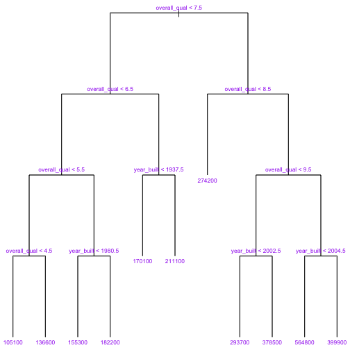
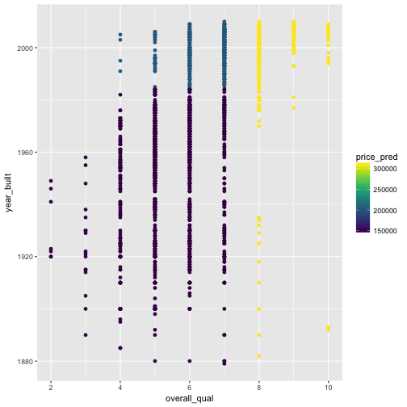


library(readr)
library(ggplot2)
library(dplyr)



ames <- read_csv("~/files/ml_data/ames.csv")


## Decision Trees


library(tree)
model <- tree(saleprice ~ neighborhood + overall_qual + overall_cond + year_built,
                      data = ames, subset = train_id == "train",
              control = tree.control(nobs = nrow(ames), mindev = 0.005))



## Warning in tree(saleprice ~ neighborhood + overall_qual + overall_cond + :
## NAs introduced by coercion



par(mar = c(0,0,0,0))
plot(model, type = "uniform")
text(model, cex = 0.7, col = "purple")


## Random Forests


library(randomForest)
model <- randomForest(saleprice ~ overall_qual + year_built,
                      data = ames, subset = train_id == "train",
                      ntree = 20, maxnodes = 3, mtry = 1)



obj <- predict(model, newdata = ames, predict.all = TRUE)$individual



ames$price_pred <- obj[,3]
qplot(overall_qual, year_built, data = ames, color = price_pred) +
  viridis::scale_color_viridis()



ames$price_pred <- predict(model, newdata = ames)
qplot(overall_qual, year_built, data = ames, color = price_pred) +
  viridis::scale_color_viridis()



sqrt(tapply((ames$saleprice - ames$price_pred)^2, ames$train_id, mean))



##     test    train    valid 
##       NA 53420.49 52693.22



importance(model)



##              IncNodePurity
## overall_qual  3.008759e+12
## year_built    1.966244e+12



sqrt(tapply((ames$saleprice - ames$price_pred)^2, ames$train_id, mean))



##     test    train    valid 
##       NA 53420.49 52693.22


## Gradient Boosted Trees


X <- model.matrix(~ . -1 , data = ames[,-c(1:3)])
y <- ames$saleprice

y_train <- y[ames$train_id == "train"]
y_valid <- y[ames$train_id == "valid"]
X_train <- X[ames$train_id == "train",]
X_valid <- X[ames$train_id == "valid",]



library(xgboost)
model <- xgboost(data = X_train, label = y_train,
                 max_depth = 2, eta = 0.01, nthread = 2,
                 nrounds = 10, objective = "reg:linear",
                 verbose = 1)



## [1]	train-rmse:200613.765625 
## [2]	train-rmse:198727.437500 
## [3]	train-rmse:196860.656250 
## [4]	train-rmse:195013.468750 
## [5]	train-rmse:193185.453125 
## [6]	train-rmse:191376.531250 
## [7]	train-rmse:189586.515625 
## [8]	train-rmse:187815.187500 
## [9]	train-rmse:186062.312500 
## [10]	train-rmse:184327.843750



y_valid_pred <- predict(model, newdata = X_valid)
sqrt(mean((y_valid - y_valid_pred)^2))



## [1] 184160.9



data_train <- xgb.DMatrix(data = X_train, label = y_train)
data_valid <- xgb.DMatrix(data = X_valid, label = y_valid)



watchlist <- list(train=data_train, valid=data_valid)

model <- xgb.train(data = data_train,
                 max_depth = 3, eta = 1, nthread = 2,
                 nrounds = 100, objective = "reg:linear",
                 watchlist = watchlist)



## [1]	train-rmse:39393.035156	valid-rmse:43673.875000 
## [2]	train-rmse:33180.218750	valid-rmse:39500.000000 
## [3]	train-rmse:30603.082031	valid-rmse:38185.210938 
## [4]	train-rmse:28056.132812	valid-rmse:35565.687500 
## [5]	train-rmse:26204.291016	valid-rmse:34096.132812 
## [6]	train-rmse:25026.939453	valid-rmse:33156.511719 
## [7]	train-rmse:24145.957031	valid-rmse:32177.208984 
## [8]	train-rmse:23053.837891	valid-rmse:31249.359375 
## [9]	train-rmse:22472.593750	valid-rmse:30777.189453 
## [10]	train-rmse:21989.720703	valid-rmse:31025.941406 
## [11]	train-rmse:21340.085938	valid-rmse:31001.617188 
## [12]	train-rmse:20732.269531	valid-rmse:30188.449219 
## [13]	train-rmse:19889.386719	valid-rmse:29897.552734 
## [14]	train-rmse:18944.714844	valid-rmse:29785.369141 
## [15]	train-rmse:18535.744141	valid-rmse:29576.892578 
## [16]	train-rmse:18210.230469	valid-rmse:29741.417969 
## [17]	train-rmse:17882.404297	valid-rmse:29961.208984 
## [18]	train-rmse:17370.464844	valid-rmse:29953.410156 
## [19]	train-rmse:17004.144531	valid-rmse:30052.984375 
## [20]	train-rmse:16729.660156	valid-rmse:30069.150391 
## [21]	train-rmse:16433.693359	valid-rmse:30005.419922 
## [22]	train-rmse:16106.257812	valid-rmse:29587.085938 
## [23]	train-rmse:15755.245117	valid-rmse:29866.257812 
## [24]	train-rmse:15611.137695	valid-rmse:29930.523438 
## [25]	train-rmse:15481.954102	valid-rmse:29922.580078 
## [26]	train-rmse:15239.398438	valid-rmse:29762.166016 
## [27]	train-rmse:14878.812500	valid-rmse:29568.207031 
## [28]	train-rmse:14757.214844	valid-rmse:29598.367188 
## [29]	train-rmse:14452.119141	valid-rmse:29717.328125 
## [30]	train-rmse:14307.778320	valid-rmse:29716.796875 
## [31]	train-rmse:13875.021484	valid-rmse:29500.107422 
## [32]	train-rmse:13692.269531	valid-rmse:29671.986328 
## [33]	train-rmse:13534.902344	valid-rmse:29819.833984 
## [34]	train-rmse:13382.177734	valid-rmse:29866.533203 
## [35]	train-rmse:13247.601562	valid-rmse:29989.492188 
## [36]	train-rmse:13055.895508	valid-rmse:30085.933594 
## [37]	train-rmse:12846.974609	valid-rmse:30183.054688 
## [38]	train-rmse:12637.966797	valid-rmse:30258.785156 
## [39]	train-rmse:12415.546875	valid-rmse:30403.175781 
## [40]	train-rmse:12246.894531	valid-rmse:30345.667969 
## [41]	train-rmse:12165.475586	valid-rmse:30535.990234 
## [42]	train-rmse:12054.515625	valid-rmse:30466.980469 
## [43]	train-rmse:11994.500977	valid-rmse:30512.562500 
## [44]	train-rmse:11799.468750	valid-rmse:30648.892578 
## [45]	train-rmse:11723.822266	valid-rmse:30713.769531 
## [46]	train-rmse:11617.278320	valid-rmse:30700.041016 
## [47]	train-rmse:11440.682617	valid-rmse:30871.414062 
## [48]	train-rmse:11266.614258	valid-rmse:30783.251953 
## [49]	train-rmse:11151.585938	valid-rmse:30740.259766 
## [50]	train-rmse:10977.289062	valid-rmse:30830.113281 
## [51]	train-rmse:10831.765625	valid-rmse:30893.207031 
## [52]	train-rmse:10757.065430	valid-rmse:30883.322266 
## [53]	train-rmse:10629.139648	valid-rmse:30965.039062 
## [54]	train-rmse:10528.677734	valid-rmse:30831.089844 
## [55]	train-rmse:10446.315430	valid-rmse:30816.150391 
## [56]	train-rmse:10412.606445	valid-rmse:30812.337891 
## [57]	train-rmse:10277.224609	valid-rmse:30853.896484 
## [58]	train-rmse:10122.825195	valid-rmse:30936.878906 
## [59]	train-rmse:9974.075195	valid-rmse:30986.166016 
## [60]	train-rmse:9863.710938	valid-rmse:31016.328125 
## [61]	train-rmse:9802.031250	valid-rmse:31017.359375 
## [62]	train-rmse:9733.841797	valid-rmse:30986.343750 
## [63]	train-rmse:9658.220703	valid-rmse:31028.199219 
## [64]	train-rmse:9583.494141	valid-rmse:30967.841797 
## [65]	train-rmse:9516.169922	valid-rmse:30943.517578 
## [66]	train-rmse:9439.804688	valid-rmse:31044.744141 
## [67]	train-rmse:9389.887695	valid-rmse:31166.009766 
## [68]	train-rmse:9327.608398	valid-rmse:31124.710938 
## [69]	train-rmse:9207.226562	valid-rmse:31258.431641 
## [70]	train-rmse:9156.968750	valid-rmse:31292.531250 
## [71]	train-rmse:9054.554688	valid-rmse:31347.099609 
## [72]	train-rmse:8954.575195	valid-rmse:31293.027344 
## [73]	train-rmse:8863.221680	valid-rmse:31247.968750 
## [74]	train-rmse:8833.748047	valid-rmse:31247.500000 
## [75]	train-rmse:8742.288086	valid-rmse:31231.701172 
## [76]	train-rmse:8637.204102	valid-rmse:31320.599609 
## [77]	train-rmse:8580.603516	valid-rmse:31251.595703 
## [78]	train-rmse:8486.450195	valid-rmse:31240.988281 
## [79]	train-rmse:8384.450195	valid-rmse:31221.802734 
## [80]	train-rmse:8289.244141	valid-rmse:31199.128906 
## [81]	train-rmse:8153.625977	valid-rmse:31260.589844 
## [82]	train-rmse:8066.261719	valid-rmse:31296.291016 
## [83]	train-rmse:7952.121094	valid-rmse:31384.126953 
## [84]	train-rmse:7903.960449	valid-rmse:31399.791016 
## [85]	train-rmse:7840.543457	valid-rmse:31427.130859 
## [86]	train-rmse:7761.291504	valid-rmse:31396.119141 
## [87]	train-rmse:7691.535156	valid-rmse:31464.666016 
## [88]	train-rmse:7622.209473	valid-rmse:31530.460938 
## [89]	train-rmse:7557.959473	valid-rmse:31407.935547 
## [90]	train-rmse:7453.467773	valid-rmse:31407.277344 
## [91]	train-rmse:7350.969238	valid-rmse:31414.355469 
## [92]	train-rmse:7309.545410	valid-rmse:31395.164062 
## [93]	train-rmse:7262.896973	valid-rmse:31408.294922 
## [94]	train-rmse:7230.316895	valid-rmse:31379.826172 
## [95]	train-rmse:7164.169922	valid-rmse:31405.041016 
## [96]	train-rmse:7136.749512	valid-rmse:31400.068359 
## [97]	train-rmse:7079.114258	valid-rmse:31377.681641 
## [98]	train-rmse:6993.206543	valid-rmse:31410.160156 
## [99]	train-rmse:6894.609375	valid-rmse:31494.599609 
## [100]	train-rmse:6839.067383	valid-rmse:31581.904297



importance_matrix <- xgb.importance(model = model)
importance_matrix[,1] <- colnames(X)[as.numeric(importance_matrix[[1]]) + 1]
importance_matrix



##              Feature         Gain        Cover   Frequency
##   1:    overall_qual 5.834151e-01 2.539266e-02 0.024615385
##   2:      price_pred 1.365819e-01 2.346205e-02 0.020000000
##   3:     gr_liv_area 6.564468e-02 4.816758e-02 0.043076923
##   4:    `1st_flr_sf` 4.012589e-02 5.365424e-02 0.049230769
##   5:    bsmtfin_sf_1 3.811273e-02 5.196652e-02 0.041538462
##  ---                                                      
## 141:    heating_qcGd 9.323116e-06 3.271651e-03 0.001538462
## 142: bsmt_exposureGd 7.394556e-06 1.037960e-05 0.001538462
## 143:  ms_subclass090 5.631989e-06 1.245552e-05 0.001538462
## 144:  bldg_typeTwnhs 4.657215e-06 2.283513e-05 0.001538462
## 145:   functionalTyp 3.183433e-06 1.660736e-05 0.001538462


