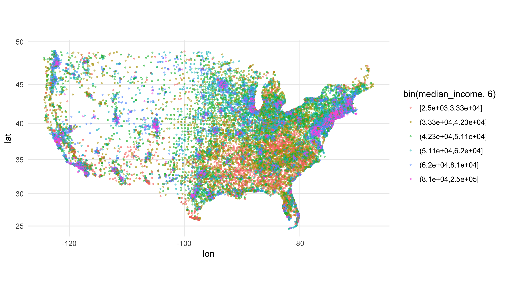
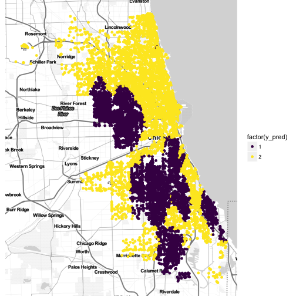
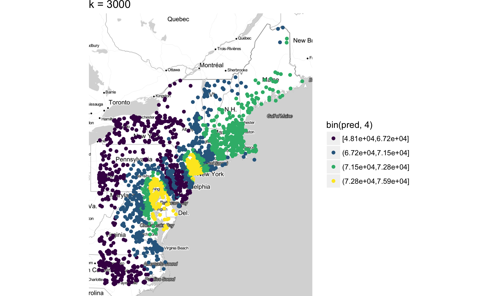
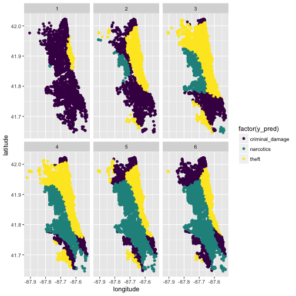
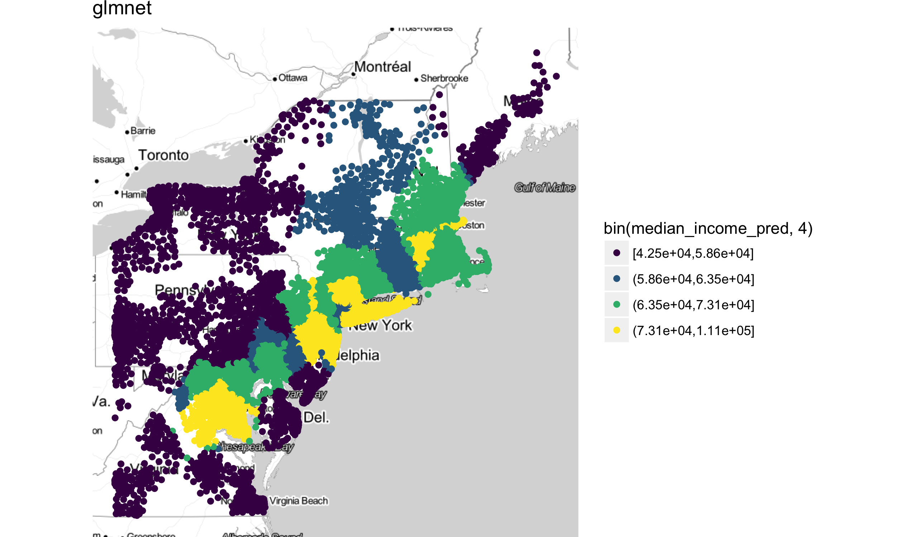
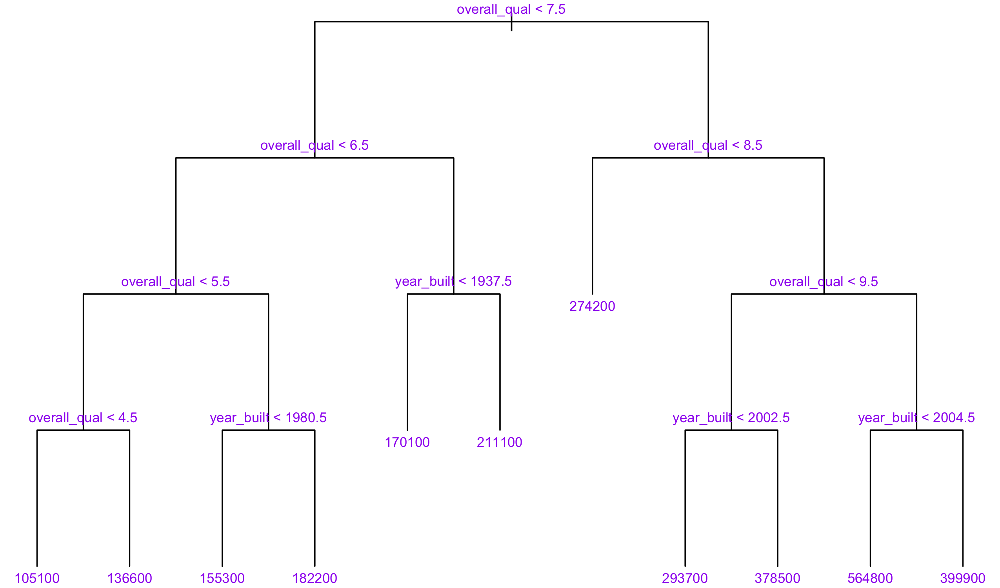
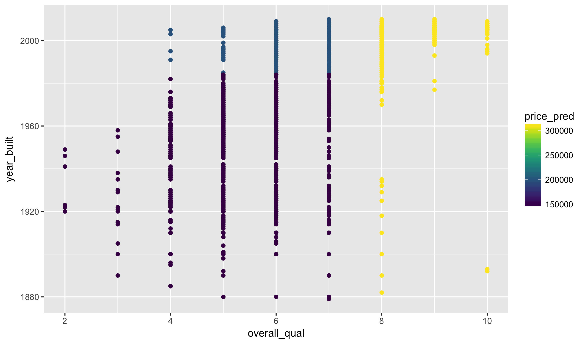
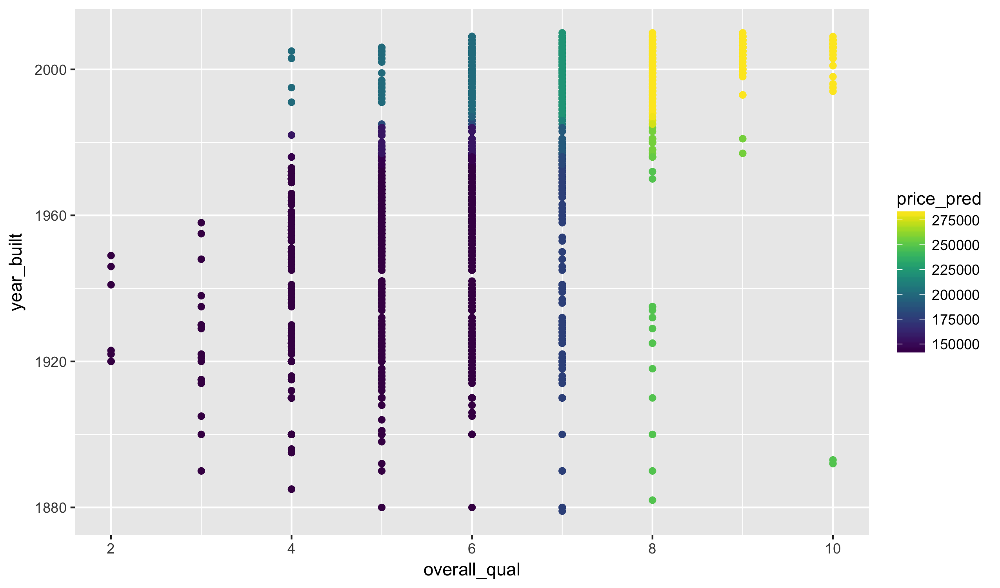


library(dplyr)
library(ggplot2)
library(readr)
library(viridis)
library(methods)


## Income data

For the first half of today, we are going to look at the dataset
you used on your last lab.


acs <- read_csv("https://statsmaths.github.io/ml_data/tract_median_income.csv")


Looking at the map, we see that income is highly local and highest
near large cities (such as NYC, Chicago, LA, and Houston).


library(smodels)
temp <- filter(acs, train_id == "train", !(state %in% c("AK", "HI")))
qplot(lon, lat, data = temp, color = bin(median_income, 6),
      size = I(0.5), alpha = I(0.5)) +
  theme_minimal() +
  coord_map()


While we have seen ways of building models that account for
linearites and interactions (GAMs and basis expansion), today's
focus will be on using inherantly local models to learn the
response variable here.

### Tuning k-nearest neighbors

The knn model, as we saw last time, requires us to use
a model matrix. We will construct one here using only
longitude and latitude:


X <- as.matrix(select(acs, lon, lat))
y <- acs$median_income

X_train <- X[acs$train_id == "train",]
X_valid <- X[acs$train_id == "valid",]
y_train <- y[acs$train_id == "train"]
y_valid <- y[acs$train_id == "valid"]


While we usually do not need a specific validation X matrix
and response vector y, it will be useful here today. We will
fit the k-nearest neighbors algorithm for 25 values of the
hyperparameter k, specifically, the integers 1 through 25.
I will save the RMSE of the validation set for each value of
k.


library(FNN)
rmse <- rep(NA, 25)
for (k in seq_along(rmse)) {
  y_valid_pred <- knn.reg(train = X_train, y = y_train,
                          test = X_valid, k = k)$pred
  rmse[k] <- sqrt( mean((y_valid_pred - y_valid)^2) )
}


With these values, we can plot the RMSE as a function of
the parameter k:


qplot(seq_along(rmse), rmse) +
  geom_line() +
  theme_minimal()


The optimal value seems to be at k equal to 5, with a drastic
degradation for k equal to 1 or 2.

One thing that may be counterintuitive about k-nearest neighbors
is the relationship between k and the model complexity. Here is
a plot of the fitted values for k equal to 3000 over the Northeastern
US:


id <- (X_valid[,1] > -80) & (X_valid[,2] > 35)
pred_id <- knn.reg(train = X_train, y = y_train,
                   test = X_valid[id,], k = 3000)$pred

df <- data_frame(lon = X_valid[id,1], lat = X_valid[id,2],
                 pred = pred_id)

library(ggmap)
qmplot(lon, lat, data = df, color = bin(pred, 4)) +
  viridis::scale_color_viridis(discrete = TRUE) +
  ggtitle("k = 3000")



## Warning: `panel.margin` is deprecated. Please use `panel.spacing` property
## instead


There are large regions that all have very similar predicted
values. In contrast, here are the predicted value from k equal to
3.


id <- (X_valid[,1] > -80) & (X_valid[,2] > 35)
pred_id <- knn.reg(train = X_train, y = y_train,
                   test = X_valid[id,], k = 3)$pred

df <- data_frame(lon = X_valid[id,1], lat = X_valid[id,2],
                 pred = pred_id)

qmplot(lon, lat, data = df, color = bin(pred, 4)) +
  viridis::scale_color_viridis(discrete = TRUE) +
  ggtitle("k = 5")



## Warning: `panel.margin` is deprecated. Please use `panel.spacing` property
## instead


Here, the values change rapidly and there are many nearby
points with drastically different values. So, a high value
of k is a less complex model and a low value is a more
complex model. If this seems confusing, think about k being
the size of the entire training set (every point will then
be equal to a constant: the training set mean). Also perhaps
confusing is that models with a larger k take longer to fit;
this should make sense as there are more points to average,
but goes against our general idea that more complex models
are more difficult to fit.

## Clustering with K-means

An alternative to k-nearest neighbors is to split the dataset
into fixed neighborhoods of nearby points and use these as
indicator variables in a model. To do this, we need to cluster
the input data. There are many algorithms available for clustering;
one of the most widely known and implemented is k-means clustering.
This is achieved by way of the `kmeans` function and requires only
that we set the number of centers. Here is a plot of kmeans applied
to the `acs` data:


set.seed(1)
acs$cluster_20 <- kmeans(X, centers = 20)$cluster
qmplot(lon, lat, data = acs, color = factor(cluster_20))



## Warning: `panel.margin` is deprecated. Please use `panel.spacing` property
## instead


Notice that I have set the random seed as the output of the algorithm
is stochastic. Here, longitude and latitude are on similar scales, but
generally you should scale the data matrix X prior to clustering.

Let's now build 20, 100, and 200 member clusters in the dataset:


set.seed(1)
acs$cluster_20 <- kmeans(X, centers = 20)$cluster
acs$cluster_100 <- kmeans(X, centers = 100)$cluster
acs$cluster_200 <- kmeans(X, centers = 200)$cluster


We can use these in a `glmnet` model to determine which clusters
should have their own offsets. I am going to use the function
`model.Matrix` (note the captial M) from the **MatrixModels**
package for efficency purposes. We will discuss the details of
the function once we get to textual data:


library(MatrixModels)
X <- model.Matrix(~ factor(cluster_20) + factor(cluster_100) +
                    factor(cluster_200) + -1 , data = acs, sparse = TRUE)
y <- acs$median_income
X_train <- X[acs$train_id == "train",]
y_train <- y[acs$train_id == "train"]


And we will fit an elastic net model to the data:


library(glmnet)



## Warning: package 'glmnet' was built under R version 3.4.2



model <- cv.glmnet(X_train, y_train, alpha = 0.2)
acs$median_income_pred <- predict(model, newx = X)


Notice that the output resembles k-nearest neighbors:


acs_ne <- filter(acs, lon > -80, lat > 35, lon < -30)
qmplot(lon, lat, data = acs_ne, color = bin(median_income_pred, 4)) +
  viridis::scale_color_viridis(discrete = TRUE) +
  ggtitle("glmnet")



## Warning: `panel.margin` is deprecated. Please use `panel.spacing` property
## instead


There are important differences with the k-nearest neighbors
method, however. The regions to group together have been determined
adaptively. Notice that upstate New York and Maine have moslty be
pushed into the same values. The Metro NYC area, in constrast, has
many more regions.

## Decision Trees

We will now look at a new dataset of housing prices in Ames,
Iowa. Unlike our other housing datasets though, the samples
here are individual houses.


ames <- read_csv("https://statsmaths.github.com/ml_data/ames.csv")


One way to build a predictive algorithm is to describe a decision
tree. The best way to understand what this is is to see an example.
Here, we use the `tree` library (pre-installed in R) to predict
sales price:


library(tree)
model <- tree(saleprice ~ neighborhood + overall_qual + overall_cond + year_built,
                      data = ames, subset = train_id == "train",
              control = tree.control(nobs = nrow(ames), mindev = 0.005))



## Warning in tree(saleprice ~ neighborhood + overall_qual + overall_cond + :
## NAs introduced by coercion


This relatively old library needs a special plotting notation (so
don't worry if this looks strange)


par(mar = c(0,0,0,0))
plot(model, type = "uniform")
text(model, cex = 0.7, col = "purple")


In order to do prediction, we start at the top of the tree and
look at each logical statement. If True, move to the left and
if False move to right. At the bottom (the *terminal nodes* or *leaves*),
there are predicted values. The tree was built by greedily picking
variables to spit the dataset up by until some stopping criterion
was reached; this is usually a fixed depth, a fixed proportion of
the data, or a fixed decrease in the RMSE of accuracy rate.

## Random Forests

Decision trees give very noisy predictions due to their use of
greedy logic and because points on the boundary of a decision
cut-off are forced into a fixed bucket. By noisy, I mean that a
slightly different training set would yield significantly
different predictions for at least some of the test points.
This may seem like a design flaw, but we can easily turn it into
a design feature!

The idea of a random forest is to add some randomness into the
decision tree algorithm, fit a large number of trees using this
random variation, and produce predictions by averaging together
the predictions from all these individual trees (its a *forest*
because there are a lot of trees; get it?). The random logic
applies only the building of the trees; once created, each tree
is exactly the same as in the case above. The randomness comes
from two sources:

- for each tree, select only a subset of the training data to
train with
- for each split, select only a subset of the available variables
to split on

The exact values for these two random features can be set as
hyperparameters. We can fit random forests using the `randomForest`
function from the package with the same name as follows:


library(randomForest)
set.seed(1)
model <- randomForest(saleprice ~ overall_qual + year_built,
                      data = ames, subset = train_id == "train",
                      ntree = 20, maxnodes = 3, mtry = 1)


Here I selected 20 randomly generated trees, each having at most
3 terminal nodes and only allowing one variable to be used at
each split. These are very low settings, used only for illustrating
the algorithm here. We can get predictions from each individual
tree by setting `predict.all` to `TRUE`:


obj <- predict(model, newdata = ames, predict.all = TRUE)$individual


Here is the prediction for just the third tree:


ames$price_pred <- obj[,4]
qplot(overall_qual, year_built, data = ames, color = price_pred) +
  viridis::scale_color_viridis()


Can you figure out roughly what the tree looks like? It first
splits on overal quality being less than 7.5, and then splits
the lower quality houses by year built around 1982. The individual
prediction is not very smooth or complex.

Taking all of the twenty trees together, the average model
looks quite a bit different:


ames$price_pred <- predict(model, newdata = ames)
qplot(overall_qual, year_built, data = ames, color = price_pred) +
  viridis::scale_color_viridis()


Helpfully, the **randomForest** also provides the function
`importance` that measures how important each variable is
to the model.


importance(model)



##              IncNodePurity
## overall_qual  3.119819e+12
## year_built    1.886067e+12


This is a measurement of how often the variable was used
in the model and how much it decreased the RMSE each time it
was used to split the dataset.

## Gradient Boosted Trees

Gradient boosted trees offer a slightly different approach
to random forests for making use of the noisy nature of
decision trees. Like random forests, they construct a
number of trees, each using only a subset of the training
data. They do not restrict the variables available for
each node to split on. Most importantly, gradient boosted
trees are fit in a sequence, with each tree trying to predict
the residuals left over by the other trees.

More exactly, if the fitted values from the t-th tree
are given by:

$$ \widehat{Y_i^t} $$
Then we train the k-th tree on the values Z given by:

$$ Z_i = Y_i - \eta \cdot \sum_{t = 1}^{k - 1} \widehat{Y_i^t} $$

The parameter eta is the learning rate. If set to one, this
is exactly fitting on the residuals of the prior trees.
Setting to less than one stop the trees from overfitting from
the first few trees. Here, we prepare a larger set of variables
from the `ames` dataset:


X <- model.matrix(~ . -1 , data = ames[,-c(1:3)])
y <- ames$saleprice

y_train <- y[ames$train_id == "train"]
y_valid <- y[ames$train_id == "valid"]
X_train <- X[ames$train_id == "train",]
X_valid <- X[ames$train_id == "valid",]


We will use the **xgboost** package to fit gradient
boosted trees. I will set the eta parameter to 0.02.


library(xgboost)
model <- xgboost(data = X_train, label = y_train,
                 max_depth = 2, eta = 0.01, nthread = 2,
                 nrounds = 10, objective = "reg:linear",
                 verbose = 1)



## [1]	train-rmse:200613.875000 
## [2]	train-rmse:198727.640625 
## [3]	train-rmse:196860.953125 
## [4]	train-rmse:195013.859375 
## [5]	train-rmse:193185.953125 
## [6]	train-rmse:191377.140625 
## [7]	train-rmse:189587.203125 
## [8]	train-rmse:187815.984375 
## [9]	train-rmse:186063.203125 
## [10]	train-rmse:184328.828125


And we can do prediction on the dataset:


y_valid_pred <- predict(model, newdata = X_valid)
sqrt(mean((y_valid - y_valid_pred)^2))



## [1] 184162.9


Alternatively, we can use the function `xgb.DMatrix` to
combine the data matrix and labels:


data_train <- xgb.DMatrix(data = X_train, label = y_train)
data_valid <- xgb.DMatrix(data = X_valid, label = y_valid)


And use a more advanced calling method for **xgboost**:


watchlist <- list(train=data_train, valid=data_valid)

model <- xgb.train(data = data_train,
                 max_depth = 3, eta = 1, nthread = 2,
                 nrounds = 100, objective = "reg:linear",
                 watchlist = watchlist)



## [1]	train-rmse:39387.718750	valid-rmse:43630.218750 
## [2]	train-rmse:33187.484375	valid-rmse:39454.351562 
## [3]	train-rmse:30578.279297	valid-rmse:38123.277344 
## [4]	train-rmse:28023.640625	valid-rmse:35523.105469 
## [5]	train-rmse:26166.941406	valid-rmse:34078.468750 
## [6]	train-rmse:24995.691406	valid-rmse:33140.027344 
## [7]	train-rmse:24229.658203	valid-rmse:32568.550781 
## [8]	train-rmse:22881.064453	valid-rmse:31502.035156 
## [9]	train-rmse:21674.976562	valid-rmse:31560.398438 
## [10]	train-rmse:21044.863281	valid-rmse:30859.064453 
## [11]	train-rmse:20491.050781	valid-rmse:30980.572266 
## [12]	train-rmse:20045.650391	valid-rmse:31187.617188 
## [13]	train-rmse:19656.458984	valid-rmse:30825.869141 
## [14]	train-rmse:19116.199219	valid-rmse:30785.873047 
## [15]	train-rmse:18829.880859	valid-rmse:30708.177734 
## [16]	train-rmse:18453.912109	valid-rmse:31036.326172 
## [17]	train-rmse:17860.994141	valid-rmse:30655.796875 
## [18]	train-rmse:17397.365234	valid-rmse:30416.314453 
## [19]	train-rmse:17067.007812	valid-rmse:30946.679688 
## [20]	train-rmse:16704.880859	valid-rmse:31027.126953 
## [21]	train-rmse:16278.335938	valid-rmse:31071.878906 
## [22]	train-rmse:16038.116211	valid-rmse:31153.265625 
## [23]	train-rmse:15765.764648	valid-rmse:30998.392578 
## [24]	train-rmse:15456.485352	valid-rmse:31223.222656 
## [25]	train-rmse:15273.040039	valid-rmse:31096.722656 
## [26]	train-rmse:14958.646484	valid-rmse:31197.484375 
## [27]	train-rmse:14811.100586	valid-rmse:31233.912109 
## [28]	train-rmse:14576.267578	valid-rmse:31070.244141 
## [29]	train-rmse:14414.208984	valid-rmse:31219.134766 
## [30]	train-rmse:14274.974609	valid-rmse:31211.501953 
## [31]	train-rmse:13968.666992	valid-rmse:31381.671875 
## [32]	train-rmse:13699.797852	valid-rmse:31438.687500 
## [33]	train-rmse:13550.646484	valid-rmse:31520.996094 
## [34]	train-rmse:13337.493164	valid-rmse:31807.056641 
## [35]	train-rmse:13176.716797	valid-rmse:31770.550781 
## [36]	train-rmse:13036.213867	valid-rmse:31813.195312 
## [37]	train-rmse:12772.610352	valid-rmse:31904.640625 
## [38]	train-rmse:12569.961914	valid-rmse:31994.439453 
## [39]	train-rmse:12410.292969	valid-rmse:31991.849609 
## [40]	train-rmse:12311.220703	valid-rmse:31941.285156 
## [41]	train-rmse:12095.907227	valid-rmse:31696.376953 
## [42]	train-rmse:11897.456055	valid-rmse:31808.634766 
## [43]	train-rmse:11658.248047	valid-rmse:31799.466797 
## [44]	train-rmse:11449.622070	valid-rmse:31775.031250 
## [45]	train-rmse:11338.799805	valid-rmse:31746.113281 
## [46]	train-rmse:11242.211914	valid-rmse:31920.767578 
## [47]	train-rmse:11067.416016	valid-rmse:32018.767578 
## [48]	train-rmse:10891.774414	valid-rmse:32050.312500 
## [49]	train-rmse:10721.001953	valid-rmse:32075.419922 
## [50]	train-rmse:10560.923828	valid-rmse:32084.414062 
## [51]	train-rmse:10402.637695	valid-rmse:31847.986328 
## [52]	train-rmse:10356.886719	valid-rmse:31851.632812 
## [53]	train-rmse:10234.088867	valid-rmse:31902.597656 
## [54]	train-rmse:10094.040039	valid-rmse:31966.564453 
## [55]	train-rmse:9937.343750	valid-rmse:31960.406250 
## [56]	train-rmse:9794.728516	valid-rmse:32056.812500 
## [57]	train-rmse:9684.227539	valid-rmse:32176.064453 
## [58]	train-rmse:9586.635742	valid-rmse:32149.871094 
## [59]	train-rmse:9476.002930	valid-rmse:32195.085938 
## [60]	train-rmse:9271.000000	valid-rmse:32174.087891 
## [61]	train-rmse:9147.355469	valid-rmse:32320.279297 
## [62]	train-rmse:9008.699219	valid-rmse:32299.322266 
## [63]	train-rmse:8864.962891	valid-rmse:32288.832031 
## [64]	train-rmse:8830.485352	valid-rmse:32258.412109 
## [65]	train-rmse:8786.670898	valid-rmse:32259.580078 
## [66]	train-rmse:8683.625977	valid-rmse:32298.400391 
## [67]	train-rmse:8613.983398	valid-rmse:32299.162109 
## [68]	train-rmse:8570.147461	valid-rmse:32173.515625 
## [69]	train-rmse:8483.368164	valid-rmse:32090.998047 
## [70]	train-rmse:8394.336914	valid-rmse:32118.982422 
## [71]	train-rmse:8276.410156	valid-rmse:32177.640625 
## [72]	train-rmse:8151.367676	valid-rmse:32210.968750 
## [73]	train-rmse:8084.541016	valid-rmse:32225.222656 
## [74]	train-rmse:8038.354492	valid-rmse:32280.789062 
## [75]	train-rmse:7937.657715	valid-rmse:32341.556641 
## [76]	train-rmse:7865.796875	valid-rmse:32508.480469 
## [77]	train-rmse:7805.263672	valid-rmse:32546.832031 
## [78]	train-rmse:7761.944336	valid-rmse:32599.972656 
## [79]	train-rmse:7705.764648	valid-rmse:32585.083984 
## [80]	train-rmse:7624.173828	valid-rmse:32597.328125 
## [81]	train-rmse:7568.135254	valid-rmse:32645.367188 
## [82]	train-rmse:7505.100098	valid-rmse:32713.955078 
## [83]	train-rmse:7419.775879	valid-rmse:32800.683594 
## [84]	train-rmse:7322.812012	valid-rmse:32858.601562 
## [85]	train-rmse:7231.112793	valid-rmse:32824.699219 
## [86]	train-rmse:7183.702637	valid-rmse:32830.074219 
## [87]	train-rmse:7103.186523	valid-rmse:32778.093750 
## [88]	train-rmse:7016.894531	valid-rmse:32807.566406 
## [89]	train-rmse:6915.380371	valid-rmse:32755.068359 
## [90]	train-rmse:6838.368652	valid-rmse:32792.367188 
## [91]	train-rmse:6778.382324	valid-rmse:32758.763672 
## [92]	train-rmse:6700.780762	valid-rmse:32731.150391 
## [93]	train-rmse:6604.482910	valid-rmse:32684.847656 
## [94]	train-rmse:6545.086426	valid-rmse:32620.916016 
## [95]	train-rmse:6522.374512	valid-rmse:32671.328125 
## [96]	train-rmse:6433.093750	valid-rmse:32659.060547 
## [97]	train-rmse:6382.375488	valid-rmse:32710.066406 
## [98]	train-rmse:6335.753906	valid-rmse:32692.509766 
## [99]	train-rmse:6244.332031	valid-rmse:32710.580078 
## [100]	train-rmse:6163.050781	valid-rmse:32633.583984


The algorithm is the same, but there are more options available
with `xgb.train`. As with random forests, there is a way of
looking at variable importance. I don't like the default output
view, so here is some code to make it look nicer:


importance_matrix <- xgb.importance(model = model)
importance_matrix[,1] <- colnames(X)[as.numeric(importance_matrix[[1]]) + 1]
importance_matrix



##             Feature         Gain        Cover   Frequency
##   1:   overall_qual 5.830815e-01 3.878433e-02 0.024024024
##   2:     price_pred 1.368774e-01 2.544728e-02 0.018018018
##   3:    gr_liv_area 6.700802e-02 7.306831e-02 0.063063063
##   4:   `1st_flr_sf` 4.027978e-02 2.863572e-02 0.033033033
##   5:   bsmtfin_sf_1 3.837214e-02 6.649631e-02 0.051051051
##  ---                                                     
## 134: ms_subclass080 1.482758e-05 3.333742e-03 0.001501502
## 135: ms_subclass085 8.917817e-06 1.037902e-05 0.001501502
## 136: ms_subclass120 5.179132e-06 6.227413e-06 0.001501502
## 137: ms_subclass050 3.606932e-06 1.037902e-05 0.001501502
## 138: ms_subclass190 2.644195e-06 8.303217e-06 0.001501502


## Thoughts on local models

We've covered a lot today. Here are some take aways:

- k-nearest neighbors are great for smoothing predictions
or creating meta-features
- k is inversely related to the complexity of the model
- using clusters simulated KNN but allows for covariates
and adaptation to the data
- don't use the `tree` function for actual predictions; I
only used it to illustrate decision trees
- random forests are easy to use and difficult to overfit
with
- gradient boosted trees are incredibly powerful (often
the give the most predictive models in large ML competitions)
- you need to tune eta and number of trees in GBT to get
a good model

The last point should be the object of study for the next
lab. We will discuss the details more next week when going
over the lab.

