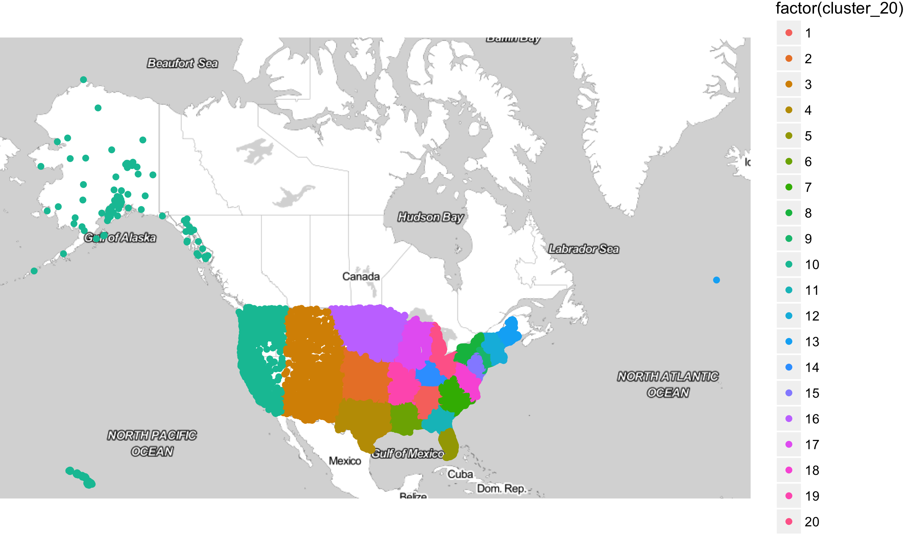


library(dplyr)
library(ggplot2)
library(readr)
library(viridis)


## Income data

The data for today is similar to the California housing dataset. For
each census tract we need to predict the median income variable.
Here, however, we now have data for the entire United States.


acs <- read_csv("https://statsmaths.github.io/ml_data/tract_median_income.csv")


Looking at the map, we see that income is highly local and highest
near large cities (such as NYC, Chicago, LA, and Houston).


library(smodels)
temp <- filter(acs, train_id == "train", !(state %in% c("AK", "HI")))
qplot(lon, lat, data = temp, color = bin(median_income, 6),
      size = I(0.5), alpha = I(0.5)) +
  theme_minimal() +
  coord_map()


###


X <- as.matrix(select(acs, lon, lat))
y <- acs$median_income

X_train <- X[acs$train_id == "train",]
X_valid <- X[acs$train_id == "valid",]
y_train <- y[acs$train_id == "train"]
y_valid <- y[acs$train_id == "valid"]



rmse <- rep(NA, 25)
for (k in seq_along(rmse)) {
  y_valid_pred <- knn.reg(train = X_train, y = y_train,
                          test = X_valid, k = k)$pred
  rmse[k] <- sqrt( mean((y_valid_pred - y_valid)^2) )
}



## Error: could not find function "knn.reg"



qplot(seq_along(rmse), rmse) +
  geom_line() +
  theme_minimal()



id <- (X_valid[,1] > -80) & (X_valid[,2] > 35)
pred_id <- knn.reg(train = X_train, y = y_train,
                   test = X_valid[id,], k = 2000)$pred



## Error in eval(expr, envir, enclos): could not find function "knn.reg"



df <- data_frame(lon = X_valid[id,1], lat = X_valid[id,2],
                 pred = pred_id)



## Error in overscope_eval_next(overscope, expr): object 'pred_id' not found



qmplot(lon, lat, data = df, color = bin(pred, 4)) +
  viridis::scale_color_viridis(discrete = TRUE) +
  ggtitle("k = 2000")



## Error in eval(expr, envir, enclos): could not find function "qmplot"



id <- (X_valid[,1] > -80) & (X_valid[,2] > 35)
pred_id <- knn.reg(train = X_train, y = y_train,
                   test = X_valid[id,], k = 3)$pred



## Error in eval(expr, envir, enclos): could not find function "knn.reg"



df <- data_frame(lon = X_valid[id,1], lat = X_valid[id,2],
                 pred = pred_id)



## Error in overscope_eval_next(overscope, expr): object 'pred_id' not found



qmplot(lon, lat, data = df, color = bin(pred, 4)) +
  viridis::scale_color_viridis(discrete = TRUE) +
  ggtitle("k = 5")



## Error in eval(expr, envir, enclos): could not find function "qmplot"


## Sparse Matricies

Let us make a design matrix capturing the state variable in
the dataset. I'll take just a small sample of the dataset
to illustrate the point:


set.seed(1)
X <- model.matrix(~state, data = sample_n(acs, size = 10))
X



##    (Intercept) stateFL stateGA stateKS stateNE stateNY stateTX stateVA
## 1            1       0       1       0       0       0       0       0
## 2            1       0       0       1       0       0       0       0
## 3            1       0       0       0       1       0       0       0
## 4            1       0       0       0       0       0       1       0
## 5            1       1       0       0       0       0       0       0
## 6            1       0       0       0       0       0       1       0
## 7            1       0       0       0       0       0       0       1
## 8            1       0       0       0       0       1       0       0
## 9            1       0       0       0       0       1       0       0
## 10           1       0       0       0       0       0       0       0
## attr(,"assign")
## [1] 0 1 1 1 1 1 1 1
## attr(,"contrasts")
## attr(,"contrasts")$state
## [1] "contr.treatment"


Noticed that the design matrix above contains primarily zeros.
With large datasets and even more categories,
we would be wasting a lot of valuable memory holding all of
these values. R has support for objects known as sparse
matricies. These store only the non-zero elements, saving
space when most elements are zero. To access them, we'll load
the **MatrixModels** package and using the function `model.Matrix`
(in general, in R capital letters indicate sparse matrix
variations of dense matrix operations).


library(methods)
library(MatrixModels)
set.seed(1)
X <- model.Matrix(~ state , data = sample_n(acs, size = 10),
                  sparse = TRUE)
X



## "dsparseModelMatrix": 10 x 8 sparse Matrix of class "dgCMatrix"
##    (Intercept) stateFL stateGA stateKS stateNE stateNY stateTX stateVA
## 1            1       .       1       .       .       .       .       .
## 2            1       .       .       1       .       .       .       .
## 3            1       .       .       .       1       .       .       .
## 4            1       .       .       .       .       .       1       .
## 5            1       1       .       .       .       .       .       .
## 6            1       .       .       .       .       .       1       .
## 7            1       .       .       .       .       .       .       1
## 8            1       .       .       .       .       1       .       .
## 9            1       .       .       .       .       1       .       .
## 10           1       .       .       .       .       .       .       .
## @ assign:  0 1 1 1 1 1 1 1 
## @ contrasts:
## $state
## [1] "contr.treatment"


Many operations, such as subsetting and multiplication, translate
directly to sparse matrices. We'll construct training and validation
sets as before:


X <- model.Matrix(~ state , data = acs, sparse = TRUE)

X_train <- X[acs$train_id == "train",]
X_valid <- X[acs$train_id == "valid",]


The **MatrixModels** package has experimental support for computing
linear regression models with sparse matricies using the function
`lm.fit.sparse`. Because it is experimental, we need to prepend the
notation `MatrixModels:::` to the function call:


beta <- MatrixModels:::lm.fit.sparse(X_train, y_train)
beta



##  [1]  68901.540 -25989.041 -27042.780 -14698.986  -2001.958  -4434.359
##  [7]   5670.806   4505.802  -7703.768 -18291.751 -18225.122   2933.547
## [13] -16347.391 -21083.230  -9311.778 -20482.650 -15917.065 -23437.565
## [19] -23556.546   3429.138  10566.917 -19612.351 -17907.762  -6817.585
## [25] -19298.992 -30300.687 -21136.827 -19370.822 -10038.143 -14938.981
## [31]  -1890.319   7031.681 -20887.978 -12859.349  -4762.510 -20238.473
## [37] -21293.034 -15506.997 -13177.950 -10664.303 -23306.434 -17068.681
## [43] -21369.316 -13493.400  -4644.084   4652.473 -14216.485  -4956.537
## [49] -15009.532 -27867.597 -10510.912


Notice that this yields the same regression vector beta as the dense
operations above. It is only the algorithm that changes.

## Indicator variables in glmnet

Remember that when building design matricies for categorical variables,
we usually have a baseline variable and define the other weights as
changes from this baseline. This is because otherwise the model will
be rank-deficent; there will be multiple ways of representing the
exact same model.

When using penalized regression, this rank issue is not a problem.
The choice between equivalent models is made by the penality; there
will be a uniquely 'best' model for any elastic net model with alpha
less than 1. In fact, it actually makes sense to have a seperate
parameter for each level, rather than a baseline and offsets from
it. The choice of baseline in penalized models would actually change
the resulting model. To do this, all we have to specify is that
we do not want an intercept by giving the formula the option "-1":


X <- model.Matrix(~ state -1 , data = acs, sparse = TRUE)
colnames(X)



##  [1] "stateAK" "stateAL" "stateAR" "stateAZ" "stateCA" "stateCO" "stateCT"
##  [8] "stateDC" "stateDE" "stateFL" "stateGA" "stateHI" "stateIA" "stateID"
## [15] "stateIL" "stateIN" "stateKS" "stateKY" "stateLA" "stateMA" "stateMD"
## [22] "stateME" "stateMI" "stateMN" "stateMO" "stateMS" "stateMT" "stateNC"
## [29] "stateND" "stateNE" "stateNH" "stateNJ" "stateNM" "stateNV" "stateNY"
## [36] "stateOH" "stateOK" "stateOR" "statePA" "stateRI" "stateSC" "stateSD"
## [43] "stateTN" "stateTX" "stateUT" "stateVA" "stateVT" "stateWA" "stateWI"
## [50] "stateWV" "stateWY"


And this is nice too, because as a side benefit we also do not have
an intercept term, which is handled directly by glmnet anyway.

## Clustering with K-means


library(ggmap)
X <- as.matrix(select(acs, lon, lat))

set.seed(1)
acs$cluster_20 <- kmeans(X, centers = 20)$cluster
qmplot(lon, lat, data = acs, color = factor(cluster_20))



library(ggmap)
X <- as.matrix(select(acs, lon, lat))

set.seed(1)
acs$cluster_20 <- kmeans(X, centers = 20)$cluster
acs$cluster_100 <- kmeans(X, centers = 100)$cluster
acs$cluster_200 <- kmeans(X, centers = 200)$cluster


## Building models with clusters


X <- model.Matrix(~ factor(cluster_20) + factor(cluster_100) +
                    factor(cluster_200) + -1 , data = acs, sparse = TRUE)
y <- acs$median_income
X_train <- X[acs$train_id == "train",]
y_train <- y[acs$train_id == "train"]



library(glmnet)
model <- cv.glmnet(X_train, y_train, alpha = 0.2)



acs$median_income_pred <- predict(model, newx = X)



acs_ne <- filter(acs, lon > -80, lat > 35, lon < -30)
qmplot(lon, lat, data = acs_ne, color = bin(median_income_pred, 4)) +
  viridis::scale_color_viridis(discrete = TRUE) +
  ggtitle("k = 5")



sqrt(tapply((acs$median_income - acs$median_income_pred)^2,
            acs$train_id, mean))



##     test    train    valid 
##       NA 25076.68 25177.46


## Hierarchical models


model <- lm(median_income ~ cluster_20, data = acs,
            subset = (train_id == "train"))
acs$cluster_20_value <- predict(model, newdata = acs)
sqrt(tapply((acs$median_income - acs$cluster_20_value)^2,
            acs$train_id, mean))



##     test    train    valid 
##       NA 28361.66 28553.62



model <- lm(median_income ~ cluster_100, data = acs,
            subset = (train_id == "train"))
acs$cluster_100_value <- predict(model, newdata = acs)
sqrt(tapply((acs$median_income - acs$cluster_100_value)^2,
            acs$train_id, mean))



##     test    train    valid 
##       NA 28396.50 28587.69



model <- lm(median_income ~ cluster_200, data = acs,
            subset = (train_id == "train"))
acs$cluster_200_value <- predict(model, newdata = acs)
sqrt(tapply((acs$median_income - acs$cluster_200_value)^2,
            acs$train_id, mean))



##     test    train    valid 
##       NA 28393.72 28586.62



model <- lm(median_income ~ poly(cluster_20_value, cluster_100_value,
                cluster_200_value, degree = 3), data = acs,
            subset = (train_id == "train"))
acs$median_income_pred <- predict(model, newdata = acs)
sqrt(tapply((acs$median_income - acs$median_income_pred)^2,
            acs$train_id, mean))



##     test    train    valid 
##       NA 27886.04 28008.99



X <- model.Matrix(~ cluster_20_value +
                    cluster_100_value +
                    cluster_200_value +
                    factor(cluster_20) +
                    factor(cluster_100) +
                    factor(cluster_200) + -1 , data = acs, sparse = TRUE)
y <- acs$median_income
X_train <- X[acs$train_id == "train",]
y_train <- y[acs$train_id == "train"]
model <- cv.glmnet(X_train, y_train, alpha = 0.2)



acs$median_income_pred <- predict(model, newx = X)
sqrt(tapply((acs$median_income - acs$median_income_pred)^2,
            acs$train_id, mean))



##     test    train    valid 
##       NA 25094.00 25197.63


