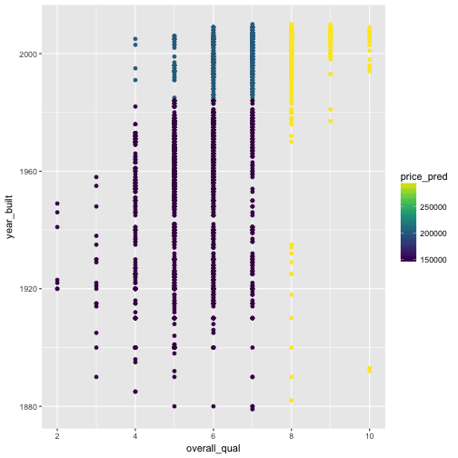
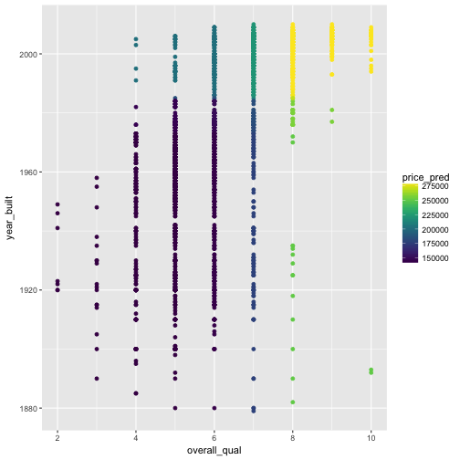


library(readr)
library(ggplot2)
library(dplyr)



ames <- read_csv("~/files/ml_data/ames.csv")


## Decision Trees


library(tree)
model <- tree(saleprice ~ neighborhood + overall_qual + overall_cond + year_built,
                      data = ames, subset = train_id == "train",
              control = tree.control(nobs = nrow(ames), mindev = 0.005))



## Warning in tree(saleprice ~ neighborhood + overall_qual + overall_cond + :
## NAs introduced by coercion



par(mar = c(0,0,0,0))
plot(model, type = "uniform")
text(model, cex = 0.7, col = "purple")


## Random Forests


library(randomForest)
model <- randomForest(saleprice ~ overall_qual + year_built,
                      data = ames, subset = train_id == "train",
                      ntree = 20, maxnodes = 3, mtry = 1)



obj <- predict(model, newdata = ames, predict.all = TRUE)$individual



ames$price_pred <- obj[,3]
qplot(overall_qual, year_built, data = ames, color = price_pred) +
  viridis::scale_color_viridis()



ames$price_pred <- predict(model, newdata = ames)
qplot(overall_qual, year_built, data = ames, color = price_pred) +
  viridis::scale_color_viridis()



sqrt(tapply((ames$saleprice - ames$price_pred)^2, ames$train_id, mean))



##     test    train    valid 
##       NA 53171.75 52549.22



importance(model)



##              IncNodePurity
## overall_qual  3.144812e+12
## year_built    1.784730e+12



sqrt(tapply((ames$saleprice - ames$price_pred)^2, ames$train_id, mean))



##     test    train    valid 
##       NA 53171.75 52549.22


## Gradient Boosted Trees


X <- model.matrix(~ . -1 , data = ames[,-c(1:3)])
y <- ames$saleprice

y_train <- y[ames$train_id == "train"]
y_valid <- y[ames$train_id == "valid"]
X_train <- X[ames$train_id == "train",]
X_valid <- X[ames$train_id == "valid",]



library(xgboost)
model <- xgboost(data = X_train, label = y_train,
                 max_depth = 2, eta = 0.01, nthread = 2,
                 nrounds = 10, objective = "reg:linear",
                 verbose = 1)



## [1]	train-rmse:200613.875000 
## [2]	train-rmse:198727.640625 
## [3]	train-rmse:196860.953125 
## [4]	train-rmse:195013.859375 
## [5]	train-rmse:193185.953125 
## [6]	train-rmse:191377.140625 
## [7]	train-rmse:189587.203125 
## [8]	train-rmse:187815.984375 
## [9]	train-rmse:186063.203125 
## [10]	train-rmse:184328.828125



y_valid_pred <- predict(model, newdata = X_valid)
sqrt(mean((y_valid - y_valid_pred)^2))



## [1] 184162.9



data_train <- xgb.DMatrix(data = X_train, label = y_train)
data_valid <- xgb.DMatrix(data = X_valid, label = y_valid)



watchlist <- list(train=data_train, valid=data_valid)

model <- xgb.train(data = data_train,
                 max_depth = 3, eta = 1, nthread = 2,
                 nrounds = 100, objective = "reg:linear",
                 watchlist = watchlist)



## [1]	train-rmse:39387.718750	valid-rmse:43630.218750 
## [2]	train-rmse:33187.484375	valid-rmse:39454.351562 
## [3]	train-rmse:30578.279297	valid-rmse:38123.277344 
## [4]	train-rmse:28023.640625	valid-rmse:35523.105469 
## [5]	train-rmse:26166.941406	valid-rmse:34078.375000 
## [6]	train-rmse:24995.691406	valid-rmse:33138.167969 
## [7]	train-rmse:24229.658203	valid-rmse:32562.845703 
## [8]	train-rmse:22881.064453	valid-rmse:31500.074219 
## [9]	train-rmse:21674.976562	valid-rmse:31559.244141 
## [10]	train-rmse:21044.863281	valid-rmse:30858.390625 
## [11]	train-rmse:20491.050781	valid-rmse:30977.238281 
## [12]	train-rmse:20045.650391	valid-rmse:31185.308594 
## [13]	train-rmse:19656.458984	valid-rmse:30823.583984 
## [14]	train-rmse:19116.199219	valid-rmse:30782.998047 
## [15]	train-rmse:18829.880859	valid-rmse:30702.011719 
## [16]	train-rmse:18453.912109	valid-rmse:31030.984375 
## [17]	train-rmse:17860.994141	valid-rmse:30659.132812 
## [18]	train-rmse:17397.365234	valid-rmse:30419.517578 
## [19]	train-rmse:17067.007812	valid-rmse:30949.851562 
## [20]	train-rmse:16704.880859	valid-rmse:31030.187500 
## [21]	train-rmse:16278.335938	valid-rmse:31074.361328 
## [22]	train-rmse:16038.116211	valid-rmse:31155.517578 
## [23]	train-rmse:15765.764648	valid-rmse:31000.904297 
## [24]	train-rmse:15456.485352	valid-rmse:31225.044922 
## [25]	train-rmse:15273.040039	valid-rmse:31098.830078 
## [26]	train-rmse:14958.646484	valid-rmse:31199.830078 
## [27]	train-rmse:14811.100586	valid-rmse:31236.355469 
## [28]	train-rmse:14576.267578	valid-rmse:31072.349609 
## [29]	train-rmse:14414.208984	valid-rmse:31221.017578 
## [30]	train-rmse:14274.974609	valid-rmse:31213.357422 
## [31]	train-rmse:13968.666992	valid-rmse:31384.312500 
## [32]	train-rmse:13699.797852	valid-rmse:31441.093750 
## [33]	train-rmse:13550.646484	valid-rmse:31523.693359 
## [34]	train-rmse:13337.493164	valid-rmse:31809.191406 
## [35]	train-rmse:13176.716797	valid-rmse:31772.507812 
## [36]	train-rmse:13036.213867	valid-rmse:31815.007812 
## [37]	train-rmse:12772.610352	valid-rmse:31911.363281 
## [38]	train-rmse:12569.961914	valid-rmse:32001.244141 
## [39]	train-rmse:12410.292969	valid-rmse:31998.474609 
## [40]	train-rmse:12311.220703	valid-rmse:31947.402344 
## [41]	train-rmse:12095.907227	valid-rmse:31702.968750 
## [42]	train-rmse:11897.456055	valid-rmse:31814.818359 
## [43]	train-rmse:11658.248047	valid-rmse:31805.654297 
## [44]	train-rmse:11449.622070	valid-rmse:31781.207031 
## [45]	train-rmse:11338.799805	valid-rmse:31752.474609 
## [46]	train-rmse:11242.211914	valid-rmse:31926.949219 
## [47]	train-rmse:11067.416016	valid-rmse:32022.974609 
## [48]	train-rmse:10891.774414	valid-rmse:32054.283203 
## [49]	train-rmse:10721.001953	valid-rmse:32080.019531 
## [50]	train-rmse:10560.923828	valid-rmse:32094.716797 
## [51]	train-rmse:10402.637695	valid-rmse:31860.121094 
## [52]	train-rmse:10356.886719	valid-rmse:31863.650391 
## [53]	train-rmse:10234.088867	valid-rmse:31914.349609 
## [54]	train-rmse:10094.040039	valid-rmse:31978.169922 
## [55]	train-rmse:9937.343750	valid-rmse:31971.837891 
## [56]	train-rmse:9794.728516	valid-rmse:32068.125000 
## [57]	train-rmse:9684.227539	valid-rmse:32187.287109 
## [58]	train-rmse:9586.635742	valid-rmse:32161.085938 
## [59]	train-rmse:9476.002930	valid-rmse:32206.222656 
## [60]	train-rmse:9271.000000	valid-rmse:32191.466797 
## [61]	train-rmse:9147.355469	valid-rmse:32339.714844 
## [62]	train-rmse:9008.699219	valid-rmse:32318.970703 
## [63]	train-rmse:8864.962891	valid-rmse:32308.140625 
## [64]	train-rmse:8830.485352	valid-rmse:32277.742188 
## [65]	train-rmse:8786.670898	valid-rmse:32279.017578 
## [66]	train-rmse:8683.625977	valid-rmse:32317.949219 
## [67]	train-rmse:8613.983398	valid-rmse:32318.007812 
## [68]	train-rmse:8570.147461	valid-rmse:32192.568359 
## [69]	train-rmse:8483.368164	valid-rmse:32110.875000 
## [70]	train-rmse:8394.336914	valid-rmse:32139.234375 
## [71]	train-rmse:8276.410156	valid-rmse:32197.892578 
## [72]	train-rmse:8151.367676	valid-rmse:32231.121094 
## [73]	train-rmse:8084.541016	valid-rmse:32245.347656 
## [74]	train-rmse:8038.354492	valid-rmse:32300.898438 
## [75]	train-rmse:7937.657715	valid-rmse:32362.208984 
## [76]	train-rmse:7865.796875	valid-rmse:32529.062500 
## [77]	train-rmse:7805.263672	valid-rmse:32567.291016 
## [78]	train-rmse:7761.944336	valid-rmse:32620.466797 
## [79]	train-rmse:7705.903809	valid-rmse:32606.271484 
## [80]	train-rmse:7624.333008	valid-rmse:32618.593750 
## [81]	train-rmse:7568.268555	valid-rmse:32666.589844 
## [82]	train-rmse:7505.221680	valid-rmse:32734.242188 
## [83]	train-rmse:7420.082031	valid-rmse:32820.148438 
## [84]	train-rmse:7323.197754	valid-rmse:32877.554688 
## [85]	train-rmse:7231.517090	valid-rmse:32843.296875 
## [86]	train-rmse:7184.094238	valid-rmse:32848.656250 
## [87]	train-rmse:7106.264648	valid-rmse:32864.953125 
## [88]	train-rmse:7036.791504	valid-rmse:32849.238281 
## [89]	train-rmse:7004.883301	valid-rmse:32831.570312 
## [90]	train-rmse:6905.609863	valid-rmse:32860.589844 
## [91]	train-rmse:6846.296387	valid-rmse:32867.843750 
## [92]	train-rmse:6749.467773	valid-rmse:32884.011719 
## [93]	train-rmse:6723.621582	valid-rmse:32874.414062 
## [94]	train-rmse:6674.845703	valid-rmse:32895.988281 
## [95]	train-rmse:6615.216797	valid-rmse:32875.917969 
## [96]	train-rmse:6540.181152	valid-rmse:32868.058594 
## [97]	train-rmse:6475.793945	valid-rmse:32713.136719 
## [98]	train-rmse:6415.841797	valid-rmse:32748.097656 
## [99]	train-rmse:6354.652344	valid-rmse:32730.162109 
## [100]	train-rmse:6331.478027	valid-rmse:32745.685547



importance_matrix <- xgb.importance(model = model)
importance_matrix[,1] <- colnames(X)[as.numeric(importance_matrix[[1]]) + 1]
importance_matrix



##                  Feature         Gain        Cover   Frequency
##   1:        overall_qual 5.832902e-01 4.207579e-02 0.025757576
##   2:          price_pred 1.369252e-01 2.544808e-02 0.018181818
##   3:         gr_liv_area 6.705418e-02 7.303529e-02 0.063636364
##   4:        `1st_flr_sf` 4.037865e-02 3.505727e-02 0.037878788
##   5:        bsmtfin_sf_1 3.841619e-02 6.664785e-02 0.051515152
##  ---                                                          
## 139:        `3ssn_porch` 8.802060e-06 3.294404e-03 0.001515152
## 140: exterior_1stWd Sdng 7.346888e-06 3.321390e-05 0.001515152
## 141:      ms_subclass120 5.180954e-06 6.227607e-06 0.001515152
## 142:      ms_subclass050 3.608201e-06 1.037934e-05 0.001515152
## 143:      ms_subclass190 2.645125e-06 8.303475e-06 0.001515152


