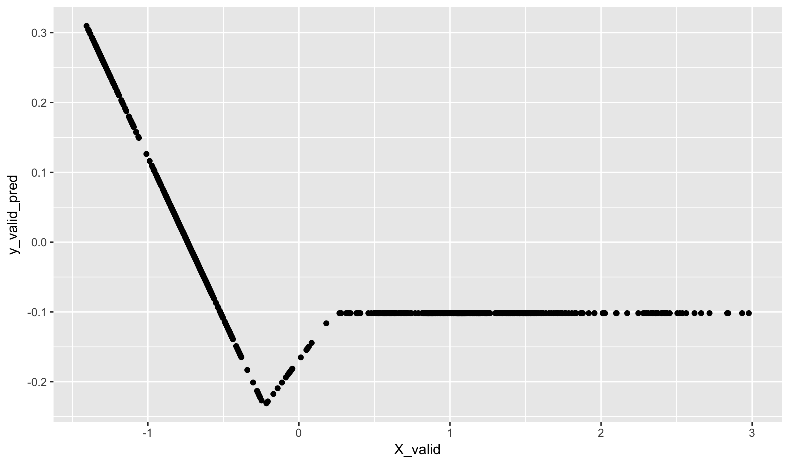
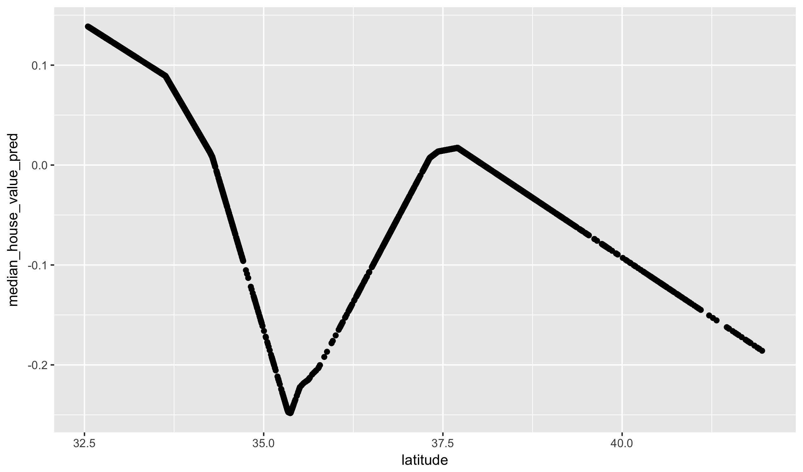


library(readr)
library(ggplot2)
library(dplyr)


**Have you studied neural networks before or used them in
an internship, job, or research project? If so, please forget
everything you think you know about them before proceeding.**

## Dense neural networks

I want to think about doing something that may seem somewhat silly
at first. Let's consider what would happen if we describe *two* linear
models to the same dataset. Don't worry yet why we would want to do
this or how we would do this, just think about what it might look like.
To simplify things, let's assume that we have only an intercept and
one prediction variable in the model. This will yield two sets of predicted
values, which we will denote by $z_1$ and $z_2$:

$$ z_1 = \alpha_1 + x \cdot \beta_1 $$

And

$$ z_2 = \alpha_2 + x \cdot \beta_2 $$

Notice that x, z_1, and z_2 are all vectors of length n. Now, let's
do something with these two predicted values. We'll construct another
liner model with these outputs, and name this the variable w:

$$ w = \alpha_3 + z_1 \cdot \gamma_1+ z_2 \cdot \gamma_2 $$

What is the relationship between w and x? In fact, this is nothing but
a very complex way of describing a linear relationship with w and x using
7 parameters instead of two. We can see this by simplifying:

$$ \begin{align}
  w &= \alpha_3 + z_1 \cdot \gamma_1+ z_2 \cdot \gamma_2  \\
    &= \alpha_3 + (\alpha_1 + x \cdot \beta_1) \gamma_1 +
                  (\alpha_2 + x \cdot \beta_2) \gamma_2 \\
    &= (\alpha_3 + \gamma_1 \cdot \alpha_1 + \gamma_2 \cdot \alpha_2) +
       (\beta_1 \cdot \gamma_1 + \beta_2 \cdot \gamma_2) \cdot x \\
    &= (\text{intercept}) + (\text{slope}) \cdot x
\end{align}$$

The mathematical description is nice, but I find it helpful to also see
a picture. Here, I'll set the $\alpha_3$ term to 0 and the gamma terms
both to one. This means that the last model simply adds the two lines
from the first regression together. We can graphically see as well that
this leads to the final model being linear too:


par(mfrow = c(1, 3))
plot(0, 0, type = "n", xlim = c(-1, 4), ylim = c(-1, 2),
     axes = FALSE, xlab = "", ylab = "")
abline(0.5, -0.5, lty = "dashed", lwd = 4)
abline(v = 0); abline(h = 0)
box()
plot(0, 0, type = "n", xlim = c(-1, 4), ylim = c(-1, 2),
     axes = FALSE, xlab = "", ylab = "")
mtext("+", side=2, line=2.2, cex=2)
abline(-1, 1, lty = "dashed", lwd = 4)
abline(v = 0); abline(h = 0)
box()
plot(0, 0, type = "n", xlim = c(-1, 4), ylim = c(-1, 2),
     axes = FALSE, xlab = "", ylab = "")
mtext("=", side=2, line=2.2, cex=2, las=1)
abline(-0.5, 0.5, lty = "dashed", col = "orange", lwd = 4)
abline(0.5, -1, lty = "dashed", lwd = 1)
abline(-1, 1, lty = "dashed", lwd = 1)
abline(v = 0); abline(h = 0)
box()


If we consider w to be the predicted values of this combined model,
we could find some values for the seven parameters (3 alpha, 2 betas,
and 2 gammas) that minimize the RMSE of the response. Of course,
there will not be a unique value for this minimum because ultimately
the final model is just a simple linear regression.

At the same time, this is an example of a neural network. It has 
two *hidden nodes*, denoted by the z's, which together form a hidden
layer. The input layer has just one node, a single x, and the output 
has just one node, a single w. We can think of this as a network as
follows:


par(mar = c(0,0,0,0))
plot(0,0,col="white",xlim=c(0,1),ylim=c(0,1))
arrows(x0 = c(0.15, 0.15, 0.55, 0.55),
       x1 = c(0.45, 0.45, 0.85, 0.85),
       y0 = c(0.5, 0.5, 0.15, 0.85),
       y1 = c(0.15, 0.85, 0.5, 0.5),
       lwd = 3)
points(x = c(0.1, 0.5, 0.5, 0.9),
       y = c(0.5, 0.15, 0.85, 0.5),
       cex = 10, lwd = 5)
text(x = c(0.1, 0.5, 0.5, 0.9),
     y = c(0.5, 0.15, 0.85, 0.5),
     label = c("x", "z1", "z2", "w"),
     cex = 2.5)


Arrows indicate which variables are being sent to the inputs of the
next layer. There is one parameter for each arrow, plus one more for
each node other than the input layer for all of the intercepts.

### Activation functions

The trick to why making combinations of linear models is a good idea
is both simple and quite subtle. Let's change the definition of just
the variable w to include the application of a function sigma:

$$ w = \alpha_3 + \sigma(z_1) \cdot \gamma_1+ \sigma(z_2) \cdot \gamma_2 $$

Sigma is not an learned function. It is just a fixed mapping that takes
any real number and returns another real number. In neural network
parlance it is call an activation function. Today we will use the
simpliest such activation, known as a **rectified linear unit (ReLU)**.
In what is the perhaps the biggest disconnect between the complexity
of a term and the complexity of what the term represents, this is the
defention of of a ReLU activation:

$$ \sigma(x) =
\begin{cases}
    x,& \text{if } x\geq 0\\
    0,              & \text{otherwise}
\end{cases}  $$

Positive values are treated as an identity function and negative values
are pushed to zero. That is all.

It turns out that the addition of this activation function greatly 
increases the complexity of the relationship between x and w. Notice
how we can now create non-linear relationships by combining two linear
functions where we have applied the ReLU unit before adding them together:


par(mfrow = c(1, 3))
plot(0, 0, type = "n", xlim = c(-1, 4), ylim = c(-1, 2),
     axes = FALSE, xlab = "", ylab = "")
abline(1, -1, lty = "dashed", lwd = 4)
abline(v = 0); abline(h = 0)
box()
plot(0, 0, type = "n", xlim = c(-1, 4), ylim = c(-1, 2),
     axes = FALSE, xlab = "", ylab = "")
mtext("+", side=2, line=2.2, cex=2)
abline(-3, 1, lty = "dashed", lwd = 4)
abline(v = 0); abline(h = 0)
box()
plot(0, 0, type = "n", xlim = c(-1, 4), ylim = c(-1, 2),
     axes = FALSE, xlab = "", ylab = "")
mtext("=", side=2, line=2.2, cex=2, las=1)
lines(x = c(-3, 1, 3, 5), y = c(4, 0, 0, 2), col = "orange",
      lwd = 6, lty = "dashed")
abline(-3, 1, lty = "dashed", lwd = 1)
abline(1, -1, lty = "dashed", lwd = 1)
abline(v = 0); abline(h = 0)
box()


The output now looks similar to a quadratic term. If we put more hidden
units into the model, and more input values into the first layer, we
can create very interesting non-linear interactions in the output. In
fact, with enough hidden neurons, a one-hidden layer neural network
can approximate any smooth function between x and w within an
arbitrarily small precision.

## Keras

### Installation in R

To build neural networks in R, we are going to use the keras library.
Originally developed for Python, there are now several wrappers for
R. To install it, we need to install both the package and the keras
library itself. To do so, run the following (as usual, do this only
once):


library(keras)
install_keras()


I have not had trouble with this on my mac, but I also have many
libraries already installed on my computer. If you run into trouble
with this, please let me know now. We are doing this one unit with
neural networks today, but will return to them in force for month of
November.

### Housing data again

For the first bit of today, let's use the (easy) California housing
dataset. We will move onto something different in a moment, but using
this model will be helpful.


ca <- read_csv("https://statsmaths.github.io/ml_data/ca_house_price.csv")


### Replication the model above

Like `glmnet` and `xgboost`, keras requires our data to be in
the form of a matrix. Let's grab such a matrix using just the
latitude variable. I will also scale the data matrix at the
same time


X <- scale(as.matrix(select(ca, latitude)))
y <- scale(ca$median_house_value)

X_train <- X[ca$train_id == "train",]
X_valid <- X[ca$train_id == "valid",]
y_train <- y[ca$train_id == "train"]
y_valid <- y[ca$train_id == "valid"]


To build a model with **keras**, we first need to create a base
empty model using the function `keras_model_sequential`. We then
add layers using the `%>%` function. To replicate our very simple
model above, we use `layer_dense`, which is just a plain vanilla
set of neurons with no fancy logic inside of them. We'll also use
the relu activation function, applied here as a seperate layer with
no learned parameters.


model <- keras_model_sequential()
model %>%
  layer_dense(units = 2, input_shape = c(1)) %>%
  layer_activation(activation = "relu") %>%
  layer_dense(units = 1)
model



## Model
## ___________________________________________________________________________
## Layer (type)                     Output Shape                  Param #     
## ===========================================================================
## dense_1 (Dense)                  (None, 2)                     4           
## ___________________________________________________________________________
## activation_1 (Activation)        (None, 2)                     0           
## ___________________________________________________________________________
## dense_2 (Dense)                  (None, 1)                     3           
## ===========================================================================
## Total params: 7
## Trainable params: 7
## Non-trainable params: 0
## ___________________________________________________________________________


Notice that printing the model gives a nice summary of all of the
layers, the number of parameters in each layer, and the output shape
that is fed into the next layer.

Once the model has been built, we need to compile it before doing anything
else with it. Here we set the loss, the thing we want to minimize, to
the mean squared error, and set a particular algorithm for finding
all of the best parameters. More on this in a bit.


model %>% compile(
  loss = 'mse',
  optimizer = optimizer_rmsprop(),
  metrics = c('mse')
)


Once the model has been compiled we can fit it to our dataset.


model %>%
  fit(X_train, y_train, epochs = 5,
      validation_data = list(X_valid, y_valid))


Notice that there is a lot of output that comes along with fitting a neural
network. As with gradient boosted trees, we get a running tally of the
training and validation performance. We'll talk more about what Epoch is and
how this model is actually fit next class.

### Predicted values

I'll use a prediction function to predict values from this model. Notice
that the learned relationship is more complex than a straightforward
linear regression:


y_valid_pred <- predict(model, X_valid)
qplot(X_valid, y_valid_pred)


### Larger models

We can easily add more hidden layers with more variables. Here
we have two hidden layers, each with 8 variables


model <- keras_model_sequential()
model %>%
  layer_dense(units = 8, input_shape = c(1)) %>%
  layer_activation(activation = "relu") %>%
  layer_dense(units = 8) %>%
  layer_activation(activation = "relu") %>%
  layer_dense(units = 1)
model



## Model
## ___________________________________________________________________________
## Layer (type)                     Output Shape                  Param #     
## ===========================================================================
## dense_3 (Dense)                  (None, 8)                     16          
## ___________________________________________________________________________
## activation_2 (Activation)        (None, 8)                     0           
## ___________________________________________________________________________
## dense_4 (Dense)                  (None, 8)                     72          
## ___________________________________________________________________________
## activation_3 (Activation)        (None, 8)                     0           
## ___________________________________________________________________________
## dense_5 (Dense)                  (None, 1)                     9           
## ===========================================================================
## Total params: 97
## Trainable params: 97
## Non-trainable params: 0
## ___________________________________________________________________________


Notice that only the first layer needs the `input_shape` parameter.
We'll compile and fit this again:


model %>% compile(
  loss = 'mse',
  optimizer = optimizer_rmsprop(),
  metrics = c('mse')
)
model %>%
  fit(X_train, y_train, epochs = 5,
      validation_data = list(X_valid, y_valid))


The relationship is now even more non-linear. We have two peaks,
one for LA and the other for San Fransisco, and a steep decline
in northern California.


ca$median_house_value_pred <- predict(model, X)
qplot(latitude, median_house_value_pred, data = ca)


At this point, neural networks should seem like a natural extension of
the models we have already seen rather than a fancy black-box. It is,
in my opinion, too often explained as the latter.
