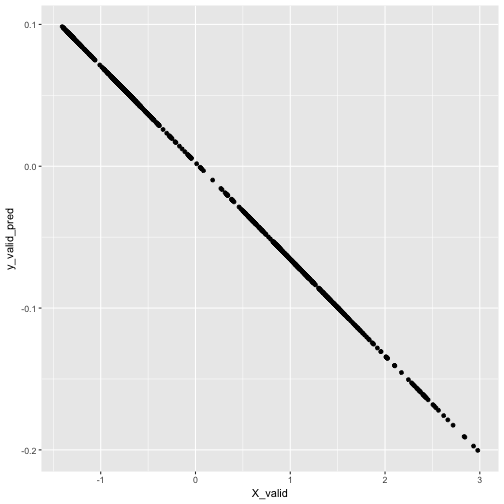
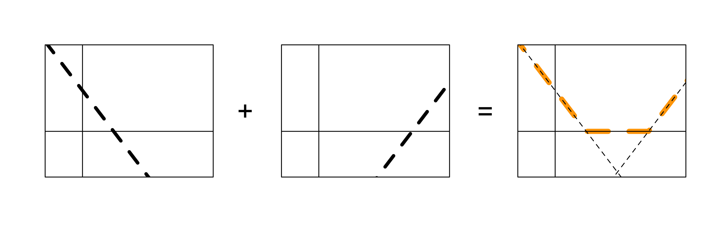
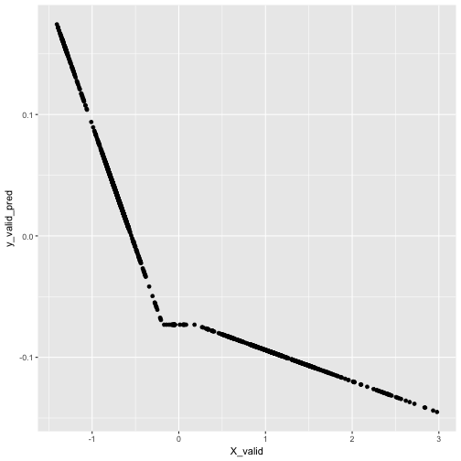
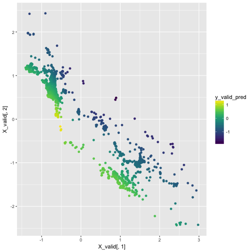


library(readr)
library(ggplot2)
library(dplyr)



wiki <- read_csv("https://statsmaths.github.io/ml_data/wiki_traffic.csv")


$$  X \cdot A =
    \left(\begin{array}{cc} X_{1,1} & X_{1,2} \\
                           X_{1,1} & X_{1,2} \\
                           \vdots & \vdots \\
                           X_{n,1} & X_{n, 2} \end{array} \right) \cdot
    \left(\begin{array}{cc} A_{1,1} & A_{1,2} \\
                            A_{2,1} & A_{2, 2} \end{array} \right)
                            =
   \left(\begin{array}{c} X_{1} \\
                           X_{2} \\
                           \vdots \\
                           X_{n} \end{array} \right) \cdot
    \left(\begin{array}{cc} A^{(0)} & A^{(1)}\end{array} \right)
                            =
   \left(\begin{array}{cc} X_{1} \cdot A^{(0)} & X_{1} \cdot A^{(0)} \\
                           X_{2} \cdot A^{(0)} & X_{2} \cdot A^{(0)} \\
                           \vdots & \vdots \\
                           X_{n} \cdot A^{(0)} & X_{n} \cdot A^{(0)} \end{array} \right)
                        $$

$$ \left( X \cdot A \right) \cdot B, \quad B = \left(\begin{array}{c} b_1 \\ b_2 \end{array}\right) $$


par(mfrow = c(1, 3))
plot(0, 0, type = "n", xlim = c(-1, 4), ylim = c(-1, 2),
     axes = FALSE, xlab = "", ylab = "")
abline(0.5, -0.5, lty = "dashed", lwd = 4)
abline(v = 0); abline(h = 0)
box()
plot(0, 0, type = "n", xlim = c(-1, 4), ylim = c(-1, 2),
     axes = FALSE, xlab = "", ylab = "")
mtext("+", side=2, line=2.2, cex=2)
abline(-1, 1, lty = "dashed", lwd = 4)
abline(v = 0); abline(h = 0)
box()
plot(0, 0, type = "n", xlim = c(-1, 4), ylim = c(-1, 2),
     axes = FALSE, xlab = "", ylab = "")
mtext("=", side=2, line=2.2, cex=2, las=1)
abline(-0.5, 0.5, lty = "dashed", col = "orange", lwd = 4)
abline(0.5, -1, lty = "dashed", lwd = 1)
abline(-1, 1, lty = "dashed", lwd = 1)
abline(v = 0); abline(h = 0)
box()



library(keras)



X <- scale(as.matrix(select(wiki, day001)))
y <- scale(wiki$day000)

X_train <- X[wiki$train_id == "train",]
X_valid <- X[wiki$train_id == "valid",]
y_train <- y[wiki$train_id == "train"]
y_valid <- y[wiki$train_id == "valid"]



model <- keras_model_sequential()
model %>%
  layer_dense(units = 2, input_shape = c(1)) %>%
  layer_dense(units = 1)
model



## Model
## ___________________________________________________________________________
## Layer (type)                     Output Shape                  Param #     
## ===========================================================================
## dense_1 (Dense)                  (None, 2)                     4           
## ___________________________________________________________________________
## dense_2 (Dense)                  (None, 1)                     3           
## ===========================================================================
## Total params: 7
## Trainable params: 7
## Non-trainable params: 0
## ___________________________________________________________________________



model %>% compile(
  loss = 'mse',
  optimizer = optimizer_rmsprop(),
  metrics = c('mse')
)



model %>%
  fit(X_train, y_train, epochs = 5,
      validation_data = list(X_valid, y_valid))



y_valid_pred <- predict(model, X_valid)
qplot(X_valid, y_valid_pred)


$$ \sigma \left( X \cdot A \right) \cdot B, \quad B =
    \left(\begin{array}{c} b_1 \\ b_2 \end{array}\right) $$

**rectified linear unit (relu)**:

$$ \sigma(x) =
\begin{cases}
    x,& \text{if } x\geq 0\\
    0,              & \text{otherwise}
\end{cases}  $$


par(mfrow = c(1, 3))
plot(0, 0, type = "n", xlim = c(-1, 4), ylim = c(-1, 2),
     axes = FALSE, xlab = "", ylab = "")
abline(1, -1, lty = "dashed", lwd = 4)
abline(v = 0); abline(h = 0)
box()
plot(0, 0, type = "n", xlim = c(-1, 4), ylim = c(-1, 2),
     axes = FALSE, xlab = "", ylab = "")
mtext("+", side=2, line=2.2, cex=2)
abline(-3, 1, lty = "dashed", lwd = 4)
abline(v = 0); abline(h = 0)
box()
plot(0, 0, type = "n", xlim = c(-1, 4), ylim = c(-1, 2),
     axes = FALSE, xlab = "", ylab = "")
mtext("=", side=2, line=2.2, cex=2, las=1)
lines(x = c(-3, 1, 3, 5), y = c(4, 0, 0, 2), col = "orange",
      lwd = 6, lty = "dashed")
abline(-3, 1, lty = "dashed", lwd = 1)
abline(1, -1, lty = "dashed", lwd = 1)
abline(v = 0); abline(h = 0)
box()



model <- keras_model_sequential()
model %>%
  layer_dense(units = 2, input_shape = c(1)) %>%
  layer_activation(activation = "relu") %>%
  layer_dense(units = 1)
model



## Model
## ___________________________________________________________________________
## Layer (type)                     Output Shape                  Param #     
## ===========================================================================
## dense_3 (Dense)                  (None, 2)                     4           
## ___________________________________________________________________________
## activation_1 (Activation)        (None, 2)                     0           
## ___________________________________________________________________________
## dense_4 (Dense)                  (None, 1)                     3           
## ===========================================================================
## Total params: 7
## Trainable params: 7
## Non-trainable params: 0
## ___________________________________________________________________________



model %>% compile(
  loss = 'mse',
  optimizer = optimizer_rmsprop(),
  metrics = c('mse')
)
model %>%
  fit(X_train, y_train, epochs = 5,
      validation_data = list(X_valid, y_valid))



y_valid_pred <- predict(model, X_valid)
qplot(X_valid, y_valid_pred)



X <- scale(as.matrix(select(wiki, day001, day002, day003, day004)))
y <- scale(wiki$day000)

X_train <- X[wiki$train_id == "train",]
X_valid <- X[wiki$train_id == "valid",]
y_train <- y[wiki$train_id == "train"]
y_valid <- y[wiki$train_id == "valid"]



model <- keras_model_sequential()
model %>%
  layer_dense(units = 5, input_shape = c(4)) %>%
  layer_activation(activation = "relu") %>%
  layer_dense(units = 3) %>%
  layer_activation(activation = "relu") %>%
  layer_dense(units = 1)
model



## Model
## ___________________________________________________________________________
## Layer (type)                     Output Shape                  Param #     
## ===========================================================================
## dense_5 (Dense)                  (None, 5)                     25          
## ___________________________________________________________________________
## activation_2 (Activation)        (None, 5)                     0           
## ___________________________________________________________________________
## dense_6 (Dense)                  (None, 3)                     18          
## ___________________________________________________________________________
## activation_3 (Activation)        (None, 3)                     0           
## ___________________________________________________________________________
## dense_7 (Dense)                  (None, 1)                     4           
## ===========================================================================
## Total params: 47
## Trainable params: 47
## Non-trainable params: 0
## ___________________________________________________________________________



model %>% compile(
  loss = 'mse',
  optimizer = optimizer_rmsprop(),
  metrics = c('mse')
)
model %>%
  fit(X_train, y_train, epochs = 20,
      validation_data = list(X_valid, y_valid))



y_valid_pred <- predict(model, X_valid)
qplot(X_valid[,1], X_valid[,2], color = y_valid_pred) +
  viridis::scale_color_viridis() +
  scale_x_log10() +
  scale_y_log10()



## Warning in self$trans$transform(x): NaNs produced



## Warning: Transformation introduced infinite values in continuous x-axis



## Warning in self$trans$transform(x): NaNs produced



## Warning: Transformation introduced infinite values in continuous y-axis



## Warning: Removed 2002 rows containing missing values (geom_point).



crimes <- read_csv("https://statsmaths.github.io/ml_data/chi_crimes_12.csv")


$$ Y = \sigma(X \cdot A) \cdot B $$


to_categorical(c(1,1,2,4,10))



##      [,1] [,2] [,3] [,4] [,5] [,6] [,7] [,8] [,9] [,10] [,11]
## [1,]    0    1    0    0    0    0    0    0    0     0     0
## [2,]    0    1    0    0    0    0    0    0    0     0     0
## [3,]    0    0    1    0    0    0    0    0    0     0     0
## [4,]    0    0    0    0    1    0    0    0    0     0     0
## [5,]    0    0    0    0    0    0    0    0    0     0     1



X <- scale(as.matrix(select(crimes, longitude, latitude, hour)))
y <- factor(crimes$crime_type)
crime_levels <- levels(y)
y <- as.integer(y) - 1

X_train <- X[crimes$train_id == "train",]
y_train <- to_categorical(y[crimes$train_id == "train"], num_classes = 12)
X_valid <- X[crimes$train_id == "valid",]
y_valid <- to_categorical(y[crimes$train_id == "valid"], num_classes = 12)



y_train[sample(nrow(y_train), 10),]



##       [,1] [,2] [,3] [,4] [,5] [,6] [,7] [,8] [,9] [,10] [,11] [,12]
##  [1,]    0    0    0    0    0    0    0    0    1     0     0     0
##  [2,]    0    0    0    0    1    0    0    0    0     0     0     0
##  [3,]    0    0    0    0    0    0    0    0    0     1     0     0
##  [4,]    1    0    0    0    0    0    0    0    0     0     0     0
##  [5,]    0    0    0    0    0    0    0    0    0     1     0     0
##  [6,]    0    0    0    0    0    0    0    0    1     0     0     0
##  [7,]    0    0    0    0    0    0    0    0    0     0     1     0
##  [8,]    0    0    0    0    0    0    0    0    1     0     0     0
##  [9,]    0    0    0    0    0    0    0    0    0     1     0     0
## [10,]    0    0    0    0    0    0    0    0    0     1     0     0



model <- keras_model_sequential()
model %>%
  layer_dense(units = 20, input_shape = c(3)) %>%
  layer_activation(activation = "relu") %>%
  layer_dense(units = 20) %>%
  layer_activation(activation = "relu") %>%
  layer_dense(units = 12) %>%
  layer_activation(activation = "softmax")
model



## Model
## ___________________________________________________________________________
## Layer (type)                     Output Shape                  Param #     
## ===========================================================================
## dense_8 (Dense)                  (None, 20)                    80          
## ___________________________________________________________________________
## activation_4 (Activation)        (None, 20)                    0           
## ___________________________________________________________________________
## dense_9 (Dense)                  (None, 20)                    420         
## ___________________________________________________________________________
## activation_5 (Activation)        (None, 20)                    0           
## ___________________________________________________________________________
## dense_10 (Dense)                 (None, 12)                    252         
## ___________________________________________________________________________
## activation_6 (Activation)        (None, 12)                    0           
## ===========================================================================
## Total params: 752
## Trainable params: 752
## Non-trainable params: 0
## ___________________________________________________________________________



model %>% compile(loss = 'categorical_crossentropy',
                  optimizer = optimizer_rmsprop(),
                  metrics = c('accuracy'))



model %>%
  fit(X_train, y_train, epochs = 10,
      validation_data = list(X_valid, y_valid))



crimes <- sample_frac(crimes, size = 1)
X <- scale(as.matrix(select(crimes, longitude, latitude, hour)))
y <- factor(crimes$crime_type)
crime_levels <- levels(y)
y <- as.integer(y) - 1

X_train <- X[crimes$train_id == "train",]
y_train <- to_categorical(y[crimes$train_id == "train"], num_classes = 12)
X_valid <- X[crimes$train_id == "valid",]
y_valid <- to_categorical(y[crimes$train_id == "valid"], num_classes = 12)



model <- keras_model_sequential()
model %>%
  layer_dense(units = 20, input_shape = c(3)) %>%
  layer_activation(activation = "relu") %>%
  layer_dense(units = 20) %>%
  layer_activation(activation = "relu") %>%
  layer_dense(units = 12) %>%
  layer_activation(activation = "softmax")
model %>% compile(loss = 'categorical_crossentropy',
                  optimizer = optimizer_rmsprop(),
                  metrics = c('accuracy'))



model %>%
  fit(X_train, y_train, epochs = 10,
      validation_data = list(X_valid, y_valid))



model <- keras_model_sequential()
model %>%
  layer_dense(units = 20, input_shape = c(3)) %>%
  layer_activation(activation = "relu") %>%
  layer_dropout(rate = 0.1) %>%
  layer_dense(units = 20) %>%
  layer_activation(activation = "relu") %>%
  layer_dropout(rate = 0.1) %>%
  layer_dense(units = 12) %>%
  layer_activation(activation = "softmax")
model %>% compile(loss = 'categorical_crossentropy',
                  optimizer = optimizer_rmsprop(),
                  metrics = c('accuracy'))



model %>%
  fit(X_train, y_train, epochs = 10,
      validation_data = list(X_valid, y_valid))

