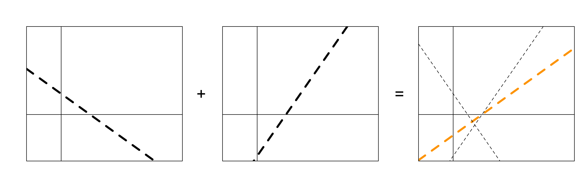
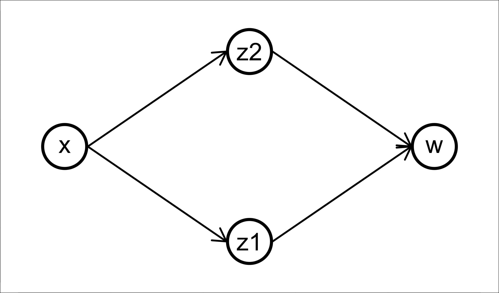
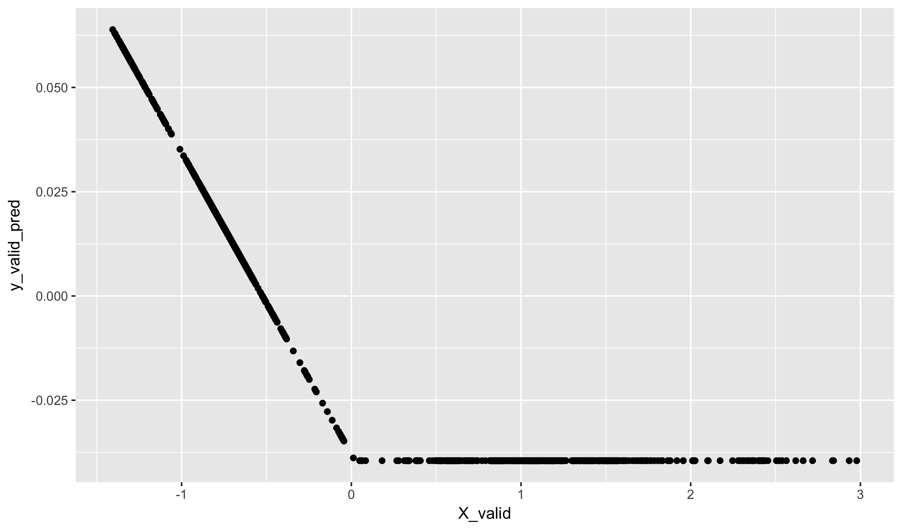
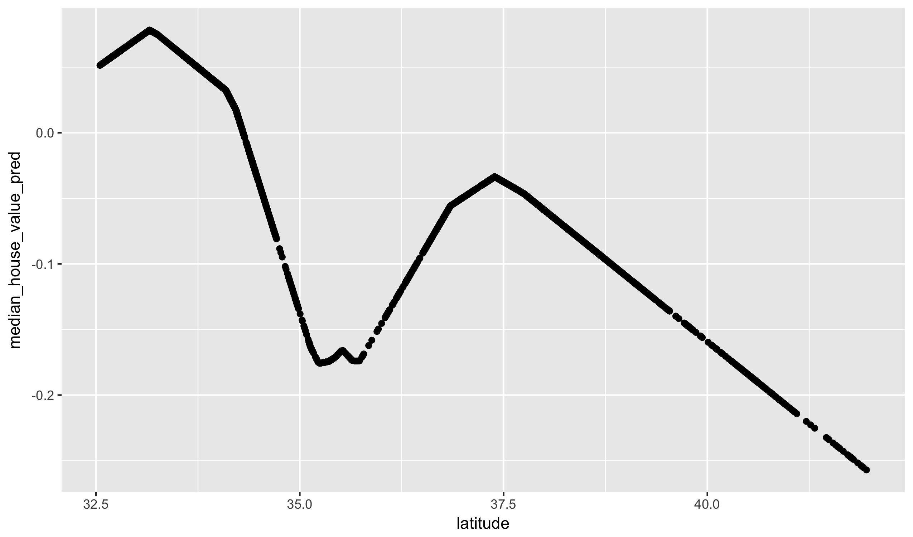


library(readr)
library(ggplot2)
library(dplyr)


**Have you studied neural networks before or used them in
an internship, job, or research project? If so, please forget
everything you think you know about them before proceeding.**

## Dense neural networks

I want to think about doing something that may seem somewhat silly
at first. Let's consider what would happen if we describe *two* linear
models to the same dataset. Don't worry yet why we would want to do
this or how we would do this, just think about what it might look like.
To simplify things, let's assume that we have only an intercept and
one prediction variable in the model. This will yield two sets of predicted
values, which we will denote by $z_1$ and $z_2$:

$$ z_1 = \alpha_1 + x \cdot \beta_1 $$

And

$$ z_2 = \alpha_2 + x \cdot \beta_2 $$

Notice that x, z_1, and z_2 are all vectors of length n. Now, let's
do something with these two predicted values. We'll construct another
liner model with these outputs, and name this the variable w:

$$ w = \alpha_3 + z_1 \cdot \gamma_1+ z_2 \cdot \gamma_2 $$

What is the relationship between w and x? In fact, this is nothing but
a very complex way of describing a linear relationship with w and x using
7 parameters instead of two. We can see this by simplifying:

$$ \begin{align}
  w &= \alpha_3 + z_1 \cdot \gamma_1+ z_2 \cdot \gamma_2  \\
    &= \alpha_3 + (\alpha_1 + x \cdot \beta_1) \gamma_1 +
                  (\alpha_2 + x \cdot \beta_2) \gamma_2 \\
    &= (\alpha_3 + \gamma_1 \cdot \alpha_1 + \gamma_2 \cdot \alpha_2) +
       (\beta_1 \cdot \gamma_1 + \beta_2 \cdot \gamma_2) \cdot x \\
    &= (\text{intercept}) + (\text{slope}) \cdot x
\end{align}$$

The mathematical description is nice, but I find it helpful to also see
a picture. Here, I'll set the $\alpha_3$ term to 0 and the gamma terms
both to one. This means that the last model simply adds the two lines
from the first regression together. We can graphically see as well that
this leads to the final model being linear too:

If we consider w to be the predicted values of this combined model,
we could find some values for the seven parameters (3 alpha, 2 betas,
and 2 gammas) that minimize the RMSE of the response. Of course,
there will not be a unique value for this minimum because ultimately
the final model is just a simple linear regression.

At the same time, this is an example of a neural network. It has 
two *hidden nodes*, denoted by the z's, which together form a hidden
layer. The input layer has just one node, a single x, and the output 
has just one node, a single w. We can think of this as a network as
follows:

Arrows indicate which variables are being sent to the inputs of the
next layer. There is one parameter for each arrow, plus one more for
each node other than the input layer for all of the intercepts.

### Activation functions

The trick to why making combinations of linear models is a good idea
is both simple and quite subtle. Let's change the definition of just
the variable w to include the application of a function sigma:

$$ w = \alpha_3 + \sigma(z_1) \cdot \gamma_1+ \sigma(z_2) \cdot \gamma_2 $$

Sigma is not an learned function. It is just a fixed mapping that takes
any real number and returns another real number. In neural network
parlance it is call an activation function. Today we will use the
simpliest such activation, known as a **rectified linear unit (ReLU)**.
In what is the perhaps the biggest disconnect between the complexity
of a term and the complexity of what the term represents, this is the
defention of of a ReLU activation:

$$ \sigma(x) =
\begin{cases}
    x,& \text{if } x\geq 0\\
    0,              & \text{otherwise}
\end{cases}  $$

Positive values are treated as an identity function and negative values
are pushed to zero. That is all.

It turns out that the addition of this activation function greatly 
increases the complexity of the relationship between x and w. Notice
how we can now create non-linear relationships by combining two linear
functions where we have applied the ReLU unit before adding them together:

The output now looks similar to a quadratic term. If we put more hidden
units into the model, and more input values into the first layer, we
can create very interesting non-linear interactions in the output. In
fact, with enough hidden neurons, a one-hidden layer neural network
can approximate any smooth function between x and w within an
arbitrarily small precision.

## Keras

### Installation in R

To build neural networks in R, we are going to use the keras library.
Originally developed for Python, there are now several wrappers for
R. Instructions to install it an included at the end of today's class
notes. Here, I have already installed it and load the package in as
you would any other package.

### Housing data again

For the first bit of today, let's use the (easy) California housing
dataset. We will move onto something different in a moment, but using
this model will be helpful.


ca <- read_csv("https://statsmaths.github.io/ml_data/ca_house_price.csv")


### Replication the model above

Like `glmnet` and `xgboost`, keras requires our data to be in
the form of a matrix. Let's grab such a matrix using just the
latitude variable. I will also scale the data matrix at the
same time


X <- scale(as.matrix(select(ca, latitude)))
y <- scale(ca$median_house_value)

X_train <- X[ca$train_id == "train",]
X_valid <- X[ca$train_id == "valid",]
y_train <- y[ca$train_id == "train"]
y_valid <- y[ca$train_id == "valid"]


To build a model with **keras**, we first need to create a base
empty model using the function `keras_model_sequential`. We then
add layers using the `%>%` function. To replicate our very simple
model above, we use `layer_dense`, which is just a plain vanilla
set of neurons with no fancy logic inside of them. We'll also use
the relu activation function, applied here as a seperate layer with
no learned parameters.


model <- keras_model_sequential()
model %>%
  layer_dense(units = 2, input_shape = c(1)) %>%
  layer_activation(activation = "relu") %>%
  layer_dense(units = 1)
model



## Model
## ___________________________________________________________________________
## Layer (type)                     Output Shape                  Param #     
## ===========================================================================
## dense_1 (Dense)                  (None, 2)                     4           
## ___________________________________________________________________________
## activation_1 (Activation)        (None, 2)                     0           
## ___________________________________________________________________________
## dense_2 (Dense)                  (None, 1)                     3           
## ===========================================================================
## Total params: 7
## Trainable params: 7
## Non-trainable params: 0
## ___________________________________________________________________________


Notice that printing the model gives a nice summary of all of the
layers, the number of parameters in each layer, and the output shape
that is fed into the next layer.

Once the model has been built, we need to compile it before doing anything
else with it. Here we set the loss, the thing we want to minimize, to
the mean squared error, and set a particular algorithm for finding
all of the best parameters. More on this in a bit.


model %>% compile(
  loss = 'mse',
  optimizer = optimizer_rmsprop(),
  metrics = c('mse')
)


Once the model has been compiled we can fit it to our dataset.


model %>%
  fit(X_train, y_train, epochs = 5,
      validation_data = list(X_valid, y_valid))


Notice that there is a lot of output that comes along with fitting a neural
network. As with gradient boosted trees, we get a running tally of the
training and validation performance. We'll talk more about what Epoch is and
how this model is actually fit next class.

### Predicted values

I'll use a prediction function to predict values from this model. Notice
that the learned relationship is more complex than a straightforward
linear regression:


y_valid_pred <- predict(model, X_valid)
qplot(X_valid, y_valid_pred)


### Larger models

We can easily add more hidden layers with more variables. Here
we have two hidden layers, each with 8 variables


model <- keras_model_sequential()
model %>%
  layer_dense(units = 8, input_shape = c(1)) %>%
  layer_activation(activation = "relu") %>%
  layer_dense(units = 8) %>%
  layer_activation(activation = "relu") %>%
  layer_dense(units = 1)
model



## Model
## ___________________________________________________________________________
## Layer (type)                     Output Shape                  Param #     
## ===========================================================================
## dense_3 (Dense)                  (None, 8)                     16          
## ___________________________________________________________________________
## activation_2 (Activation)        (None, 8)                     0           
## ___________________________________________________________________________
## dense_4 (Dense)                  (None, 8)                     72          
## ___________________________________________________________________________
## activation_3 (Activation)        (None, 8)                     0           
## ___________________________________________________________________________
## dense_5 (Dense)                  (None, 1)                     9           
## ===========================================================================
## Total params: 97
## Trainable params: 97
## Non-trainable params: 0
## ___________________________________________________________________________


Notice that only the first layer needs the `input_shape` parameter.
We'll compile and fit this again:


model %>% compile(
  loss = 'mse',
  optimizer = optimizer_rmsprop(),
  metrics = c('mse')
)
model %>%
  fit(X_train, y_train, epochs = 5,
      validation_data = list(X_valid, y_valid))


The relationship is now even more non-linear. We have two peaks,
one for LA and the other for San Fransisco, and a steep decline
in northern California.


ca$median_house_value_pred <- predict(model, X)
qplot(latitude, median_house_value_pred, data = ca)


At this point, neural networks should seem like a natural extension of
the models we have already seen rather than a fancy black-box. It is,
in my opinion, too often explained as the latter.

## Classification with neural networks

We have just seen how to use neural networks to do regression with one
continuous response. Of course, we could modify this to do binary
classification by coding factors as 0 and 1. Further, the *one-vs-one*
and *one-vs-many* paradigms would allow this to extend to multiclass
classification. There is, however, a more straightforward approach.
If you recall that we used the **nnet** package to fit the multinomial
function, this should not be surprising.

### One-hot encoding

The trick for doing multiclass regression with neural networks is to
realize that we can easily make the last layer of a neural network
output multiple values. All we need to do is have the function that
we want to minimize by a function of all these outputs rather than
a single output with each row of the data. An easy way to do this is
to assign multiple response variables with each observation and do
mean squared error loss, but we will now take the mean squared loss of
predicting all the outputs.

The **keras** package include a function `to_categorical` that converts
numeric class labels to binary indicator variables. This is very similar
to the model matricies we built for the X matrix when using categorical
predictors. Here is a simple example of its application:


to_categorical(c(1,1,2,4,10))



##      [,1] [,2] [,3] [,4] [,5] [,6] [,7] [,8] [,9] [,10] [,11]
## [1,]    0    1    0    0    0    0    0    0    0     0     0
## [2,]    0    1    0    0    0    0    0    0    0     0     0
## [3,]    0    0    1    0    0    0    0    0    0     0     0
## [4,]    0    0    0    0    1    0    0    0    0     0     0
## [5,]    0    0    0    0    0    0    0    0    0     0     1


Notice that keras is 0-indexed, so it wants the first category to be zero.
That's why we have 11 columns even thought the largest category is only
10. The best way to understand how to use this response matrix is to see
a worked example in keras.

### Chicago Crimes, again

I am going to load another version of the Chicago crimes data, but this 
time there are 12 crime types:


crimes <- read_csv("https://statsmaths.github.io/ml_data/chi_crimes_12.csv")


I want to just use latitude, longitude, and hour here to simplify the analysis.
The X data matrix is unchanged from previous code examples other than the
fact that we scale the columns.


X <- scale(as.matrix(select(crimes, longitude, latitude, hour)))
X_train <- X[crimes$train_id == "train",]
X_valid <- X[crimes$train_id == "valid",]


Typically, I create a y variable as before, but make sure to subtract one so that
the smallest category is zero. When creating `y_train` and `y_valid`, I use the
`to_categorical` function, manually specifying the number of classes to avoid any
issues:


y <- crimes$crime_type - 1
y_train <- to_categorical(y[crimes$train_id == "train"], num_classes = 12)
y_valid <- to_categorical(y[crimes$train_id == "valid"], num_classes = 12)


Take note of what the response matrix looks like:


y_train[sample(nrow(y_train), 10),]



##       [,1] [,2] [,3] [,4] [,5] [,6] [,7] [,8] [,9] [,10] [,11] [,12]
##  [1,]    0    0    0    0    0    0    0    0    1     0     0     0
##  [2,]    0    0    0    0    1    0    0    0    0     0     0     0
##  [3,]    0    0    0    0    0    0    0    1    0     0     0     0
##  [4,]    0    0    0    0    0    0    0    0    0     1     0     0
##  [5,]    1    0    0    0    0    0    0    0    0     0     0     0
##  [6,]    0    0    0    0    0    0    1    0    0     0     0     0
##  [7,]    0    0    0    0    0    0    1    0    0     0     0     0
##  [8,]    0    0    0    0    0    0    0    0    0     0     0     1
##  [9,]    0    0    0    0    0    1    0    0    0     0     0     0
## [10,]    1    0    0    0    0    0    0    0    0     0     0     0


### Building a classification model

Here is the specificiation of a model that could train on our dataset. The
input shape is three because we have three input variables. The last layer
has 12 units because the respones has 12 columns. I use a new activation layer
at the end called a "softmax". The forces the output values to all be
positive and sum to 1; therefore we can safely view them as proper
probabilities.


model <- keras_model_sequential()
model %>%
  layer_dense(units = 20, input_shape = c(3)) %>%
  layer_activation(activation = "relu") %>%
  layer_dense(units = 20) %>%
  layer_activation(activation = "relu") %>%
  layer_dense(units = 12) %>%
  layer_activation(activation = "softmax")
model



## Model
## ___________________________________________________________________________
## Layer (type)                     Output Shape                  Param #     
## ===========================================================================
## dense_6 (Dense)                  (None, 20)                    80          
## ___________________________________________________________________________
## activation_4 (Activation)        (None, 20)                    0           
## ___________________________________________________________________________
## dense_7 (Dense)                  (None, 20)                    420         
## ___________________________________________________________________________
## activation_5 (Activation)        (None, 20)                    0           
## ___________________________________________________________________________
## dense_8 (Dense)                  (None, 12)                    252         
## ___________________________________________________________________________
## activation_6 (Activation)        (None, 12)                    0           
## ===========================================================================
## Total params: 752
## Trainable params: 752
## Non-trainable params: 0
## ___________________________________________________________________________


Notice that this fairly simple model already has 752 parameters that we need
to learn. Neural networks can get complex very quickly!

Now, we compile the model. While "mse" could work for the function we want to
minimize, something called "categorical_crossentropy" is better for some technical
reasons when learning to do multiclass classification. We'll also print out the
accuracy at each step.


model %>% compile(loss = 'categorical_crossentropy',
                  optimizer = optimizer_rmsprop(lr = 0.01),
                  metrics = c('accuracy'))



model %>%
  fit(X_train, y_train, epochs = 10,
      validation_data = list(X_valid, y_valid))


Random guessing yields a classification rate of 8%, so our model does approximately
twice as well as guessing. Not bad for a first take at using neural networks.

In order to get predictions on the whole dataset, we can use the function `predict_classes`.
A `predict` function exists, but it would give us a matrix of values much like `y_train`.
The `predict_classes` function helpfully saves a step. **Don't forget to add one to predictions!**


crimes$crime_type_pred <- predict_classes(model, x = X) + 1


Finally, take a look at the lower right-hand panel in RStudio. You will see a helpful plot of
the training and validation loss functions metrics.

## Installation

To install keras, we need to install the package, the keras
library itself, and python. The best first step is to install
keras as you would any package:


install.packages("keras")


Once that is done, load the library and try to run the `install_keras`
function:


library(keras)
install_keras()


Depending on your system, it may just run and download some files and
you are all set to go. In the future, just call `library(keras)` as
you would any other package. If it complains about not having Python,
install Anaconda for Python 3 from this link:

- [https://www.anaconda.com/download/](https://www.anaconda.com/download/)

Then, restart RStudio and run the block of code again. If there is
a different error message (most likely you are one a Mac), try to
do whatever it says. 

If you run into trouble with this, please let me know now. We are doing
this one unit with neural networks today, but will return to them in force
for the entire month of November.

