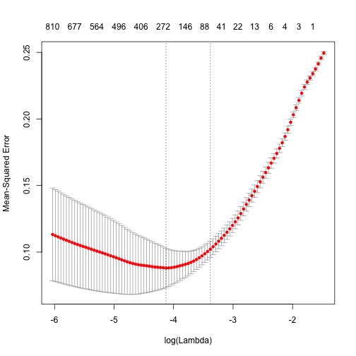
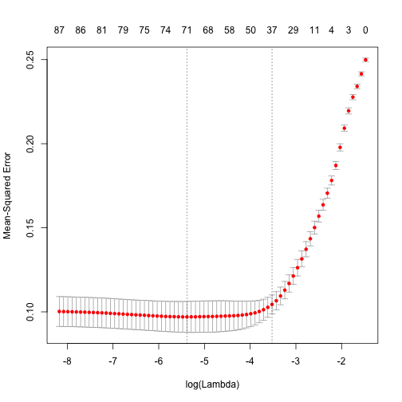
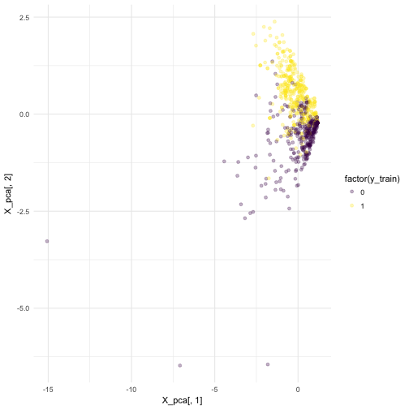


library(readr)
library(dplyr)
library(ggplot2)

# text processing packages
library(tokenizers)
library(stringi)
library(smodels)



spam <- read_csv("~/files/ml_data/spam.csv")



stri_wrap(spam$text[500], width = 60)



## [1] "Orange brings you ringtones from all time Chart Heroes, with"
## [2] "a free hit each week! Go to Ringtones & Pics on wap. To stop"
## [3] "receiving these tips reply STOP."



token_list <- tokenize_words(spam$text)
token_list[500]



## [[1]]
##  [1] "orange"    "brings"    "you"       "ringtones" "from"     
##  [6] "all"       "time"      "chart"     "heroes"    "with"     
## [11] "a"         "free"      "hit"       "each"      "week"     
## [16] "go"        "to"        "ringtones" "pics"      "on"       
## [21] "wap"       "to"        "stop"      "receiving" "these"    
## [26] "tips"      "reply"     "stop"



token_df <- term_list_to_df(token_list)



## Loading required package: methods



## Loading required package: Matrix



filter(token_df, id == 500)



## # A tibble: 28 x 2
##       id     token
##    <int>     <chr>
##  1   500    orange
##  2   500    brings
##  3   500       you
##  4   500 ringtones
##  5   500      from
##  6   500       all
##  7   500      time
##  8   500     chart
##  9   500    heroes
## 10   500      with
## # ... with 18 more rows



X <- term_df_to_matrix(token_df)
dim(X)



## [1] 1276 4454



colnames(X)[1:10]



##  [1] "to"   "you"  "a"    "i"    "call" "the"  "u"    "your" "for"  "is"



X[1:10,1:10]



## 10 x 10 sparse Matrix of class "dgTMatrix"



##    [[ suppressing 10 column names 'to', 'you', 'a' ... ]]



##                          
##  [1,] 1 . 2 . . 1 . . . .
##  [2,] 2 . . . . . . . . .
##  [3,] . . . 1 1 . . 1 1 .
##  [4,] . 1 . . . . . . . .
##  [5,] . . . . . . 1 . 1 .
##  [6,] 1 1 . . . . . 2 . .
##  [7,] 3 2 2 . 1 . . 1 . .
##  [8,] . . . . . 1 1 . . .
##  [9,] 3 1 . . . 1 1 . 1 .
## [10,] 1 . . . . . . . . .



X_train <- X[spam$train_id == "train",]
X_valid <- X[spam$train_id == "valid",]
y_train <- spam$class[spam$train_id == "train"]
y_valid <- spam$class[spam$train_id == "valid"]



library(glmnet)
model <- cv.glmnet(X_train, y_train)
plot(model)



beta <- coef(model, s = model$lambda.min)
rownames(beta)[which((beta != 0))]



##   [1] "(Intercept)"                 "to"                         
##   [3] "a"                           "i"                          
##   [5] "call"                        "your"                       
##   [7] "for"                         "now"                        
##   [9] "2"                           "free"                       
##  [11] "or"                          "ur"                         
##  [13] "txt"                         "from"                       
##  [15] "my"                          "4"                          
##  [17] "me"                          "text"                       
##  [19] "mobile"                      "stop"                       
##  [21] "not"                         "reply"                      
##  [23] "prize"                       "that"                       
##  [25] "do"                          "we"                         
##  [27] "out"                         "at"                         
##  [29] "cash"                        "but"                        
##  [31] "won"                         "new"                        
##  [33] "send"                        "i'm"                        
##  [35] "gt"                          "please"                     
##  [37] "1"                           "150p"                       
##  [39] "lt"                          "up"                         
##  [41] "win"                         "urgent"                     
##  [43] "week"                        "contact"                    
##  [45] "msg"                         "service"                    
##  [47] "who"                         "ok"                         
##  [49] "18"                          "chat"                       
##  [51] "customer"                    "how"                        
##  [53] "come"                        "cs"                         
##  [55] "its"                         "500"                        
##  [57] "draw"                        "more"                       
##  [59] "message"                     "awarded"                    
##  [61] "100"                         "find"                       
##  [63] "1.50"                        "line"                       
##  [65] "receive"                     "code"                       
##  [67] "ringtone"                    "still"                      
##  [69] "he"                          "mob"                        
##  [71] "da"                          "hope"                       
##  [73] "i'll"                        "tones"                      
##  [75] "8007"                        "again"                      
##  [77] "where"                       "account"                    
##  [79] "orange"                      "sexy"                       
##  [81] "top"                         "10"                         
##  [83] "250"                         "much"                       
##  [85] "5"                           "expires"                    
##  [87] "games"                       "later"                      
##  [89] "calls"                       "ham"                        
##  [91] "join"                        "oh"                         
##  [93] "uk"                          "winner"                     
##  [95] "http"                        "services"                   
##  [97] "unsubscribe"                 "something"                  
##  [99] "voucher"                     "amp"                        
## [101] "content"                     "days"                       
## [103] "hot"                         "m"                          
## [105] "pics"                        "player"                     
## [107] "choose"                      "eg"                         
## [109] "info"                        "txts"                       
## [111] "wap"                         "welcome"                    
## [113] "call2optout"                 "problem"                    
## [115] "terms"                       "thing"                      
## [117] "admirer"                     "called"                     
## [119] "ldn"                         "sunshine"                   
## [121] "thinks"                      "within"                     
## [123] "50"                          "always"                     
## [125] "co.uk"                       "crazy"                      
## [127] "few"                         "goto"                       
## [129] "i've"                        "member"                     
## [131] "saturday"                    "sure"                       
## [133] "address"                     "entered"                    
## [135] "questions"                   "enough"                     
## [137] "frnd"                        "local"                      
## [139] "luck"                        "spam"                       
## [141] "sport"                       "2day"                       
## [143] "62468"                       "alone"                      
## [145] "email"                       "hav"                        
## [147] "selection"                   "team"                       
## [149] "www.sms.ac"                  "4u"                         
## [151] "88066"                       "asks"                       
## [153] "bank"                        "bill"                       
## [155] "boytoy"                      "costs"                      
## [157] "e.g"                         "fri"                        
## [159] "hint"                        "members"                    
## [161] "minmobsmorelkpobox177hp51fl" "registered"                 
## [163] "seemed"                      "some1"                      
## [165] "super"                       "term"                       
## [167] "tickets"                     "02073162414"                
## [169] "2u"                          "30"                         
## [171] "447797706009"                "5.00"                       
## [173] "ago"                         "bag"                        
## [175] "bloomberg"                   "boo"                        
## [177] "costing"                     "darling"                    
## [179] "eh"                          "enjoyin"                    
## [181] "explicit"                    "explosive"                  
## [183] "further"                     "gender"                     
## [185] "granite"                     "hoping"                     
## [187] "ice"                         "issues"                     
## [189] "nasdaq"                      "secs"                       
## [191] "sptv"                        "star"                       
## [193] "symbol"                      "technical"                  
## [195] "unique"                      "web"                        
## [197] "07880867867"                 "07946746291"                
## [199] "08450542832"                 "0871750.77.11"              
## [201] "08718726270"                 "146tf150p"                  
## [203] "151"                         "24m"                        
## [205] "391784"                      "84122"                      
## [207] "84484"                       "adrian"                     
## [209] "appreciate"                  "banned"                     
## [211] "barbie"                      "breath"                     
## [213] "clubsaisai"                  "cnn"                        
## [215] "coincidence"                 "confirmd"                   
## [217] "connection"                  "created"                    
## [219] "current"                     "dating:i"                   
## [221] "detroit"                     "devils"                     
## [223] "divorce"                     "fgkslpo"                    
## [225] "hockey"                      "housewives"                 
## [227] "ibn"                         "incorrect"                  
## [229] "jersey"                      "ken's"                      
## [231] "landlines"                   "leading"                    
## [233] "marketing"                   "mobsi.com"                  
## [235] "monthly"                     "nearly"                     
## [237] "notified"                    "offering"                   
## [239] "opinions"                    "outgoing"                   
## [241] "paris.free"                  "pause"                      
## [243] "presence"                    "rct"                        
## [245] "rgds"                        "ringtoneking"               
## [247] "romcapspam"                  "roses"                      
## [249] "sms.shsex.netun"             "soiree"                     
## [251] "speciale"                    "thnq"                       
## [253] "vatian"                      "videos"                     
## [255] "wings"                       "wrote"                      
## [257] "www.asjesus.com"             "xclusive"                   
## [259] "zouk"



beta <- coef(model, s = model$lambda.1se)
sprintf("%s (%s)", rownames(beta)[which((beta != 0))],
                   sign(beta)[which((beta != 0))])



##  [1] "(Intercept) (1)"                 "to (1)"                         
##  [3] "a (1)"                           "i (-1)"                         
##  [5] "call (1)"                        "your (1)"                       
##  [7] "for (1)"                         "now (1)"                        
##  [9] "2 (1)"                           "free (1)"                       
## [11] "or (1)"                          "txt (1)"                        
## [13] "from (1)"                        "me (-1)"                        
## [15] "text (1)"                        "mobile (1)"                     
## [17] "stop (1)"                        "not (-1)"                       
## [19] "reply (1)"                       "prize (1)"                      
## [21] "do (-1)"                         "cash (1)"                       
## [23] "but (-1)"                        "won (1)"                        
## [25] "new (1)"                         "send (1)"                       
## [27] "i'm (-1)"                        "gt (-1)"                        
## [29] "please (1)"                      "1 (1)"                          
## [31] "150p (1)"                        "lt (-1)"                        
## [33] "win (1)"                         "urgent (1)"                     
## [35] "contact (1)"                     "msg (1)"                        
## [37] "service (1)"                     "come (-1)"                      
## [39] "cs (1)"                          "more (1)"                       
## [41] "awarded (1)"                     "100 (1)"                        
## [43] "find (1)"                        "code (1)"                       
## [45] "ringtone (1)"                    "mob (1)"                        
## [47] "da (-1)"                         "i'll (-1)"                      
## [49] "again (-1)"                      "sexy (1)"                       
## [51] "top (1)"                         "much (-1)"                      
## [53] "5 (1)"                           "games (1)"                      
## [55] "later (-1)"                      "calls (1)"                      
## [57] "winner (1)"                      "http (1)"                       
## [59] "unsubscribe (1)"                 "days (1)"                       
## [61] "choose (1)"                      "co.uk (1)"                      
## [63] "sure (-1)"                       "minmobsmorelkpobox177hp51fl (1)"



y_valid_pred <- as.numeric(predict(model, X_valid, type = "response") > 0.5)
mean(y_valid == y_valid_pred)



## [1] 0.9294118


## Modify the features


X <- term_df_to_matrix(token_df, min_df = 0.03)
y <- spam$class
X_train <- X[spam$train_id == "train",]
X_valid <- X[spam$train_id == "valid",]
y_train <- spam$class[spam$train_id == "train"]
y_valid <- spam$class[spam$train_id == "valid"]

model <- cv.glmnet(X_train, y_train)
plot(model)



beta <- coef(model, s = model$lambda.1se)
sprintf("%s (%s)", rownames(beta)[which((beta != 0))],
                   sign(beta)[which((beta != 0))])



##  [1] "(Intercept) (1)" "to (1)"          "a (1)"          
##  [4] "i (-1)"          "call (1)"        "your (1)"       
##  [7] "for (1)"         "now (1)"         "2 (1)"          
## [10] "free (1)"        "or (1)"          "txt (1)"        
## [13] "from (1)"        "4 (1)"           "me (-1)"        
## [16] "text (1)"        "mobile (1)"      "stop (1)"       
## [19] "not (-1)"        "reply (1)"       "prize (1)"      
## [22] "do (-1)"         "cash (1)"        "but (-1)"       
## [25] "won (1)"         "new (1)"         "send (1)"       
## [28] "i'm (-1)"        "please (1)"      "1 (1)"          
## [31] "150p (1)"        "win (1)"         "contact (1)"    
## [34] "msg (1)"         "service (1)"     "when (-1)"      
## [37] "ok (-1)"         "18 (1)"



y_valid_pred <- as.numeric(predict(model, X_valid, type = "response") > 0.5)
mean(y_valid == y_valid_pred)



## [1] 0.9254902


## Negative examples


table(y_valid = y_valid, y_valid_pred = y_valid_pred)



##        y_valid_pred
## y_valid   0   1
##       0 131   4
##       1  15 105



y_pred <- as.numeric(predict(model, X, type = "response") > 0.5)
these_rows <- which(spam$train_id == "valid" &
                    y != y_pred &
                    y == 1)
cat(stri_wrap(spam$text[these_rows], exdent = 5), sep = "\n")



## Cashbin.co.uk (Get lots of cash this weekend!) www.cashbin.co.uk
##      Dear Welcome to the weekend We have got our biggest and best EVER
##      cash give away!! These..
## Do you ever notice that when you're driving, anyone going slower
##      than you is an idiot and everyone driving faster than you is a
##      maniac?
## http//tms. widelive.com/index. wml?
##      id=820554ad0a1705572711&first=true¡C C Ringtone¡
## network operator. The service is free. For T & C's visit 80488.biz
## PRIVATE! Your 2003 Account Statement for 078
## Filthy stories and GIRLS waiting for your
## Get 3 Lions England tone, reply lionm 4 mono or lionp 4 poly. 4
##      more go 2 www.ringtones.co.uk, the original n best. Tones 3GBP
##      network operator rates apply
## Ringtone Club: Gr8 new polys direct to your mobile every week !
## Warner Village 83118 C Colin Farrell in SWAT this wkend @Warner
##      Village & get 1 free med. Popcorn!Just show msg+ticket@kiosk.Valid
##      4-7/12. C t&c @kiosk. Reply SONY 4 mre film offers
## Reminder: You have not downloaded the content you have already paid
##      for. Goto http://doit. mymoby. tv/ to collect your content.
## New Tones This week include: 1)McFly-All Ab.., 2) Sara Jorge-
##      Shock.. 3) Will Smith-Switch.. To order follow instructions on next
##      message
## Latest News! Police station toilet stolen, cops have nothing to go
##      on!
## Money i have won wining number 946 wot do i do next
## You will be receiving this week's Triple Echo ringtone shortly.
##      Enjoy it!
## SplashMobile: Choose from 1000s of gr8 tones each wk! This is a
##      subscrition service with weekly tones costing 300p. U have one
##      credit - kick back and ENJOY



y_pred <- as.numeric(predict(model, X, type = "response") > 0.5)
these_rows <- which(spam$train_id == "valid" &
                    y != y_pred &
                    y == 0)
cat(stri_wrap(spam$text[these_rows], exdent = 5), sep = "\n")



## if you text on your way to cup stop that should work. And that
##      should be BUS
## We have sent JD for Customer Service cum Accounts Executive to ur
##      mail id, For details contact us
## I‘ll have a look at the frying pan in case it‘s cheap or a book
##      perhaps. No that‘s silly a frying pan isn‘t likely to be a book
## In e msg jus now. U said thanks for gift.


## Visualization


library(irlba)
X_pca <- prcomp_irlba(X_train, n = 2)$x
qplot(X_pca[,1], X_pca[,2], color = factor(y_train),
      alpha = I(0.3)) +
  viridis::scale_color_viridis(discrete = TRUE) +
  theme_minimal()


