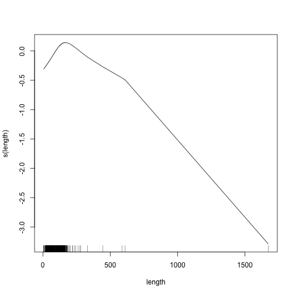
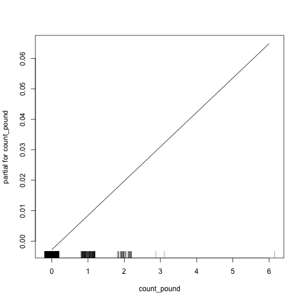
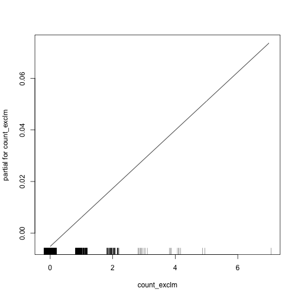
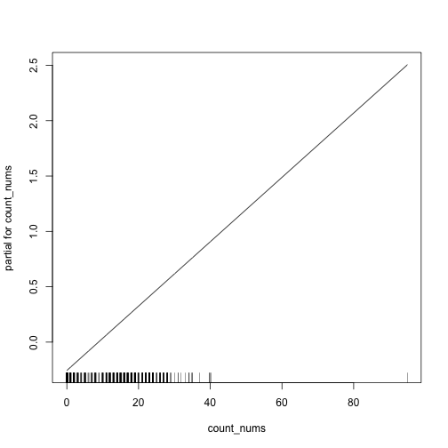
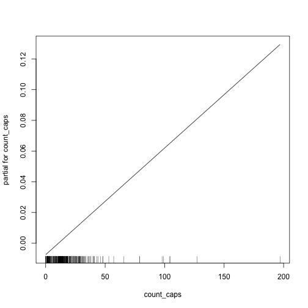


library(readr)
library(dplyr)
library(ggplot2)
library(methods)
library(stringi)
library(smodels)
library(tokenizers)


## Spam Detection

Today, we start our analysis of textual data (to me, this is where things
start to get particularly interesting). As a first task let's look at a
dataset of spam records:


spam <- read_csv("https://statsmaths.github.io/ml_data/spam.csv")


Notice that our dataset now has only four columns. There is no easy way of
putting this in any of our predictive models.

Its useful to see some examples of the data, particularly to see if we can
detect any manual patterns for classifying the data. What do you think the
classification of this message is?


stri_wrap(spam$text[500], width = 60)



## [1] "Orange brings you ringtones from all time Chart Heroes, with"
## [2] "a free hit each week! Go to Ringtones & Pics on wap. To stop"
## [3] "receiving these tips reply STOP."


Or this one:


stri_wrap(spam$text[506], width = 60)



## [1] "I though we shd go out n have some fun so bar in town or"
## [2] "something – sound ok?"


Or this:


stri_wrap(spam$text[903], width = 60)



## [1] "Yeah, that's fine! It's £6 to get in, is that ok?"


Or this:


stri_wrap(spam$text[125], width = 60)



## [1] "We tried to contact you re your reply to our offer of a"
## [2] "Video Handset? 750 anytime any networks mins? UNLIMITED"
## [3] "TEXT? Camcorder? Reply or call 08000930705 NOW"


As you probably guessed, the first and last are spam and the other two
are not:


spam$class[c(500, 506, 903, 125)]



## [1] 1 0 0 1


## Constructing Features by Hand

In order to build predictive models from this dataset, we first need to
create new (ideally numeric) variables that capture relevant aspects of
each message. This process is known as *featurization*, and will be the
key task that we will focus on in our text analysis.

What things might be useful to extract from the text? In a moment, we'll
see some more systematic ways of doing this, but for spam we can do some
of this manually. Perhaps we could detect the length of each text and use
that as a feature? To do that, I'll use the **stringi** function `stri_length`:


spam$length <- stri_length(spam$text)


It may also be useful to count how many times the pound symbol (this data
comes from the UK) and exclamation symbol is used. For this, we use the
`stri_count` function:


spam$count_pound <- stri_count(spam$text, fixed = "£")
spam$count_exclm <- stri_count(spam$text, fixed = "!")


We can tweak the count function to match patterns rather than a fixed
string. Let's count the number of capital letters and the number of
numbers:


spam$count_caps <- stri_count(spam$text, regex = "[A-Z]")
spam$count_nums <- stri_count(spam$text, regex = "[0-9]")


The `regex` option stands for *regular expression*. We are not going to
make much use of them in this course, but they are incredibly powerful
when cleaning and manipulating text-based datasets.

With these new variables in hand, we can now apply the learning algorithms
we learned earlier this semester. I'll use a GAM model, allowing for a
non-linear relationship with length.


library(gam)



## Loading required package: splines



## Loading required package: foreach



## Loaded gam 1.14-4



model <- gam(class ~ s(length) + count_pound + count_exclm + count_nums +
                     count_caps,
             data = spam,
             subset = (train_id == "train"))
plot(model)


As we may have expected, all of the linear terms are positively related
with spam. Spam tends to have about 200 characters, with the probability
decreasing for shorter and longer messages.


spam$class_pred <- as.numeric(predict(model, newdata = spam, type = "response") > 0.5)
tapply(spam$class == spam$class_pred, spam$train_id, mean)



##      test     train     valid 
##        NA 0.9241830 0.9176471


So, we are already doing a very good job with about a 92% classification
rate. Here, a confusion matrix is fairly useful:


table(y = spam$class, ypred = spam$class_pred)



##    ypred
## y     0   1
##   0 494   3
##   1  76 447


It shows that only classify three non-spam messages as spam but fail
to detect 76 spam messages. This inbalance, where one type of error is
more common, comes up a lot in text and image analysis. Knowing which
error type is more frequent is helpful in figuring what features are
missing.

## Negative examples

Let's look 50 of those elements in the training sampling that were not
detected as spam. Can you think of things that would have helped
or why the model was not correctly classifying the output?


these_rows <- which(spam$train_id == "train" &
                    spam$class != spam$class_pred &
                    spam$class == 1)
these_rows <- sample(these_rows, 50)
cat(stri_wrap(spam$text[these_rows], exdent = 5, width = 60), sep = "\n")



## You have 1 new voicemail. Please call 08719181503
## Burger King - Wanna play footy at a top stadium? Get 2
##      Burger King before 1st Sept and go Large or Super with Coca-
##      Cola and walk out a winner
## dating:i have had two of these. Only started after i sent
##      a text to talk sport radio last week. Any connection do you
##      think or coincidence?
## XXXMobileMovieClub: To use your credit, click the WAP
##      link in the next txt message or click here>> http://wap.
##      xxxmobilemovieclub.com?n=QJKGIGHJJGCBL
## Dear Voucher Holder, To claim this weeks offer, at you PC
##      please go to http://www.e-tlp.co.uk/reward. Ts&Cs apply.
## Hi babe its Chloe, how r u? I was smashed on saturday night,
##      it was great! How was your weekend? U been missing me? SP
##      visionsms.com Text stop to stop 150p/text
## Welcome to Select, an O2 service with added benefits. You
##      can now call our specially trained advisors FREE from your
##      mobile by dialling 402.
## BangBabes Ur order is on the way. U SHOULD receive a Service
##      Msg 2 download UR content. If U do not, GoTo wap. bangb. tv
##      on UR mobile internet/service menu
## You have 1 new message. Call 0207-083-6089
## Did you hear about the new "Divorce Barbie"? It comes with
##      all of Ken's stuff!
## Hi this is Amy, we will be sending you a free phone number
##      in a couple of days, which will give you an access to all
##      the adult parties...
## Sorry! U can not unsubscribe yet. THE MOB offer package has
##      a min term of 54 weeks> pls resubmit request after expiry.
##      Reply THEMOB HELP 4 more info
## tddnewsletter@emc1.co.uk (More games from TheDailyDraw) Dear
##      Helen, Dozens of Free Games - with great prizesWith..
## Are you unique enough? Find out from 30th August.
##      www.areyouunique.co.uk
## Free Msg: get Gnarls Barkleys "Crazy" ringtone TOTALLY FREE
##      just reply GO to this message right now!
## Win the newest “Harry Potter and the Order of the Phoenix
##      (Book 5) reply HARRY, answer 5 questions - chance to be the
##      first among readers!
## 2/2 146tf150p
## 500 free text msgs. Just text ok to 80488 and we'll credit
##      your account
## Check Out Choose Your Babe Videos @ sms.shsex.netUN
##      fgkslpoPW fgkslpo
## You won't believe it but it's true. It's Incredible Txts!
##      Reply G now to learn truly amazing things that will blow
##      your mind. From O2FWD only 18p/txt
## Hi ya babe x u 4goten bout me?' scammers getting
##      smart..Though this is a regular vodafone no, if you respond
##      you get further prem rate msg/subscription. Other nos used
##      also. Beware!
## SMS. ac Sptv: The New Jersey Devils and the Detroit Red
##      Wings play Ice Hockey. Correct or Incorrect? End? Reply END
##      SPTV
## Guess who am I?This is the first time I created a web page
##      WWW.ASJESUS.COM read all I wrote. I'm waiting for your
##      opinions. I want to be your friend 1/1
## Had your mobile 10 mths? Update to the latest Camera/Video
##      phones for FREE. KEEP UR SAME NUMBER, Get extra free mins/
##      texts. Text YES for a call
## 0A$NETWORKS allow companies to bill for SMS, so they are
##      responsible for their "suppliers", just as a shop has to
##      give a guarantee on what they sell. B. G.
## You will recieve your tone within the next 24hrs. For Terms
##      and conditions please see Channel U Teletext Pg 750
## Our brand new mobile music service is now live. The free
##      music player will arrive shortly. Just install on your phone
##      to browse content from the top artists.
## Monthly password for wap. mobsi.com is 391784. Use your wap
##      phone not PC.
## Hello darling how are you today? I would love to have a
##      chat, why dont you tell me what you look like and what you
##      are in to sexy?
## Sppok up ur mob with a Halloween collection of nokia
##      logo&pic message plus a FREE eerie tone, txt CARD SPOOK to
##      8007
## You have 1 new voicemail. Please call 08719181513.
## FROM 88066 LOST £12 HELP
## Had your contract mobile 11 Mnths? Latest Motorola, Nokia
##      etc. all FREE! Double Mins & Text on Orange tariffs. TEXT
##      YES for callback, no to remove from records.
## 88066 FROM 88066 LOST 3POUND HELP
## Xmas & New Years Eve tickets are now on sale from the club,
##      during the day from 10am till 8pm, and on Thurs, Fri & Sat
##      night this week. They're selling fast!
## Will u meet ur dream partner soon? Is ur career off 2 a
##      flyng start? 2 find out free, txt HORO followed by ur star
##      sign, e. g. HORO ARIES
## Orange brings you ringtones from all time Chart Heroes, with
##      a free hit each week! Go to Ringtones & Pics on wap. To stop
##      receiving these tips reply STOP.
## ROMCAPspam Everyone around should be responding well to
##      your presence since you are so warm and outgoing. You are
##      bringing in a real breath of sunshine.
## Had your contract mobile 11 Mnths? Latest Motorola, Nokia
##      etc. all FREE! Double Mins & Text on Orange tariffs. TEXT
##      YES for callback, no to remove from records
## RCT' THNQ Adrian for U text. Rgds Vatian
## Your credits have been topped up for http://
##      www.bubbletext.com Your renewal Pin is tgxxrz
## Sunshine Quiz! Win a super Sony DVD recorder if you canname
##      the capital of Australia? Text MQUIZ to 82277. B
## Ringtone Club: Get the UK singles chart on your mobile each
##      week and choose any top quality ringtone! This message is
##      free of charge.
## Save money on wedding lingerie at
##      www.bridal.petticoatdreams.co.uk Choose from a superb
##      selection with national delivery. Brought to you by
##      WeddingFriend
## TheMob>Hit the link to get a premium Pink Panther game,
##      the new no. 1 from Sugababes, a crazy Zebra animation or a
##      badass Hoody wallpaper-all 4 FREE!
## 3. You have received your mobile content. Enjoy
## Mobile Club: Choose any of the top quality items for your
##      mobile. 7cfca1a
## Welcome! Please reply with your AGE and GENDER to begin. e.g
##      24M
## ringtoneking 84484
## Ever thought about living a good life with a perfect
##      partner? Just txt back NAME and AGE to join the mobile
##      community. (100p/SMS)


In some cases different model might help (there are some short messages
that use all of the other "spam" features that would probably be caught by
a local model).

## Product Classification

The dataset for your next lab has a similar task, but involves multiclass
classification. The task is to look at amazon reviews, which we can read
in with the following:


amazon <- read_csv("https://statsmaths.github.io/ml_data/amazon_product_class.csv")


And to classify them as being in:

1. Books
2. Food
3. Movies and TV

Here are some examples:


these_rows <- which(amazon$train_id == "train" &
                    !duplicated(amazon$category))
cat(stri_wrap(amazon$text[these_rows], exdent = 5, width = 60), sep = "\n")



## At some point I would like to try TeffBob's Red Mill Whole
##      Grain Teff, 24-Ounce Packages (Pack of 4)I eat lots of Brown
##      Rice & Quinoa I putRoland Tahini Pure Ground Sesame Seed,
##      32-Ounce Container (Pack of 2)on it withReese Artichoke
##      Bottoms, 14-Ounce Cans (Pack of 12)Carrots & Lettuce
##      YUMMMMMAmaranth is more Woodys smell but I Like it now!
##      Haven't gotten to a point where I have it for breakfast...
## John Crowley wrote "Little, Big", in the words of Michael
##      Dirda, book editor of the Washington Post, "Utterly assured
##      and beautiful, it is the greatest fantasy novel so far
##      written by an American" and if memory serves, he went on to
##      say it was "perhaps the best novel written by an American".
##      Crowley also wrote the magnum opus "Aegypt", a four volume
##      series with three and a half volumes of great story.In
##      "Four Freedoms" Crowley shows an incredible squandering
##      of his talent. There are literally millions of novelists,
##      but very very few quality fantasy writers. After trudging
##      through about four hundred pages of this weighty tome, I
##      found there is really nothing here that is not covered in
##      the paragraph listed above describing the plot. A "cripple"
##      and his various girlfriends, working on a Spruce Goose style
##      mega-airplane in WWII. No magical realism. Zip. Nada. Also
##      missing is a PLOT, and a CLIMAX (other than WWII). People
##      listed go to a defense plant, work, have relationships, the
##      war ends. That's it. There is Mr Crowley flawless, creamy
##      prose, the occasional bon mots, but beyond that there is
##      a poverty of imagination. There are various suggestions
##      of other more interesting plots but they peter out into
##      nothingness like dried up creek beds.A cushy position at
##      Yale teaching rich kids English Comp seems to have robbed
##      Mr Crowley of the desire to be creative. Boola Boola.
##      It's sad. The world needs more fantasy and less reality. A
##      pointless waste of his considerable talent.Save your money.I
##      kept reading and reading waiting for Mr. Crowley to use his
##      considerable talents and DO something with these characters,
##      and when I got to the final chapters, I realized he was
##      not going to!All of his other books have honored places on
##      my bookcase. This one ended in the trashcan.This is really
##      SAD, Crowley was one of my favorite authors for more than
##      a decade. For a good time, Read Aegypt, Little Big, Engine
##      Summer, Great Work of Time...
## When the Wind Blows was based upon an English novel about
##      an elderly English couple who survives a nuclear war only to
##      face dire consequences. The book was turned into an animated
##      feature with an all-star soundtrack fwith music from the
##      likes of Roger Waters and Phil Collins (to name a few). It's
##      a heart wrenching film because the characters are flesh and
##      bone instead of some dull cookie cutter figures. I highly
##      recommend this film. A true classic in every since.Track
##      down a copy of this must see classic. Tied with Graveyard
##      of the Fireflies for the best animated full length feature I
##      have ever beared witness to,


**What might make these easier to classifier and what might make them
hard to classifier?**

### Detecting words

To do a good job of predicting categories in the Amazon dataset, we need
to create features that capture how frequently certain words are used.
For example, it might make sense to figure out how often the word "read"
was used in each review. The thought is that it is common in the
book reviews (and likely entirely absent from food reviews).


amazon$count_read <- stri_count(amazon$text, fixed = "read")


With three categories and only a small number of features, the `multinom`
function is a good choice for a model to fit this feature to:


library(nnet)
model <- multinom(category ~ count_read, data = amazon)



## # weights:  9 (4 variable)
## initial  value 7910.008478 
## iter  10 value 6733.037500
## iter  10 value 6733.037490
## final  value 6733.037490 
## converged


Remembering that the base class is the book category, the slopes
of the read feature (which are negative here) seem as expected:


coef(model)



##   (Intercept) count_read
## 2   0.8050306  -1.787002
## 3   0.8058612  -1.793111


We see that, on its own, this one feature lets us do a reasonably good
job of prediction (remember to compare it to the 33% rate of random
guessing):


amazon$category_pred <- predict(model, newdata = amazon)
tapply(amazon$category_pred == amazon$category, amazon$train_id, mean)



##      test     train     valid 
##        NA 0.5051852 0.5155556


With this feature we can start to see the benefit of the confusion
matrix:


table(y = amazon$category, y_pred = amazon$category_pred)



##    y_pred
## y      1    2    3
##   1 1520    0  898
##   2  231    0 2160
##   3  255    0 2136


Notice that our simple model never predicts that something is a Food
item and only predicts that it is a Book or a Movie. It's main predictive
power coems from seperating some Books from the other categories, as we
would have expected.

For the next lab, your task is to create more features by finding other
words that help to seperate the classes. This might be due to just thinking
about the problem, as we did here, or looking at negative examples to find
patterns. Some other things you might try:

- use the function `stri_trans_tolower` to convert the text to lower
case before counting tokens
- does it make more sense to normalize each county by the length of
the review?
- is there any predictive power to features like length or other stylistic
features
- notice that searching for "read" also detects words that contain "read";
this might be useful such as with "reading" or less useful which words
such as "ready"

There is a lot of room to be creative this time, but don't feel the need
to go too crazy. As we did with structured data in the first few weeks,
we will see more automatic/systematic ways of doing this analysis in the
next class.

