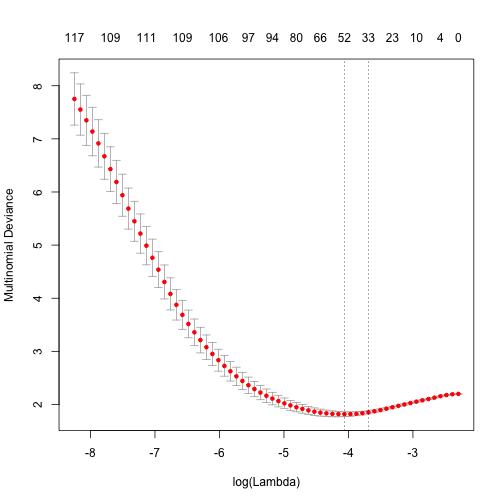
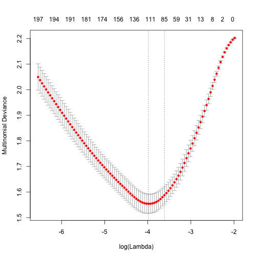
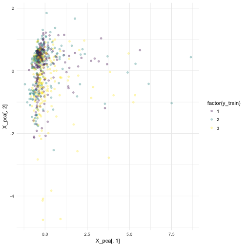


library(readr)
library(dplyr)
library(ggplot2)

# text processing packages
library(tokenizers)
library(stringi)
library(smodels)



president <- read_csv("~/files/ml_data/presidents3.csv")



stri_wrap(president$text[1000], width = 60)



##  [1] "Iraqis are showing their courage every day, and we are proud"
##  [2] "to be their allies in the cause of freedom. Our work in Iraq"
##  [3] "is difficult because our enemy is brutal. But that brutality"
##  [4] "has not stopped the dramatic progress of a new democracy."   
##  [5] "In less than 3 years, the nation has gone from dictatorship" 
##  [6] "to liberation, to sovereignty, to a Constitution, to"        
##  [7] "national elections. At the same time, our coalition has been"
##  [8] "relentless in shutting off terrorist infiltration, clearing" 
##  [9] "out insurgent strongholds, and turning over territory to"    
## [10] "Iraqi security forces."



data(stop_words, package = "tidytext")
stop_words <- stop_words$word
sample(stop_words, 50)



##  [1] "wants"      "away"       "through"    "often"      "yours"     
##  [6] "about"      "then"       "those"      "anyway"     "be"        
## [11] "isn't"      "they'll"    "need"       "near"       "again"     
## [16] "exactly"    "twice"      "where"      "non"        "would"     
## [21] "hither"     "else"       "am"         "great"      "our"       
## [26] "ever"       "somewhere"  "nor"        "interested" "why"       
## [31] "almost"     "had"        "whence"     "your"       "new"       
## [36] "here"       "much"       "n"          "out"        "same"      
## [41] "still"      "give"       "cases"      "somewhere"  "nd"        
## [46] "few"        "younger"    "here's"     "where"      "when's"



token_list <- tokenize_words(president$text,
                             stopwords = stop_words)
token_df <- term_list_to_df(token_list)

X <- term_df_to_matrix(token_df, min_df = 0.03, max_df = 0.97,
                       scale = TRUE)

y <- president$class
X_train <- X[president$train_id == "train",]
X_valid <- X[president$train_id == "valid",]
y_train <- y[president$train_id == "train"]
y_valid <- y[president$train_id == "valid"]

library(glmnet)
model <- cv.glmnet(X_train, y_train, family = "multinomial")



## Warning: from glmnet Fortran code (error code -86); Convergence for 86th
## lambda value not reached after maxit=100000 iterations; solutions for
## larger lambdas returned



## Warning: from glmnet Fortran code (error code -83); Convergence for 83th
## lambda value not reached after maxit=100000 iterations; solutions for
## larger lambdas returned



## Warning: from glmnet Fortran code (error code -72); Convergence for 72th
## lambda value not reached after maxit=100000 iterations; solutions for
## larger lambdas returned



## Warning: from glmnet Fortran code (error code -71); Convergence for 71th
## lambda value not reached after maxit=100000 iterations; solutions for
## larger lambdas returned



## Warning: from glmnet Fortran code (error code -71); Convergence for 71th
## lambda value not reached after maxit=100000 iterations; solutions for
## larger lambdas returned



## Warning: from glmnet Fortran code (error code -72); Convergence for 72th
## lambda value not reached after maxit=100000 iterations; solutions for
## larger lambdas returned



## Warning: from glmnet Fortran code (error code -69); Convergence for 69th
## lambda value not reached after maxit=100000 iterations; solutions for
## larger lambdas returned



## Warning: from glmnet Fortran code (error code -66); Convergence for 66th
## lambda value not reached after maxit=100000 iterations; solutions for
## larger lambdas returned



## Warning: from glmnet Fortran code (error code -72); Convergence for 72th
## lambda value not reached after maxit=100000 iterations; solutions for
## larger lambdas returned



## Warning: from glmnet Fortran code (error code -70); Convergence for 70th
## lambda value not reached after maxit=100000 iterations; solutions for
## larger lambdas returned



## Warning: from glmnet Fortran code (error code -67); Convergence for 67th
## lambda value not reached after maxit=100000 iterations; solutions for
## larger lambdas returned



plot(model)



beta <- coef(model, s = model$lambda[12])
length(beta)



## [1] 3



head(beta[[3]])



## 6 x 1 sparse Matrix of class "dgCMatrix"
##                      1
## (Intercept) 0.03479369
## people      0.46827615
## america     .         
## american    .         
## americans   .         
## country     .



for(j in 1:3) {
  beta <- coef(model, s = model$lambda[12])
  cat(sprintf("%s:\n", c( "Obama", "Bush", "Clinton" )[j]))
  out <-sprintf("%s (%s)", rownames(beta[[j]])[which((beta[[j]] != 0))],
                     sign(beta[[j]])[which((beta[[j]] != 0))])
  print(out)
  cat("\n")
}



## Obama:
##  [1] "(Intercept) (-1)" "jobs (1)"         "future (1)"      
##  [4] "businesses (1)"   "job (1)"          "peace (-1)"      
##  [7] "hope (-1)"        "income (-1)"      "billion (-1)"    
## [10] "lead (1)"         "increase (-1)"    "research (1)"    
## [13] "invest (1)"       "afford (1)"       "finally (1)"     
## 
## Bush:
##  [1] "(Intercept) (1)"  "jobs (-1)"        "security (1)"    
##  [4] "deficit (-1)"     "freedom (1)"      "weapons (1)"     
##  [7] "college (-1)"     "social (1)"       "free (1)"        
## [10] "hope (1)"         "iraq (1)"         "terrorists (1)"  
## [13] "communities (-1)" "income (1)"       "billion (1)"     
## [16] "terror (1)"       "republicans (-1)"
## 
## Clinton:
##  [1] "(Intercept) (1)" "people (1)"      "energy (-1)"    
##  [4] "cut (1)"         "national (1)"    "welfare (1)"    
##  [7] "bill (1)"        "free (-1)"       "century (1)"    
## [10] "program (1)"     "crime (1)"       "service (1)"



y_valid_pred <- predict(model, X_valid, type = "response",
                        s = model$lambda.min)[,,1]
head(y_valid_pred)



##                1          2         3
## [1,] 0.119140063 0.56832098 0.3125390
## [2,] 0.075003795 0.61724273 0.3077535
## [3,] 0.371000864 0.09669129 0.5323078
## [4,] 0.004256906 0.01190841 0.9838347
## [5,] 0.302853653 0.18828918 0.5088572
## [6,] 0.183596798 0.27580156 0.5406016



y_valid_pred <- predict(model, X_valid, type = "response",
                        s = model$lambda.min)[,,1]
y_valid_pred <- apply(y_valid_pred, 1, which.max)
mean(y_valid == y_valid_pred)



## [1] 0.5732484


## Bigrams


token_list <- tokenize_ngrams(president$text, n = 2, n_min = 1,
                             stopwords = stop_words)
token_df <- term_list_to_df(token_list)

X <- term_df_to_matrix(token_df, min_df = 0.03)
y <- president$class
X_train <- X[president$train_id == "train",]
X_valid <- X[president$train_id == "valid",]
y_train <- y[president$train_id == "train"]
y_valid <- y[president$train_id == "valid"]

library(glmnet)
model <- cv.glmnet(X_train, y_train, family = "multinomial")



## Warning: from glmnet Fortran code (error code -77); Convergence for 77th
## lambda value not reached after maxit=100000 iterations; solutions for
## larger lambdas returned



## Warning: from glmnet Fortran code (error code -72); Convergence for 72th
## lambda value not reached after maxit=100000 iterations; solutions for
## larger lambdas returned



## Warning: from glmnet Fortran code (error code -71); Convergence for 71th
## lambda value not reached after maxit=100000 iterations; solutions for
## larger lambdas returned



## Warning: from glmnet Fortran code (error code -68); Convergence for 68th
## lambda value not reached after maxit=100000 iterations; solutions for
## larger lambdas returned



## Warning: from glmnet Fortran code (error code -67); Convergence for 67th
## lambda value not reached after maxit=100000 iterations; solutions for
## larger lambdas returned



## Warning: from glmnet Fortran code (error code -68); Convergence for 68th
## lambda value not reached after maxit=100000 iterations; solutions for
## larger lambdas returned



## Warning: from glmnet Fortran code (error code -79); Convergence for 79th
## lambda value not reached after maxit=100000 iterations; solutions for
## larger lambdas returned



## Warning: from glmnet Fortran code (error code -78); Convergence for 78th
## lambda value not reached after maxit=100000 iterations; solutions for
## larger lambdas returned



## Warning: from glmnet Fortran code (error code -75); Convergence for 75th
## lambda value not reached after maxit=100000 iterations; solutions for
## larger lambdas returned



plot(model)



for(j in 1:3) {
  beta <- coef(model, s = model$lambda[15])
  cat(sprintf("%s:\n", c( "Obama", "Bush", "Clinton" )[j]))
  out <-sprintf("%s (%s)", rownames(beta[[j]])[which((beta[[j]] != 0))],
                     sign(beta[[j]])[which((beta[[j]] != 0))])
  print(out)
  cat("\n")
}



## Obama:
##  [1] "(Intercept) (1)"    "country (-1)"       "jobs (1)"          
##  [4] "children (-1)"      "budget (-1)"        "education (1)"     
##  [7] "citizens (-1)"      "businesses (1)"     "job (1)"           
## [10] "deficit (1)"        "president (-1)"     "peace (-1)"        
## [13] "pass (-1)"          "hope (-1)"          "taxes (-1)"        
## [16] "strong (-1)"        "fellow (-1)"        "income (-1)"       
## [19] "billion (-1)"       "lead (1)"           "increase (-1)"     
## [22] "research (1)"       "administration (1)" "invest (1)"        
## [25] "afford (1)"         "progress (1)"       "expand (-1)"       
## [28] "finally (1)"        "republicans (1)"   
## 
## Bush:
##  [1] "(Intercept) (1)"     "american (-1)"       "jobs (-1)"          
##  [4] "families (-1)"       "education (-1)"      "future (-1)"        
##  [7] "citizens (1)"        "home (-1)"           "deficit (-1)"       
## [10] "money (1)"           "federal (1)"         "freedom (1)"        
## [13] "change (-1)"         "hard (-1)"           "weapons (1)"        
## [16] "continue (1)"        "college (-1)"        "life (1)"           
## [19] "free (1)"            "hope (1)"            "iraq (1)"           
## [22] "terrorists (1)"      "social security (1)" "cuts (-1)"          
## [25] "communities (-1)"    "military (1)"        "fight (1)"          
## [28] "income (1)"          "billion (1)"         "class (-1)"         
## [31] "terror (1)"          "coverage (1)"        "stand (-1)"         
## [34] "bipartisan (-1)"     "global (-1)"         "raise (-1)"         
## [37] "finally (-1)"        "republicans (-1)"   
## 
## Clinton:
##  [1] "(Intercept) (-1)" "people (1)"       "energy (-1)"     
##  [4] "united (-1)"      "cut (1)"          "president (1)"   
##  [7] "national (1)"     "change (1)"       "challenge (1)"   
## [10] "welfare (1)"      "law (-1)"         "pay (1)"         
## [13] "bill (1)"         "free (-1)"        "women (-1)"      
## [16] "parents (1)"      "protect (-1)"     "goal (-1)"       
## [19] "start (1)"        "trade (1)"        "century (1)"     
## [22] "program (1)"      "class (1)"        "democracy (1)"   
## [25] "crime (1)"        "stop (1)"         "research (-1)"   
## [28] "global (1)"       "proud (1)"        "expand (1)"      
## [31] "raise (1)"



y_valid_pred <- predict(model, X_valid, type = "response",
                        s = model$lambda.min)[,,1]
y_valid_pred <- apply(y_valid_pred, 1, which.max)
mean(y_valid == y_valid_pred)



## [1] 0.611465


## Character grams


token_list <- tokenize_character_shingles(president$text, n = 3,
                                          n_min = 1,
                                          strip_non_alphanum = TRUE)
token_df <- term_list_to_df(token_list)

X <- term_df_to_matrix(token_df, min_df = 0.03)
y <- president$class
X_train <- X[president$train_id == "train",]
X_valid <- X[president$train_id == "valid",]
y_train <- y[president$train_id == "train"]
y_valid <- y[president$train_id == "valid"]

library(glmnet)
model <- cv.glmnet(X_train, y_train, family = "multinomial")
plot(model)



for(j in 1:3) {
  beta <- coef(model, s = model$lambda[12])
  cat(sprintf("%s:\n", c( "Obama", "Bush", "Clinton" )[j]))
  out <-sprintf("%s (%s)", rownames(beta[[j]])[which((beta[[j]] != 0))],
                     sign(beta[[j]])[which((beta[[j]] != 0))])
  print(out)
  cat("\n")
}



## Obama:
## [1] "(Intercept) (-1)" "tha (1)"          "hat (1)"         
## [4] "mu (-1)"          "ats (1)"          "emu (-1)"        
## 
## Bush:
##  [1] "(Intercept) (1)" "hat (-1)"        "bu (-1)"        
##  [4] "ob (-1)"         "now (-1)"        "but (-1)"       
##  [7] "las (-1)"        "err (1)"         "ira (1)"        
## [10] "add (1)"         "oci (1)"        
## 
## Clinton:
## [1] "(Intercept) (-1)" "to (1)"           "all (1)"         
## [4] "ple (1)"          "tto (1)"          "htt (1)"         
## [7] "lfa (1)"          "ink (1)"          "ico (1)"



y_valid_pred <- predict(model, X_valid, type = "response",
                        s = model$lambda.min)[,,1]
y_valid_pred <- apply(y_valid_pred, 1, which.max)
mean(y_valid == y_valid_pred)



## [1] 0.6910828


## Negative examples

Let's redo the simple unigram term analysis:


token_list <- tokenize_words(president$text,
                             stopwords = stop_words)
token_df <- term_list_to_df(token_list)

X <- term_df_to_matrix(token_df, min_df = 0.03, max_df = 0.97,
                       scale = FALSE)

y <- president$class
X_train <- X[president$train_id == "train",]
X_valid <- X[president$train_id == "valid",]
y_train <- y[president$train_id == "train"]
y_valid <- y[president$train_id == "valid"]

library(glmnet)
model <- cv.glmnet(X_train, y_train, family = "multinomial")



## Warning: from glmnet Fortran code (error code -85); Convergence for 85th
## lambda value not reached after maxit=100000 iterations; solutions for
## larger lambdas returned



## Warning: from glmnet Fortran code (error code -71); Convergence for 71th
## lambda value not reached after maxit=100000 iterations; solutions for
## larger lambdas returned



## Warning: from glmnet Fortran code (error code -72); Convergence for 72th
## lambda value not reached after maxit=100000 iterations; solutions for
## larger lambdas returned



## Warning: from glmnet Fortran code (error code -71); Convergence for 71th
## lambda value not reached after maxit=100000 iterations; solutions for
## larger lambdas returned



## Warning: from glmnet Fortran code (error code -77); Convergence for 77th
## lambda value not reached after maxit=100000 iterations; solutions for
## larger lambdas returned



## Warning: from glmnet Fortran code (error code -73); Convergence for 73th
## lambda value not reached after maxit=100000 iterations; solutions for
## larger lambdas returned



## Warning: from glmnet Fortran code (error code -74); Convergence for 74th
## lambda value not reached after maxit=100000 iterations; solutions for
## larger lambdas returned



## Warning: from glmnet Fortran code (error code -68); Convergence for 68th
## lambda value not reached after maxit=100000 iterations; solutions for
## larger lambdas returned



## Warning: from glmnet Fortran code (error code -72); Convergence for 72th
## lambda value not reached after maxit=100000 iterations; solutions for
## larger lambdas returned



## Warning: from glmnet Fortran code (error code -73); Convergence for 73th
## lambda value not reached after maxit=100000 iterations; solutions for
## larger lambdas returned



## Warning: from glmnet Fortran code (error code -71); Convergence for 71th
## lambda value not reached after maxit=100000 iterations; solutions for
## larger lambdas returned



pnames <-c( "Obama", "Bush", "Clinton" )
table(actual = pnames[y_valid],
      pred = pnames[y_valid_pred])



##          pred
## actual    Bush Clinton Obama
##   Bush      70      12    16
##   Clinton   11      71    26
##   Obama      9      23    76



neg_example <- function(actual, pred) {
  pnames <-c( "Obama", "Bush", "Clinton" )
  ids <- which(y_valid == match(actual, pnames) &
               y_valid_pred == match(pred, pnames))
  cat(c(stri_wrap(president$text[sample(ids, 1)], width = 60),
    "\n"), sep = "\n")
}

neg_example("Bush", "Clinton")



## So tonight I am proposing that starting this year, we freeze
## annual domestic spending for the next 5 years. Now, this
## would reduce the deficit by more than $400 billion over
## the next decade and will bring discretionary spending to
## the lowest share of our economy since Dwight Eisenhower was
## President. This freeze will require painful cuts. Already,
## we've frozen the salaries of hard-working Federal employees
## for the next 2 years. I've proposed cuts to things I care
## deeply about, like community action programs.



neg_example("Bush", "Obama")



## After all, why would we choose to make deeper cuts to
## education and Medicare just to protect special interest tax
## breaks? How is that fair? Why is it that deficit reduction
## is a big emergency justifying making cuts in Social Security
## benefits, but not closing some loopholes? How does that
## promote growth? Now is our best chance for bipartisan,
## comprehensive tax reform that encourages job creation and
## helps bring down the deficit.



neg_example("Obama", "Bush")



## This dramatic progress has brought its own challenge, in the
## rising costs of medical care and health insurance. Members
## of Congress, we must work together to help control those
## costs and extend the benefits of modern medicine throughout
## our country. Meeting these goals requires bipartisan effort,
## and 2 months ago, you showed the way. By strengthening
## Medicare and adding a prescription drug benefit, you kept
## a basic commitment to our seniors. You are giving them the
## modern medicine they deserve.


## Visualization


library(irlba)
X_pca <- prcomp_irlba(X_train, n = 2)$x
qplot(X_pca[,1], X_pca[,2], color = factor(y_train),
      alpha = I(0.3)) +
  viridis::scale_color_viridis(discrete = TRUE) +
  theme_minimal()


## SVD

$$ X = U \cdot D \cdot V^t $$


library(irlba)
X_svd <- irlba::irlba(X_train, nv = 10)

names(X_svd)



## [1] "d"     "u"     "v"     "iter"  "mprod"



length(X_svd$d)



## [1] 10



dim(X_svd$u)



## [1] 651  10



dim(X_svd$v)



## [1] 180  10



top_words <- apply(X_svd$v, 2, function(v) {
  id <- order(v, decreasing = TRUE)[1:5]
  stri_paste(colnames(X_train)[id], collapse = "; ")
})
top_words



##  [1] "people; health; care; america; american"         
##  [2] "health; care; insurance; tax; costs"             
##  [3] "tax; energy; social; jobs; plan"                 
##  [4] "america; world; energy; country; security"       
##  [5] "security; social; people; tax; benefits"         
##  [6] "government; budget; spending; security; programs"
##  [7] "energy; jobs; people; clean; congress"           
##  [8] "government; america; tax; jobs; world"           
##  [9] "jobs; security; america; social; budget"         
## [10] "people; energy; america; tax; education"



table(top_words[apply(X_svd$u, 1, which.max)], pnames[y_train])



##                                                   
##                                                    Bush Clinton Obama
##   america; world; energy; country; security          50      34    26
##   energy; jobs; people; clean; congress              10       5    21
##   government; america; tax; jobs; world               7       7    11
##   government; budget; spending; security; programs   29      29    26
##   health; care; insurance; tax; costs                11       9    12
##   jobs; security; america; social; budget             6      18    16
##   people; energy; america; tax; education            13      26    21
##   people; health; care; america; american            45      74    53
##   security; social; people; tax; benefits            32       5     5
##   tax; energy; social; jobs; plan                    18      14    18


