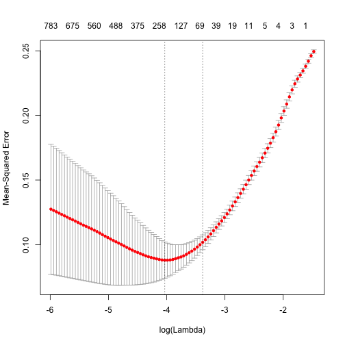
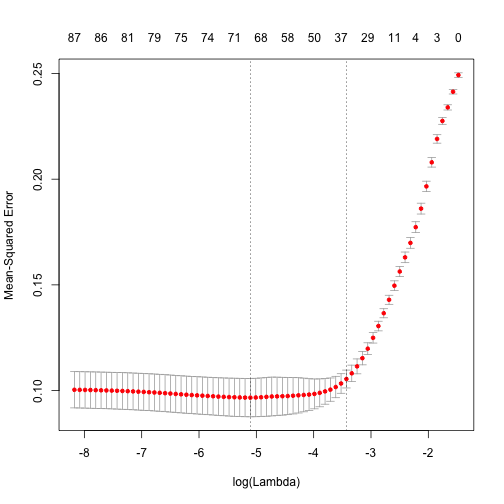
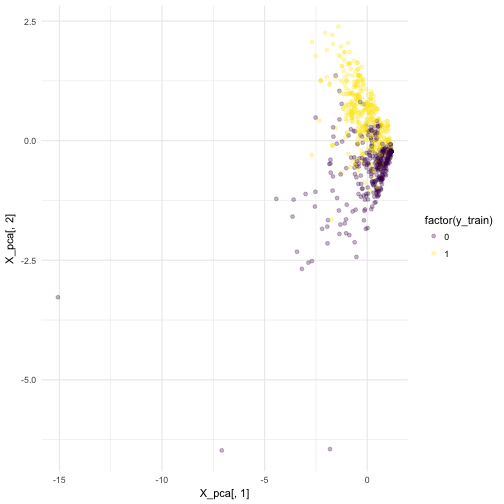


library(readr)
library(dplyr)
library(ggplot2)
library(tokenizers)
library(stringi)
library(smodels)



spam <- read_csv("~/files/ml_data/spam.csv")



stri_wrap(spam$text[500], width = 60)



## [1] "Orange brings you ringtones from all time Chart Heroes, with"
## [2] "a free hit each week! Go to Ringtones & Pics on wap. To stop"
## [3] "receiving these tips reply STOP."



token_list <- tokenize_words(spam$text)
token_list[500]



## [[1]]
##  [1] "orange"    "brings"    "you"       "ringtones" "from"     
##  [6] "all"       "time"      "chart"     "heroes"    "with"     
## [11] "a"         "free"      "hit"       "each"      "week"     
## [16] "go"        "to"        "ringtones" "pics"      "on"       
## [21] "wap"       "to"        "stop"      "receiving" "these"    
## [26] "tips"      "reply"     "stop"



token_df <- term_list_to_df(token_list)



## Loading required package: methods



## Loading required package: Matrix



filter(token_df, id == 500)



## # A tibble: 28 x 2
##       id     token
##    <int>     <chr>
##  1   500    orange
##  2   500    brings
##  3   500       you
##  4   500 ringtones
##  5   500      from
##  6   500       all
##  7   500      time
##  8   500     chart
##  9   500    heroes
## 10   500      with
## # ... with 18 more rows



X <- term_df_to_matrix(token_df)
dim(X)



## [1] 1276 4454



colnames(X)[1:10]



##  [1] "to"   "you"  "a"    "i"    "call" "the"  "u"    "your" "for"  "is"



X[1:10,1:10]



## 10 x 10 sparse Matrix of class "dgTMatrix"



##    [[ suppressing 10 column names 'to', 'you', 'a' ... ]]



##                          
##  [1,] 1 . 2 . . 1 . . . .
##  [2,] 2 . . . . . . . . .
##  [3,] . . . 1 1 . . 1 1 .
##  [4,] . 1 . . . . . . . .
##  [5,] . . . . . . 1 . 1 .
##  [6,] 1 1 . . . . . 2 . .
##  [7,] 3 2 2 . 1 . . 1 . .
##  [8,] . . . . . 1 1 . . .
##  [9,] 3 1 . . . 1 1 . 1 .
## [10,] 1 . . . . . . . . .



X_train <- X[spam$train_id == "train",]
X_valid <- X[spam$train_id == "valid",]
y_train <- spam$class[spam$train_id == "train"]
y_valid <- spam$class[spam$train_id == "valid"]



library(glmnet)
model <- cv.glmnet(X_train, y_train)
plot(model)



beta <- coef(model, s = model$lambda.min)
rownames(beta)[which((beta != 0))]



##   [1] "(Intercept)"                 "to"                         
##   [3] "a"                           "i"                          
##   [5] "call"                        "your"                       
##   [7] "for"                         "now"                        
##   [9] "2"                           "free"                       
##  [11] "or"                          "txt"                        
##  [13] "from"                        "my"                         
##  [15] "4"                           "me"                         
##  [17] "text"                        "mobile"                     
##  [19] "stop"                        "not"                        
##  [21] "reply"                       "prize"                      
##  [23] "that"                        "do"                         
##  [25] "we"                          "at"                         
##  [27] "cash"                        "but"                        
##  [29] "won"                         "new"                        
##  [31] "send"                        "i'm"                        
##  [33] "gt"                          "please"                     
##  [35] "1"                           "150p"                       
##  [37] "lt"                          "up"                         
##  [39] "win"                         "urgent"                     
##  [41] "week"                        "contact"                    
##  [43] "msg"                         "service"                    
##  [45] "who"                         "ok"                         
##  [47] "18"                          "chat"                       
##  [49] "customer"                    "how"                        
##  [51] "come"                        "cs"                         
##  [53] "its"                         "500"                        
##  [55] "draw"                        "more"                       
##  [57] "message"                     "awarded"                    
##  [59] "100"                         "find"                       
##  [61] "1.50"                        "line"                       
##  [63] "receive"                     "code"                       
##  [65] "ringtone"                    "still"                      
##  [67] "he"                          "mob"                        
##  [69] "da"                          "hope"                       
##  [71] "i'll"                        "tones"                      
##  [73] "again"                       "where"                      
##  [75] "account"                     "sexy"                       
##  [77] "top"                         "10"                         
##  [79] "250"                         "much"                       
##  [81] "5"                           "expires"                    
##  [83] "games"                       "later"                      
##  [85] "calls"                       "ham"                        
##  [87] "join"                        "uk"                         
##  [89] "winner"                      "http"                       
##  [91] "services"                    "unsubscribe"                
##  [93] "something"                   "voucher"                    
##  [95] "amp"                         "days"                       
##  [97] "hot"                         "m"                          
##  [99] "pics"                        "player"                     
## [101] "choose"                      "eg"                         
## [103] "info"                        "txts"                       
## [105] "wap"                         "welcome"                    
## [107] "problem"                     "terms"                      
## [109] "admirer"                     "called"                     
## [111] "ldn"                         "sunshine"                   
## [113] "thinks"                      "within"                     
## [115] "50"                          "always"                     
## [117] "co.uk"                       "few"                        
## [119] "goto"                        "i've"                       
## [121] "member"                      "saturday"                   
## [123] "sure"                        "entered"                    
## [125] "questions"                   "enough"                     
## [127] "frnd"                        "local"                      
## [129] "luck"                        "spam"                       
## [131] "sport"                       "2day"                       
## [133] "62468"                       "alone"                      
## [135] "email"                       "hav"                        
## [137] "selection"                   "team"                       
## [139] "4u"                          "88066"                      
## [141] "asks"                        "bank"                       
## [143] "bill"                        "boytoy"                     
## [145] "costs"                       "e.g"                        
## [147] "fri"                         "hint"                       
## [149] "members"                     "minmobsmorelkpobox177hp51fl"
## [151] "registered"                  "seemed"                     
## [153] "strong"                      "super"                      
## [155] "term"                        "tickets"                    
## [157] "02073162414"                 "2u"                         
## [159] "5.00"                        "costing"                    
## [161] "darling"                     "explicit"                   
## [163] "explosive"                   "further"                    
## [165] "gender"                      "granite"                    
## [167] "hoping"                      "ice"                        
## [169] "issues"                      "nasdaq"                     
## [171] "secs"                        "sptv"                       
## [173] "symbol"                      "unique"                     
## [175] "web"                         "07880867867"                
## [177] "0871750.77.11"               "08718726270"                
## [179] "146tf150p"                   "151"                        
## [181] "24m"                         "391784"                     
## [183] "84484"                       "adrian"                     
## [185] "appreciate"                  "banned"                     
## [187] "barbie"                      "clubsaisai"                 
## [189] "cnn"                         "coincidence"                
## [191] "confirmd"                    "created"                    
## [193] "current"                     "dating:i"                   
## [195] "detroit"                     "devils"                     
## [197] "disconnect"                  "divorce"                    
## [199] "fgkslpo"                     "hockey"                     
## [201] "housewives"                  "ibn"                        
## [203] "incorrect"                   "itz"                        
## [205] "jersey"                      "ken's"                      
## [207] "landlines"                   "leading"                    
## [209] "mobsi.com"                   "monthly"                    
## [211] "nearly"                      "note"                       
## [213] "offering"                    "opinions"                   
## [215] "paris.free"                  "pause"                      
## [217] "rgds"                        "ringtoneking"               
## [219] "roses"                       "sms.shsex.netun"            
## [221] "soiree"                      "terrorist"                  
## [223] "thankyou"                    "type"                       
## [225] "wings"                       "wrote"                      
## [227] "www.asjesus.com"



beta <- coef(model, s = model$lambda.1se)
paste(rownames(beta)[which((beta != 0))], " (",
      sign(beta)[which((beta != 0))], ")", sep = "")



##  [1] "(Intercept) (1)"                 "to (1)"                         
##  [3] "a (1)"                           "i (-1)"                         
##  [5] "call (1)"                        "your (1)"                       
##  [7] "for (1)"                         "now (1)"                        
##  [9] "2 (1)"                           "free (1)"                       
## [11] "or (1)"                          "txt (1)"                        
## [13] "from (1)"                        "me (-1)"                        
## [15] "text (1)"                        "mobile (1)"                     
## [17] "stop (1)"                        "not (-1)"                       
## [19] "reply (1)"                       "prize (1)"                      
## [21] "do (-1)"                         "cash (1)"                       
## [23] "but (-1)"                        "won (1)"                        
## [25] "new (1)"                         "send (1)"                       
## [27] "i'm (-1)"                        "gt (-1)"                        
## [29] "please (1)"                      "1 (1)"                          
## [31] "150p (1)"                        "lt (-1)"                        
## [33] "win (1)"                         "urgent (1)"                     
## [35] "contact (1)"                     "msg (1)"                        
## [37] "service (1)"                     "come (-1)"                      
## [39] "cs (1)"                          "more (1)"                       
## [41] "awarded (1)"                     "100 (1)"                        
## [43] "find (1)"                        "code (1)"                       
## [45] "ringtone (1)"                    "mob (1)"                        
## [47] "da (-1)"                         "i'll (-1)"                      
## [49] "again (-1)"                      "sexy (1)"                       
## [51] "top (1)"                         "much (-1)"                      
## [53] "5 (1)"                           "games (1)"                      
## [55] "later (-1)"                      "calls (1)"                      
## [57] "winner (1)"                      "http (1)"                       
## [59] "unsubscribe (1)"                 "days (1)"                       
## [61] "choose (1)"                      "co.uk (1)"                      
## [63] "sure (-1)"                       "minmobsmorelkpobox177hp51fl (1)"



y_valid_pred <- as.numeric(predict(model, X_valid, type = "response") > 0.5)
mean(y_valid == y_valid_pred)



## [1] 0.9294118


## Modify the features


X <- term_df_to_matrix(token_df, min_df = 0.03)
y <- spam$class
X_train <- X[spam$train_id == "train",]
X_valid <- X[spam$train_id == "valid",]
y_train <- spam$class[spam$train_id == "train"]
y_valid <- spam$class[spam$train_id == "valid"]

model <- cv.glmnet(X_train, y_train)
plot(model)



beta <- coef(model, s = model$lambda.1se)
paste(rownames(beta)[which((beta != 0))], " (",
      sign(beta)[which((beta != 0))], ")", sep = "")



##  [1] "(Intercept) (1)" "to (1)"          "a (1)"          
##  [4] "i (-1)"          "call (1)"        "your (1)"       
##  [7] "for (1)"         "now (1)"         "2 (1)"          
## [10] "free (1)"        "or (1)"          "txt (1)"        
## [13] "from (1)"        "4 (1)"           "me (-1)"        
## [16] "text (1)"        "mobile (1)"      "stop (1)"       
## [19] "not (-1)"        "reply (1)"       "prize (1)"      
## [22] "do (-1)"         "cash (1)"        "but (-1)"       
## [25] "won (1)"         "new (1)"         "send (1)"       
## [28] "i'm (-1)"        "please (1)"      "1 (1)"          
## [31] "150p (1)"        "win (1)"         "contact (1)"    
## [34] "msg (1)"         "service (1)"     "18 (1)"



y_valid_pred <- as.numeric(predict(model, X_valid, type = "response") > 0.5)
mean(y_valid == y_valid_pred)



## [1] 0.9215686


## Negative examples


table(y_valid = y_valid, y_valid_pred = y_valid_pred)



##        y_valid_pred
## y_valid   0   1
##       0 131   4
##       1  16 104



y_pred <- as.numeric(predict(model, X, type = "response") > 0.5)
these_rows <- which(spam$train_id == "valid" &
                    y != y_pred &
                    y == 1)
cat(stri_wrap(spam$text[these_rows], exdent = 5), sep = "\n")



## Cashbin.co.uk (Get lots of cash this weekend!) www.cashbin.co.uk
##      Dear Welcome to the weekend We have got our biggest and best EVER
##      cash give away!! These..
## Do you ever notice that when you're driving, anyone going slower
##      than you is an idiot and everyone driving faster than you is a
##      maniac?
## http//tms. widelive.com/index. wml?
##      id=820554ad0a1705572711&first=true¡C C Ringtone¡
## network operator. The service is free. For T & C's visit 80488.biz
## PRIVATE! Your 2003 Account Statement for 078
## Filthy stories and GIRLS waiting for your
## Get 3 Lions England tone, reply lionm 4 mono or lionp 4 poly. 4
##      more go 2 www.ringtones.co.uk, the original n best. Tones 3GBP
##      network operator rates apply
## Ringtone Club: Gr8 new polys direct to your mobile every week !
## Warner Village 83118 C Colin Farrell in SWAT this wkend @Warner
##      Village & get 1 free med. Popcorn!Just show msg+ticket@kiosk.Valid
##      4-7/12. C t&c @kiosk. Reply SONY 4 mre film offers
## Reminder: You have not downloaded the content you have already paid
##      for. Goto http://doit. mymoby. tv/ to collect your content.
## New Tones This week include: 1)McFly-All Ab.., 2) Sara Jorge-
##      Shock.. 3) Will Smith-Switch.. To order follow instructions on next
##      message
## Latest News! Police station toilet stolen, cops have nothing to go
##      on!
## Money i have won wining number 946 wot do i do next
## You will be receiving this week's Triple Echo ringtone shortly.
##      Enjoy it!
## Am new 2 club & dont fink we met yet Will B gr8 2 C U Please leave
##      msg 2day wiv ur area 09099726553 reply promised CARLIE x Calls£1/
##      minMobsmore LKPOBOX177HP51FL
## SplashMobile: Choose from 1000s of gr8 tones each wk! This is a
##      subscrition service with weekly tones costing 300p. U have one
##      credit - kick back and ENJOY



y_pred <- as.numeric(predict(model, X, type = "response") > 0.5)
these_rows <- which(spam$train_id == "valid" &
                    y != y_pred &
                    y == 0)
cat(stri_wrap(spam$text[these_rows], exdent = 5), sep = "\n")



## if you text on your way to cup stop that should work. And that
##      should be BUS
## We have sent JD for Customer Service cum Accounts Executive to ur
##      mail id, For details contact us
## I‘ll have a look at the frying pan in case it‘s cheap or a book
##      perhaps. No that‘s silly a frying pan isn‘t likely to be a book
## In e msg jus now. U said thanks for gift.


## Visualization


library(irlba)
X_pca <- prcomp_irlba(X_train, n = 2)$x
qplot(X_pca[,1], X_pca[,2], color = factor(y_train),
      alpha = I(0.3)) +
  viridis::scale_color_viridis(discrete = TRUE) +
  theme_minimal()


