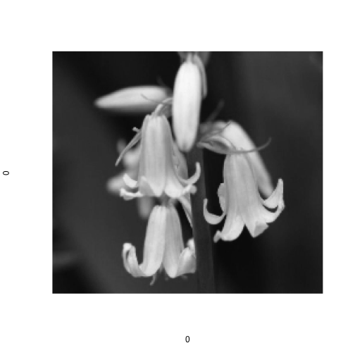
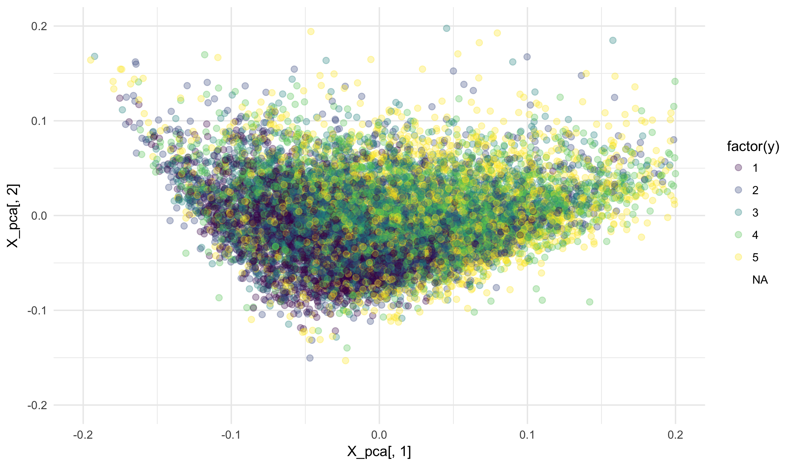
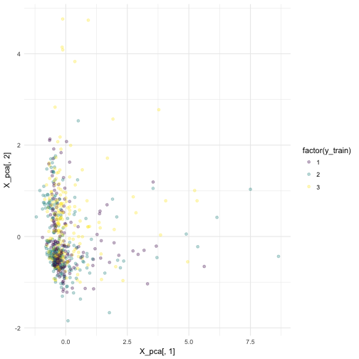
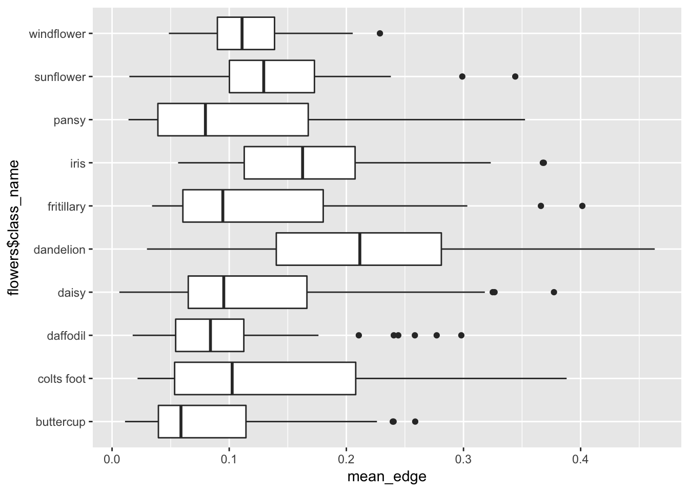
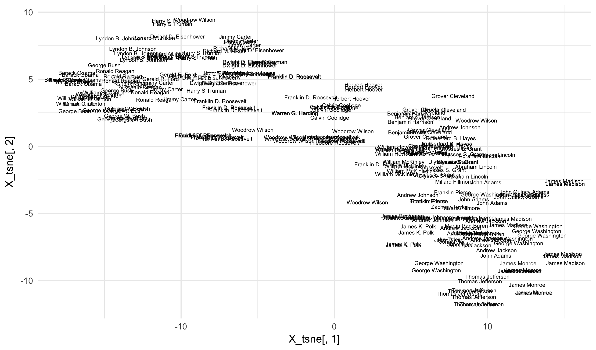


library(readr)
library(dplyr)



## Warning: package 'dplyr' was built under R version 3.4.2



library(ggplot2)
library(tokenizers)
library(stringi)
library(smodels)


## Natural Language Processing

Natural language processing, or NLP, refers to the process of
teaching machines how to **understand** language. This goes 
far beyond the simple models that we have so far built. Consider
this classic example sentence:

> I forgot the papers.

Only four words here, but let's think about how we as humans
would understand the sentence. The word "I" refers to the speaker.
The word forgot is a verb that has four important elements to
it:

- its lemma, "forget", has several definitions that all
reduce to some form of not remembering about to do something
- the *tense* indicates that the action occured in the past
- the placement right after "I" indicates that the speaker 
is the one who "forgot""
- the placement of the determinant and noun "the papers" 
afterwards indicates that this is the object that the speaker
forgot

The word "the" is associated with "papers"; it is a definite
article and shows that "papers" refers to a specific item
rather than a generic object. Finally, "papers" indicates
the a set of many objects (from the "s") of type "paper".

Phew! There is actually a lot going on in this short sentence.
And so far we have just looked at the sentence **semantics**,
what it literally is saying. **Pragmatics** goes even farther
and describes what this sentence means within a broader context.
For example, the sentence above could mean several things
depending on context:

- I forgot to mix up the morning newspapers.
- I forgot *about* the papers (perhaps that needed grading).
- I forgot to bring the paperwork for a meeting.

Getting computers to understand all of these nuances is a 
**very** open question and certainly not something we will
get into the details of right now. However, we can get a 
little bit closer to understand than our current pipeline
for processing text. Hopefully, at the end of the semester,
we will return to these ideas and be able to get just a 
bit closer to parsing textual data the way that humans
do.

## Text annotation

We can split semantics into two broad categories: grammatical
relationships and word meanings. The first is the easiest to
learn computationally because we have a relatively simple way
of describing grammatical relationships. These can further
be broken down into several steps:

- **tokenization**: splitting raw characters into sentences
and words
- **lemmatization**: finding the root of a word, such as the
infinitive version of a verb or the singular version of a 
noun
- **part of speech tagging**: associating a part of speech
to each token
- **dependency parsing**: finding binary relationships
between words, such as noun-verb and subject-verb relations

We have so far only used tokenization in our analyses. To
get these deeper attributes we need a more powerful library.
I have wrote the package **cleanNLP** for just this purpose.
Unlike **smodels**, this is not just meant for our class; it
something meant for public consumption. You can find more 
details in the paper here:

- [A Tidy Data Model for Natural Language Processing using cleanNLP](https://journal.r-project.org/archive/2017/RJ-2017-035/index.html)

Setting up the basic R package is easy, but I won't force you
all to do this because you also need to correctly set up the
spaCy library in Python which can be a bit of a pain.

To run **cleanNLP**, we can do the following:


text <- "I forgot the papers."

library(cleanNLP)
init_spaCy("en")
anno <- get_combine(run_annotators(text, as_strings = TRUE))
anno



## # A tibble: 5 x 13
##      id   sid   tid   word  lemma  upos   pos   cid source relation
##   <int> <int> <int>  <chr>  <chr> <chr> <chr> <int>  <int>    <chr>
## 1     1     1     1      I -PRON-  PRON   PRP     0      2    nsubj
## 2     1     1     2 forgot forget  VERB   VBD     2      0     ROOT
## 3     1     1     3    the    the   DET    DT     9      4      det
## 4     1     1     4 papers  paper  NOUN   NNS    13      2     dobj
## 5     1     1     5      .      . PUNCT     .    19      2    punct
## # ... with 3 more variables: word_source <chr>, lemma_source <chr>,
## #   spaces <dbl>


Notice that this captures all of the grammatical information,
but nothing about the meaning of the words themselves. The 
field *upos* gives a coarse universal part of speech code
whereas *pos* gives a more specific speech code specific to
English. Specific things captured by the model:

- "I" is a pronoun  
- "I" is the subject of the verb "forgot"
- "forgot" is the past tense ("VBD") of the verb "forget"
- "the" is the determinant of the noun "paper"
- "papers" is the plural ("NNS" is plural) of "paper"
- "papers" is the direct object of the verb forgot

This grammatical information is very useful for many tasks that
fall outside of our predictive modelling framework. For example,
parsing the sentence is useful for document summarization, 
classification, information extraction, and for building
question-answer type chat bots.

The grammatical units can also be used in the kinds of predictive
document classification tasks we have seen so far. We will now
briefly look at these.

## Authorship with tokens

Today, we will look at short writtings from five well-known
British authors.


stylo <- read_csv("~/gh/ml_data/stylo_uk.csv")


As a first step, let us build a term-frequency based
data matrix `X` as usual.


token_list <- tokenize_words(stylo$text)
token_df <- term_list_to_df(token_list)

X <- term_df_to_matrix(token_df, min_df = 0.05, max_df = 1,
                       scale = FALSE)

y <- stylo$author
X_train <- X[stylo$train_id == "train",]
X_valid <- X[stylo$train_id == "valid",]
y_train <- y[stylo$train_id == "train"]
y_valid <- y[stylo$train_id == "valid"]

library(glmnet)



## Warning: package 'glmnet' was built under R version 3.4.2



model <- cv.glmnet(X_train, y_train, family = "multinomial")


The resulting regression model is quite large. We will
look at just the first 50 rows.


beta <- coef(model, s = model$lambda.1se)
beta <- Reduce(cbind, beta)
dim(beta[apply(beta != 0, 1, any),])



## [1] 181   5



beta[apply(beta != 0, 1, any),][1:50,]



## 50 x 5 sparse Matrix of class "dgCMatrix"
##                        1             1            1            1
## (Intercept) -1.330011187  0.0629267938  0.470668809 -0.461911871
## the         -0.234342718 -0.0860619409  0.030476592  0.040706096
## and         -0.001612918  .            -0.217532890  0.089478316
## of           0.044626890 -0.0527143814 -0.136155311  0.024050088
## to           0.059912529  .            -0.099703368  0.048657442
## a           -0.109919917 -0.0126724864  .            0.079923538
## i            .           -0.0285719725 -0.056080389  0.180548736
## in          -0.011441072  0.1520284808 -0.028457816  0.056994858
## was          0.054962646 -0.1202881359  .            0.020632926
## it           .            0.0214899585  0.032781280 -0.082912974
## that        -0.182982846  0.1331620952  0.225241105 -0.108139310
## he           .           -0.0375534260  .            .          
## you          .            0.0008549527  0.123907045 -0.019858222
## his          .            0.0625427016  0.110636951 -0.069662233
## with         .            .            -0.029987318  0.051822325
## had          .           -0.0126531149  0.017781961 -0.001629622
## as           0.093682919  0.1810042716  .            .          
## for          .           -0.0373913083  .            0.026667851
## her          0.344845567  0.1635953739  .           -0.050299807
## my           .            .            -0.120291533  .          
## not          0.405094584  .            -0.390569249  .          
## is           0.096526949 -0.0832375026  .            0.219997690
## at           .            0.0253520521  .           -0.031101812
## but          0.024446514 -0.3149789383 -0.170817245  0.019539208
## be           0.231192003  0.0017002062 -0.060533351  .          
## have         .            0.1092203686 -0.005284342  .          
## she          0.249919015  .            -0.205371535  .          
## on           .            .            -0.188446690  0.073212157
## him          .            0.1359392908  .           -0.239571664
## me          -0.123917073  .            -0.123713167  .          
## said        -0.360050959  0.1598998255  .           -0.223123872
## all          0.059079527 -0.0752734020  .            .          
## this        -0.237360562  .             .            .          
## by           .            0.0483372429 -0.096281449  .          
## so           .            0.1671054281  .            .          
## they         .            .             0.141772042  .          
## were         0.223039471  0.0239534843  .           -0.035821101
## from         0.029762709  .             0.181393031  .          
## which        0.108778643  .             0.614892307 -0.023843343
## we           .           -0.4079860438  0.244867447  0.136094413
## no           0.010482350  0.0729797350  .            .          
## there        .            0.1415367244  0.295560191 -0.130113660
## one          .           -0.0026734091  0.156462527  0.088523794
## been         0.275692938  0.0218320617  .           -0.046388904
## an           .           -0.1191398548  .            .          
## what         .            0.0031297952  .           -0.144324981
## if          -0.271117330  0.1410127618  0.102824243  .          
## very         0.821602164  .             0.003987479  .          
## would        .           -0.0757812674  0.095048332  .          
## or          -0.094104082  0.0779036372 -0.031882881  .          
##                        1
## (Intercept)  1.258327456
## the          .          
## and          .          
## of           .          
## to          -0.115180570
## a            .          
## i            0.219711204
## in           .          
## was          .          
## it          -0.143606467
## that         .          
## he           .          
## you         -0.233613758
## his         -0.003975694
## with        -0.186049525
## had          .          
## as          -0.026828657
## for         -0.194692121
## her         -0.471082559
## my           0.064473779
## not         -0.260916904
## is          -0.138645301
## at           .          
## but          .          
## be          -0.375106987
## have        -0.220651763
## she         -0.394283998
## on          -0.180805608
## him         -0.067951759
## me           0.190606195
## said         0.517511811
## all          .          
## this        -0.013514219
## by           .          
## so          -0.119960527
## they        -0.113115622
## were        -0.010322304
## from         .          
## which       -0.355423830
## we          -0.019949492
## no          -0.179935388
## there       -0.095185189
## one          .          
## been         .          
## an           0.085815891
## what         .          
## if          -0.212566956
## very         .          
## would        .          
## or           0.086257624


Notice that many of these words are the most frequent terms
rather than relatively rare ones. This fits on theories that
writing style is most determined by how often one uses 
function words. 

- [Zheng, Rong, et al. "A framework for authorship identification of online messages: Writing‐style features and classification techniques." Journal of the Association for Information Science and Technology 57.3 (2006): 378-393.](http://onlinelibrary.wiley.com/doi/10.1002/asi.20316/full)	

Evaluating the model, we see that it is reasonably predictive
but quite overfit to the data.


stylo$author_pred <- predict(model, newx = X, type = "class",
                             lambda = model$lambda.min)
tapply(stylo$author_pred == stylo$author,
       stylo$train_id, mean)



##      test     train     valid 
##        NA 0.6943636 0.5703333


We see from the confusion matrix that some authors are
more difficult to tell apart from others.


table(author_pred = stylo$author_pred,
      author = stylo$author_name)



##            author
## author_pred Austen Dickens Doyle Stevenson Wells
##           1   1849     198    86       150    23
##           2    179    1143   332       235   151
##           3    114     462  1289       244   288
##           4    124     217   298      1381   259
##           5     34     280   295       290  1579


Remember, there are $5$ classes, so a rate of 57% on the
validation set is actually fairly good. The reason for
overfitting is that a given novel or story is completely
contained within one of the train/test/valid splits. this
is similar to the splitting done with the State of the 
Union addresses.

## Stylometry

Stylometry is the study of linguistic style. This is 
more or less what we are attempting to do with this dataset.

Was the classification of the State of the Union Addresses
stylometry? Well, sort of. We wanted to predict authorship
but this came from both stylistic features as well as topic
based features. That will still be somewhat the case with
this data (H.G. Wells writes about different topics than
Jane Austen), but primarily we hope that the features will
indicate more about writing style than just the topics
featured.

To get a better sense of style, let us grab the annotations
from the **cleanNLP** package. I have put these online so
that we do not need to set-up and run the package ourselves.


anno <- read_csv("~/gh/ml_data/stylo_uk_anno.csv.gz")
anno



## # A tibble: 1,581,311 x 8
##       id  word  lemma  upos   pos source relation word_source
##    <int> <chr>  <chr> <chr> <chr>  <int>    <chr>       <chr>
##  1     1     I -PRON-  PRON   PRP      2    nsubj         sat
##  2     1   sat    sit  VERB   VBD      0     ROOT        ROOT
##  3     1  down   down  PART    RP      2      prt         sat
##  4     1 again  again   ADV    RB      2   advmod         sat
##  5     1     ;      ; PUNCT     :      2    punct         sat
##  6     1   sat    sit  VERB   VBD      2     conj         sat
##  7     1   for    for   ADP    IN      6     prep         sat
##  8     1     a      a   DET    DT      9      det        time
##  9     1  time   time  NOUN    NN      7     pobj         for
## 10     1    in     in   ADP    IN      9     prep        time
## # ... with 1,581,301 more rows


How might we use these in predicting authorship? One approach is
to look at the patterns of part of speech codes. Let's reconstruct
the text using just the universal part of speech values:


stylo$text2 <- tapply(anno$upos, anno$id, paste, collapse = " ")
stylo$text2[1]



##                                                                                                                                                                                                                                                                                                                                                                                    1 
## "PRON VERB PART ADV PUNCT VERB ADP DET NOUN ADP DET NOUN ADP ADJ NOUN PUNCT ADV ADJ PUNCT ADV PUNCT ADV PUNCT CCONJ ADV PUNCT ADP PRON VERB ADV VERB ADP DET NOUN ADP ADJ PRON VERB VERB PRON PUNCT DET ADJ NOUN VERB ADP PRON ADP DET NOUN PUNCT ADP ADV ADP DET NOUN PRON VERB PART DET NOUN CCONJ VERB ADP DET NOUN PUNCT ADV ADV PRON VERB ADJ PUNCT VERB DET PROPN PROPN PUNCT"



stylo$text2[2]



##                                                                                                                                                                                                                                                                                                                                                                                                                                                                              2 
## "ADP DET NOUN PUNCT ADV PUNCT PRON VERB ADV ADV VERB ADV PRON VERB ADV PUNCT ADJ NOUN VERB VERB ADP PRON ADP DET NOUN PUNCT ADJ NOUN VERB VERB PUNCT CCONJ ADJ NOUN VERB VERB ADV ADP ADJ NOUN PUNCT DET ADJ NOUN ADP PUNCT ADV VERB ADV VERB NUM ADJ NOUN ADP PRON PUNCT DET NOUN ADP DET NOUN CCONJ NOUN CCONJ NOUN PUNCT ADJ ADJ NOUN CCONJ NOUN PUNCT CCONJ DET ADJ NOUN ADP NOUN PUNCT ADV PRON VERB ADP ADP NOUN VERB PART PUNCT CCONJ DET NOUN ADP NOUN VERB ADV PUNCT"



token_list <- tokenize_words(stylo$text2)
token_df <- term_list_to_df(token_list)

X <- term_df_to_matrix(token_df, min_df = 0.05, max_df = 1,
                       scale = TRUE)

y <- stylo$author
X_train <- X[stylo$train_id == "train",]
X_valid <- X[stylo$train_id == "valid",]
y_train <- y[stylo$train_id == "train"]
y_valid <- y[stylo$train_id == "valid"]

library(glmnet)
model <- cv.glmnet(X_train, y_train, family = "multinomial")


And we do see differences based on the usage of each part
of speech.


beta <- coef(model, s = model$lambda.1se)
beta <- Reduce(cbind, beta)
beta[apply(beta != 0, 1, any),]



## 13 x 5 sparse Matrix of class "dgCMatrix"
##                      1          1           1          1           1
## (Intercept)   1.741748 -0.2968023  -0.5208526 -0.5531999  -0.3708931
## verb          .        -1.0733837   .         -3.7299480   .        
## noun         -8.585861  .          -2.6294969  .           2.2906671
## adp           1.894952  0.9594134   .         -0.8069434  -9.2939062
## adj           1.897341  .           .         -2.2731280  -3.7361848
## det         -20.633423 -9.9405369   1.3831444  .           3.1430059
## pron         -7.070028  .           1.3363470  .           0.2291734
## adv           5.305466  1.7642352  -0.7379938  .           .        
## cconj         .        -2.4280852 -12.1999476  4.5958084   0.3389308
## propn         .         2.3645724  -0.4032862  1.8520992  -1.7560417
## part          6.009987  .          -1.2534625  0.5808796   .        
## num          -1.438200  .           6.8292664 12.8699808   .        
## intj         -4.020533  5.6437726   5.7491075  .         -13.8038017


The overall classification is not great though, at only 35%
on the validation set.


stylo$author_pred <- predict(model, newx = X, type = "class")
tapply(stylo$author_pred == stylo$author,
       stylo$train_id, mean)



##      test     train     valid 
##        NA 0.3798182 0.3483333


We can improve the prediction by considering patterns of 
parts of speech code. Let's look at the tri-grams:


token_list <- tokenize_ngrams(stylo$text2, n_min = 1, n = 2)
token_df <- term_list_to_df(token_list)

X <- term_df_to_matrix(token_df, min_df = 0.05, max_df = 1,
                       scale = TRUE)

y <- stylo$author
X_train <- X[stylo$train_id == "train",]
X_valid <- X[stylo$train_id == "valid",]
y_train <- y[stylo$train_id == "train"]
y_valid <- y[stylo$train_id == "valid"]

library(glmnet)
model <- cv.glmnet(X_train, y_train, family = "multinomial")


The predictive power is substantially improved, though
still not quite as good as the approach based on the
word counts.


stylo$author_pred <- predict(model, newx = X, type = "class",
                             s = model$lambda.1se)
tapply(stylo$author_pred == stylo$author,
       stylo$train_id, mean)



##      test     train     valid 
##        NA 0.5867273 0.5123333


A good technique is to combine the features from this model
with the features from the token based model. For example:


token_list <- tokenize_words(stylo$text)
token_df <- term_list_to_df(token_list)
X1 <- term_df_to_matrix(token_df, min_df = 0.05, max_df = 1,
                       scale = FALSE)

token_list <- tokenize_ngrams(stylo$text2, n_min = 1, n = 2)
token_df <- term_list_to_df(token_list)
X2 <- term_df_to_matrix(token_df, min_df = 0.05, max_df = 1,
                       scale = TRUE)

X <- cbind(X1, X2)

y <- stylo$author
X_train <- X[stylo$train_id == "train",]
X_valid <- X[stylo$train_id == "valid",]
y_train <- y[stylo$train_id == "train"]
y_valid <- y[stylo$train_id == "valid"]

library(glmnet)
model <- cv.glmnet(X_train, y_train, family = "multinomial", 
                   nfolds = 3)


And we see that the result do improve on those from the
words alone, albeit only slightly.


stylo$author_pred <- predict(model, newx = X, type = "class",
                             s = model$lambda.min)
tapply(stylo$author_pred == stylo$author,
       stylo$train_id, mean)



##      test     train     valid 
##        NA 0.7798182 0.6371667


This approach can be extended to fitting models using the
*pos* tags, filtering the word lists based on part of speech
codes, using lemmatized word forms, or involving the
dependencies structure into the model. Note that when you
are using character shingles, you are partially approximating
part of speech codes. Verbs end in "ing " and adjectives end
in "ly ". To simplify things for the next lab, you are
**not** allowed to use character shingles and must stick to
token based algorithms.

## Visualization and Unsupervised Learning

One difficulty with textual data is that even once we
have constructed nice features there is no easy way of
plotting the data because there are too many variables
to plot scatter plots with all of them. Here, we will
see some visualization techniques that can be applied 
to any high dimensional dataset.

### Principal Component Analysis (PCA)

Principal component analysis is a linear technique for
dimensionality reduction. For a fixed number of dimensions
d, we find the optimal d dimensional hyperplane that describes
the largest possible amount of variation in the dataset. This
proceeds greedily, as follows:

- the first principal component (PC1) is a weighted sum of
the columns of X that has the maximum achievable variance
- the second principal component (PC2) is a weighted sum of
the columns of X that has the maximum achievable variance
subject to being perpendicular to PC1
- the third principal component (PC3) is a weighted sum of
the columns of X that as the maximum achieveable variance
subject to being perpendicular to PC1 and PC2

And so forth for all p of the principal component. By looking
at just the top components we can often visualize the 
high dimensional data in an interesting way.

Here, I will use the **irlba** library to efficently compute
the first two principal components for the `stylo` dataset.
We will then plot the results using color to denote the
author.


token_list <- tokenize_words(stylo$text)
token_df <- term_list_to_df(token_list)

X <- term_df_to_matrix(token_df, min_df = 0.05, max_df = 1,
                       scale = TRUE)

library(irlba)



## Warning: package 'irlba' was built under R version 3.4.2



X_pca <- prcomp_irlba(X, n = 2)$x
qplot(X_pca[,1], X_pca[,2], color = factor(y),
      alpha = I(0.3)) +
  viridis::scale_color_viridis(discrete = TRUE) +
  theme_minimal()



## Warning: Removed 3750 rows containing missing values (geom_point).


Most of the interesting behavior comes from points near
the origin so let's zoom in a bit:


qplot(X_pca[,1], X_pca[,2], color = factor(y),
      alpha = I(0.3), size = I(2)) +
  viridis::scale_color_viridis(discrete = TRUE) +
  theme_minimal() +
  scale_x_continuous(limits = c(-0.2, 0.2)) +
  scale_y_continuous(limits = c(-0.2, 0.2))



## Warning: Removed 3819 rows containing missing values (geom_point).


There appears to be a fairly clear difference between the
Jane Austin texts (category 1) and the rest. There may be
other patterns, but these are slightly harder to find.


library(sotu)
token_list <- tokenize_words(sotu_text)
token_df <- term_list_to_df(token_list)

X <- term_df_to_matrix(token_df, min_df = 0.05, max_df = 1,
                       scale = TRUE)
X_pca <- prcomp_irlba(X, n = 2)$x
qplot(X_pca[,1], X_pca[,2], label = sotu_meta$president,
      alpha = I(0)) +
  geom_text() +
  viridis::scale_color_viridis(discrete = TRUE) +
  theme_minimal()



qplot(X_pca[,1], X_pca[,2], color = sotu_meta$year,
      alpha = I(1), size = I(3)) +
  viridis::scale_color_viridis() +
  theme_minimal()


### t-Distributed Stochastic Neighbor Embedding (t-SNE)

PCA is a great linear technique for dimensionality reduction.
If we want to find non-linear dimensionality reduction, a 
popular technique is t-SNE. A fast implemenetation is available
with R's **Rtsne**


library(Rtsne)
X_tsne <- Rtsne(as.matrix(X))$Y
qplot(X_tsne[,1], X_tsne[,2], label = sotu_meta$president,
      alpha = I(0)) +
  geom_text(size = 2) +
  viridis::scale_color_viridis(discrete = TRUE) +
  theme_minimal()


This does an even better job of spreading the data out over
the space and allowing us to visualize the changes over time.

### The SVD

The singular value decomposition write a matrix as a
product of three new matricies as follows:

$$ X = U \cdot D \cdot V^t $$

The matrices U and V are unitary matricies (you can
think of them representing rotations) and the matrix D
is a diagonal matrix. The elements of the diagonal matrix
D are are all non-negative and arranged from smallest to
largest. This gives a way of approximating the matrix
by truncated all but the top k values of D to zero. 
The resulting product then writes X as the product of
two matricies:

- **U**: one row per document and k columns
- **V**: one row per term and k columns

These can be visualized as follows:

The **irlba** package can compute the svd of a large
matrix (in fact, PCA can be written in terms of the
SVD). Make sure that the following dimensions match
what you would expect them to be.


library(irlba)
X_svd <- irlba::irlba(X, nv = 10)

names(X_svd)



## [1] "d"     "u"     "v"     "iter"  "mprod"



length(X_svd$d)



## [1] 10



dim(X_svd$u)



## [1] 236  10



dim(X_svd$v)



## [1] 6973   10


We can view the k dimensions as *topics*, groups of words
that tend to occur together within a document. 


top_words <- apply(X_svd$v, 2, function(v) {
  id <- order(v, decreasing = TRUE)[1:5]
  stri_paste(colnames(X)[id], collapse = "; ")
})
top_words



##  [1] "we; which; government; they; its"        
##  [2] "which; united; its; was; may"            
##  [3] "government; year; upon; should; congress"
##  [4] "you; america; was; who; so"              
##  [5] "war; they; was; upon; who"               
##  [6] "was; united; year; war; had"             
##  [7] "we; year; upon; should; last"            
##  [8] "united; world; you; your; nations"       
##  [9] "government; which; was; people; great"   
## [10] "united; war; national; you; was"


This is an example of a task that would be better if we
filtered by parts of speech. Here we can see which topic
is most associated with each speech:


table(top_words[apply(X_svd$u, 1, which.max)], sotu_meta$president)



##                                           
##                                            Abraham Lincoln Andrew Jackson
##   government; which; was; people; great                  0              3
##   government; year; upon; should; congress               0              0
##   united; war; national; you; was                        0              0
##   united; world; you; your; nations                      0              0
##   war; they; was; upon; who                              0              0
##   was; united; year; war; had                            0              0
##   we; which; government; they; its                       3              0
##   we; year; upon; should; last                           0              0
##   which; united; its; was; may                           1              5
##   you; america; was; who; so                             0              0
##                                           
##                                            Andrew Johnson Barack Obama
##   government; which; was; people; great                 0            0
##   government; year; upon; should; congress              0            0
##   united; war; national; you; was                       0            0
##   united; world; you; your; nations                     1            0
##   war; they; was; upon; who                             1            0
##   was; united; year; war; had                           1            0
##   we; which; government; they; its                      0            0
##   we; year; upon; should; last                          0            0
##   which; united; its; was; may                          1            0
##   you; america; was; who; so                            0            8
##                                           
##                                            Benjamin Harrison
##   government; which; was; people; great                    0
##   government; year; upon; should; congress                 4
##   united; war; national; you; was                          0
##   united; world; you; your; nations                        0
##   war; they; was; upon; who                                0
##   was; united; year; war; had                              0
##   we; which; government; they; its                         0
##   we; year; upon; should; last                             0
##   which; united; its; was; may                             0
##   you; america; was; who; so                               0
##                                           
##                                            Calvin Coolidge
##   government; which; was; people; great                  0
##   government; year; upon; should; congress               3
##   united; war; national; you; was                        0
##   united; world; you; your; nations                      0
##   war; they; was; upon; who                              0
##   was; united; year; war; had                            0
##   we; which; government; they; its                       3
##   we; year; upon; should; last                           0
##   which; united; its; was; may                           0
##   you; america; was; who; so                             0
##                                           
##                                            Chester A. Arthur
##   government; which; was; people; great                    0
##   government; year; upon; should; congress                 1
##   united; war; national; you; was                          0
##   united; world; you; your; nations                        0
##   war; they; was; upon; who                                0
##   was; united; year; war; had                              0
##   we; which; government; they; its                         0
##   we; year; upon; should; last                             0
##   which; united; its; was; may                             3
##   you; america; was; who; so                               0
##                                           
##                                            Dwight D. Eisenhower
##   government; which; was; people; great                       0
##   government; year; upon; should; congress                    4
##   united; war; national; you; was                             0
##   united; world; you; your; nations                           5
##   war; they; was; upon; who                                   0
##   was; united; year; war; had                                 0
##   we; which; government; they; its                            0
##   we; year; upon; should; last                                1
##   which; united; its; was; may                                0
##   you; america; was; who; so                                  0
##                                           
##                                            Franklin D. Roosevelt
##   government; which; was; people; great                        4
##   government; year; upon; should; congress                     0
##   united; war; national; you; was                              2
##   united; world; you; your; nations                            2
##   war; they; was; upon; who                                    4
##   was; united; year; war; had                                  0
##   we; which; government; they; its                             1
##   we; year; upon; should; last                                 0
##   which; united; its; was; may                                 0
##   you; america; was; who; so                                   0
##                                           
##                                            Franklin Pierce George Bush
##   government; which; was; people; great                  0           0
##   government; year; upon; should; congress               0           0
##   united; war; national; you; was                        0           0
##   united; world; you; your; nations                      0           0
##   war; they; was; upon; who                              0           0
##   was; united; year; war; had                            2           0
##   we; which; government; they; its                       0           2
##   we; year; upon; should; last                           0           0
##   which; united; its; was; may                           2           0
##   you; america; was; who; so                             0           2
##                                           
##                                            George W. Bush
##   government; which; was; people; great                 0
##   government; year; upon; should; congress              0
##   united; war; national; you; was                       0
##   united; world; you; your; nations                     1
##   war; they; was; upon; who                             0
##   was; united; year; war; had                           0
##   we; which; government; they; its                      2
##   we; year; upon; should; last                          0
##   which; united; its; was; may                          0
##   you; america; was; who; so                            5
##                                           
##                                            George Washington
##   government; which; was; people; great                    0
##   government; year; upon; should; congress                 0
##   united; war; national; you; was                          3
##   united; world; you; your; nations                        1
##   war; they; was; upon; who                                0
##   was; united; year; war; had                              0
##   we; which; government; they; its                         0
##   we; year; upon; should; last                             0
##   which; united; its; was; may                             4
##   you; america; was; who; so                               0
##                                           
##                                            Gerald R. Ford Grover Cleveland
##   government; which; was; people; great                 0                0
##   government; year; upon; should; congress              1                7
##   united; war; national; you; was                       0                0
##   united; world; you; your; nations                     0                0
##   war; they; was; upon; who                             0                1
##   was; united; year; war; had                           1                0
##   we; which; government; they; its                      1                0
##   we; year; upon; should; last                          0                0
##   which; united; its; was; may                          0                0
##   you; america; was; who; so                            0                0
##                                           
##                                            Harry S Truman Herbert Hoover
##   government; which; was; people; great                 1              0
##   government; year; upon; should; congress              1              4
##   united; war; national; you; was                       1              0
##   united; world; you; your; nations                     1              0
##   war; they; was; upon; who                             1              0
##   was; united; year; war; had                           0              0
##   we; which; government; they; its                      2              0
##   we; year; upon; should; last                          1              0
##   which; united; its; was; may                          0              0
##   you; america; was; who; so                            0              0
##                                           
##                                            James Buchanan James K. Polk
##   government; which; was; people; great                 0             1
##   government; year; upon; should; congress              0             0
##   united; war; national; you; was                       0             0
##   united; world; you; your; nations                     2             0
##   war; they; was; upon; who                             2             2
##   was; united; year; war; had                           0             1
##   we; which; government; they; its                      0             0
##   we; year; upon; should; last                          0             0
##   which; united; its; was; may                          0             0
##   you; america; was; who; so                            0             0
##                                           
##                                            James Madison James Monroe
##   government; which; was; people; great                0            6
##   government; year; upon; should; congress             0            0
##   united; war; national; you; was                      0            0
##   united; world; you; your; nations                    0            0
##   war; they; was; upon; who                            0            0
##   was; united; year; war; had                          5            0
##   we; which; government; they; its                     0            0
##   we; year; upon; should; last                         0            0
##   which; united; its; was; may                         3            2
##   you; america; was; who; so                           0            0
##                                           
##                                            Jimmy Carter John Adams
##   government; which; was; people; great               2          0
##   government; year; upon; should; congress            3          0
##   united; war; national; you; was                     0          2
##   united; world; you; your; nations                   1          2
##   war; they; was; upon; who                           0          0
##   was; united; year; war; had                         1          0
##   we; which; government; they; its                    0          0
##   we; year; upon; should; last                        0          0
##   which; united; its; was; may                        0          0
##   you; america; was; who; so                          0          0
##                                           
##                                            John F. Kennedy
##   government; which; was; people; great                  0
##   government; year; upon; should; congress               0
##   united; war; national; you; was                        0
##   united; world; you; your; nations                      0
##   war; they; was; upon; who                              0
##   was; united; year; war; had                            1
##   we; which; government; they; its                       2
##   we; year; upon; should; last                           0
##   which; united; its; was; may                           0
##   you; america; was; who; so                             0
##                                           
##                                            John Quincy Adams John Tyler
##   government; which; was; people; great                    0          4
##   government; year; upon; should; congress                 0          0
##   united; war; national; you; was                          0          0
##   united; world; you; your; nations                        0          0
##   war; they; was; upon; who                                0          0
##   was; united; year; war; had                              1          0
##   we; which; government; they; its                         1          0
##   we; year; upon; should; last                             2          0
##   which; united; its; was; may                             0          0
##   you; america; was; who; so                               0          0
##                                           
##                                            Lyndon B. Johnson
##   government; which; was; people; great                    1
##   government; year; upon; should; congress                 0
##   united; war; national; you; was                          0
##   united; world; you; your; nations                        0
##   war; they; was; upon; who                                0
##   was; united; year; war; had                              0
##   we; which; government; they; its                         2
##   we; year; upon; should; last                             3
##   which; united; its; was; may                             0
##   you; america; was; who; so                               0
##                                           
##                                            Martin Van Buren
##   government; which; was; people; great                   1
##   government; year; upon; should; congress                0
##   united; war; national; you; was                         0
##   united; world; you; your; nations                       1
##   war; they; was; upon; who                               0
##   was; united; year; war; had                             0
##   we; which; government; they; its                        0
##   we; year; upon; should; last                            0
##   which; united; its; was; may                            2
##   you; america; was; who; so                              0
##                                           
##                                            Millard Fillmore
##   government; which; was; people; great                   0
##   government; year; upon; should; congress                0
##   united; war; national; you; was                         0
##   united; world; you; your; nations                       1
##   war; they; was; upon; who                               0
##   was; united; year; war; had                             0
##   we; which; government; they; its                        0
##   we; year; upon; should; last                            0
##   which; united; its; was; may                            2
##   you; america; was; who; so                              0
##                                           
##                                            Richard M. Nixon Ronald Reagan
##   government; which; was; people; great                   2             0
##   government; year; upon; should; congress                1             0
##   united; war; national; you; was                         0             0
##   united; world; you; your; nations                       0             1
##   war; they; was; upon; who                               0             0
##   was; united; year; war; had                             1             0
##   we; which; government; they; its                        2             5
##   we; year; upon; should; last                            0             0
##   which; united; its; was; may                            0             0
##   you; america; was; who; so                              0             2
##                                           
##                                            Rutherford B. Hayes
##   government; which; was; people; great                      0
##   government; year; upon; should; congress                   3
##   united; war; national; you; was                            0
##   united; world; you; your; nations                          1
##   war; they; was; upon; who                                  0
##   was; united; year; war; had                                0
##   we; which; government; they; its                           0
##   we; year; upon; should; last                               0
##   which; united; its; was; may                               0
##   you; america; was; who; so                                 0
##                                           
##                                            Theodore Roosevelt
##   government; which; was; people; great                     0
##   government; year; upon; should; congress                  2
##   united; war; national; you; was                           0
##   united; world; you; your; nations                         0
##   war; they; was; upon; who                                 5
##   was; united; year; war; had                               0
##   we; which; government; they; its                          1
##   we; year; upon; should; last                              0
##   which; united; its; was; may                              0
##   you; america; was; who; so                                0
##                                           
##                                            Thomas Jefferson
##   government; which; was; people; great                   0
##   government; year; upon; should; congress                0
##   united; war; national; you; was                         0
##   united; world; you; your; nations                       0
##   war; they; was; upon; who                               0
##   was; united; year; war; had                             0
##   we; which; government; they; its                        5
##   we; year; upon; should; last                            1
##   which; united; its; was; may                            2
##   you; america; was; who; so                              0
##                                           
##                                            Ulysses S. Grant
##   government; which; was; people; great                   0
##   government; year; upon; should; congress                2
##   united; war; national; you; was                         0
##   united; world; you; your; nations                       3
##   war; they; was; upon; who                               0
##   was; united; year; war; had                             0
##   we; which; government; they; its                        1
##   we; year; upon; should; last                            1
##   which; united; its; was; may                            1
##   you; america; was; who; so                              0
##                                           
##                                            Warren G. Harding
##   government; which; was; people; great                    0
##   government; year; upon; should; congress                 0
##   united; war; national; you; was                          0
##   united; world; you; your; nations                        0
##   war; they; was; upon; who                                0
##   was; united; year; war; had                              0
##   we; which; government; they; its                         2
##   we; year; upon; should; last                             0
##   which; united; its; was; may                             0
##   you; america; was; who; so                               0
##                                           
##                                            William Howard Taft
##   government; which; was; people; great                      0
##   government; year; upon; should; congress                   4
##   united; war; national; you; was                            0
##   united; world; you; your; nations                          0
##   war; they; was; upon; who                                  0
##   was; united; year; war; had                                0
##   we; which; government; they; its                           0
##   we; year; upon; should; last                               0
##   which; united; its; was; may                               0
##   you; america; was; who; so                                 0
##                                           
##                                            William J. Clinton
##   government; which; was; people; great                     0
##   government; year; upon; should; congress                  0
##   united; war; national; you; was                           0
##   united; world; you; your; nations                         0
##   war; they; was; upon; who                                 0
##   was; united; year; war; had                               0
##   we; which; government; they; its                          1
##   we; year; upon; should; last                              0
##   which; united; its; was; may                              0
##   you; america; was; who; so                                7
##                                           
##                                            William McKinley Woodrow Wilson
##   government; which; was; people; great                   1              0
##   government; year; upon; should; congress                0              0
##   united; war; national; you; was                         2              0
##   united; world; you; your; nations                       0              0
##   war; they; was; upon; who                               0              3
##   was; united; year; war; had                             1              0
##   we; which; government; they; its                        0              4
##   we; year; upon; should; last                            0              1
##   which; united; its; was; may                            0              0
##   you; america; was; who; so                              0              0
##                                           
##                                            Zachary Taylor
##   government; which; was; people; great                 0
##   government; year; upon; should; congress              0
##   united; war; national; you; was                       0
##   united; world; you; your; nations                     1
##   war; they; was; upon; who                             0
##   was; united; year; war; had                           0
##   we; which; government; they; its                      0
##   we; year; upon; should; last                          0
##   which; united; its; was; may                          0
##   you; america; was; who; so                            0


## For next time

We have covered a lot of ground today in terms of new topics,
however unlike other classes not all of these relate as directly
to predictive modelling. That is okay. Hopefully you are here to
learn broadly about modelling data in all its forms.

The lab for today uses a collection of blog posts where you need
to predict whether the author is a teenager or not. You are not
allowed to use character n-grams. Try to focus on not just predicting
well but also looking at the output.

Next class we will begin looking at images, starting with the ones
you made last week. I'll also describe details for the final project.
