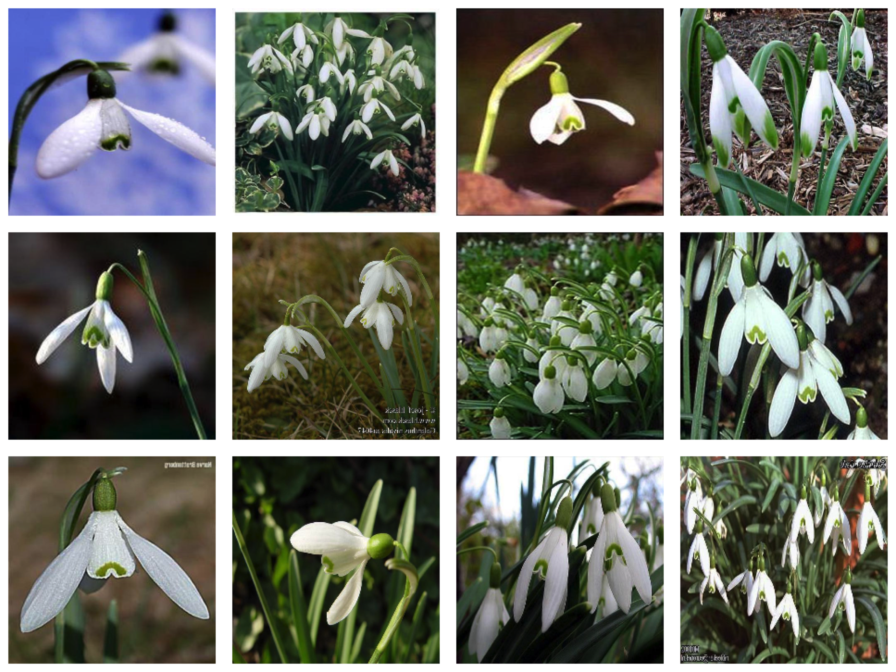
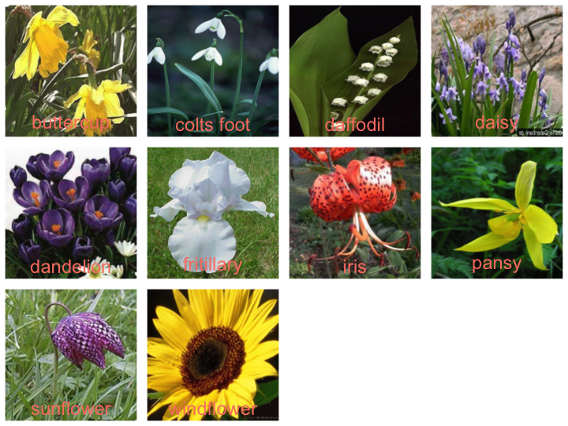
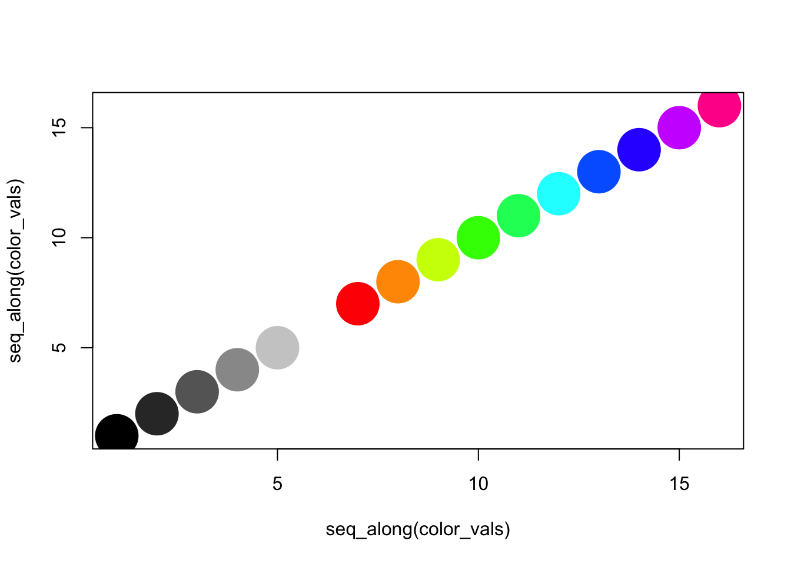
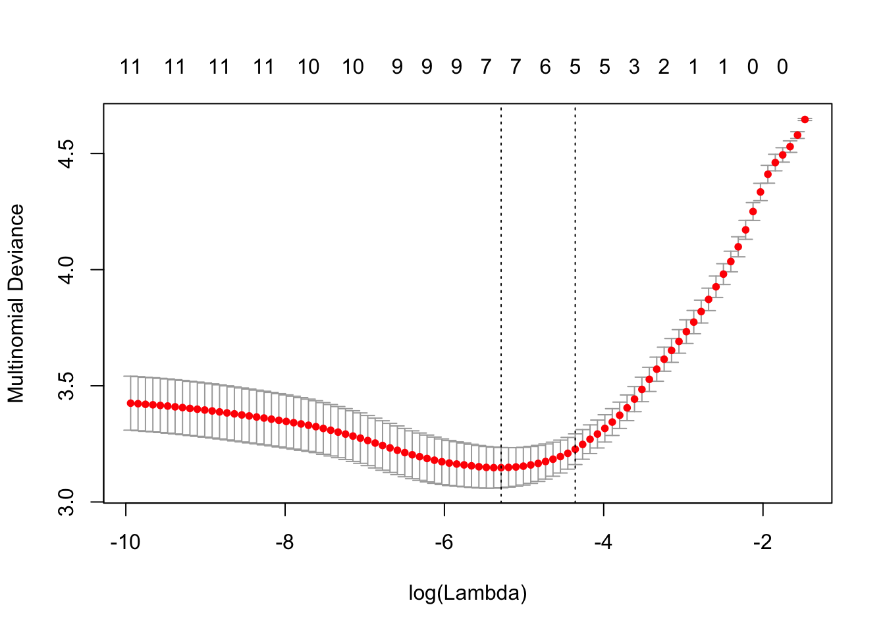
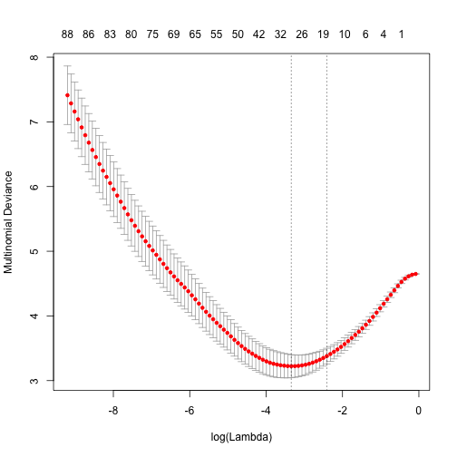
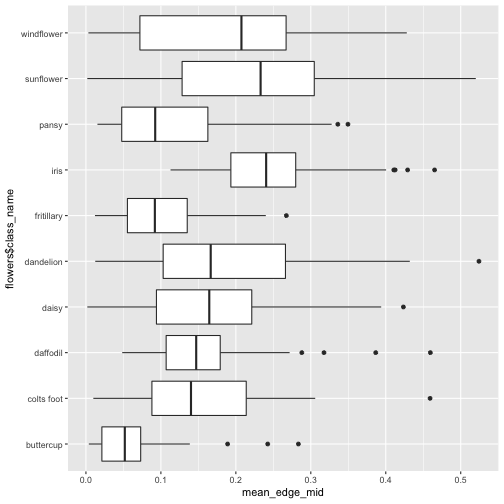
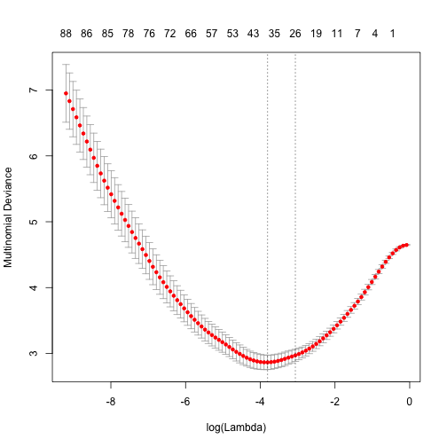


library(readr)
library(dplyr)
library(ggplot2)
library(methods)



flowers <- read_csv("~/files/ml_data/flowers17.csv")
X <- read_rds("~/files/ml_data/flowers17_X.rds")
X <- X[flowers$class %in% 1:10,,,]
flowers <- flowers[flowers$class %in% 1:10,]



par(mar = c(0,0,0,0))
par(mfrow = c(3, 4))
for (i in sample(which(flowers$class == 2), 12)) {
  plot(0,0,xlim=c(0,1),ylim=c(0,1),axes= FALSE,type = "n")
  rasterImage(X[i,,,],0,0,1,1)
}



par(mar = c(0,0,0,0))
par(mfrow = c(3, 4))
for (i in 1:10) {
  plot(0,0,xlim=c(0,1),ylim=c(0,1),axes= FALSE,type = "n")
  i <- sample(which(flowers$class == i), 1)
  rasterImage(X[i,,,],0,0,1,1)
  text(0.5, 0.1, flowers$class_name[i], cex = 3, col = "salmon")
}



i <- 3
red <- as.numeric(X[i,,,1])
green <- as.numeric(X[i,,,2])
blue <- as.numeric(X[i,,,3])
hsv <- t(rgb2hsv(red, green, blue, maxColorValue = 1))
head(hsv)



##              h         s         v
## [1,] 0.3958333 0.4062571 0.1544468
## [2,] 0.3958333 0.4407280 0.1423669
## [3,] 0.3958333 0.4464300 0.1405486
## [4,] 0.3958333 0.4406196 0.1424020
## [5,] 0.3958333 0.4169866 0.1504727
## [6,] 0.3958333 0.4102564 0.1529412



color_vals <- c(hsv(1, 0, seq(0, 1, by = 0.2)),
                hsv(seq(0, 0.9, by = 0.1), 1, 1))
plot(seq_along(color_vals), seq_along(color_vals),
     col = color_vals, pch = 19, cex = 5)



color <- rep("#000000", nrow(hsv))

index <- which(hsv[,2] < 0.2)
color[index] <- hsv(1, 0, round(hsv[index,2] * 5) / 5)

index <- which(hsv[,2] > 0.2 & hsv[,3] > 0.2)
color[index] <- hsv(round(hsv[index,1],1), 1, 1)

table(factor(color, levels = color_vals))



##
## #000000 #333333 #666666 #999999 #CCCCCC #FFFFFF #FF0000 #FF9900 #CCFF00
##   42292    2560       0       0       0       0       0     169    2868
## #33FF00 #00FF66 #00FFFF #0066FF #3300FF #CC00FF #FF0099
##    1540     418     326       3       0       0       0



X_hsv <- matrix(0, ncol = length(color_vals),
                   nrow = nrow(flowers))
for (i in seq_len(nrow(flowers))) {
  red <- as.numeric(X[i,,,1])
  green <- as.numeric(X[i,,,2])
  blue <- as.numeric(X[i,,,3])
  hsv <- t(rgb2hsv(red, green, blue, maxColorValue = 1))

  color <- rep("#000000", nrow(hsv))

  index <- which(hsv[,2] < 0.2)
  color[index] <- hsv(1, 0, round(hsv[index,2] * 5) / 5)

  index <- which(hsv[,2] > 0.2 & hsv[,3] > 0.2)
  color[index] <- hsv(round(hsv[index,1],1), 1, 1)

  X_hsv[i,] <- table(factor(color, levels = color_vals))
}



y <- flowers$class

X_train <- X_hsv[flowers$train_id == "train",]
X_valid <- X_hsv[flowers$train_id == "valid",]
y_train <- y[flowers$train_id == "train"]
y_valid <- y[flowers$train_id == "valid"]



library(glmnet)
model <- cv.glmnet(X_train, y_train, family = "multinomial")
plot(model)



pred <- as.numeric(predict(model, newx = X_hsv,
                           type = "class"))

tapply(pred == y, flowers$train_id, mean)



##  train  valid
## 0.4575 0.3700



table(pred[flowers$train_id == "valid"],
      y[flowers$train_id == "valid"])



##
##       1  2  3  4  5  6  7  8  9 10
##   1   1  0  0  0  0  0  2  0  0  2
##   2   5  7  1  1  3  1  3  8  2  1
##   3   5  7 16  4  0  3  2  4  2  0
##   4   1  0  0  3  1  7  0  0  1  0
##   5   0  0  1  3 11  2  0  1  0  0
##   6   1  1  1  6  0  0  1  1  1  0
##   7   2  1  0  0  2  1  8  1  3  0
##   8   2  2  0  0  0  3  4  1  0  1
##   9   0  0  0  1  1  1  0  0 11  0
##   10  3  2  1  2  2  2  0  4  0 16


## More colors


color_vals <- c(hsv(1, 0, seq(0, 1, by = 0.2)),
                hsv(seq(0, 0.9, by = 0.01), 1, 1))



X_hsv <- matrix(0, ncol = length(color_vals),
                   nrow = nrow(flowers))
for (i in seq_len(nrow(flowers))) {
  red <- as.numeric(X[i,,,1])
  green <- as.numeric(X[i,,,2])
  blue <- as.numeric(X[i,,,3])
  hsv <- t(rgb2hsv(red, green, blue, maxColorValue = 1))

  color <- rep("#000000", nrow(hsv))

  index <- which(hsv[,2] < 0.2)
  color[index] <- hsv(1, 0, round(hsv[index,2] * 5) / 5)

  index <- which(hsv[,2] > 0.2 & hsv[,3] > 0.2)
  color[index] <- hsv(round(hsv[index,1], 2), 1, 1)

  X_hsv[i,] <- table(factor(color, levels = color_vals))
}



y <- flowers$class

X_train <- X_hsv[flowers$train_id == "train",]
X_valid <- X_hsv[flowers$train_id == "valid",]
y_train <- y[flowers$train_id == "train"]
y_valid <- y[flowers$train_id == "valid"]



library(glmnet)
model <- cv.glmnet(X_train, y_train, family = "multinomial",
                   alpha = 0.2)
plot(model)



pred <- as.numeric(predict(model, newx = X_hsv,
                           type = "class"))

tapply(pred == y, flowers$train_id, mean)



##  train  valid
## 0.5375 0.4000



table(pred[flowers$train_id == "valid"],
      y[flowers$train_id == "valid"])



##
##       1  2  3  4  5  6  7  8  9 10
##   1   8  0  0  0  0  1  0  1  1  7
##   2   2  9  3  1  4  3  3  7  2  1
##   3   3  6 15  4  0  2  3  4  1  1
##   4   0  0  0  4  1  3  0  0  1  0
##   5   0  0  1  2 10  1  0  0  0  0
##   6   0  2  0  5  0  3  3  2  1  0
##   7   4  2  1  0  2  1  8  2  2  0
##   8   3  0  0  1  0  2  1  1  1  0
##   9   0  0  0  1  1  1  1  0 11  0
##   10  0  1  0  2  2  3  1  3  0 11


## Texture


i <- 8
bw <- (X[i,,,1] + X[i,,,2] + X[i,,,3]) / 3
plot(0,0,xlim=c(0,1),ylim=c(0,1),axes= FALSE,type = "n")
rasterImage(bw,0,0,1,1)



edge <- abs(bw[-1,-1] - bw[-nrow(bw),-ncol(bw)])
plot(0,0,xlim=c(0,1),ylim=c(0,1),axes= FALSE,type = "n")
rasterImage(edge,0,0,1,1)



mean_edge <- rep(0, nrow(flowers))
for (i in seq_len(nrow(flowers))) {
  bw <- (X[i,,,1] + X[i,,,2] + X[i,,,3]) / 3
  edge <- abs(bw[-1,-1] - bw[-nrow(bw),-ncol(bw)])
  mean_edge[i] <- mean(edge > 0.1)
}



qplot(flowers$class_name, mean_edge, geom = "blank") +
  geom_boxplot() +
  coord_flip()



mean_edge_mid <- rep(0, nrow(flowers))
for (i in seq_len(nrow(flowers))) {
  bw <- (X[i,,,1] + X[i,,,2] + X[i,,,3]) / 3
  edge <- abs(bw[-1,-1] - bw[-nrow(bw),-ncol(bw)])
  mean_edge_mid[i] <- mean(edge[75:148,75:148] > 0.1)
}



qplot(flowers$class_name, mean_edge_mid, geom = "blank") +
  geom_boxplot() +
  coord_flip()



X_edge <- cbind(X_hsv, mean_edge, mean_edge_mid)
y <- flowers$class

X_train <- X_edge[flowers$train_id == "train",]
X_valid <- X_edge[flowers$train_id == "valid",]
y_train <- y[flowers$train_id == "train"]
y_valid <- y[flowers$train_id == "valid"]



library(glmnet)
model <- cv.glmnet(X_train, y_train, family = "multinomial",
                   alpha = 0.2)
plot(model)



pred <- as.numeric(predict(model, newx = X_edge,
                           type = "class"))

tapply(pred == y, flowers$train_id, mean)



##  train  valid
## 0.6575 0.4600



table(pred[flowers$train_id == "valid"],
      y[flowers$train_id == "valid"])



##
##       1  2  3  4  5  6  7  8  9 10
##   1   8  0  0  0  0  3  0  0  0  4
##   2   4  8  2  1  1  2  2  5  1  0
##   3   0  5 16  4  0  2  4  2  1  1
##   4   0  0  0  5  1  3  0  0  1  0
##   5   0  2  0  4 14  2  1  3  0  0
##   6   2  1  0  1  0  3  0  2  2  0
##   7   3  2  1  0  1  0 11  2  2  0
##   8   3  1  0  0  0  3  0  2  2  1
##   9   0  0  0  3  1  1  1  0 11  0
##   10  0  1  1  2  2  1  1  4  0 14


