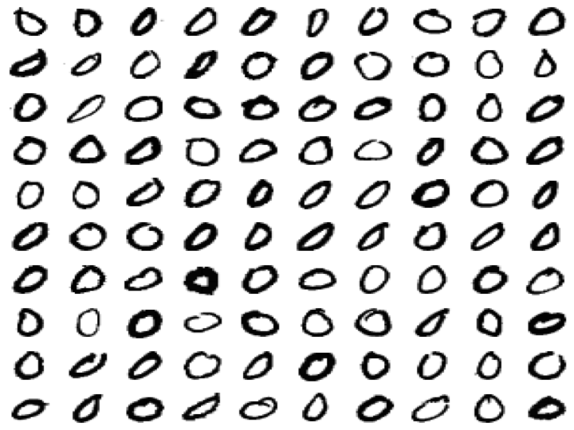
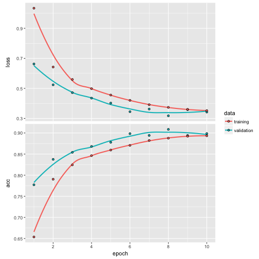
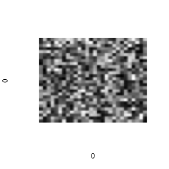


library(readr)
library(ggplot2)
library(dplyr)
library(methods)
library(keras)



mnist <- read_csv("~/files/ml_data/mnist10.csv")
X <- read_rds("~/files/ml_data/mnist10_X.rds")



dim(X)



## [1] 70000    28    28



par(mar = c(0,0,0,0))
par(mfrow = c(10, 10))
for (i in sample(which(mnist$class == 0), 100)) {
  plot(0,0,xlim=c(0,1),ylim=c(0,1),axes= FALSE,type = "n")
  rasterImage(X[i,,],0,0,1,1)
}



y <- mnist$class

X_train <- X[mnist$train_id == "train",,]
y_train <- to_categorical(y[mnist$train_id == "train"], num_classes = 10)



model <- keras_model_sequential()
model %>%
  layer_reshape(target_shape = c(28^2), input_shape = c(28, 28)) %>%
  layer_dense(units = 20) %>%
  layer_activation(activation = "relu") %>%
  layer_dense(units = 20) %>%
  layer_activation(activation = "relu") %>%
  layer_dense(units = 10) %>%
  layer_activation(activation = "softmax")

model %>% compile(loss = 'categorical_crossentropy',
                  optimizer = optimizer_rmsprop(),
                  metrics = c('accuracy'))

model



## Model
## ___________________________________________________________________________
## Layer (type)                     Output Shape                  Param #     
## ===========================================================================
## reshape_1 (Reshape)              (None, 784)                   0           
## ___________________________________________________________________________
## dense_1 (Dense)                  (None, 20)                    15700       
## ___________________________________________________________________________
## activation_1 (Activation)        (None, 20)                    0           
## ___________________________________________________________________________
## dense_2 (Dense)                  (None, 20)                    420         
## ___________________________________________________________________________
## activation_2 (Activation)        (None, 20)                    0           
## ___________________________________________________________________________
## dense_3 (Dense)                  (None, 10)                    210         
## ___________________________________________________________________________
## activation_3 (Activation)        (None, 10)                    0           
## ===========================================================================
## Total params: 16,330
## Trainable params: 16,330
## Non-trainable params: 0
## ___________________________________________________________________________



history <- model %>%
  fit(X_train, y_train, epochs = 10, validation_split = 0.2)
plot(history)



y_pred <- predict_classes(model, X)
table(y[mnist$train_id == "train"], y_pred[mnist$train_id == "train"])



##    
##        0    1    2    3    4    5    6    7    8    9
##   0 5509    0   26    5    6  115   57   37  122   46
##   1    0 6551   16   18    9   30    3   21   80   14
##   2   57  147 4937   71   95   55  164   75  294   63
##   3    8  193  154 4757    8  389   17  102  298  205
##   4    9   17   15    2 5420    9   50    5   23  292
##   5   37   51   31  126   40 4606   67   40  267  156
##   6   31   19   15    0  137  123 5546    0   46    1
##   7    8   39   32   11   25   20    0 5654   16  460
##   8    7  146   27   27   37  126   30   16 5281  154
##   9   30   11    6   17  316   12    1  113   57 5386



par(mar = c(0,0,0,0))
par(mfrow = c(10, 10))
for (i in sample(which(y_pred != y), 100)) {
  plot(0,0,xlim=c(0,1),ylim=c(0,1),axes= FALSE,type = "n")
  rasterImage(X[i,,],0,0,1,1)
  text(0.1,0.1,y[i],col="blue", cex = 3)
  text(0.9,0.1,y_pred[i],col="red", cex = 3)
  box()
}


## Visualize weights


layer <- get_layer(model, index = 2)
dim(layer$get_weights()[[1]])



## [1] 784  20



dim(layer$get_weights()[[2]])



## [1] 20



im <- matrix(layer$get_weights()[[1]], nrow = 28, ncol = 28)
im <- abs(im) / max(abs(im))
plot(0,0,xlim=c(0,1),ylim=c(0,1),axes= FALSE,type = "n")
rasterImage(im,0,0,1,1)


## Larger model


model <- keras_model_sequential()
model %>%
  layer_reshape(target_shape = c(28^2), input_shape = c(28, 28)) %>%
  layer_dense(units = 128, kernel_initializer = "glorot_normal") %>%
  layer_activation(activation = "relu") %>%
  layer_dropout(rate = 0.5) %>%

  layer_dense(units = 512, kernel_initializer = "glorot_normal",
              kernel_regularizer = regularizer_l2(0.2)) %>%
  layer_activation(activation = "relu") %>%
  layer_dropout(rate = 0.5) %>%

  layer_dense(units = 10) %>%
  layer_activation(activation = "softmax")

model %>% compile(loss = 'categorical_crossentropy',
                  optimizer = optimizer_rmsprop(),
                  metrics = c('accuracy'))

model



## Model
## ___________________________________________________________________________
## Layer (type)                     Output Shape                  Param #     
## ===========================================================================
## reshape_2 (Reshape)              (None, 784)                   0           
## ___________________________________________________________________________
## dense_4 (Dense)                  (None, 128)                   100480      
## ___________________________________________________________________________
## activation_4 (Activation)        (None, 128)                   0           
## ___________________________________________________________________________
## dropout_1 (Dropout)              (None, 128)                   0           
## ___________________________________________________________________________
## dense_5 (Dense)                  (None, 512)                   66048       
## ___________________________________________________________________________
## activation_5 (Activation)        (None, 512)                   0           
## ___________________________________________________________________________
## dropout_2 (Dropout)              (None, 512)                   0           
## ___________________________________________________________________________
## dense_6 (Dense)                  (None, 10)                    5130        
## ___________________________________________________________________________
## activation_6 (Activation)        (None, 10)                    0           
## ===========================================================================
## Total params: 171,658
## Trainable params: 171,658
## Non-trainable params: 0
## ___________________________________________________________________________



history <- model %>%
  fit(X_train, y_train, epochs = 10,
      validation_split = 0.1)
plot(history)


Why is the training accuracy lower than the validation accuracy, particularly
for the first few epochs?
