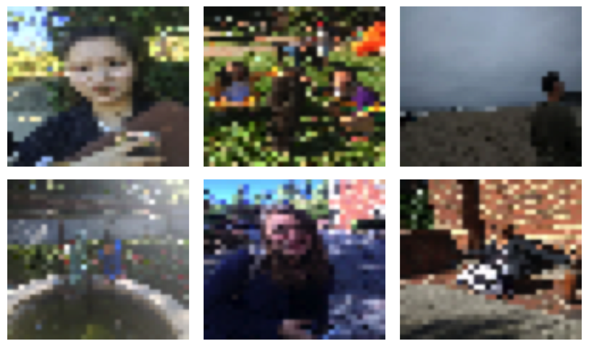
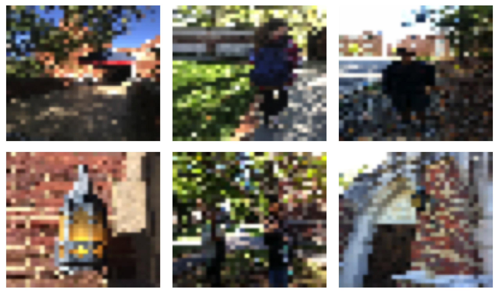
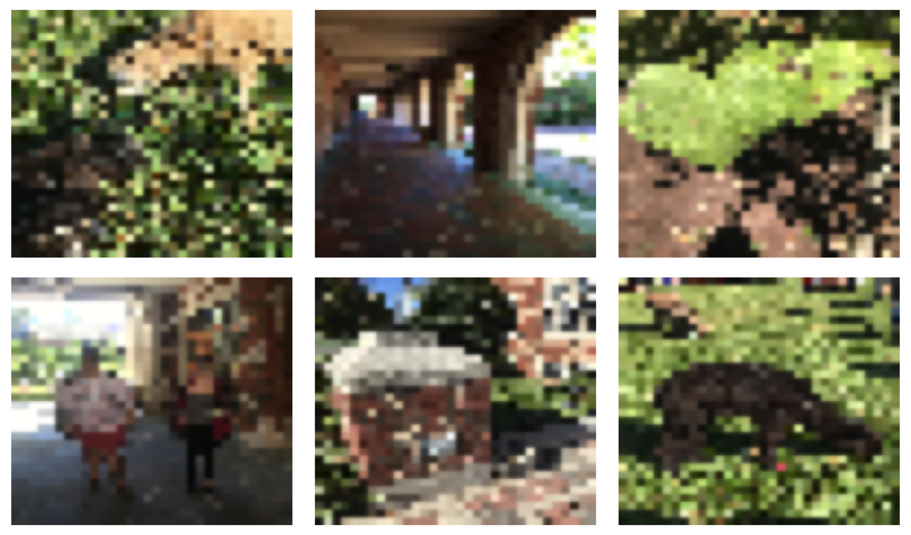
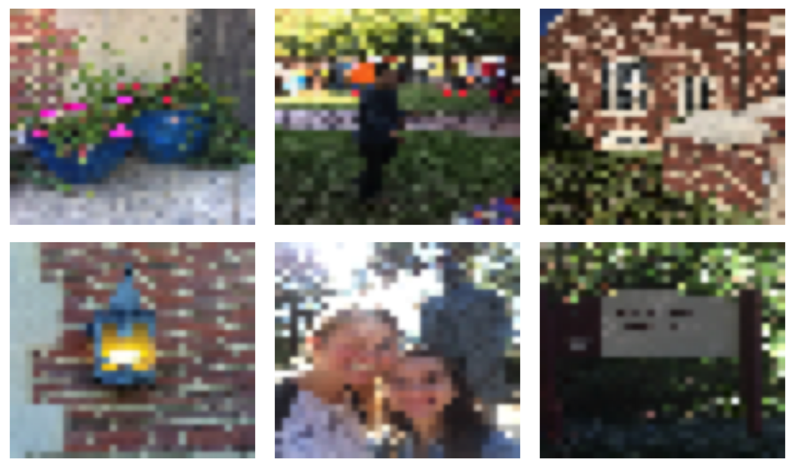
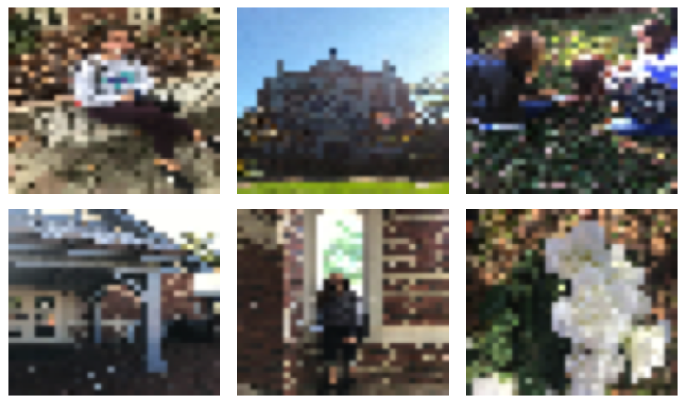
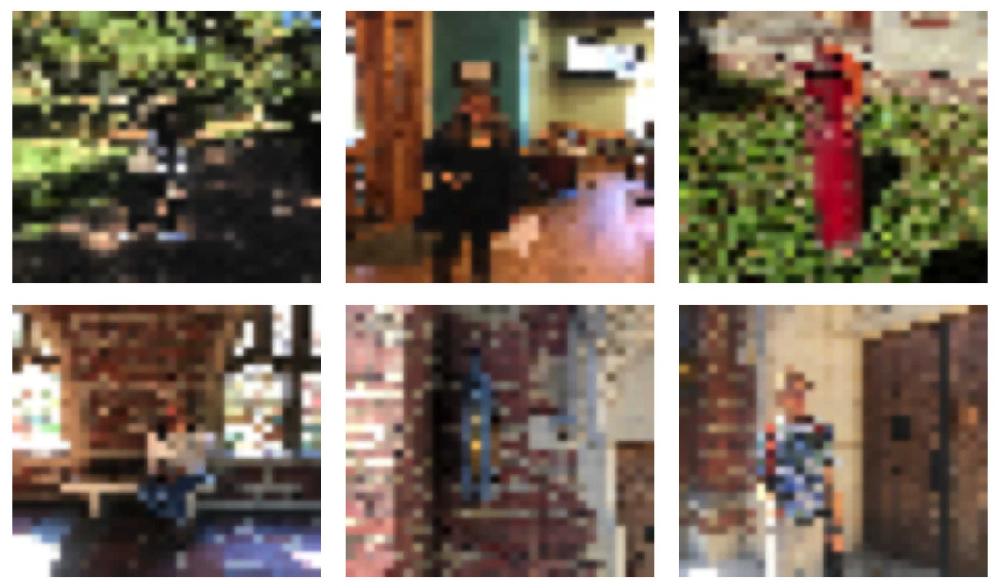
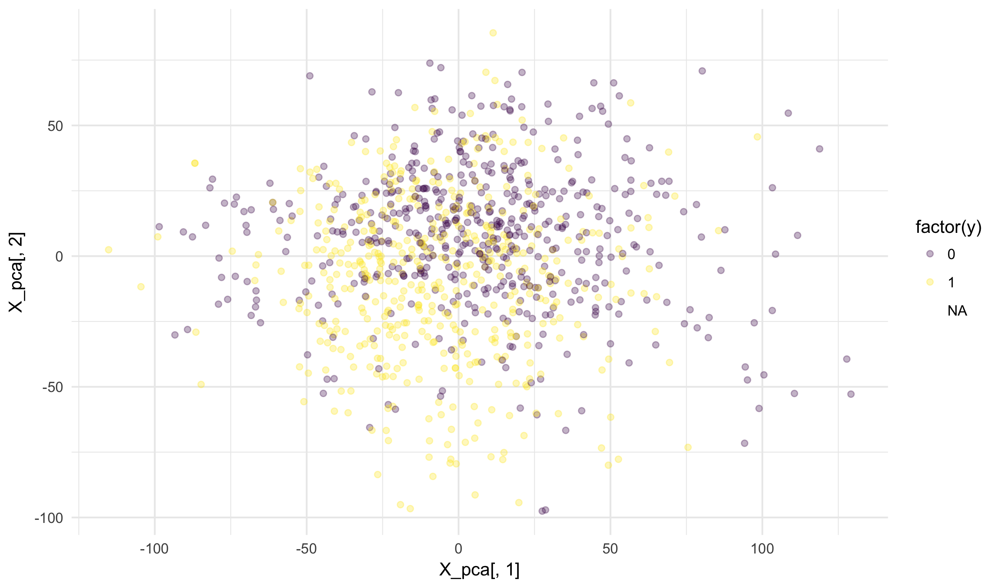


library(readr)
library(dplyr)



## Warning: package 'dplyr' was built under R version 3.4.2



library(ggplot2)
library(stringi)


## Image data

Today we begin our study of image data. We will spend about
two weeks working with several image datasets, building up to
state-of-art methods such as convolutional neural networks.

Image data is similar in many ways to text data. Both are
relatively unstructured and we generally need to perform
some sort of feature extraction in order to do predictive
modelling. Image data is stored (or at least can be represented)
in a numeric format giving the pixel intensities of the file.
Because of this is may seem easier than text data where we
do not even start with numbers. By most measures this is not
the case as images have many more difficulties that outweight
this one benefit.

One difficulty of image data is that the files become very
large. You will see that the images we work with are fairly
low resolution and yet they still take many gigabyte for just
a few thousand images.

My original draft of notes dove head-first into some high
level image analysis. I took a step back and decided it would
be beneficial to everyone to start with a gentle introduction
that shows how to work with image data. As such, note that
like the last class much of today's notes are for your general
knowledge and not strictly required for completing the labs.

## Stat395 Photos

### Images to numbers and back again

You all were nice enough to run around outside last week to
take some photos for class. Let's not let those go to waste!
The first step in working with the images is to read each
image into R. There are few different functions for doing
this. To start, I will use the `readJPEG` function from the
**jpeg** library. We will start with a single example:


library(jpeg)
img <- readJPEG("~/gd/ml_data_raw/stat395_images/heatheremcd/outdoor_people/IMG_7555.JPG")


The data is stored as an array. This is a generalization of
a matrix beyond two dimensions. We can think of the array as
storing three matricies of the same size, with one column per
column of pixels, one row per row of pixels, with the red,
green, and blue intensities storied as their own tables.


class(img)



## [1] "array"



dim(img)



## [1] 3024 4032    3



img[1:5,1:5,]



## , , 1
## 
##           [,1]      [,2]      [,3]      [,4]      [,5]
## [1,] 0.3176471 0.3372549 0.2901961 0.3019608 0.3215686
## [2,] 0.4666667 0.4509804 0.4509804 0.3764706 0.3176471
## [3,] 0.6470588 0.6470588 0.6549020 0.5254902 0.3254902
## [4,] 0.8156863 0.7176471 0.6705882 0.6509804 0.4862745
## [5,] 0.8392157 0.8000000 0.7137255 0.6509804 0.6156863
## 
## , , 2
## 
##           [,1]      [,2]      [,3]      [,4]      [,5]
## [1,] 0.1960784 0.2156863 0.1764706 0.2000000 0.2313725
## [2,] 0.3450980 0.3294118 0.3372549 0.2705882 0.2274510
## [3,] 0.5294118 0.5294118 0.5450980 0.4235294 0.2392157
## [4,] 0.6980392 0.6000000 0.5647059 0.5490196 0.3921569
## [5,] 0.7254902 0.6862745 0.6078431 0.5529412 0.5215686
## 
## , , 3
## 
##           [,1]      [,2]      [,3]      [,4]      [,5]
## [1,] 0.1254902 0.1450980 0.1137255 0.1333333 0.1686275
## [2,] 0.2666667 0.2509804 0.2666667 0.1960784 0.1568627
## [3,] 0.4352941 0.4352941 0.4588235 0.3333333 0.1568627
## [4,] 0.5882353 0.4901961 0.4588235 0.4431373 0.2980392
## [5,] 0.6000000 0.5607843 0.4901961 0.4313725 0.4117647


The numbers are stored as a value between 0 and 1. Note that
if all the color channels are 1 the color is "white" and if
all pixels are 0 the color is "black". We can do some simple
math here to see which of the colors is the most dominant in
this photograph


cat(sprintf("red = %f, green = %f, blue = %f",
            mean(img[,,1]), mean(img[,,2]), mean(img[,,3])))



## red = 0.482885, green = 0.437942, blue = 0.343427


Red is the most active color, followed closely by green and
then finally by blue. What we actually want to do though is
see the image itself. This block of code plots it in R while
preserving the correct aspect ratio.


par(mar = rep(0, 4L))
plot(0,0,xlim=c(0,1),ylim=c(0,1),axes= FALSE,type = "n",
     asp = nrow(img) / ncol(img))
rasterImage(img,0,0,1,1)


I choose this in part because I like that is a photo of someone
taking a photo of someone else. We can see that the red comes from
the brick in the photo and the green from the trees. The blue,
which is not as prominent, mostly comes from the sky.

### Metadata

This all seems surprisingly easy. Let's try another example.


library(jpeg)
img <- readJPEG("~/gd/ml_data_raw/stat395_images/cadecardenas/outdoor_people/IMG_4795.JPG")
par(mar = rep(0, 4L))
plot(0,0,xlim=c(0,1),ylim=c(0,1),axes= FALSE,type = "n",
     asp = nrow(img) / ncol(img))
rasterImage(img,0,0,1,1)


Oh no! The image is flipped on its side. This is because many
cell phones do not actually flip the digital image directly.
Instead, they save the original image and attatch some metadata
that indicates the orientation of the image.

We now have two additional steps: we need to read this metadata
and then rotate the image. We will do this by way of two different
packages. The **exif** package returns


library(exif)
fpath <- "~/gd/ml_data_raw/stat395_images/cadecardenas/outdoor_people/IMG_4795.JPG"
str(read_exif(fpath))



## 'data.frame':	1 obs. of  31 variables:
##  $ make                 : chr "Apple"
##  $ model                : chr "iPhone 7"
##  $ software             : chr "10.2.1"
##  $ bits_per_sample      : int 0
##  $ image_width          : int 4032
##  $ image_height         : int 3024
##  $ description          : chr ""
##  $ orientation          : int 6
##  $ copyright            : chr ""
##  $ timestamp            : chr "2017:10:19 13:41:26"
##  $ origin_timestamp     : chr "2017:10:19 13:41:26"
##  $ digitised_timestamp  : chr "2017:10:19 13:41:26"
##  $ subsecond_timestamp  : chr "670"
##  $ exposure_time        : num 163
##  $ f_stop               : num 1.8
##  $ iso_speed            : int 20
##  $ subject_distance     : chr ""
##  $ exposure_bias        : num 0
##  $ used_flash           : logi TRUE
##  $ metering             : int 5
##  $ focal_length         : num 3.99
##  $ focal_length_35mm    : int 28
##  $ latitude             : num 0
##  $ longitude            : num 0
##  $ altitude             : num 0
##  $ lens_min_focal_length: num 3.99
##  $ lens_max_focal_length: num 3.99
##  $ lens_min_f_stop      : num 1.8
##  $ lens_max_f_stop      : num 1.8
##  $ lens_make            : chr "Apple"
##  $ lens_model           : chr "iPhone 7 back camera 3.99mm f/1.8"


There is a lot of information here about the phone and the photograph.
We even see information such as whether the flash was used the digital
"speed" of the sensor. Importantly, there is also a number called
orientation. It turns out that "6" means we need to rotate the image
90 degrees ("3" means 180 and "8" is 270). Other numbers indicate
forms of mirror images that did not appear in this corpus of images.

In order to easily rotate the image, we will use the **EBImage**
package to load the image. We can then use the `rotate` function
that operates on an EBImage object to rotate the image.


library(EBImage)
img <- EBImage::readImage(fpath)
orientation <- read_exif(fpath)$orientation
orientation[orientation <= 0] <- 0
rotation <- c(0, 0, 180, 0, 0, 90, 0, 270)[orientation]
img <- rotate(img, angle = rotation)


Now, the image looks great but the file is very large. Trying to
load a few thousand of these will not be feasible if we want to
store everything in memory. Instead, we will downsample to an
image that is only 224-by-244 pixels. This also stretches the
image, but for our purpose here that should not be a problem.


img <- resize(img, w = 224, h = 224)
plot(img)


While grainy, we can still make out the basic subjects of the
image. Most importantly, it is still obvious that the image
has two people in it and it was taken outdoors.

It will also be useful to have an even smaller version of the
image. This is just a thumbnail, but still contains a lot of
information that we can use for detecting whether an image
was taken inside or outside.


img <- resize(img, w = 32, h = 32)
plot(img)


Basically, this is all I did to the entire dataset, while
also taking care to construct a response variable, training
flags, and the observation ids.

### Fun with exif

There are several interesting things that we can do with the
exif metadata attached to your images. You may even be
surprised (and a little worried) about what I can do, actually.
Let's grab the exif data for all of the images that you uploaded.
A few of the images have invalid exif data, so the following
block of code removes these.


fpath <- "~/gd/ml_data_raw/stat395_images"
f <- dir(fpath, recursive = TRUE, full.names = TRUE)
df <- lapply(f, function(v) {u = NULL; try({u <- exif::read_exif(v)}); return(u)})
df <- Reduce(rbind, Filter(function(v) length(v) != 0, df))
df <- as_data_frame(df)



df



## # A tibble: 1,371 x 31
##     make    model   software bits_per_sample image_width image_height
##    <chr>    <chr>      <chr>           <int>       <int>        <int>
##  1 Apple iPhone 6 Photos 1.5               0        2448         3264
##  2 Apple iPhone 6 Photos 1.5               0        2448         3264
##  3 Apple iPhone 6 Photos 1.5               0        2448         3264
##  4 Apple iPhone 6 Photos 1.5               0        2448         3264
##  5 Apple iPhone 6 Photos 1.5               0        3264         2448
##  6 Apple iPhone 6 Photos 1.5               0        2448         3264
##  7 Apple iPhone 6 Photos 1.5               0        2448         3264
##  8 Apple iPhone 6 Photos 1.5               0        2448         3264
##  9 Apple iPhone 6 Photos 1.5               0        2448         3264
## 10 Apple iPhone 6 Photos 1.5               0        2448         3264
## # ... with 1,361 more rows, and 25 more variables: description <chr>,
## #   orientation <int>, copyright <chr>, timestamp <chr>,
## #   origin_timestamp <chr>, digitised_timestamp <chr>,
## #   subsecond_timestamp <chr>, exposure_time <dbl>, f_stop <dbl>,
## #   iso_speed <int>, subject_distance <chr>, exposure_bias <dbl>,
## #   used_flash <lgl>, metering <int>, focal_length <dbl>,
## #   focal_length_35mm <int>, latitude <dbl>, longitude <dbl>,
## #   altitude <dbl>, lens_min_focal_length <dbl>,
## #   lens_max_focal_length <dbl>, lens_min_f_stop <dbl>,
## #   lens_max_f_stop <dbl>, lens_make <chr>, lens_model <chr>


Notice that two of the columns in this dataset are longitude
and latitude. What if we plot these over a map (perhaps trimming
a few outliers)? We can even use the time variable to show when
these photos were taken.


library(ggmap)
df$hour <- as.character(as.numeric(stri_sub(df$timestamp, 12, 13)))
qmplot(longitude, latitude, color = hour,
        data = df[df$latitude > 0 & df$longitude > -78 & df$hour > 10,])


Not all of you have location data turned on, so this is only those
photos with non-missing location data. But still, it is is interesting
how accurate these values seem to be. **Don't worry, I won't be sharing
any geolocation data publically (notice the chunks above call local
files on my computer), I just wanted to illustrate how pervasive this
kind of information is.**

## Classifying Class Data

Now that we know roughly how to turn image data into arrays, let's
load the entire corpus from class. The data is split into two
parts, much like the annotated data you made for today's class. The
first is a small data frame that gives just the metadata:


f17 <- read_csv("https://statsmaths.github.io/ml_data/f17_photos_2.csv")
f17



## # A tibble: 1,331 x 3
##       obs_id train_id class
##        <chr>    <chr> <int>
##  1 id_000001    train     0
##  2 id_000002    valid     0
##  3 id_000003    train     1
##  4 id_000004    valid     1
##  5 id_000005     test    NA
##  6 id_000006     test    NA
##  7 id_000007     test    NA
##  8 id_000008    valid     1
##  9 id_000009    train     1
## 10 id_000010    train     0
## # ... with 1,321 more rows


The arrays containing the pixels can be read with the following
code:


x32 <- read_rds("~/gd/ml_data_raw/output_image_data/f17_photos_2_x32.rds")
dim(x32)



## [1] 1331  224  224    3


The dimension of this array gives the number of rows, the width
of the image, the height of the image, and the number of channels
in the image. The channels here refer to the red, green, and blue
values.

Today, we'll start by using the `apply` function to collapse this into
a two-dimensional array. This has one row for each observation and
one column for each pixel value.


X <- t(apply(x32, 1, cbind))
dim(X)



## [1]   1331 150528


Now that we have data in a standard matrix, we can throw this into
an elastic net model.


y <- f17$class

X_train <- X[f17$train_id == "train",]
y_train <- y[f17$train_id == "train"]

library(glmnet)
model <- cv.glmnet(X_train, y_train, family = "binomial", nfolds = 3)
beta <- coef(model, s = model$lambda.1se)
beta[beta[,1] != 0,,drop = FALSE]



## 70 x 1 sparse Matrix of class "dgCMatrix"
##                         1
## (Intercept)  1.7624983289
## V322        -0.1400460533
## V1428       -0.0317215751
## V2796       -0.1486300979
## V4513       -0.0340298853
## V5674       -0.3391068211
## V6357       -0.0326341609
## V11697      -0.0186490045
## V11922      -0.0410129664
## V12370      -0.1822014403
## V15916      -0.1893382250
## V16651      -0.0995767488
## V17495      -0.0292923420
## V17698      -0.2048708667
## V17764      -0.0119738848
## V19120      -0.0328231656
## V19278      -0.1725716512
## V21793      -0.5711896116
## V22231      -0.1125470071
## V22234      -0.0678322561
## V22449      -0.0266923312
## V22463      -0.1395703431
## V22912      -0.1165279887
## V23091      -0.0026090611
## V24275      -0.0163121158
## V24280      -0.0842428623
## V24499      -0.0299246890
## V24895      -0.0886529343
## V25092      -0.1278996061
## V25132      -0.0297981131
## V25134      -0.0342054256
## V26919      -0.0231390218
## V26920      -0.3554758741
## V27584      -0.2202752817
## V27822      -0.0304381354
## V33615      -0.0988189135
## V34093      -0.1500330974
## V35670      -0.0025532790
## V37458      -0.0450074108
## V37486      -0.2957693736
## V38830      -0.0228017869
## V39061      -0.0391742728
## V39957      -0.1897251432
## V41733      -0.1921355156
## V43275      -0.0054960162
## V43502      -0.1129279014
## V44167      -0.4717674855
## V47960      -0.0973559652
## V48408      -0.3330723084
## V94052       0.1127293799
## V94964       0.0557313990
## V102599      0.1745505207
## V104144      0.0303803502
## V105035      0.0638075358
## V105039      0.0524615501
## V116668      0.1091828447
## V116669      0.3746010725
## V118046      0.0727720882
## V118279      0.2133666003
## V118281      0.0015362257
## V118949      0.0999983815
## V119173      0.0009093894
## V120291      0.0620935001
## V120515      0.3742013103
## V121401      0.1809932156
## V122092      0.0277048430
## V127240      0.0656821208
## V132391      0.1239893839
## V144242      0.0309782671
## V145592      0.0914757177


Do you see any patterns in these numbers?

Every value in the first
1000 is negative. There are only two values from 1000-2000, and all
the values in the 3000s are postive. It turns out that the first
1024 (32 * 32) columns are the red channels, the next 1024 are the
green channels, and the final 1024 are the blues. So there are
negative weights on the red channels, very small weights on green,
and positive weights on blue. Does that make sense?

We see that this model is fairly predictive:


pred <- predict(model, newx = X, type = "class")
tapply(pred == y, f17$train_id, mean)



##      test     train     valid 
##        NA 0.8408408 0.7447447


It may help in this case to set the alpha parameter close to zero
so the weights get spread out over more of the photograph. Here we
see how this offers a slight improvement in the validation set.


model <- cv.glmnet(X_train, y_train, family = "binomial", nfolds = 3,
                   alpha = 0.05)
pred <- predict(model, newx = X, type = "class")
tapply(pred == y, f17$train_id, mean)



##      test     train     valid 
##        NA 0.8588589 0.7627628


### Negative Examples

Finding negative examples, validation points that we did not classify
correctly, is an important task in image classification much as it is
with text classification. To look at the negative examples, I will
read in the larger 224x224 images:


x224 <- read_rds("~/gd/ml_data_raw/output_image_data/f17_photos_2_x224.rds")


First, let's plot the examples taken inside but that our algorithm thinks
were taken outside:


par(mfrow = c(2, 3))
id <- which(pred != y & y == 0 & f17$train_id == "valid")
for (i in id) {
  par(mar = rep(0, 4L))
  plot(0,0,xlim=c(0,1),ylim=c(0,1),axes= FALSE,type = "n")
  rasterImage(x224[i,,,],0,0,1,1)
}


Do you notice any interesting patterns here?

Now, let's see outdoor images that were classified as being inside:


par(mfrow = c(2, 3))
id <- which(pred != y & y == 1 & f17$train_id == "valid")
for (i in sample(id)) {
  par(mar = rep(0, 4L))
  plot(0,0,xlim=c(0,1),ylim=c(0,1),axes= FALSE,type = "n")
  rasterImage(x224[i,,,],0,0,1,1)
}


What do many of these images have in them (hint: we have **a lot** of
this at UR).

### Visualization

Notice that we can do a PCA-based visualization of this data much
as we did with the text data in the last class.


library(irlba)
X_pca <- prcomp_irlba(X, n = 2)$x
qplot(X_pca[,1], X_pca[,2], color = factor(y),
      alpha = I(0.3)) +
  viridis::scale_color_viridis(discrete = TRUE) +
  theme_minimal()


The plot shows a pattern differentiating the indoor and outdoor
photographs, but not a particularly clear one. We will look at more
PCA plots next week.

### New Features

Finally, we can construct new meta features by using our knowledge
of how the columns of X are organized. For example, here I will take
the average of the red, green, and blue channels and fit a new model
on just these.


Z <- cbind(apply(X[,1:1024 + 1024 * 0], 1, mean),
            apply(X[,1:1024 + 1024 * 1], 1, mean),
            apply(X[,1:1024 + 1024 * 2], 1, mean))

Z_train <- Z[f17$train_id == "train",]

library(glmnet)
model <- cv.glmnet(Z_train, y_train, family = "binomial", nfolds = 3)
beta <- coef(model, s = model$lambda.1se)
beta



## 4 x 1 sparse Matrix of class "dgCMatrix"
##                       1
## (Intercept)  0.79809140
## V1          -1.93068124
## V2           .         
## V3          -0.06123639


Notice that the final model is almost as good as the one fit on the
entire dataset. As a benefit, it does not over-fit the training data.


pred <- predict(model, newx = Z, type = "class")
tapply(pred == y, f17$train_id, mean)



##      test     train     valid 
##        NA 0.5945946 0.6396396


Your assignment for the next lab is to work with this data and to try
to find a creative way to do prediction. At a minimum, at least show
that you can apply and understand what I did in class today.

