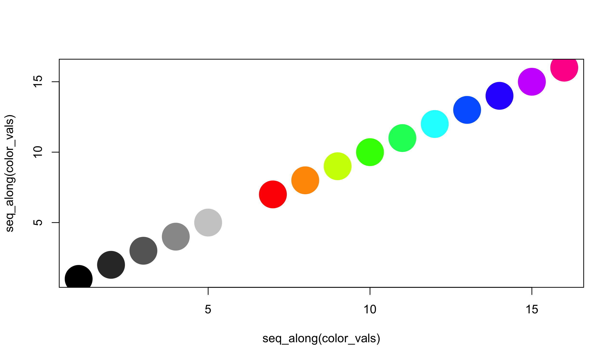


library(readr)
library(dplyr)
library(ggplot2)
library(methods)



flowers <- read_csv("~/files/ml_data/flowers_17.csv")
X <- read_rds("~/files/ml_data/flowers_17_X.rds")



## Warning in gzfile(file, "rb"): cannot open compressed file '/Users/
## taylor/files/ml_data/flowers_17_X.rds', probable reason 'No such file or
## directory'



## Error in gzfile(file, "rb"): cannot open the connection



X <- X[flowers$class %in% 1:10,,,]



## Error in eval(expr, envir, enclos): object 'X' not found



flowers <- flowers[flowers$class %in% 1:10,]



par(mar = c(0,0,0,0))
par(mfrow = c(3, 4))
for (i in sample(which(flowers$class == 2), 12)) {
  plot(0,0,xlim=c(0,1),ylim=c(0,1),axes= FALSE,type = "n")
  rasterImage(X[i,,,],0,0,1,1)
}



## Error in rasterImage(X[i, , , ], 0, 0, 1, 1): object 'X' not found



par(mar = c(0,0,0,0))
par(mfrow = c(3, 4))
for (i in 1:10) {
  plot(0,0,xlim=c(0,1),ylim=c(0,1),axes= FALSE,type = "n")
  i <- sample(which(flowers$class == i), 1)
  rasterImage(X[i,,,],0,0,1,1)
  text(0.5, 0.1, flowers$class_name[i], cex = 3, col = "salmon")
}



## Error in rasterImage(X[i, , , ], 0, 0, 1, 1): object 'X' not found



i <- 3
red <- as.numeric(X[i,,,1])



## Error in eval(expr, envir, enclos): object 'X' not found



green <- as.numeric(X[i,,,2])



## Error in eval(expr, envir, enclos): object 'X' not found



blue <- as.numeric(X[i,,,3])



## Error in eval(expr, envir, enclos): object 'X' not found



hsv <- t(rgb2hsv(red, green, blue, maxColorValue = 1))



## Error in rgb2hsv(red, green, blue, maxColorValue = 1): object 'green' not found



head(hsv)



##                                                             
## 1 function (h = 1, s = 1, v = 1, alpha = 1)                 
## 2 .Call(C_hsv, h, s, v, if (missing(alpha)) NULL else alpha)



color_vals <- c(hsv(1, 0, seq(0, 1, by = 0.2)),
                hsv(seq(0, 0.9, by = 0.1), 1, 1))
plot(seq_along(color_vals), seq_along(color_vals),
     col = color_vals, pch = 19, cex = 5)



color <- rep("#000000", nrow(hsv))



## Error in rep("#000000", nrow(hsv)): invalid 'times' argument



index <- which(hsv[,2] < 0.2)



## Error in hsv[, 2]: object of type 'closure' is not subsettable



color[index] <- hsv(1, 0, round(hsv[index,2] * 5) / 5)



## Error in hsv(1, 0, round(hsv[index, 2] * 5)/5): object 'index' not found



index <- which(hsv[,2] > 0.2 & hsv[,3] > 0.2)



## Error in hsv[, 2]: object of type 'closure' is not subsettable



color[index] <- hsv(round(hsv[index,1],1), 1, 1)



## Error in hsv(round(hsv[index, 1], 1), 1, 1): object 'index' not found



table(factor(color, levels = color_vals))



## Error in factor(color, levels = color_vals): object 'color' not found



X_hsv <- matrix(0, ncol = length(color_vals),
                   nrow = nrow(flowers))
for (i in seq_len(nrow(flowers))) {
  red <- as.numeric(X[i,,,1])
  green <- as.numeric(X[i,,,2])
  blue <- as.numeric(X[i,,,3])
  hsv <- t(rgb2hsv(red, green, blue, maxColorValue = 1))

  color <- rep("#000000", nrow(hsv))

  index <- which(hsv[,2] < 0.2)
  color[index] <- hsv(1, 0, round(hsv[index,2] * 5) / 5)

  index <- which(hsv[,2] > 0.2 & hsv[,3] > 0.2)
  color[index] <- hsv(round(hsv[index,1],1), 1, 1)

  X_hsv[i,] <- table(factor(color, levels = color_vals))
}



## Error: object 'X' not found



y <- flowers$class

X_train <- X_hsv[flowers$train_id == "train",]
X_valid <- X_hsv[flowers$train_id == "valid",]
y_train <- y[flowers$train_id == "train"]
y_valid <- y[flowers$train_id == "valid"]



library(glmnet)
model <- cv.glmnet(X_train, y_train, family = "multinomial")



## Error: from glmnet Fortran code (error code 7777); All used predictors have zero variance



plot(model)



## Error in plot(model): object 'model' not found



pred <- as.numeric(predict(model, newx = X_hsv,
                           type = "class"))



## Error in predict(model, newx = X_hsv, type = "class"): object 'model' not found



tapply(pred == y, flowers$train_id, mean)



## Error in tapply(pred == y, flowers$train_id, mean): object 'pred' not found



table(pred[flowers$train_id == "valid"],
      y[flowers$train_id == "valid"])



## Error in table(pred[flowers$train_id == "valid"], y[flowers$train_id == : object 'pred' not found


## More colors


color_vals <- c(hsv(1, 0, seq(0, 1, by = 0.2)),
                hsv(seq(0, 0.9, by = 0.01), 1, 1))



X_hsv <- matrix(0, ncol = length(color_vals),
                   nrow = nrow(flowers))
for (i in seq_len(nrow(flowers))) {
  red <- as.numeric(X[i,,,1])
  green <- as.numeric(X[i,,,2])
  blue <- as.numeric(X[i,,,3])
  hsv <- t(rgb2hsv(red, green, blue, maxColorValue = 1))

  color <- rep("#000000", nrow(hsv))

  index <- which(hsv[,2] < 0.2)
  color[index] <- hsv(1, 0, round(hsv[index,2] * 5) / 5)

  index <- which(hsv[,2] > 0.2 & hsv[,3] > 0.2)
  color[index] <- hsv(round(hsv[index,1], 2), 1, 1)

  X_hsv[i,] <- table(factor(color, levels = color_vals))
}



## Error: object 'X' not found



y <- flowers$class

X_train <- X_hsv[flowers$train_id == "train",]
X_valid <- X_hsv[flowers$train_id == "valid",]
y_train <- y[flowers$train_id == "train"]
y_valid <- y[flowers$train_id == "valid"]



library(glmnet)
model <- cv.glmnet(X_train, y_train, family = "multinomial",
                   alpha = 0.2)



## Error: from glmnet Fortran code (error code 7777); All used predictors have zero variance



plot(model)



## Error in plot(model): object 'model' not found



pred <- as.numeric(predict(model, newx = X_hsv,
                           type = "class"))



## Error in predict(model, newx = X_hsv, type = "class"): object 'model' not found



tapply(pred == y, flowers$train_id, mean)



## Error in tapply(pred == y, flowers$train_id, mean): object 'pred' not found



table(pred[flowers$train_id == "valid"],
      y[flowers$train_id == "valid"])



## Error in table(pred[flowers$train_id == "valid"], y[flowers$train_id == : object 'pred' not found


## Texture


i <- 8
bw <- (X[i,,,1] + X[i,,,2] + X[i,,,3]) / 3



## Error in eval(expr, envir, enclos): object 'X' not found



plot(0,0,xlim=c(0,1),ylim=c(0,1),axes= FALSE,type = "n")



rasterImage(bw,0,0,1,1)



## Error in rasterImage(bw, 0, 0, 1, 1): object 'bw' not found



edge <- abs(bw[-1,-1] - bw[-nrow(bw),-ncol(bw)])



## Error in eval(expr, envir, enclos): object 'bw' not found



plot(0,0,xlim=c(0,1),ylim=c(0,1),axes= FALSE,type = "n")



rasterImage(edge,0,0,1,1)



## Error in rasterImage(edge, 0, 0, 1, 1): object 'edge' not found



mean_edge <- rep(0, nrow(flowers))
for (i in seq_len(nrow(flowers))) {
  bw <- (X[i,,,1] + X[i,,,2] + X[i,,,3]) / 3
  edge <- abs(bw[-1,-1] - bw[-nrow(bw),-ncol(bw)])
  mean_edge[i] <- mean(edge > 0.1)
}



## Error: object 'X' not found



qplot(flowers$class_name, mean_edge, geom = "blank") +
  geom_boxplot() +
  coord_flip()



mean_edge_mid <- rep(0, nrow(flowers))
for (i in seq_len(nrow(flowers))) {
  bw <- (X[i,,,1] + X[i,,,2] + X[i,,,3]) / 3
  edge <- abs(bw[-1,-1] - bw[-nrow(bw),-ncol(bw)])
  mean_edge_mid[i] <- mean(edge[75:148,75:148] > 0.1)
}



## Error: object 'X' not found



qplot(flowers$class_name, mean_edge_mid, geom = "blank") +
  geom_boxplot() +
  coord_flip()



X_edge <- cbind(X_hsv, mean_edge, mean_edge_mid)
y <- flowers$class

X_train <- X_edge[flowers$train_id == "train",]
X_valid <- X_edge[flowers$train_id == "valid",]
y_train <- y[flowers$train_id == "train"]
y_valid <- y[flowers$train_id == "valid"]



library(glmnet)
model <- cv.glmnet(X_train, y_train, family = "multinomial",
                   alpha = 0.2)



## Error: from glmnet Fortran code (error code 7777); All used predictors have zero variance



plot(model)



## Error in plot(model): object 'model' not found



pred <- as.numeric(predict(model, newx = X_edge,
                           type = "class"))



## Error in predict(model, newx = X_edge, type = "class"): object 'model' not found



tapply(pred == y, flowers$train_id, mean)



## Error in tapply(pred == y, flowers$train_id, mean): object 'pred' not found



table(pred[flowers$train_id == "valid"],
      y[flowers$train_id == "valid"])



## Error in table(pred[flowers$train_id == "valid"], y[flowers$train_id == : object 'pred' not found


