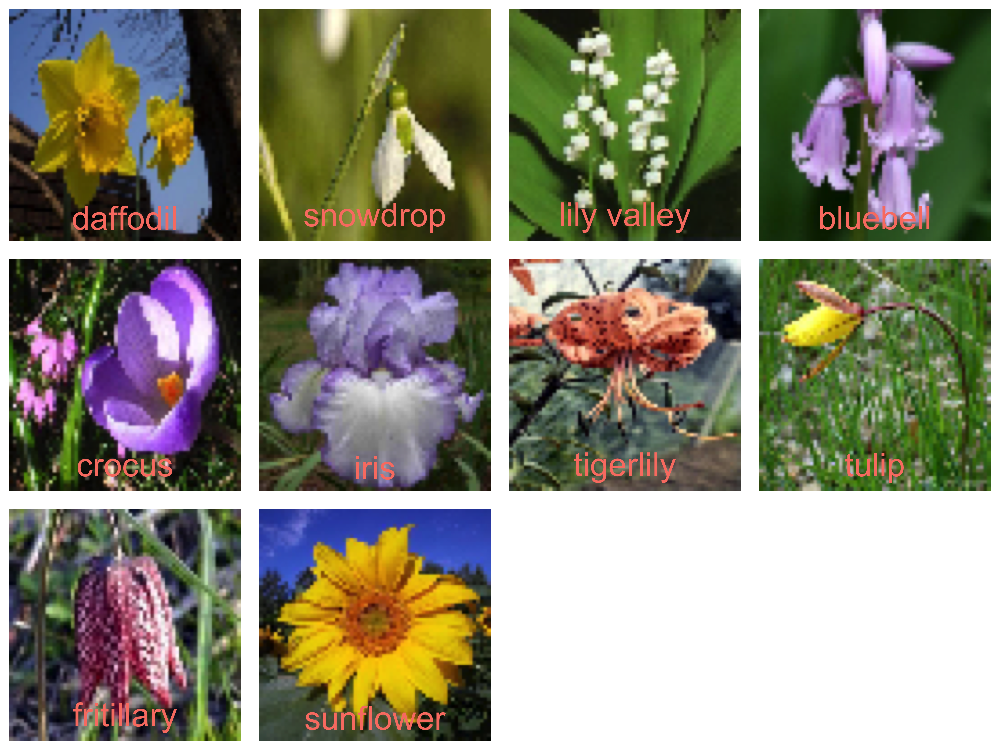
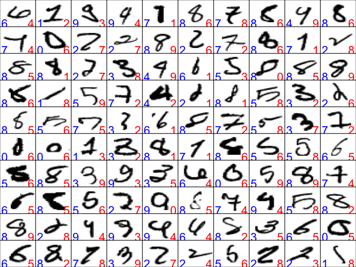
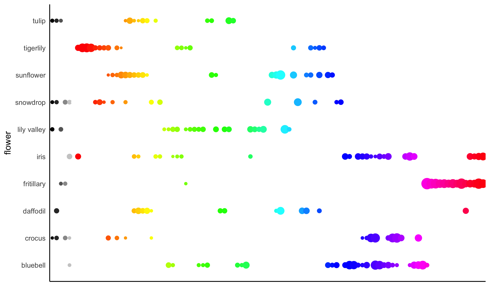
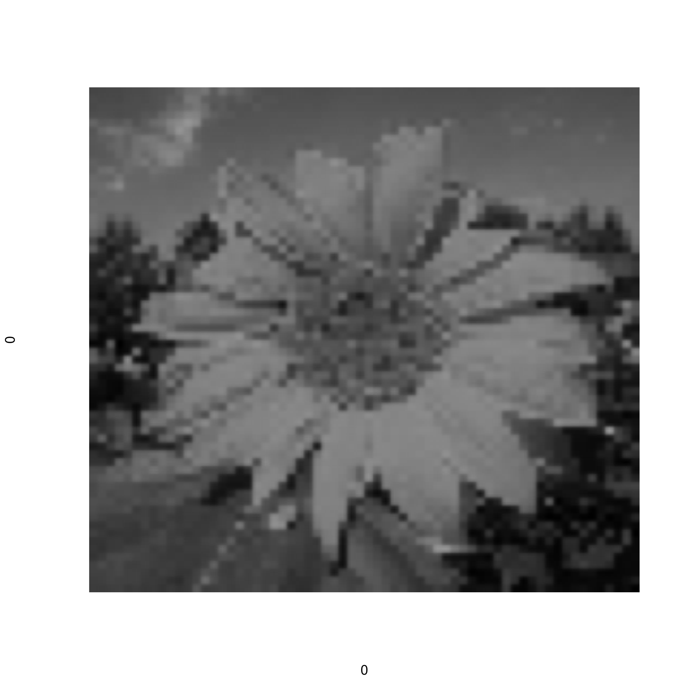
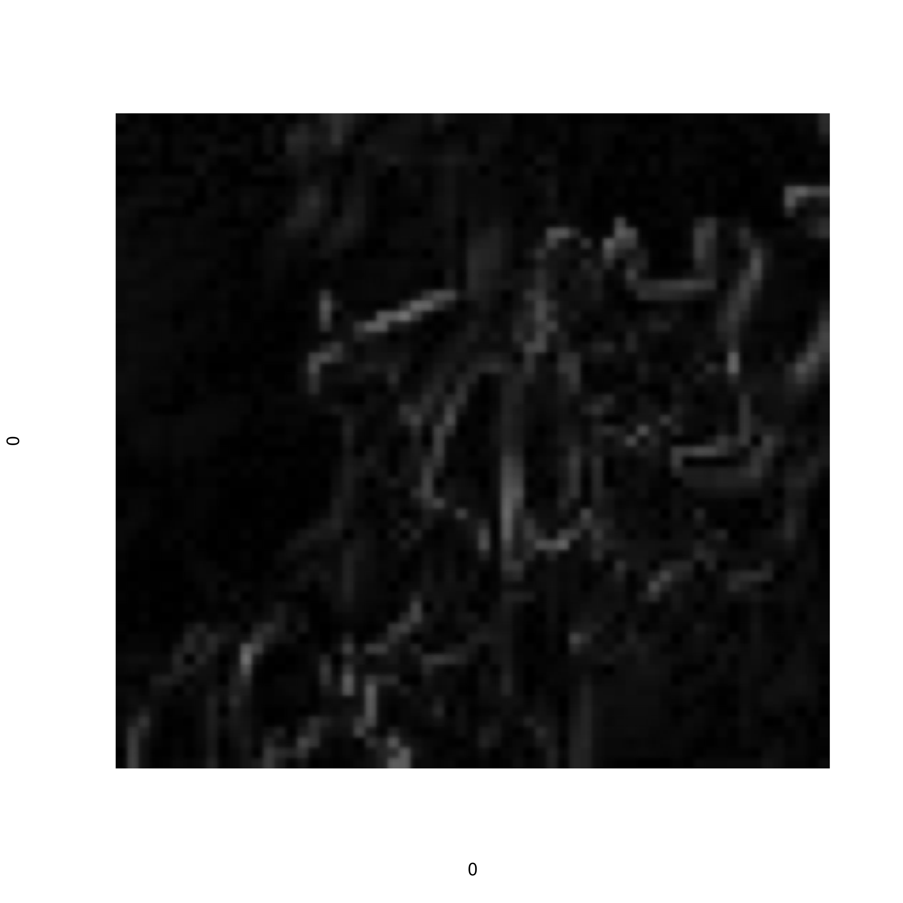
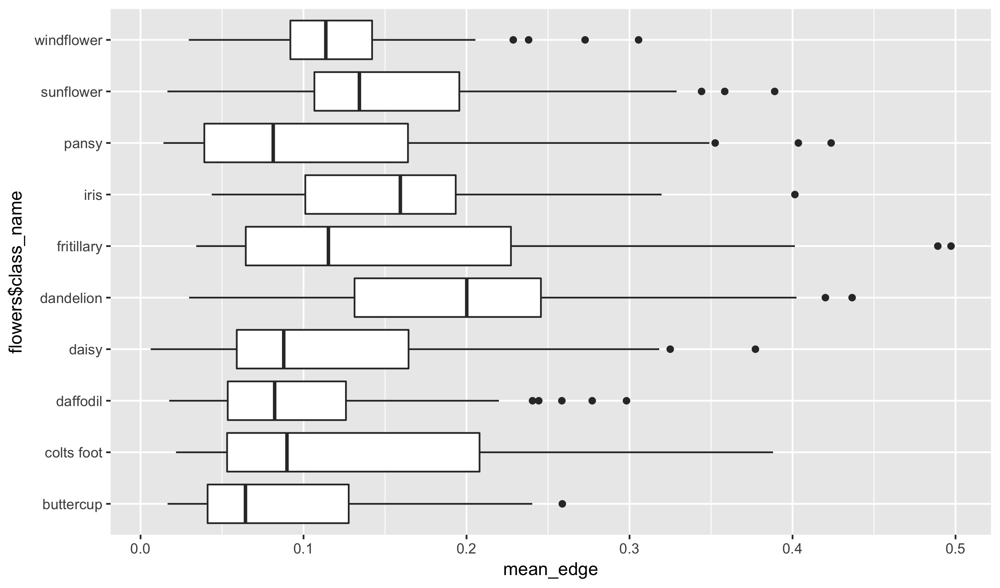
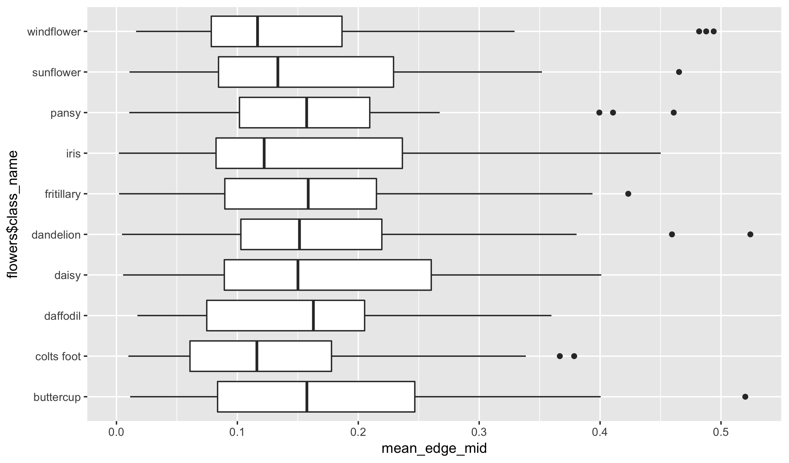
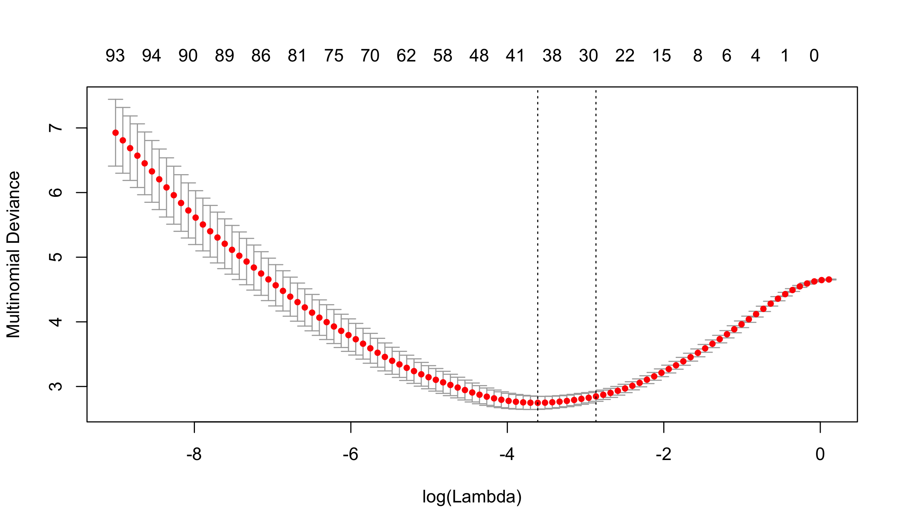


library(readr)
library(dplyr)



## Warning: package 'dplyr' was built under R version 3.4.2



library(ggplot2)
library(methods)


## Flowers dataset

Today we will look at another image dataset. The data consists
of photos of flowers. There are 17 types of flowers and the task
is to recognize the flower from the image. We will look at just
10 of the classes in the notes today; your lab will look at working
with the entire set of 17. If you are curious, the original paper
of the dataset can be found here:

- [Nilsback, M-E., and Andrew Zisserman. "A visual vocabulary for flower classification." Computer Vision and Pattern Recognition, 2006 IEEE Computer Society Conference on. Vol. 2. IEEE, 2006.](https://www.ics.uci.edu/~welling/teaching/273ASpring09/nilsback06.pdf)

It was constructed by the Visual Geometry Group (VGG) at Oxford
University. Keep this in mind as that name will come up again in
our study of image processing.

Once again, the data will be read into R in two parts. The first
containing the photo metadata and the second an array consisting
of the image pixel values.


flowers <- read_csv("https://statsmaths.github.io/ml_data/flowers_17.csv")
x64 <- read_rds("~/gd/ml_data_raw/output_image_data/flowers_17_x64.rds")
x64 <- x64[flowers$class %in% 0:9,,,]
flowers <- flowers[flowers$class %in% 0:9,]
fnames <- flowers$class_name[match(0:9, flowers$class)]
fnames <- factor(fnames, levels = fnames)
flowers



## # A tibble: 600 x 4
##       obs_id train_id class class_name
##        <chr>    <chr> <int>      <chr>
##  1 id_000362    valid     4     crocus
##  2 id_000506    train     6  tigerlily
##  3 id_000778    valid     9  sunflower
##  4 id_000274    train     3   bluebell
##  5 id_000084    train     1   snowdrop
##  6 id_000279    train     3   bluebell
##  7 id_000518    train     6  tigerlily
##  8 id_000670    train     8 fritillary
##  9 id_000511    train     6  tigerlily
## 10 id_000285    valid     3   bluebell
## # ... with 590 more rows


These images are 64 pixels by 64 pixels. Four times larger than
the thumbnails we used of our data. Class "1" consists of the
snowdrop flower. Let's see at a few of the images to get a
sense of what this flower looks like:


par(mar = c(0,0,0,0))
par(mfrow = c(3, 4))
set.seed(1)
for (i in sample(which(flowers$class == 1), 12)) {
  plot(0,0,xlim=c(0,1),ylim=c(0,1),axes= FALSE,type = "n")
  rasterImage(x64[i,,,],0,0,1,1)
}


We can look at these and instantly see the similarities. The difficulty
is going to be teaching the computer to understand these as well. Let's
now look at a representative from all 10 classes of flowers:


par(mar = c(0,0,0,0))
par(mfrow = c(3, 4))
set.seed(1)
for (i in 0:9) {
  plot(0,0,xlim=c(0,1),ylim=c(0,1),axes= FALSE,type = "n")
  j <- sample(which(flowers$class == i), 1)
  rasterImage(x64[j,,,],0,0,1,1)
  text(0.5, 0.1, flowers$class_name[j], cex = 3, col = "salmon")
}


Notice that color will be useful for telling some of these apart, but
not sufficent for distinguishing all classes. Crocus' and irises,
for example, look very similar.

## Collapse into data matrix

To start, we will use the same trick we tried last time of flattening
the array into a matrix and applying the elastic net to the data.


X <- t(apply(x64, 1, cbind))
y <- flowers$class

X_train <- X[flowers$train_id == "train",]
y_train <- y[flowers$train_id == "train"]

library(glmnet)



## Warning: package 'glmnet' was built under R version 3.4.2



model <- cv.glmnet(X_train, y_train, family = "multinomial", nfolds = 3)
beta <- coef(model, s = model$lambda.1se)
beta <- Reduce(cbind, beta)
dim(beta[apply(beta != 0, 1, any),])



## [1] 359  10


The resulting model, even at `lambda.1se`, has over 300
non-zero components. This is a dense model that has included
many of the pixel values. Evaluating the model we see that it
heavily overfits to the training data:


pred <- predict(model, newx = X, type = "class")
tapply(pred == y, flowers$train_id, mean)



##  train  valid
## 0.9325 0.3600


There are ten classes here, so a 36% classification rate is
not terrible. I think we can probably do better though!

## HSV Space

One difficulty with using the red, green, and blue pixel values
is that these do not map very well into a "natural" meaning of
color. They are useful for digital screens to display images but
not ideal for much else.

Instead, we can use a different color space model that translated
red, green, and blue into a different set of variables. One popular
choice in statistical learning is the hue, saturation, value space.
These three values range from 0 to 10. A good picture helps a lot to
understand what the values mean:

**Value** tells how dark a pixel is, **saturation** how much color it
has (with a low value being close to grey), and **hue** gives the specific
point on a color wheel. Usually a hue of 0 indicates red. Notice that
hue is a circular variable, so that a hue of 0.99 is close to a
hue of 0.01.

We can conver into HSV space with the base R function `rgb2hsv`:


i <- 3
red <- as.numeric(x64[i,,,1])
green <- as.numeric(x64[i,,,2])
blue <- as.numeric(x64[i,,,3])
hsv <- t(rgb2hsv(red, green, blue, maxColorValue = 1))
head(hsv)



##              h         s         v
## [1,] 0.5681818 0.3235306 0.2666657
## [2,] 0.5681818 0.2404577 0.3587929
## [3,] 0.5733333 0.2531846 0.3872243
## [4,] 0.5733333 0.2492254 0.3933757
## [5,] 0.5802469 0.2573864 0.4113750
## [6,] 0.5808081 0.3063756 0.4223958


To make sure we understand exactly what these values mean,
let's plot some values in R. The `hsv` function maps a set
of HSV coordinates into a name of the color. Here we look
at a bunch of grey color with varying values (hue is set
to 1 and saturation to zero), as well as a set of 10 of
hues where saturation and value are set at 1.


color_vals <- c(hsv(1, 0, seq(0, 1, by = 0.2)),
                hsv(seq(0, 0.9, by = 0.1), 1, 1))
plot(seq_along(color_vals), seq_along(color_vals),
     col = color_vals, pch = 19, cex = 5)


A good trick with HSV space is to discritize the pixels into
a small set of fixed colors. We will start by using the buckets
defined in the previous plot.

We will do that we creating a vector called `color` set to `#000000`
(pure black) and then changing the color depending on the HSV
coordinates. If the saturation is less than 0.2 this is a pixel
too washed out to make out a reasonable color. We then set it to
a shade of grey depending on value split into five buckets. If
the saturation is higher than 0.2 and value is higher than 0.2
(i.e., it is not too dark), we bucket the hue into ten buckets.
Points with a low value are all kept at the default of black.


color <- rep("#000000", nrow(hsv))

index <- which(hsv[,2] < 0.2)
color[index] <- hsv(1, 0, round(hsv[index,2] * 5) / 5)

index <- which(hsv[,2] > 0.2 & hsv[,3] > 0.2)
color[index] <- hsv(round(hsv[index,1],1), 1, 1)

table(factor(color, levels = color_vals))



##
## #000000 #333333 #666666 #999999 #CCCCCC #FFFFFF #FF0000 #FF9900 #CCFF00
##     204     260       0       0       0       0      13    2870      83
## #33FF00 #00FF66 #00FFFF #0066FF #3300FF #CC00FF #FF0099
##      28       3      22     611       2       0       0


For the one test image, we see that the dominant color is "#FF9900",
an orange, followed by "#0066FF", a blue.

We can use these counts as features to tell us about a given flower.
Let's cycle over the entire dataset and grab these features.


X_hsv <- matrix(0, ncol = length(color_vals),
                   nrow = nrow(flowers))
for (i in seq_len(nrow(flowers))) {
  red <- as.numeric(x64[i,,,1])
  green <- as.numeric(x64[i,,,2])
  blue <- as.numeric(x64[i,,,3])
  hsv <- t(rgb2hsv(red, green, blue, maxColorValue = 1))

  color <- rep("#000000", nrow(hsv))

  index <- which(hsv[,2] < 0.2)
  color[index] <- hsv(1, 0, round(hsv[index,3] * 5) / 5)

  index <- which(hsv[,2] > 0.2 & hsv[,3] > 0.2)
  color[index] <- hsv(round(hsv[index,1],1), 1, 1)

  X_hsv[i,] <- table(factor(color, levels = color_vals))
}
head(X_hsv)



##      [,1] [,2] [,3] [,4] [,5] [,6] [,7] [,8] [,9] [,10] [,11] [,12] [,13]
## [1,]  435  191  283  207  280  175  100  579  752   105     0     0     0
## [2,]    0  370  731  135    7   19  957  611   42   165   972    51    11
## [3,]  124   32  160   13  128    7   13 2870   83    28     3    22   611
## [4,]   94   42  299  552  223  117   12  245 1754    14     0     0     1
## [5,] 2825  232   32   41  245  144    2  188  214     8     1     0     4
## [6,]  415  114  222  193  180  434  135  121  305   903   259    73   152
##      [,14] [,15] [,16]
## [1,]    35   832   122
## [2,]     5     1    19
## [3,]     2     0     0
## [4,]   404   335     4
## [5,]    25    88    47
## [6,]   486    36    68


The 8th column is the orange color and the 9th a greenish color,
both popular from the flowers and the background greenery.

We can use this new matrix to fit another elastic net. The matrix
is small enough that we could use other techniques too, but I'll
keep it consistent here.


y <- flowers$class

X_train <- X_hsv[flowers$train_id == "train",]
X_valid <- X_hsv[flowers$train_id == "valid",]
y_train <- y[flowers$train_id == "train"]
y_valid <- y[flowers$train_id == "valid"]

library(glmnet)
model <- cv.glmnet(X_train, y_train, family = "multinomial")
beta <- coef(model, s = model$lambda.1se)
beta <- Reduce(cbind, beta)
colnames(beta) <- fnames
rownames(beta) <- c("(intercept)", color_vals)
as.matrix(beta)



##                  daffodil      snowdrop   lily valley      bluebell
## (intercept)  1.770461e-01 -1.489402e-02  1.119792e+00  0.2156050038
## #000000      0.000000e+00  2.393722e-04  9.244839e-05 -0.0001356352
## #333333      1.292036e-03  3.897117e-05 -8.897221e-04 -0.0009465659
## #666666      0.000000e+00  0.000000e+00  1.657749e-04  0.0000000000
## #999999      0.000000e+00  1.087899e-03  0.000000e+00  0.0000000000
## #CCCCCC     -1.788616e-03  1.068943e-03  0.000000e+00  0.0000000000
## #FFFFFF     -1.343429e-03  1.447499e-03  0.000000e+00  0.0000000000
## #FF0000      0.000000e+00  0.000000e+00  0.000000e+00  0.0000000000
## #FF9900      6.590324e-04  0.000000e+00 -1.317518e-03 -0.0005517535
## #CCFF00      0.000000e+00  0.000000e+00  0.000000e+00  0.0000000000
## #33FF00     -3.320615e-05 -2.903422e-04  3.651323e-04  0.0000000000
## #00FF66      0.000000e+00  0.000000e+00  0.000000e+00  0.0001266336
## #00FFFF      2.898429e-04  3.269193e-04  4.960677e-04  0.0000000000
## #0066FF      1.597266e-04  0.000000e+00 -7.731947e-04  0.0000000000
## #3300FF      0.000000e+00  0.000000e+00  0.000000e+00  0.0031461614
## #CC00FF      0.000000e+00  0.000000e+00  0.000000e+00  0.0020355444
## #FF0099      0.000000e+00  0.000000e+00  0.000000e+00  0.0000000000
##                    crocus          iris     tigerlily         tulip
## (intercept)  2.056405e-01  1.424085e-01 -0.2184719713  1.1743047065
## #000000      3.070082e-05 -3.567885e-04  0.0000000000  0.0002189562
## #333333      2.607157e-04 -3.664088e-03  0.0000000000  0.0000000000
## #666666      0.000000e+00 -3.545157e-04  0.0000000000  0.0000000000
## #999999      9.013507e-04 -8.905244e-05  0.0000000000  0.0000000000
## #CCCCCC      1.965885e-04  1.602054e-03  0.0000000000 -0.0042881467
## #FFFFFF      7.882126e-04  0.000000e+00  0.0000000000 -0.0017858055
## #FF0000      0.000000e+00  1.090692e-03  0.0032937491  0.0000000000
## #FF9900      0.000000e+00  0.000000e+00  0.0000000000  0.0000000000
## #CCFF00     -2.136064e-04  2.265112e-04  0.0000000000  0.0000000000
## #33FF00     -4.583371e-04  0.000000e+00  0.0000000000  0.0000000000
## #00FF66     -1.076706e-03  0.000000e+00  0.0000000000  0.0000000000
## #00FFFF     -2.047303e-04  0.000000e+00  0.0000000000 -0.0007464020
## #0066FF     -2.904192e-04 -7.562564e-05  0.0004041505 -0.0005402705
## #3300FF      2.140144e-03  2.184012e-03  0.0000000000  0.0000000000
## #CC00FF      2.745270e-03  1.326558e-03  0.0000000000  0.0000000000
## #FF0099      0.000000e+00  0.000000e+00  0.0000000000  0.0000000000
##               fritillary     sunflower
## (intercept) -1.398503900 -1.4029265754
## #000000      0.000000000  0.0000000000
## #333333      0.000000000 -0.0005368208
## #666666      0.000000000  0.0000000000
## #999999      0.000000000  0.0000000000
## #CCCCCC      0.000000000 -0.0004132294
## #FFFFFF      0.000000000  0.0000000000
## #FF0000      0.002407056  0.0000000000
## #FF9900      0.000000000  0.0016435783
## #CCFF00      0.000000000  0.0000000000
## #33FF00      0.000000000  0.0000000000
## #00FF66      0.000000000  0.0000000000
## #00FFFF      0.000000000  0.0011926989
## #0066FF      0.000000000  0.0007580761
## #3300FF      0.000000000  0.0000000000
## #CC00FF      0.000000000  0.0000000000
## #FF0099      0.009268888  0.0000000000


We see that some expected patterns here. Snowdrops have a large
white coefficient ("#FFFFFF") and bluebells have a large value
for blue ("#3300FF") and purple ("#CC00FF"). Sunflowers have a
large coefficient for orange ("#FF9900").

This model is slightly more predictive, but importantly is not
nearly as overfit.


pred <- as.numeric(predict(model, newx = X_hsv,
                           type = "class"))

tapply(pred == y, flowers$train_id, mean)



##  train  valid
## 0.5525 0.4100


The reason for this that the first elastic net likely
approximated the kind of analysis we did here, but in doing overfit
to the way hue, value, and saturation looked on the training data.

### More Colors

We can improve our model by including more colors. We don't need
any more greys, but lets include a set of 100 hues. This will give
us more information about the particular colors for each flower.


color_vals <- c(hsv(1, 0, seq(0, 1, by = 0.2)),
                hsv(seq(0, 0.99, by = 0.01), 1, 1))

X_hsv <- matrix(0, ncol = length(color_vals),
                   nrow = nrow(flowers))
for (i in seq_len(nrow(flowers))) {
  red <- as.numeric(x64[i,,,1])
  green <- as.numeric(x64[i,,,2])
  blue <- as.numeric(x64[i,,,3])
  hsv <- t(rgb2hsv(red, green, blue, maxColorValue = 1))

  color <- rep("#000000", nrow(hsv))

  index <- which(hsv[,2] < 0.2)
  color[index] <- hsv(1, 0, round(hsv[index,3] * 5) / 5)

  index <- which(hsv[,2] > 0.2 & hsv[,3] > 0.2)
  color[index] <- hsv(round(hsv[index,1], 2), 1, 1)

  X_hsv[i,] <- table(factor(color, levels = color_vals))
}


We will use the elastic net again here. With the increased
set of colors, let's set alpha to 0.2 to spread the weights
out over similar colors.


y <- flowers$class

X_train <- X_hsv[flowers$train_id == "train",]
X_valid <- X_hsv[flowers$train_id == "valid",]
y_train <- y[flowers$train_id == "train"]
y_valid <- y[flowers$train_id == "valid"]

library(glmnet)
model <- cv.glmnet(X_train, y_train, family = "multinomial",
                   alpha = 0.2)


The model is more predictive with the more grainular
color labels:


pred <- as.numeric(predict(model, newx = X_hsv, type = "class"))
tapply(pred == y, flowers$train_id, mean)



##  train  valid
## 0.6075 0.4300


We can create an interesting visualization of these values by
showing the weights as a function of the actual colors for
each flower.


beta <- coef(model, s = model$lambda.min)
beta <- as.matrix(Reduce(cbind, beta))[-1,]
colnames(beta) <- fnames
rownames(beta) <- color_vals
df <- data_frame(flower = rep(colnames(beta), each = nrow(beta)),
                 color = rep(rownames(beta), ncol(beta)),
                 beta = as.numeric(beta))
cols <- color_vals; names(cols) <- color_vals
df$color <- factor(df$color, levels = color_vals)
filter(df, beta > 0) %>%
  ggplot(aes(color, flower)) +
    geom_point(aes(color = color, size = beta), show.legend = FALSE) +
    theme_minimal() +
    scale_colour_manual(values = cols) +
    theme(axis.title.x=element_blank(),
        axis.text.x=element_blank(),
        axis.ticks.x=element_blank(),
        panel.border = element_blank(),
        panel.grid.major = element_blank(),
        panel.grid.minor = element_blank(),
        axis.line = element_line(colour = "black"))


Tigerlily's are very red, whereas bluebells, crocuses, and
irises have a blue/purple color.

At the very least, I think it visually looks very neat even if
it is not particularly helpful from a predictive standpoint.

## Texture

If we want to improve our model further, we need to include information
beyond just the color of the flower. When we look at the images, our
brains also use information about shape and texture. Let's try to find
a way to measure this in the image.

I will start by taking a sample flower image and creating a black and
white version of it. A simple way to do this is to average the red,
green, and blue pixels.


i <- 50
bw <- (x64[i,,,1] + x64[i,,,2] + x64[i,,,3]) / 3
plot(0,0,xlim=c(0,1),ylim=c(0,1),axes= FALSE,type = "n")
rasterImage(bw,0,0,1,1)


To detect texture we can take the brightness of each pixel and
subtract it from the brightness of the pixel to its lower right.
We can do this in a vectorized fashion as such:


edge <- abs(bw[-1,-1] - bw[-nrow(bw),-ncol(bw)])
plot(0,0,xlim=c(0,1),ylim=c(0,1),axes= FALSE,type = "n")
rasterImage(edge,0,0,1,1)


The resulting image roughly detects edges in the image. Notice
that is has only 63-by-63 pixels due to the fact that we cannot
compute this measurement on the rightmost or bottommost edges
of the plot.

We'll do this for each image, and save the number of pixels that
have an edge value greater than 0.1. You could of course play around
with this cutoff, or save a number of different cutoff values. This
number will tell us roughly how much of the image consists of edges.
A low number indicates a smooth petal and a a high one indicates
a grassy texture to the flower.


mean_edge <- rep(0, nrow(flowers))
for (i in seq_len(nrow(flowers))) {
  bw <- (x64[i,,,1] + x64[i,,,2] + x64[i,,,3]) / 3
  edge <- abs(bw[-1,-1] - bw[-nrow(bw),-ncol(bw)])
  mean_edge[i] <- mean(edge > 0.1)
}


A boxplot shows that there are differences between the flowers
in this measurement. Crocuses in particular have a lot of edges.


qplot(flowers$class_name, mean_edge, geom = "blank") +
  geom_boxplot() +
  coord_flip() +
  theme_minimal()


Most of the photos have a flower in the middle, but the background
may include grass, sky, or other non-related elements. Let's repeat
the edge detector but now only such as the degree of edge-ness only
for the middle of the image.


mean_edge_mid <- rep(0, nrow(flowers))
for (i in seq_len(nrow(flowers))) {
  bw <- (x64[i,,,1] + x64[i,,,2] + x64[i,,,3]) / 3
  edge <- abs(bw[-1,-1] - bw[-nrow(bw),-ncol(bw)])
  mean_edge_mid[i] <- mean(edge[20:44,20:44] > 0.1)
}


This shows a clearly differentiation of the flowers. Fritillary
have a lot of edges due to their spots in the middle of
the photo. Notice that the patterns here are quite different
from those in the whole image.


qplot(flowers$class_name, mean_edge_mid, geom = "blank") +
  geom_boxplot() +
  coord_flip() +
  theme_minimal()


We will create a data matrix by putting together the color information
with the `mean_edge` and `mean_edge_mid` metrics.


X_edge <- cbind(X_hsv, mean_edge, mean_edge_mid)
y <- flowers$class

X_train <- X_edge[flowers$train_id == "train",]
X_valid <- X_edge[flowers$train_id == "valid",]
y_train <- y[flowers$train_id == "train"]
y_valid <- y[flowers$train_id == "valid"]

library(glmnet)
model <- cv.glmnet(X_train, y_train, family = "multinomial",
                   alpha = 0.2)
plot(model)


I've included the cross-validation curve because it is a
perfect textbook example of what the curve should look like
(but rarely does so nicely). The resulting model performs much
better than the color alone.


pred <- as.numeric(predict(model, newx = X_edge,
                           type = "class"))
tapply(pred == y, flowers$train_id, mean)



## train valid
## 0.655 0.470


A confusion matrix shows us that only a few flowers are still
difficult to differentiate.


table(pred = fnames[pred[flowers$train_id == "valid"] + 1],
      y = y[flowers$train_id == "valid"])



##              y
## pred           0  1  2  3  4  5  6  7  8  9
##   daffodil     5  0  0  1  0  2  0  1  0  5
##   snowdrop     3 11  5  1  1  2  1 10  1  0
##   lily valley  1  2 14  4  0  1  4  1  2  1
##   bluebell     0  0  0  9  1  4  0  1  0  0
##   crocus       0  1  0  2 13  2  1  1  0  0
##   iris         0  0  0  0  0  4  0  0  2  0
##   tigerlily    4  2  1  0  1  1 12  2  1  0
##   tulip        7  3  0  0  0  1  1  1  2  1
##   fritillary   0  0  0  1  2  1  0  0 12  0
##   sunflower    0  1  0  2  2  2  1  3  0 13


We won't have time here, but the next step would be to figure out
what features would help distinguish the "snowdrop", "daffodil",
and "bluebell" flowers from the others as false positives and
negatives from these groups are causing a large portion of the
remaining errors.

