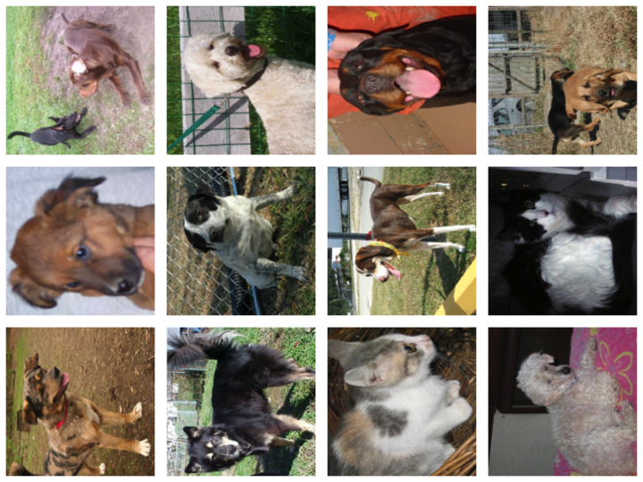
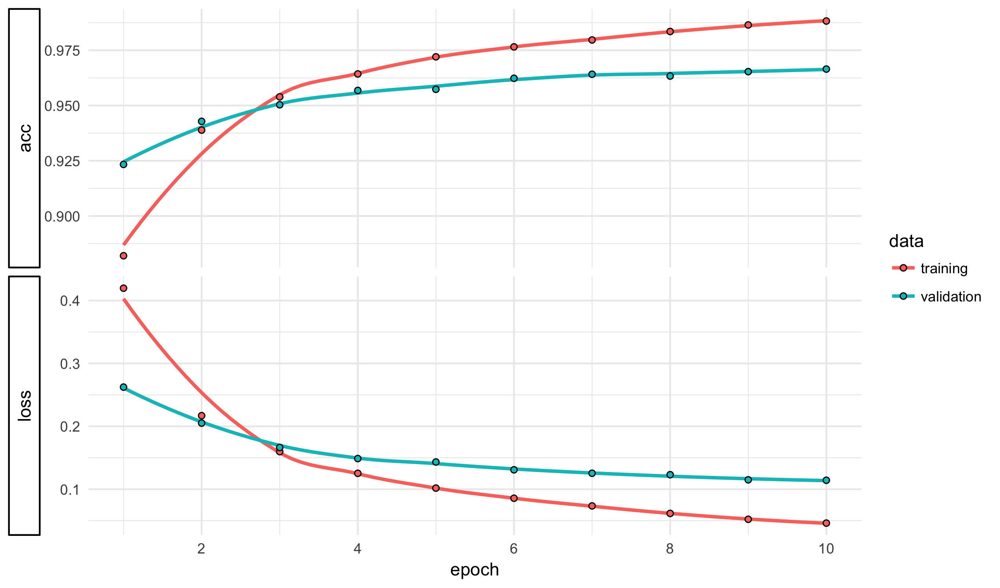
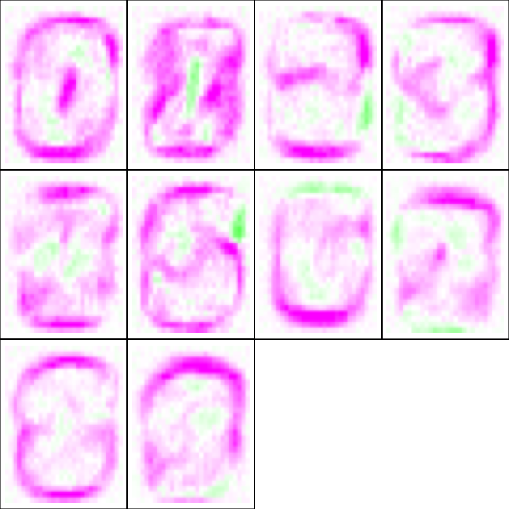
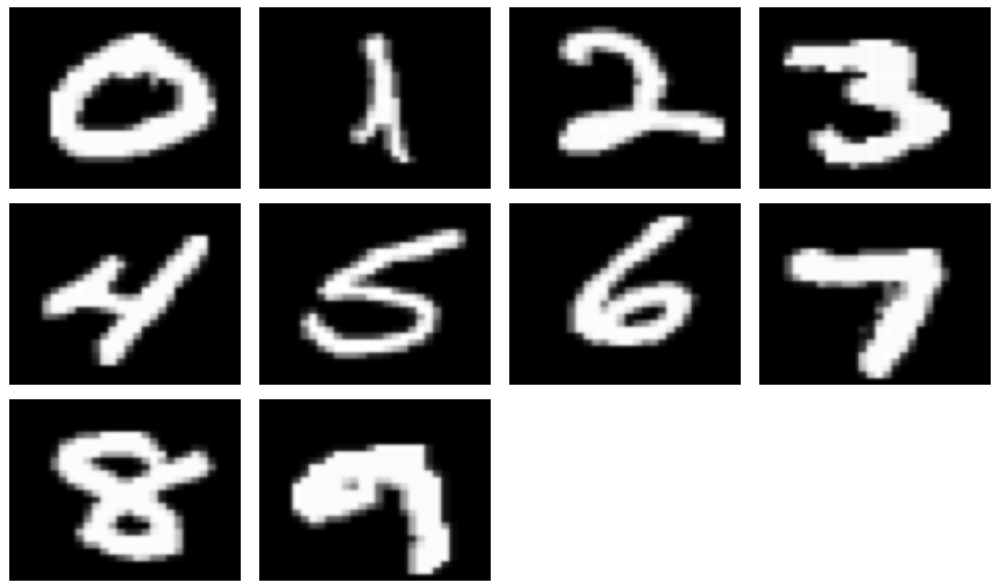
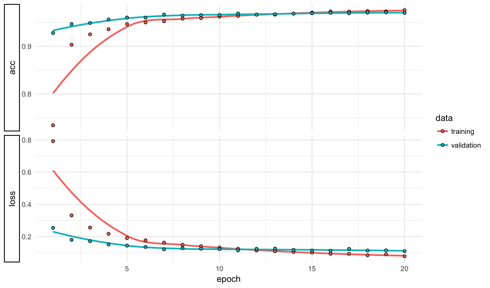
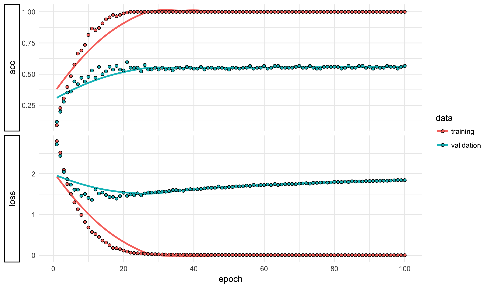


library(readr)
library(ggplot2)
library(dplyr)
library(methods)
library(keras)
theme_set(theme_minimal())


## Image processing vs text processing

Recall that when we started with text processing my first assignment
for you was to hand construct features to classify different types of
Amazon products. We found that this works fairly well but needed a
more automated approach. I then showed how to use term-frequency
matrices to build a large dataset with lots of automatically generated
counts. An elastic net was then used to fit a model to the data;
along the way, we also saw those words that were most associated
with each category.

The primary difficulty with text data was that the raw input were
not numeric; we needed to do feature extraction in order to
create numeric features.

The problem with images is different: we have images represented
natively by pixel intensities. However, good models need to
incorporate interactions and non-linearities to do much of
use with pixel data. Also, unlike text models it is unlikely
that the best model will be relatively sparse.

Think about it this way, if I said that an Amazon review used
the words "book" and "chapter" each 3 times. From this alone
you would know there is a high chance it is from a book review.
If I told you that the red pixel in the center of the image has
an intensity of 0.42, can you say much about whether this is an
indoor or outdoor photo?

We have many ways of fitting non-linear models with interactions
(trees, gams, basis expansion), though the only one that works
with data having many variables are neural networks. That is why
we turn to them today.

## MNIST

The National Institute of Standards and Technology (NIST) is a
US federal agency specifically tasked with developing measurement
standards. The agency has put together several datasets of images
showing handwritten digits. These were standardized and put together
by Yann LeCun and Corinna Cortes while at AT&T Labs into a
classification dataset. The prediction task is to recognize what
number is shown in the image.

The dataset, known as MNIST or MNIST-10, is a very commonly used
training set when learning how to do image recognition. In academic
research, it is certainly overused, but it does make a great
example for teaching purposes. The images are relatively small
but still represent an interesting classification task. The
primary reason for this is that digit classification does not
require color or high-resolution images, making the data size
relatively small.

As with the class images and the flowers dataset, the MNIST data
is split into metadata and pixel counts. We will read both of
these into R here:


mnist <- read_csv("https://statsmaths.github.io/ml_data/mnist_10.csv")
x28 <- read_rds("~/gd/ml_data_raw/output_image_data/mnist_10_x28.rds")


These images are in black and white. Let's look at the dimension of
the data to make sure that it makes sense to us:


dim(x28)



## [1] 60000    28    28     1


There are 60000 total images, with 28 rows, 28 columns, and one
color channel. Before diving into the classification task, we
can take a quick look at what the digits actually look like.
Here are 60 examples of the digit 2


par(mar = c(0,0,0,0))
par(mfrow = c(6, 10))
for (i in sample(which(mnist$class == 2), 60)) {
  plot(0,0,xlim=c(0,1),ylim=c(0,1),axes= FALSE,type = "n")
  rasterImage(x28[i,,,],0,0,1,1)
}


We can quickly recognize that all of these are the digit 2, though
note that the specific pixel values between two different 2's can
be extremely different.

### Neural networks

It is now time to return to neural networks. We first flatten the
dataset `x28` and then construct a training set of data. The only
tweak for neural networks is the use of `to_categorical` to create
a matrix for `y_train`. Notice that here the smallest category is
already "0", so we can put the response `y` in directly to the
function. Also, pixel values live between 0 and 1 already so there
is no need to standardize the columns of X.


X <- t(apply(x28, 1, cbind))
y <- mnist$class

X_train <- X[mnist$train_id == "train",]
y_train <- to_categorical(y[mnist$train_id == "train"], num_classes = 10)


Next, we construct the model architecture for the neural network.
Here we have 28^2 inputs, one hidden layer with 128 neurons, and
an output layer with 10 neurons. A rectified linear unit is used
to "activate" the hidden layer and a "softmax" function is used
to turn the outputs into probabilities.


model <- keras_model_sequential()
model %>%
  layer_dense(units = 128, input_shape = c(28^2)) %>%
  layer_activation(activation = "relu") %>%
  layer_dense(units = 10) %>%
  layer_activation(activation = "softmax")

model %>% compile(loss = 'categorical_crossentropy',
                  optimizer = optimizer_rmsprop(),
                  metrics = c('accuracy'))

model



## Model
## ___________________________________________________________________________
## Layer (type)                     Output Shape                  Param #     
## ===========================================================================
## dense_1 (Dense)                  (None, 128)                   100480      
## ___________________________________________________________________________
## activation_1 (Activation)        (None, 128)                   0           
## ___________________________________________________________________________
## dense_2 (Dense)                  (None, 10)                    1290        
## ___________________________________________________________________________
## activation_2 (Activation)        (None, 10)                    0           
## ===========================================================================
## Total params: 101,770
## Trainable params: 101,770
## Non-trainable params: 0
## ___________________________________________________________________________


This is a small model, but notice that it already has over 100k
parameters to train! If you prefer mathematical notation, here
is how we can describe this neural network:

$$ \widehat{Y} = \text{softmax} \left(a_2 + \sigma(a_1 + X \cdot B_1) \cdot B_2 \right) $$
Where the B's are matrices of weights that need to be learned,
the a's are vectors of biases that need to be learned, and sigma
is the rectified linear unit (ReLU). The ReLU turns negative values
into zero and operates component wise on the matrix.

Next, we compile the model:


model %>% compile(loss = 'categorical_crossentropy',
                  optimizer = optimizer_sgd(lr = 0.01, momentum = 0.9,
                                            nesterov = TRUE),
                  metrics = c('accuracy'))


And fit it on our training data:


history <- model %>%
  fit(X_train, y_train, epochs = 10, validation_split = 0.2)
plot(history)


The model seems to do very well will a minimal amount of effor on our
part. Here is how it performs on the real validation set:


y_pred <- predict_classes(model, X)
tapply(y == y_pred, mnist$train_id, mean)



##      test     train     valid 
##        NA 0.9872667 0.9665333


Over 96%, which is quite good given that we have just a single hidden
layer neural network with a minimal set of tweaks to the inputs.

Which categories are the hardest to distinguish?


table(y[mnist$train_id == "train"], y_pred[mnist$train_id == "train"])



##    
##        0    1    2    3    4    5    6    7    8    9
##   0 2983    0    0    1    2    3    2    1    3    5
##   1    0 2967    6    1    8    1    1    4    9    3
##   2    6    3 2963    0    2    2    5   11    5    3
##   3    2    4   12 2915    0   13    1   17   21   15
##   4    0    1    3    0 2968    0    3    3    1   21
##   5    1    1    1   10    0 2970    7    1    5    4
##   6    3    1    1    0    1   10 2978    0    6    0
##   7    0    5    6    1    4    0    0 2962    4   18
##   8    4    4    5    7    1   12    4    2 2949   12
##   9    3    0    1    1    7   11    0   11    3 2963


It seems the we most often confuse 9's and 4's;
8's and 3's, and 7's and 9's. Thinking about the shape of
these digits all of these confusions should seem reasonable.

### Visualize weights

There are many ways of accessing and modifying the weights
inside of a training **keras** model. The `get_layer` function
returns a pointer to a particular layer in a neural network
(it lives in Python, so the indices start at 0). There are
two sets of "weights" in each layer: the weights corresponding
to the matrix "B" and the bias (called "a" in our equation
above).


layer <- get_layer(model, index = 1)
dim(layer$get_weights()[[1]])



## [1] 784 128



dim(layer$get_weights()[[2]])



## [1] 128


Here, we grabbed the first Dense layer, which has 28^2 by 128
weights. It can sometimes be insightful to visualize these
weights. Let's create a new, much smaller model. This one does
not even have a hidden layer. It is essentially a multinomial
model, albeit with a different algorithm for learning the weights.


model <- keras_model_sequential()
model %>%
  layer_dense(units = 10, input_shape = c(28^2)) %>%
  layer_activation(activation = "softmax")

model %>% compile(loss = 'categorical_crossentropy',
                  optimizer = optimizer_rmsprop(),
                  metrics = c('accuracy'))

history <- model %>%
  fit(X_train, y_train, epochs = 10, validation_split = 0.2)


It is still a fairly good model, relative to its simplicity:


y_pred <- predict_classes(model, X)
tapply(y == y_pred, mnist$train_id, mean)



##      test     train     valid 
##        NA 0.9278333 0.9153333


With a validation classification of about 91.5%. Lets grab
the weights for the one layer with trainable parameters and
turn this into an array


layer <- get_layer(model, index = 1)
B <- array(layer$get_weights()[[1]], dim = c(28, 28, 10))


The


relu <- function(mat) {
  id <- which(mat <= 0)
  mat[id] <- 0
  mat
}

par(mar = rep(0, 4L))
par(mfrow = c(3, 4))
for (j in 1:10) {
  v <- B[,,j]
  b <- array(1, dim = c(28, 28, 4))
  b[,,1] <- 1 - relu(v / max(abs(v)))
  b[,,2] <- 1 - relu(v / max(abs(v)) * -1)
  b[,,3] <- 1 - relu(v / max(abs(v)))
  b[,,4] <- ifelse(v == 0, 0, 1)
  plot(0,0,xlim=c(0,1),ylim=c(0,1),axes= FALSE,type = "n")
  rasterImage(b,0,0,1,1)
  box()
}


Green shows positive weights and purple shows negative ones. Remember
that these 10 images relate to the ten digits. They show which pixels
need to be activate ("white" in our formulation). Notice that images
in this neural network are largely determine based on where the image
is **not** colored. You can almost see the outlines of the digits in
the images if you squint at these.

Another visualization technique that we can do with neural networks
is to find the inputs with the highest probabilities. Here are the
most typical images for each class:


y_pred <- predict_proba(model, X)
id <- apply(y_pred, 2, which.max)
par(mar = c(0,0,0,0))
par(mfrow = c(3, 4))
for (i in id) {
  plot(0,0,xlim=c(0,1),ylim=c(0,1),axes= FALSE,type = "n")
  rasterImage(x28[i,,,],0,0,1,1)
}


Compared to the rest of the corpus, these are all relatively thick but
small.

### Neural Network Regularization

With MNIST, a small neural network goes a long way. The real power of
neural network though begin to come into play when working with larger
and deeping networks. We have already seen that it is easy to build
these with the **keras** package. However, if we have too many parameters
to the model will begin to overfit. We need to regularize the model much
like we did with the elastic net.

One way to regularize a neural network is to include a *dropout* layer.
This layer, during training only, randomly converts a proportion of its
inputs to zero. This forces the next layer to smooth out weights over
all of the inputs in the prior layer. It is similar to when random
forests only allow a random subset of the variable to be used at a
given branching point or how the weights in a ridge regression force
the model to spread out over correlated values.

Dropout can be added to the model with the `layer_dropout` function.
Here, we also change the initializing function for the starting
weights B in the neural network. I find that "glorot_normal" often
performs better when using dropout.


model <- keras_model_sequential()
model %>%

  layer_dense(units = 512, kernel_initializer = "glorot_normal",
              input_shape = c(28^2)) %>%
  layer_activation(activation = "relu") %>%
  layer_dropout(rate = 0.5) %>%

  layer_dense(units = 512, kernel_initializer = "glorot_normal") %>%
  layer_activation(activation = "relu") %>%
  layer_dropout(rate = 0.5) %>%

  layer_dense(units = 512, kernel_initializer = "glorot_normal") %>%
  layer_activation(activation = "relu") %>%
  layer_dropout(rate = 0.5) %>%

  layer_dense(units = 512, kernel_initializer = "glorot_normal") %>%
  layer_activation(activation = "relu") %>%
  layer_dropout(rate = 0.5) %>%

  layer_dense(units = 10) %>%
  layer_activation(activation = "softmax")

model %>% compile(loss = 'categorical_crossentropy',
                  optimizer = optimizer_sgd(lr = 0.01, momentum = 0.9,
                                            nesterov = TRUE),
                  metrics = c('accuracy'))

model



## Model
## ___________________________________________________________________________
## Layer (type)                     Output Shape                  Param #     
## ===========================================================================
## dense_4 (Dense)                  (None, 512)                   401920      
## ___________________________________________________________________________
## activation_4 (Activation)        (None, 512)                   0           
## ___________________________________________________________________________
## dropout_1 (Dropout)              (None, 512)                   0           
## ___________________________________________________________________________
## dense_5 (Dense)                  (None, 512)                   262656      
## ___________________________________________________________________________
## activation_5 (Activation)        (None, 512)                   0           
## ___________________________________________________________________________
## dropout_2 (Dropout)              (None, 512)                   0           
## ___________________________________________________________________________
## dense_6 (Dense)                  (None, 512)                   262656      
## ___________________________________________________________________________
## activation_6 (Activation)        (None, 512)                   0           
## ___________________________________________________________________________
## dropout_3 (Dropout)              (None, 512)                   0           
## ___________________________________________________________________________
## dense_7 (Dense)                  (None, 512)                   262656      
## ___________________________________________________________________________
## activation_7 (Activation)        (None, 512)                   0           
## ___________________________________________________________________________
## dropout_4 (Dropout)              (None, 512)                   0           
## ___________________________________________________________________________
## dense_8 (Dense)                  (None, 10)                    5130        
## ___________________________________________________________________________
## activation_8 (Activation)        (None, 10)                    0           
## ===========================================================================
## Total params: 1,195,018
## Trainable params: 1,195,018
## Non-trainable params: 0
## ___________________________________________________________________________


The new model now has over 1 million parameters. We can train it just
as with the simpler neural networks.


history <- model %>%
  fit(X_train, y_train, epochs = 20,
      validation_split = 0.1, batch_size = 32)
plot(history)


Why is the training accuracy lower than the validation accuracy, particularly
for the first few epochs? The reason is that the training accuracy uses the
dropout functions but the validation accuracy turns the dropout off.

From the plot, it looks like the model is not improving much after about 10
iterations through the dataset. It is possible to train the model with a
smaller learning rate to get a slightly better performance.


model %>% compile(loss = 'categorical_crossentropy',
                  optimizer = optimizer_sgd(lr = 0.003, momentum = 0.9,
                                            nesterov = TRUE),
                  metrics = c('accuracy'))
history <- model %>%
  fit(X_train, y_train, epochs = 10,
      validation_split = 0.1, batch_size = 32)


The smaller learning rate helps use achieve a slightly better validation
than our initial simple model.


y_pred <- predict_classes(model, X)
tapply(y == y_pred, mnist$train_id, mean)



##      test     train     valid 
##        NA 0.9958333 0.9775333



table(y[mnist$train_id == "train"], y_pred[mnist$train_id == "train"])



##    
##        0    1    2    3    4    5    6    7    8    9
##   0 2994    0    0    0    1    0    2    0    3    0
##   1    0 2990    2    1    1    0    0    4    2    0
##   2    3    1 2987    1    0    0    1    4    3    0
##   3    1    0    5 2977    0    3    0    3    8    3
##   4    0    0    2    1 2993    0    0    2    0    2
##   5    2    0    0    7    0 2982    5    0    3    1
##   6    0    0    1    0    0    3 2995    0    1    0
##   7    0    3    5    0    0    0    0 2988    1    3
##   8    1    2    2    2    0    0    4    2 2986    1
##   9    0    0    1    0    4    6    0    6    0 2983


We are now around 97.5% accurate on the training set.

### Tuning Neural Networks

The next lab has you take your turn at building a neural
network on a dataset very similar to MNIST. There are a
number of parameters that you can change in the neural
network. Many of you asked me to be more explicit regarding
how to select tuning parameters. Here are the general rules
I would follow at this point:

- run a model for how ever many epochs (iterations) it takes
to visually flatline
- always build layers by putting together a `layer_dense`,
`layer_activation` ("relu" on all but the last, which should
be "softmax") and `layer_dropout`
- use `optimizer_sgd` with `nesterov = TRUE` and momentum
equal to `0.9`
- make all hidden layers have the same number of nodes
- start with 2 hidden layers with 128 nodes each and an
`lr = 0.01`

Then, you can change the following parameters as you test
which ones work the best. Make sure that you only change one
thing at a time and run enough epochs to get the model to
roughly converge

- experiment with between 2 and 5 hidden layers
- try doubling or halving the number of hidden nodes;
usually work in powers of 2
- if the model is very noisy, you can decrease the dropout
to 0.25
- try successively halving the loss ratio

Try to start small and work up slowly so you do not crash
R (or, at least, you don't crash R too frequently).

## Neural Network Internals

At this point you should have a good idea of what a neural
network is once we have learned the weight matricies and
bias vectors. We have not spent any time discussing exactly
how neural networks are actually trained. In short, they
use a modification of gradient descent. Recall that this is
an optimization technique where (for minimization) we take
a small step in the opposite direction of the gradient
vector of partial derivatives.

There are three tweaks / tricks that make this feasible for
neural networks:

- the use of stochastic gradient descent
- backpropagation
- momentum

Back propagation is a trick for computing the gradient very
quickly. Momentum is a way of keeping track of prior gradients
so that we avoid the pitfalls of ordinary gradient descent.
In short, the gradient in the current step is averaged with
some proportion of the prior gradient. This way, if we are
stuck in a flat area the gradients will accumulate and "pick
up speed". If we are bouncing over the sides of a valley, the
gradients cancel each other out and lower the step size. It
is a very clever technique that has huge performance benefits.
(See the notes from Class 04, "Fuel Efficiency in the Big City",
for a review of gradient descent and some of its pitfalls).

Stochastic gradient descent (SGD) is a way of incrementally updating
the weights in the model without needing to work with the entire
dataset at each step. The name is an anachronism, as the current
way of doing SGD does not involve any randomness. To understand
SGD, consider updates in ordinary gradient descent:e

$$ \left( w^{(0)} - \eta \cdot \nabla_w f \right) \, \rightarrow \, w^{(1)} $$

Notice that for squared error loss (it is also true for categorical
cross-entropy), the loss can be written as a sum of component losses
for each observation. The gradient, therefore, can also be written
as a sum of terms over all of the data points.

$$ \begin{align} f(w) &= \sum_i (\widehat{y}_i(w) - y_i)^2 \\
        &= \sum_i f_i(w) \\
        \nabla_w f &= \sum_i \nabla_w f_i
    \end{align}$$

This means that we could write gradient descent as a series of
n steps over each of the training observations.

$$
\begin{align}
\left( w^{(0)} - (\eta / n) \cdot \nabla_{w^{(0)}} f_1 \right) \, &\rightarrow \, w^{(1)} \\
\left( w^{(1)} - (\eta / n) \cdot \nabla_{w^{(0)}} f_2 \right) \, &\rightarrow \, w^{(2)} \\
&\vdots \\
\left( w^{(n-1)} - (\eta / n) \cdot \nabla_{w^{(0)}} f_n \right) \, &\rightarrow \, w^{(n)} \\
\end{align}
$$

The output $w^{(n)}$ here is exactly equivalent to the $w^{(1)}$ from before.
SGD actually does the updates in this iterative fashion, but makes one
modification. In each step it updates the gradient with respect to the
new set of weights. Writing eta prime as eta divided by the sample size,
we can write this as:

$$
\begin{align}
\left( w^{(0)} - \eta' \cdot \nabla_{w^{(0)}} f_1 \right) \, &\rightarrow \, w^{(1)} \\
\left( w^{(1)} - \eta' \cdot \nabla_{w^{(1)}} f_2 \right) \, &\rightarrow \, w^{(2)} \\
&\vdots \\
\left( w^{(n-1)} - \eta' \cdot \nabla_{w^{(n)}} f_n \right) \, &\rightarrow \, w^{(n)} \\
\end{align}
$$

The approach of SGD should seem quite reasonable. Why work with
old weights in each step when we already know what direction the
points are moving in? One pass through the entire dataset is
called n *epoch*.

Typically, **keras** and other neural network software implement a
batched version of SGD. Instead of splitting the data into
individual observations it instead buckets the data into small
groups known as *mini batches*. The entire mini batch is used
in each step of the algorithm. This is the `batch_size` parameter
you may have noticed in the code chunks. Generally the only
effect of this number is the speed of the algorithm and it
tends to be set to some small power of 2.

If you are interested even more in understanding the internals
of the backpropigation algorithm, the only part that we have
truly glossed over, I recommend the notes by Michael Nielsen:

- [http://neuralnetworksanddeeplearning.com/chap2.html](http://neuralnetworksanddeeplearning.com/chap2.html)

This is just Chapter 2 of his free online text. The entire
digital book is fantastic and an excellent reference that goes
much deeper into the details than we are able to this semester.

## Flowers with Neural Networks

We probably will not have time to cover this in class, but
just for comparison, let's try to use neural networks to fit the
flowers dataset.


flowers <- read_csv("https://statsmaths.github.io/ml_data/flowers_17.csv")
x64 <- read_rds("~/gd/ml_data_raw/output_image_data/flowers_17_x64.rds")

X <- t(apply(x64, 1, cbind))
y <- flowers$class

X_train <- X[flowers$train_id == "train",]
y_train <- to_categorical(y[flowers$train_id == "train"], num_classes = 17)


The model we use with have three hidden layers of 128 parameters
each.


model <- keras_model_sequential()
model %>%
  layer_dense(units = 128, input_shape = c(ncol(X_train))) %>%
  layer_activation(activation = "relu") %>%
  layer_dense(units = 128) %>%
  layer_activation(activation = "relu") %>%
  layer_dense(units = 128) %>%
  layer_activation(activation = "relu") %>%
  layer_dense(units = 17) %>%
  layer_activation(activation = "softmax")

model %>% compile(loss = 'categorical_crossentropy',
                  optimizer = optimizer_sgd(lr = 0.003, momentum = 0.9,
                                            nesterov = TRUE),
                  metrics = c('accuracy'))

model



## Model
## ___________________________________________________________________________
## Layer (type)                     Output Shape                  Param #     
## ===========================================================================
## dense_9 (Dense)                  (None, 128)                   1572992     
## ___________________________________________________________________________
## activation_9 (Activation)        (None, 128)                   0           
## ___________________________________________________________________________
## dense_10 (Dense)                 (None, 128)                   16512       
## ___________________________________________________________________________
## activation_10 (Activation)       (None, 128)                   0           
## ___________________________________________________________________________
## dense_11 (Dense)                 (None, 128)                   16512       
## ___________________________________________________________________________
## activation_11 (Activation)       (None, 128)                   0           
## ___________________________________________________________________________
## dense_12 (Dense)                 (None, 17)                    2193        
## ___________________________________________________________________________
## activation_12 (Activation)       (None, 17)                    0           
## ===========================================================================
## Total params: 1,608,209
## Trainable params: 1,608,209
## Non-trainable params: 0
## ___________________________________________________________________________


Now, we can try a model on this data. There are far fewer data points
here, so I will use more iterations.


history <- model %>%
  fit(X_train, y_train, epochs = 100, validation_split = 0.2)
plot(history)


The model seems to plateau around a classification rate just over
50%. It does not perform even as well on the true validation set:


y_pred <- predict_classes(model, X)
tapply(y == y_pred, flowers$train_id, mean)



##      test     train     valid 
##        NA 0.9132353 0.4647059


Why does it not do as well as perhaps your non-NN models were able
to do? The issue is that we were constructing features that used the
shape of the image and the relationship between the color channels.
Next time we will see how to do this in the context of neural networks.

