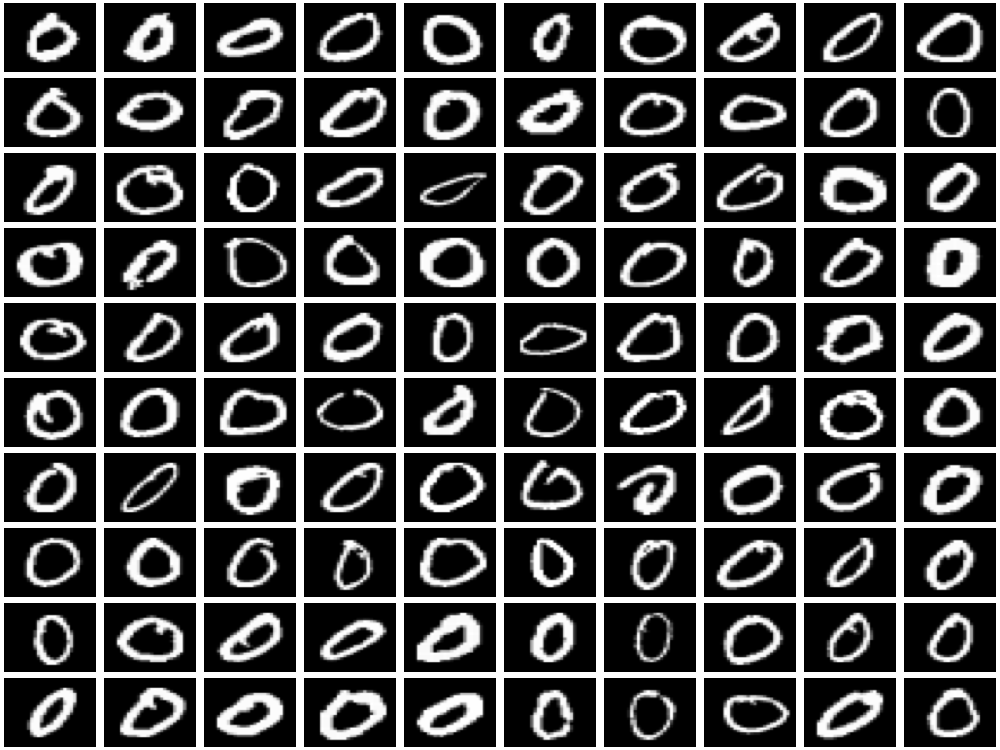
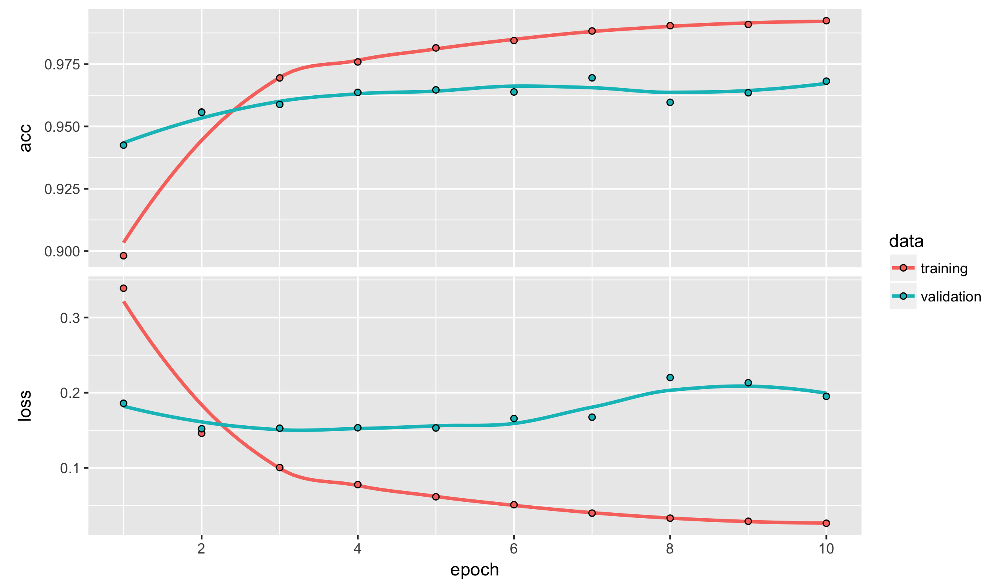
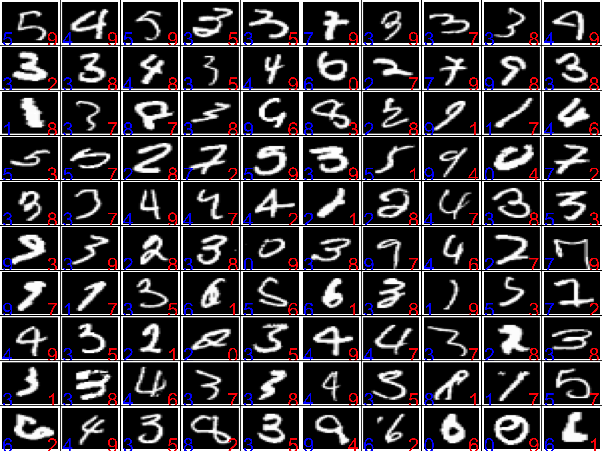
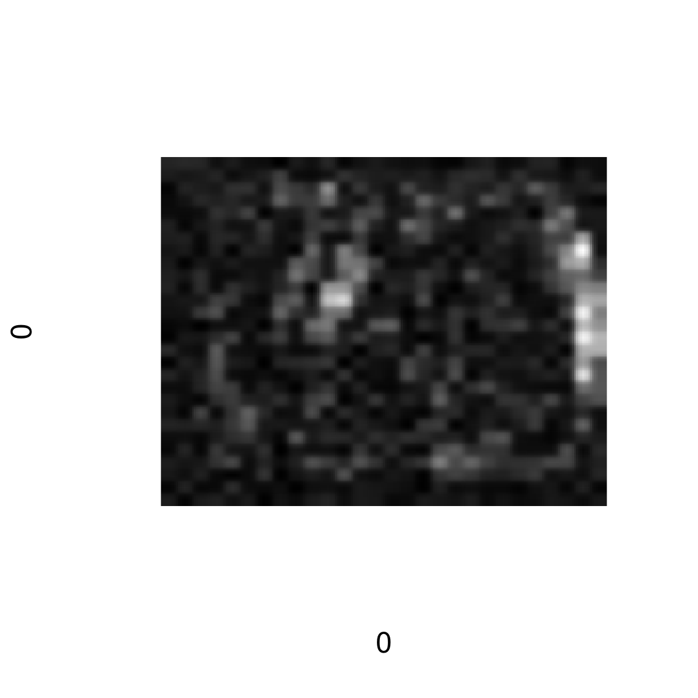


library(readr)
library(ggplot2)
library(dplyr)



## Warning: package 'dplyr' was built under R version 3.4.2



library(methods)
library(keras)



## Warning: package 'keras' was built under R version 3.4.2


## Flowers with Neural Networks


flowers <- read_csv("https://statsmaths.github.io/ml_data/flowers_17.csv")



## Parsed with column specification:
## cols(
##   obs_id = col_character(),
##   train_id = col_character(),
##   class = col_integer(),
##   class_name = col_character()
## )



x64 <- read_rds("~/gd/ml_data_raw/output_image_data/flowers_17_x64.rds")

X <- t(apply(x64, 1, cbind))
y <- flowers$class

X_train <- X[flowers$train_id == "train",]
y_train <- to_categorical(y[flowers$train_id == "train"], num_classes = 17)



model <- keras_model_sequential()
model %>%
  layer_dense(units = 128, input_shape = c(ncol(X_train))) %>%
  layer_activation(activation = "relu") %>%
  layer_dense(units = 128) %>%
  layer_activation(activation = "relu") %>%
  layer_dense(units = 128) %>%
  layer_activation(activation = "relu") %>%
  layer_dense(units = 17) %>%
  layer_activation(activation = "softmax")

model %>% compile(loss = 'categorical_crossentropy',
                  optimizer = optimizer_rmsprop(),
                  metrics = c('accuracy'))

model



## Model
## ___________________________________________________________________________
## Layer (type)                     Output Shape                  Param #     
## ===========================================================================
## dense_1 (Dense)                  (None, 128)                   1572992     
## ___________________________________________________________________________
## activation_1 (Activation)        (None, 128)                   0           
## ___________________________________________________________________________
## dense_2 (Dense)                  (None, 128)                   16512       
## ___________________________________________________________________________
## activation_2 (Activation)        (None, 128)                   0           
## ___________________________________________________________________________
## dense_3 (Dense)                  (None, 128)                   16512       
## ___________________________________________________________________________
## activation_3 (Activation)        (None, 128)                   0           
## ___________________________________________________________________________
## dense_4 (Dense)                  (None, 17)                    2193        
## ___________________________________________________________________________
## activation_4 (Activation)        (None, 17)                    0           
## ===========================================================================
## Total params: 1,608,209
## Trainable params: 1,608,209
## Non-trainable params: 0
## ___________________________________________________________________________



history <- model %>%
  fit(X_train, y_train, epochs = 100, validation_split = 0.2)
plot(history)


## MNIST


mnist <- read_csv("https://statsmaths.github.io/ml_data/mnist_10.csv")
X <- read_rds("~/gd/ml_data_raw/output_image_data/mnist_10_x28.rds")



dim(X)



## [1] 60000    28    28



par(mar = c(0,0,0,0))
par(mfrow = c(10, 10))
for (i in sample(which(mnist$class == 0), 100)) {
  plot(0,0,xlim=c(0,1),ylim=c(0,1),axes= FALSE,type = "n")
  rasterImage(X[i,,],0,0,1,1)
}



y <- mnist$class

X_train <- X[mnist$train_id == "train",,]
y_train <- to_categorical(y[mnist$train_id == "train"], num_classes = 10)



model <- keras_model_sequential()
model %>%
  layer_reshape(target_shape = c(28^2), input_shape = c(28, 28)) %>%
  layer_dense(units = 128) %>%
  layer_activation(activation = "relu") %>%
  layer_dense(units = 128) %>%
  layer_activation(activation = "relu") %>%
  layer_dense(units = 128) %>%
  layer_activation(activation = "relu") %>%
  layer_dense(units = 10) %>%
  layer_activation(activation = "softmax")

model %>% compile(loss = 'categorical_crossentropy',
                  optimizer = optimizer_rmsprop(),
                  metrics = c('accuracy'))

model



## Model
## ___________________________________________________________________________
## Layer (type)                     Output Shape                  Param #     
## ===========================================================================
## reshape_1 (Reshape)              (None, 784)                   0           
## ___________________________________________________________________________
## dense_5 (Dense)                  (None, 128)                   100480      
## ___________________________________________________________________________
## activation_5 (Activation)        (None, 128)                   0           
## ___________________________________________________________________________
## dense_6 (Dense)                  (None, 128)                   16512       
## ___________________________________________________________________________
## activation_6 (Activation)        (None, 128)                   0           
## ___________________________________________________________________________
## dense_7 (Dense)                  (None, 128)                   16512       
## ___________________________________________________________________________
## activation_7 (Activation)        (None, 128)                   0           
## ___________________________________________________________________________
## dense_8 (Dense)                  (None, 10)                    1290        
## ___________________________________________________________________________
## activation_8 (Activation)        (None, 10)                    0           
## ===========================================================================
## Total params: 134,794
## Trainable params: 134,794
## Non-trainable params: 0
## ___________________________________________________________________________



history <- model %>%
  fit(X_train, y_train, epochs = 10, validation_split = 0.2)
plot(history)



y_pred <- predict_classes(model, X)
tapply(y == y_pred, mnist$train_id, mean)



##   test  train  valid 
##     NA 0.9908 0.9680



table(y[mnist$train_id == "train"], y_pred[mnist$train_id == "train"])



##    
##        0    1    2    3    4    5    6    7    8    9
##   0 2991    0    0    0    1    1    2    2    3    0
##   1    0 2987    2    0    3    0    1    3    2    2
##   2    3    4 2977    0    1    0    4    4    7    0
##   3    0    3   15 2897    1   29    0   15   22   18
##   4    0    0    1    0 2980    0    3    6    1    9
##   5    2    1    0    3    1 2972    7    3    8    3
##   6    0    1    5    0    2    2 2988    0    2    0
##   7    0    1    3    0    2    1    0 2982    4    7
##   8    2    4    3    2    3    2    1    3 2976    4
##   9    0    1    0    3    2    1    0   10    9 2974



par(mar = c(0,0,0,0))
par(mfrow = c(10, 10))
for (i in sample(which(y_pred != y), 100)) {
  plot(0,0,xlim=c(0,1),ylim=c(0,1),axes= FALSE,type = "n")
  rasterImage(X[i,,],0,0,1,1)
  text(0.1,0.1,y[i],col="blue", cex = 3)
  text(0.9,0.1,y_pred[i],col="red", cex = 3)
  box()
}


## Visualize weights


layer <- get_layer(model, index = 2)
dim(layer$get_weights()[[1]])



## [1] 784 128



dim(layer$get_weights()[[2]])



## [1] 128



im <- matrix(layer$get_weights()[[1]], nrow = 28, ncol = 28)
im <- abs(im) / max(abs(im))
plot(0,0,xlim=c(0,1),ylim=c(0,1),axes= FALSE,type = "n")
rasterImage(im,0,0,1,1)


### Neural Network Regularization


model <- keras_model_sequential()
model %>%
  layer_reshape(target_shape = c(28^2), input_shape = c(28, 28)) %>%

  layer_dense(units = 512, kernel_initializer = "glorot_normal") %>%
  layer_activation(activation = "relu") %>%
  layer_dropout(rate = 0.5) %>%

  layer_dense(units = 512, kernel_initializer = "glorot_normal") %>%
  layer_activation(activation = "relu") %>%
  layer_dropout(rate = 0.5) %>%

  layer_dense(units = 512, kernel_initializer = "glorot_normal") %>%
  layer_activation(activation = "relu") %>%
  layer_dropout(rate = 0.5) %>%

  layer_dense(units = 512, kernel_initializer = "glorot_normal") %>%
  layer_activation(activation = "relu") %>%
  layer_dropout(rate = 0.5) %>%

  layer_dense(units = 10) %>%
  layer_activation(activation = "softmax")

model %>% compile(loss = 'categorical_crossentropy',
                  optimizer = optimizer_sgd(lr = 0.01, momentum = 0.9,
                                            nesterov = TRUE),
                  metrics = c('accuracy'))

model



## Model
## ___________________________________________________________________________
## Layer (type)                     Output Shape                  Param #     
## ===========================================================================
## reshape_2 (Reshape)              (None, 784)                   0           
## ___________________________________________________________________________
## dense_9 (Dense)                  (None, 512)                   401920      
## ___________________________________________________________________________
## activation_9 (Activation)        (None, 512)                   0           
## ___________________________________________________________________________
## dropout_1 (Dropout)              (None, 512)                   0           
## ___________________________________________________________________________
## dense_10 (Dense)                 (None, 512)                   262656      
## ___________________________________________________________________________
## activation_10 (Activation)       (None, 512)                   0           
## ___________________________________________________________________________
## dropout_2 (Dropout)              (None, 512)                   0           
## ___________________________________________________________________________
## dense_11 (Dense)                 (None, 512)                   262656      
## ___________________________________________________________________________
## activation_11 (Activation)       (None, 512)                   0           
## ___________________________________________________________________________
## dropout_3 (Dropout)              (None, 512)                   0           
## ___________________________________________________________________________
## dense_12 (Dense)                 (None, 512)                   262656      
## ___________________________________________________________________________
## activation_12 (Activation)       (None, 512)                   0           
## ___________________________________________________________________________
## dropout_4 (Dropout)              (None, 512)                   0           
## ___________________________________________________________________________
## dense_13 (Dense)                 (None, 10)                    5130        
## ___________________________________________________________________________
## activation_13 (Activation)       (None, 10)                    0           
## ===========================================================================
## Total params: 1,195,018
## Trainable params: 1,195,018
## Non-trainable params: 0
## ___________________________________________________________________________



history <- model %>%
  fit(X_train, y_train, epochs = 10,
      validation_split = 0.1, batch_size = 32)
plot(history)



y_pred <- predict_classes(model, X)
tapply(y == y_pred, mnist$train_id, mean)



##      test     train     valid 
##        NA 0.9841667 0.9687333



table(y[mnist$train_id == "train"], y_pred[mnist$train_id == "train"])



##    
##        0    1    2    3    4    5    6    7    8    9
##   0 2980    0    0    0    2    0    4    1    6    7
##   1    0 2965   10    0    5    1    0   10    7    2
##   2    6    1 2956    4    2    1    1   18    8    3
##   3    2    0   18 2925    0   14    0   16   18    7
##   4    1    2    7    1 2934    0    3    2    0   50
##   5    4    0    0   14    1 2955   16    1    6    3
##   6    5    3    1    0    2   10 2973    0    6    0
##   7    1    7   12    0    3    0    0 2953    1   23
##   8    2    6   13    5    5    9    4    3 2941   12
##   9    4    2    1    6   12   10    0   17    5 2943


Why is the training accuracy lower than the validation accuracy, particularly
for the first few epochs?

## Neural Network Internals

### Stochastic Gradient Descent

$$ \left( w^{(0)} - \eta \cdot \nabla_w f \right) \, \rightarrow \, w^{(1)} $$

$$ \begin{align} f(w) &= \sum_i (\widehat{y}_i(w) - y_i)^2 \\
        &= \sum_i f_i(w) \\
        \nabla_w f &= \sum_i \nabla_w f_i
    \end{align}$$

$$
\begin{align}
\left( w^{(0)} - (\eta / n) \cdot \nabla_{w^{(0)}} f_1 \right) \, &\rightarrow \, w^{(1)} \\
\left( w^{(1)} - (\eta / n) \cdot \nabla_{w^{(0)}} f_2 \right) \, &\rightarrow \, w^{(2)} \\
&\vdots \\
\left( w^{(n-1)} - (\eta / n) \cdot \nabla_{w^{(0)}} f_n \right) \, &\rightarrow \, w^{(n)} \\
\end{align}
$$

The $w^{(n)}$ here is exactly equivalent to the $w^{(1)}$ from before.

$$
\begin{align}
\left( w^{(0)} - \eta' \cdot \nabla_{w^{(0)}} f_1 \right) \, &\rightarrow \, w^{(1)} \\
\left( w^{(1)} - \eta' \cdot \nabla_{w^{(1)}} f_2 \right) \, &\rightarrow \, w^{(2)} \\
&\vdots \\
\left( w^{(n-1)} - \eta' \cdot \nabla_{w^{(n)}} f_n \right) \, &\rightarrow \, w^{(n)} \\
\end{align}
$$

### Backpropagation

$$ \begin{align} \widehat{Y} &= \sigma(X \cdot A) \cdot B \\
                 \widehat{Y} &= Z \cdot B \end{align} \\
                 $$

It will be easier to index of $A$ as a vector, with elements $a_i$ rather than
having to keep track of the 2-dimensional nature of the matrix.

$$ \frac{\partial f}{\partial a_{i}} =
    \sum_k \frac{\partial z_{k}}{\partial a_{i}} \cdot \frac{\partial f}{\partial z_{k}} $$

$$ \frac{\partial f}{\partial z_{k}} =
    \sum_j \frac{\partial \widehat{y}_{j}}{\partial z_{k}} \cdot \frac{\partial f}{\partial \widehat{y}_{j}} $$

