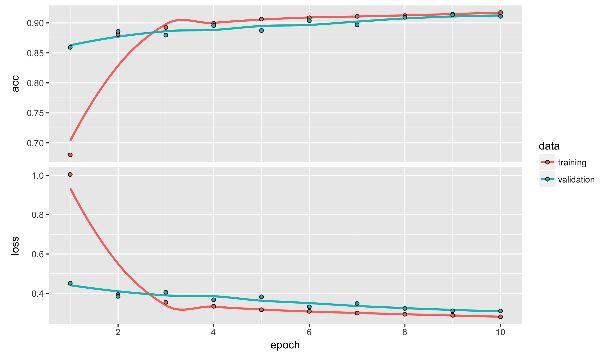
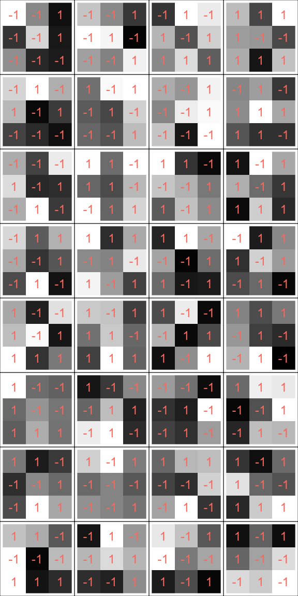
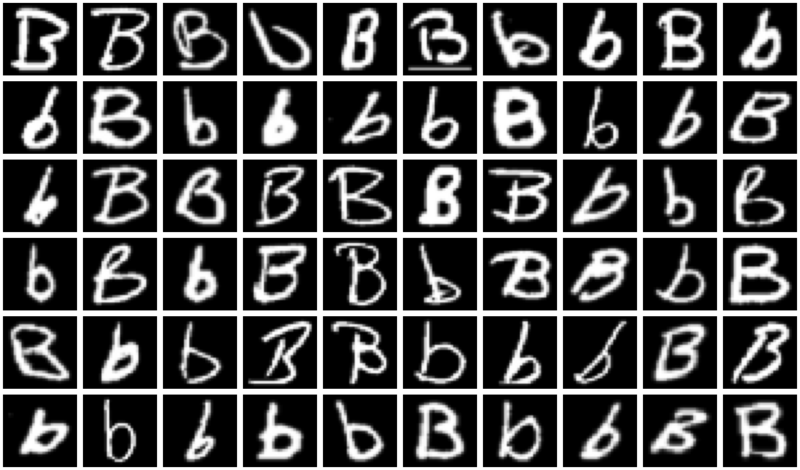
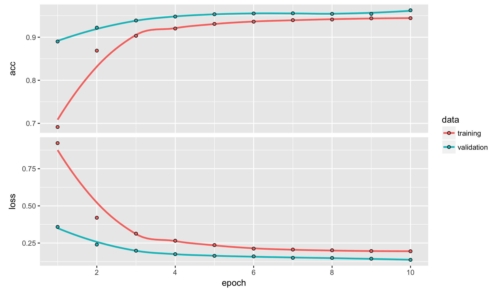
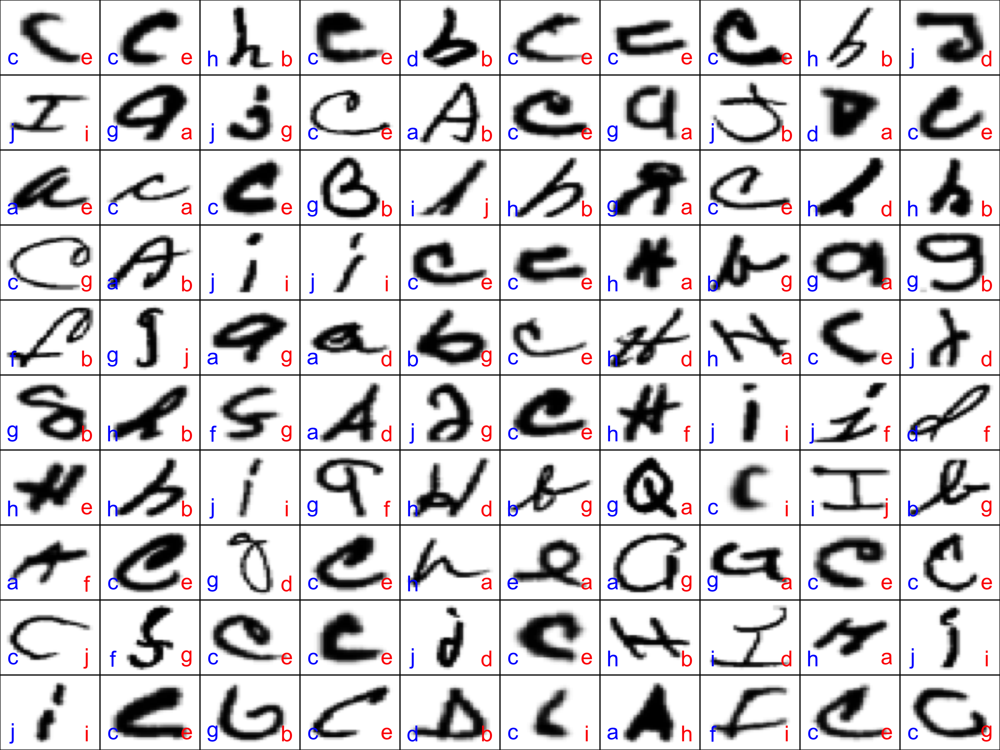


library(readr)
library(ggplot2)
library(dplyr)



## Warning: package 'dplyr' was built under R version 3.4.2



library(methods)
library(keras)



## Warning: package 'keras' was built under R version 3.4.2


## Local Weights in Neural Networks

We know that it is possible to unravel the pixel counts
describing an image to turn images into high-dimensional
matrix. The columns from this can be put into an elastic net or a
neural network to train much as we would with any other
numeric dataset. There is, however, quite a lot of information
contained in the structure of the image data that we are losing
by this approach. Ideally, we would use the information about the
fact that some pixels as close to one another and that certain
color channels describe the same or neighboring pixels.

The solution is to use convolutional neural networks (CNNs).
Despite their name, CNNs are not actually a different kind of
neural network but instead refer to a particular kind of layer in
a neural network. In a purely pragmatic sense of writing the
code, adding convolutional layers into a keras model is very
easy. Understanding what they are actually doing, however,
can sometimes be difficult. Today we will spend some time
trying to build up to convolutional layers before showing
how they work on our data.

## Convolutions for edge detection

We will start by considering convolutions created manually
outside of a neural network. To start, we need a kernel
matrix. Let's use a kernel with one row and 2 columns:

$$ k = [1, -1] $$

The convolution implied by this kernel takes the pixels in
an image and subtracts the value of the pixel value to its
immediate right. If the input image has a resolution of
28-by-28, what size and shape with the result of this
convolution be? Without modification, it needs to be 28-by-27.
The lost column comes because we do not have a way of applying
the convolution to pixels in the right-most column of the image.
This is usually fixed (keeping the image size constant is
useful) by adding a virtual column of 0's. With this, the
result of the convolution is another image of size 28-by-28.

Let's apply this to a small example. Here we have an input "image"
of only 8-by-8. The image seems to show something like a capital
letter "L".


x <- matrix(0, ncol = 8, nrow = 8)
x[2:7, 2] <- c(0.7, 0.7, 0.7, 0.7, 0.7, 0.7)
x[7, 3:5] <- c(0.7, 0.7, 0.7)
x



##      [,1] [,2] [,3] [,4] [,5] [,6] [,7] [,8]
## [1,]    0  0.0  0.0  0.0  0.0    0    0    0
## [2,]    0  0.7  0.0  0.0  0.0    0    0    0
## [3,]    0  0.7  0.0  0.0  0.0    0    0    0
## [4,]    0  0.7  0.0  0.0  0.0    0    0    0
## [5,]    0  0.7  0.0  0.0  0.0    0    0    0
## [6,]    0  0.7  0.0  0.0  0.0    0    0    0
## [7,]    0  0.7  0.7  0.7  0.7    0    0    0
## [8,]    0  0.0  0.0  0.0  0.0    0    0    0


By constructing the variable x2 as version of x padded with zeros,
we can apply the kernel matrix as follows:


z <- matrix(0, ncol = 8, nrow = 8)
x2 <- cbind(x, 0)
kernel <- matrix(c(1, -1), nrow = 1)
for (i in seq_len(nrow(x))) {
  for (j in seq_len(ncol(x))) {
    z[i, j] <- sum(x2[i, j:(j+1), drop = FALSE] * kernel)
  }
}
z



##      [,1] [,2] [,3] [,4] [,5] [,6] [,7] [,8]
## [1,]  0.0  0.0    0    0  0.0    0    0    0
## [2,] -0.7  0.7    0    0  0.0    0    0    0
## [3,] -0.7  0.7    0    0  0.0    0    0    0
## [4,] -0.7  0.7    0    0  0.0    0    0    0
## [5,] -0.7  0.7    0    0  0.0    0    0    0
## [6,] -0.7  0.7    0    0  0.0    0    0    0
## [7,] -0.7  0.0    0    0  0.7    0    0    0
## [8,]  0.0  0.0    0    0  0.0    0    0    0


Typically we will apply a ReLU activation to the output of
a convolution, so we care only about the positive values.
Notice here that almost all of these occur where there is
a vertical edge to the capital "L". There is also one bit of
an activation at the end of the bottom part of the letter.

Now, consider a different kernel given by a matrix with
one column and two rows:

$$ k = \left[\begin{array}{c} 1 \\ -1 \end{array} \right] $$

To apply this, we take each pixel value and subtract the value
immediately below it in the image. By padding the input with an
extra row of 0's, we can get an output image that is the same
size as the input. Let's apply this to the matrix `x` as well:


y <- matrix(0, ncol = 8, nrow = 8)
x2 <- rbind(x, 0)
kernel <- matrix(c(1, -1), ncol = 1)
for (i in seq_len(nrow(x))) {
  for (j in seq_len(ncol(x))) {
    y[i, j] <- sum(x2[i:(i+1), j, drop = FALSE] * kernel)
  }
}
y



##      [,1] [,2] [,3] [,4] [,5] [,6] [,7] [,8]
## [1,]    0 -0.7  0.0  0.0  0.0    0    0    0
## [2,]    0  0.0  0.0  0.0  0.0    0    0    0
## [3,]    0  0.0  0.0  0.0  0.0    0    0    0
## [4,]    0  0.0  0.0  0.0  0.0    0    0    0
## [5,]    0  0.0  0.0  0.0  0.0    0    0    0
## [6,]    0  0.0 -0.7 -0.7 -0.7    0    0    0
## [7,]    0  0.7  0.7  0.7  0.7    0    0    0
## [8,]    0  0.0  0.0  0.0  0.0    0    0    0


The positive values from this kernel all occur on the bottom edge of
the "L". So the first kernel detects vertical edges and the second
one detects horizontal images. Presumably, knowing where in the image
these types of lines are would be very helpful in identifying digits,
fashion items, letters, and other types of objects.

If we have a training set here of 1000 images, our input data
will have a dimension of

$$ 1000 \times 8 \times 8 \times 1 $$

Because these are 8-by-8 black and white images. What is the dimension
after applying these two kernels? Well, for each kernel we have an
image of the same size as the original, so we have

$$ 1000 \times 8 \times 8 \times 2 $$

Each of the outputs from the kernels is called a filter. Here we have
two filters. You can think of these similarly to the red, green, and blue
components of a color image. Each filter tells something useful about a
particular part of the original image. Here, it tells whether there is
a vertical edge (first component) or horizontal edge (second component).

We could apply another convolution to the output of the first set of
convolutions. The kernel here would need to be three dimensional, with
a depth of 2, because it has to say what to do with each of the two
filters. Likewise, a kernel for an input color image needs three dimensions
as well.

Once we have applied convolutions, you an imagine for most applications
we do not care exactly where edges or any other features are found. For
digit detection we instead just care *generally* where edges of a
particular type are found. With a large number of filters, the data
size after a convolution can also quickly become quite large. A solution
to this is known as *max pooling*. We reduce the width and height of
each input by a factor of two by dividing the image into 2-by-2 blocks
and taking the maximum value of each filter within a block. Here, we
apply max pooling, as well as ReLU activations, to the values in the
vertical filter:


relu <- function(mat) {
  id <- which(mat <= 0)
  mat[id] <- 0
  mat
}

w <- matrix(0, ncol = 4, nrow = 4)
for (i in seq_len(nrow(x) / 2)) {
  for (j in seq_len(ncol(x) / 2)) {
    box <- relu(z[(2*i-1):(2*i), (2*j-1):(2*j)])
    w[i, j] <- max(box)
  }
}
w



##      [,1] [,2] [,3] [,4]
## [1,]  0.7    0  0.0    0
## [2,]  0.7    0  0.0    0
## [3,]  0.7    0  0.0    0
## [4,]  0.0    0  0.7    0


In theory, we can pool using other sizes, such as a grid of 3-by-3
points. However, the 2-by-2 is the most common and rarely do we need
anything else.

If we apply max pooling, the dataset now has a size of:

$$ 1000 \times 4 \times 4 \times 2 $$

Consider another convolution with 5 filters. The resulting size
becomes:

$$ 1000 \times 4 \times 4 \times 5 $$

With max pooling again, we get:

$$ 1000 \times 2 \times 2 \times 5 $$

Once we have used enough combinations of pooling and convolution, the
array can *then* be unravelled to form a dataset of size

$$ 1000 \times 20 $$

This data is small relative to the input and has already learned
localized features. A dense neural network can then use it to produce
predicted probabilities.

##

Now, we will apply convolutions and max pooling the context of an
actual neural network. This is exactly the same as described in our
small example above, however the values of the weights in the kernels
are learned from the data rather than being pre-determined. This means
that they have the power to detect patterns we would not have thought
of, but it also comes at the cost of not longer being able to describe
exactly what each filter is doing.

We start by working with the MNIST dataset again. We need
the data to remain in its array-format, so we will not collapse
it into a matrix this time.


mnist <- read_csv("https://statsmaths.github.io/ml_data/mnist_10.csv")
X <- read_rds("~/gd/ml_data_raw/output_image_data/mnist_10_x28.rds")
y <- mnist$class

X_train <- X[mnist$train_id == "train",,,,drop = FALSE]
y_train <- to_categorical(y[mnist$train_id == "train"], num_classes = 10)


We now build a simple convolution neural network, with just
one convolutional layer with 16 filters, followed by max pooling.
Typically, unlike our example above, we use square kernels. Most
often these are of size 2-by-2, though 3-by-3 and even 5-by-5 are
seen in certain architectures. Note that we need to fully
describe the correct dimension of `X_train`. We also need a
layer called `layer_flatten` when going from the convolutional
part of the network to the dense part.


model <- keras_model_sequential()
model %>%
  layer_conv_2d(filters = 16, kernel_size = c(2, 2),
                  input_shape = dim(X_train)[-1],
                  padding = "same") %>%
  layer_max_pooling_2d(pool_size = c(2, 2)) %>%
  layer_activation(activation = "sigmoid") %>%
  layer_flatten() %>%

  layer_dense(units = 10) %>%
  layer_activation(activation = "softmax")
model %>% compile(loss = 'categorical_crossentropy',
                  optimizer = optimizer_sgd(lr = 0.01, momentum = 0.8),
                  metrics = c('accuracy'))
model



## Model
## ___________________________________________________________________________
## Layer (type)                     Output Shape                  Param #     
## ===========================================================================
## conv2d_1 (Conv2D)                (None, 28, 28, 16)            80          
## ___________________________________________________________________________
## max_pooling2d_1 (MaxPooling2D)   (None, 14, 14, 16)            0           
## ___________________________________________________________________________
## activation_1 (Activation)        (None, 14, 14, 16)            0           
## ___________________________________________________________________________
## flatten_1 (Flatten)              (None, 3136)                  0           
## ___________________________________________________________________________
## dense_1 (Dense)                  (None, 10)                    31370       
## ___________________________________________________________________________
## activation_2 (Activation)        (None, 10)                    0           
## ===========================================================================
## Total params: 31,450
## Trainable params: 31,450
## Non-trainable params: 0
## ___________________________________________________________________________


Setting `padding` to "same" is what maxes it so that the first layer
outputs images of size 28-by-28.


history <- model %>% fit(X_train, y_train, epochs = 10,
      validation_split = 0.1)
plot(history)


Notice that this model does not have many weight compared to the
neural networks we used last time. It takes a fairly long time to
run, though, given its size. The reason is that convolutions generally
do not have a large weights because for each filter we are only learning
2-by-2-by-(num prior filters) values, unlike the dense layers that
connect everything in one layer to everything in the prior layer.
Computing the gradient and the inputs to the next layer, however, take
a long time because we have to apply each kernel to the entire image.

### Visualize the kernels

Much as we did with the weights in the dense neural networks, we can
visualize the kernels learned by the neural network. To start, make
sure that the sizes of the weights in the convolutional layer
make sense:


layer <- get_layer(model, index = 1)
dim(layer$get_weights()[[1]])



## [1]  2  2  1 16



dim(layer$get_weights()[[2]])



## [1] 16


The 16 in each refers to the specific kernel, with all 16 put into
a single 4-dimensional array.


par(mar = c(0,0,0,0))
par(mfrow = c(4, 4))
for (i in 1:16) {
  wg <- layer$get_weights()[[1]][,,,i]
  im <- abs(wg) / max(abs(wg))
  plot(0,0,xlim=c(0,1),ylim=c(0,1),axes= FALSE,type = "n")
  rasterImage(im,0,0,1,1,interpolate=FALSE)
  box()
}


There is not much we can directly do with these, but it is good to
see them in order to check whether you understand what these
convolutions are doing to the input image.

### Le-Net for MNIST-10 (1995)

Yann LeCun, one of the creators of the MNIST-10 dataset, was a
pioneer of using CNNs. His 1995 paper provided one of the first
examples where CNNs produced state-of-the-art results for image
classification:

- LeCun, Yann, et al. "Learning algorithms for classification: A comparison on handwritten digit recognition." *Neural networks: the statistical mechanics perspective* 261 (1995): 276.

I have tried to reproduce his exact model and training technique
here in keras. As techniques were not standardized at the time, this
only approximate, but gets to the general point of how powerful these
CNNs are.


model <- keras_model_sequential()
model %>%
  layer_conv_2d(filters = 6, kernel_size = c(5, 5),
                  input_shape = c(28, 28, 1)) %>%
  layer_max_pooling_2d(pool_size = c(2, 2)) %>%
  layer_activation(activation = "sigmoid") %>%

  layer_conv_2d(16, kernel_size = c(5, 5)) %>%
  layer_max_pooling_2d(pool_size = c(2, 2)) %>%
  layer_activation(activation = "sigmoid") %>%

  layer_conv_2d(120, kernel_size = c(1, 1)) %>%

  layer_flatten() %>%

  layer_dense(units = 84) %>%
  layer_activation(activation = "sigmoid") %>%
  layer_dense(units = 10) %>%
  layer_activation(activation = "softmax")


To fit the model, we do SGD with a large learning rate that is
manually decreased after a handful of epochs. Remember, in 1995
computers were not nearly as powerful as what they are today,
so it was feasible to only run a limited number of epochs even
on a large research project and with the resources at AT&T Bell
Labs.


model %>% compile(loss = 'categorical_crossentropy',
                  optimizer = optimizer_sgd(lr = 0.1, momentum = 0.8),
                  metrics = c('accuracy'))
model %>% fit(X_train, y_train, epochs = 2,
      validation_split = 0.1)
model %>% compile(loss = 'categorical_crossentropy',
                  optimizer = optimizer_sgd(lr = 0.08, momentum = 0.8),
                  metrics = c('accuracy'))
model %>% fit(X_train, y_train, epochs = 3,
      validation_split = 0.1)
model %>% compile(loss = 'categorical_crossentropy',
                  optimizer = optimizer_sgd(lr = 0.04, momentum = 0.8),
                  metrics = c('accuracy'))
model %>% fit(X_train, y_train, epochs = 3,
      validation_split = 0.1)
model %>% compile(loss = 'categorical_crossentropy',
                  optimizer = optimizer_sgd(lr = 0.02, momentum = 0.8),
                  metrics = c('accuracy'))
model %>% fit(X_train, y_train, epochs = 4,
      validation_split = 0.1)
model %>% compile(loss = 'categorical_crossentropy',
                  optimizer = optimizer_sgd(lr = 0.008, momentum = 0.8),
                  metrics = c('accuracy'))
model %>% fit(X_train, y_train, epochs = 4,
      validation_split = 0.1)


The prediction here is fairly good, and better than the dense
networks I had last time.


y_pred <- predict_classes(model, X)
tapply(y == y_pred, mnist$train_id, mean)



##      test     train     valid 
##        NA 0.9944000 0.9806667


This is not quite as good as the 99% accuracy reported in the paper.
Likely this is due to using both the training and validation sets
as well as some tweaks Yann LeCun and company used that
was not fully documented in their paper. This is a common but
frustrating patter than occurs often in neural network literature.

## EMNIST

The EMNIST dataset is a relatively new dataset constructed by NIST.
It matches the data from the handwritten digits in size, but uses
letters rather than numbers. For size reasons, here we will look at
just the first ten letters of the alphabet.

Let's read the data in now:


emnist <- read_csv("https://statsmaths.github.io/ml_data/emnist_10.csv")
X <- read_rds("~/gd/ml_data_raw/output_image_data/emnist_10_x28.rds")
y <- emnist$class
y_label <- emnist$class_name
X_train <- X[emnist$train_id == "train",,,,drop = FALSE]
y_train <- to_categorical(y[emnist$train_id == "train"], num_classes = 10)


Notice that the dataset includes both upper and lower case letters,
making the task in theory more difficult than the MNIST data.


par(mar = c(0,0,0,0))
par(mfrow = c(6, 10))
for (i in sample(which(emnist$class == 1), 60)) {
  plot(0,0,xlim=c(0,1),ylim=c(0,1),axes= FALSE,type = "n")
  rasterImage(X[i,,,],0,0,1,1)
}


Here is a much larger CNN model for use with the EMNIST dataset.
It follows some typical design patterns, namely:

- uses 2-by-2 kernels with a power of 2 number of filters
- uses ReLU activations throughout
- uses "double convolutions"; that is, one convolution followed
  by another without a pooling layer in between
- uses a 2-by-2 max pooling layer and dropout after the
  double convolution
- top layers use power of 2 number of nodes, with a uniform
  number in each layer
- drop out at the last layer, along with a softmax activation
- padding uses the "same" logic, to make max pooling even (i.e.,
  it keep dimensions factorizable by a power of 2)

And here is the actual model:


model <- keras_model_sequential()
model %>%
  layer_conv_2d(filters = 32, kernel_size = c(2,2),
                  input_shape = c(28, 28, 1),
                  padding = "same") %>%
  layer_activation(activation = "relu") %>%
  layer_conv_2d(filters = 32, kernel_size = c(2,2),
                padding = "same") %>%
  layer_activation(activation = "relu") %>%
  layer_max_pooling_2d(pool_size = c(2, 2)) %>%
  layer_dropout(rate = 0.5) %>%

  layer_conv_2d(filters = 32, kernel_size = c(2,2),
                padding = "same") %>%
  layer_activation(activation = "relu") %>%
  layer_conv_2d(filters = 32, kernel_size = c(2,2),
                padding = "same") %>%
  layer_activation(activation = "relu") %>%
  layer_max_pooling_2d(pool_size = c(2, 2)) %>%
  layer_dropout(rate = 0.5) %>%

  layer_flatten() %>%
  layer_dense(units = 128) %>%
  layer_activation(activation = "relu") %>%
  layer_dense(units = 128) %>%
  layer_activation(activation = "relu") %>%
  layer_dropout(rate = 0.5) %>%
  layer_dense(units = 10) %>%
  layer_activation(activation = "softmax")

model %>% compile(loss = 'categorical_crossentropy',
                  optimizer = optimizer_rmsprop(),
                  metrics = c('accuracy'))

model



## Model
## ___________________________________________________________________________
## Layer (type)                     Output Shape                  Param #     
## ===========================================================================
## conv2d_5 (Conv2D)                (None, 28, 28, 32)            160         
## ___________________________________________________________________________
## activation_7 (Activation)        (None, 28, 28, 32)            0           
## ___________________________________________________________________________
## conv2d_6 (Conv2D)                (None, 28, 28, 32)            4128        
## ___________________________________________________________________________
## activation_8 (Activation)        (None, 28, 28, 32)            0           
## ___________________________________________________________________________
## max_pooling2d_4 (MaxPooling2D)   (None, 14, 14, 32)            0           
## ___________________________________________________________________________
## dropout_1 (Dropout)              (None, 14, 14, 32)            0           
## ___________________________________________________________________________
## conv2d_7 (Conv2D)                (None, 14, 14, 32)            4128        
## ___________________________________________________________________________
## activation_9 (Activation)        (None, 14, 14, 32)            0           
## ___________________________________________________________________________
## conv2d_8 (Conv2D)                (None, 14, 14, 32)            4128        
## ___________________________________________________________________________
## activation_10 (Activation)       (None, 14, 14, 32)            0           
## ___________________________________________________________________________
## max_pooling2d_5 (MaxPooling2D)   (None, 7, 7, 32)              0           
## ___________________________________________________________________________
## dropout_2 (Dropout)              (None, 7, 7, 32)              0           
## ___________________________________________________________________________
## flatten_3 (Flatten)              (None, 1568)                  0           
## ___________________________________________________________________________
## dense_4 (Dense)                  (None, 128)                   200832      
## ___________________________________________________________________________
## activation_11 (Activation)       (None, 128)                   0           
## ___________________________________________________________________________
## dense_5 (Dense)                  (None, 128)                   16512       
## ___________________________________________________________________________
## activation_12 (Activation)       (None, 128)                   0           
## ___________________________________________________________________________
## dropout_3 (Dropout)              (None, 128)                   0           
## ___________________________________________________________________________
## dense_6 (Dense)                  (None, 10)                    1290        
## ___________________________________________________________________________
## activation_13 (Activation)       (None, 10)                    0           
## ===========================================================================
## Total params: 231,178
## Trainable params: 231,178
## Non-trainable params: 0
## ___________________________________________________________________________



history <- model %>%
  fit(X_train, y_train, epochs = 10,
      validation_split = 0.1)
plot(history)


Given the added difficulty of this task, our result of 96% is
not a bad start.


y_pred <- predict_classes(model, X)
tapply(y == y_pred, emnist$train_id, mean)



##      test     train     valid 
##        NA 0.9530417 0.9444167


For the next lab you'll be working with the EMNIST dataset, but
using a different subset of the letters.

### Negative examples, again

Which letters are the hardest to distinguish?


y_pred <- predict_classes(model, X)
table(y_label[emnist$train_id == "train"],
      letters[y_pred[emnist$train_id == "train"] + 1])



##    
##        a    b    c    d    e    f    g    h    i    j
##   a 2302   24    2   18   22    4   27    0    1    0
##   b    2 2359    0   10    6    2   20    1    0    0
##   c   10    3 2030    1  337    3    9    0    5    2
##   d   22   31    0 2333    3    2    3    1    0    5
##   e    7    1    5    2 2373    6    2    1    1    2
##   f    1    2    0    2   12 2368    6    1    7    1
##   g   53   43    1    5   12    4 2275    0    0    7
##   h   49   59    0   25    5   17   11 2230    2    2
##   i    1    0    2    2    4    2    1    1 2357   30
##   j    9    6    1   35    1    6   21    0   75 2246


Looks like the hardest to classify are "a" and "g",
followed by "g" and "b"; as well as " "h" and "a"
(likely all lower case versions).


par(mar = c(0,0,0,0))
par(mfrow = c(10, 10))
for (i in sample(which(y_pred != y), 100)) {
  plot(0,0,xlim=c(0,1),ylim=c(0,1),axes= FALSE,type = "n")
  rasterImage(1 - X[i,,,],0,0,1,1)
  text(0.1,0.2,letters[y[i] + 1], col="blue", cex = 2)
  text(0.9,0.2,letters[y_pred[i] + 1], col="red", cex = 2)
  box()
}


The blue letter gives the initial value and red the predicted value. It
is generally a good sign that many of these are hard for us to max
out as well. Some of them, in fact, I would have guess the same as the
neural network even though in theory they were not the "correct" labels.

