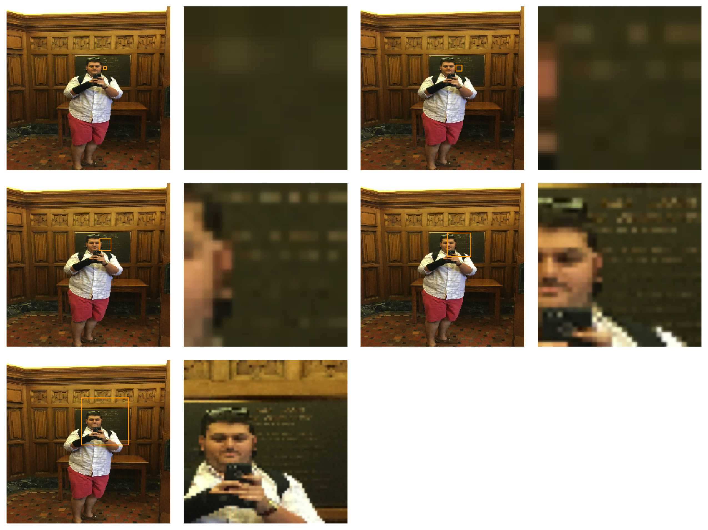
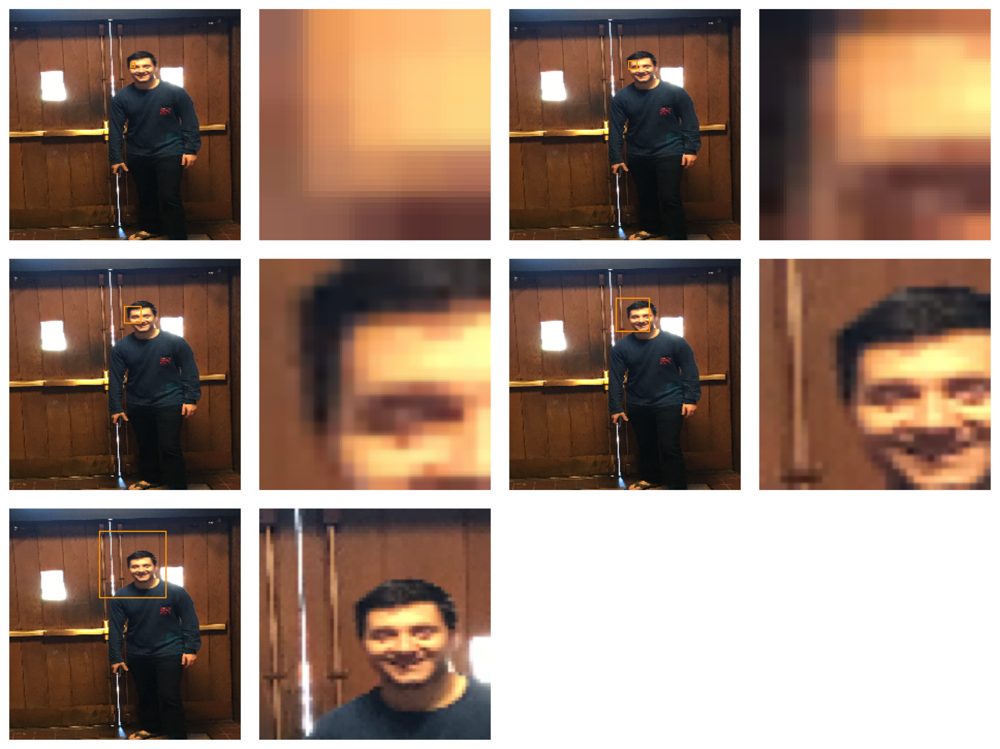
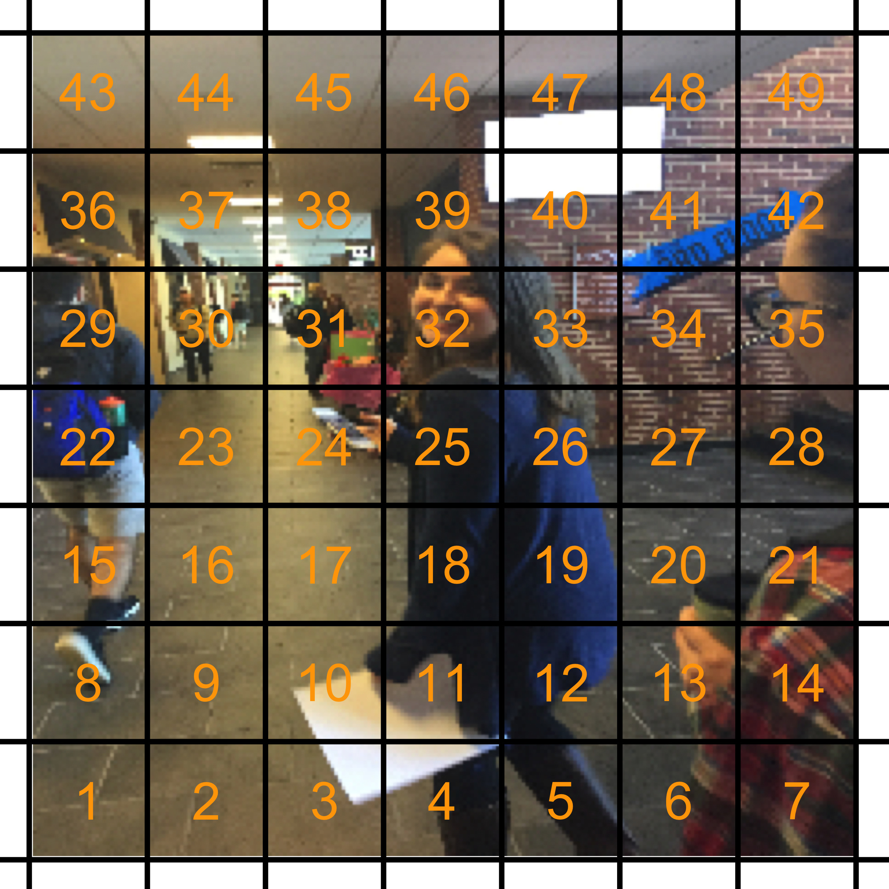
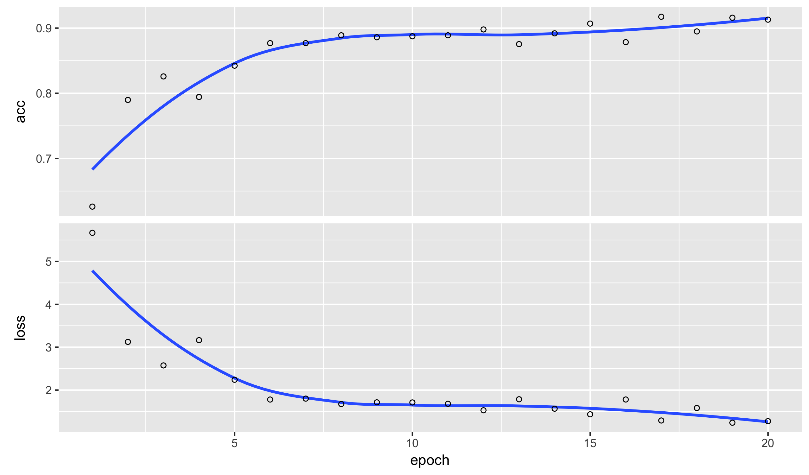
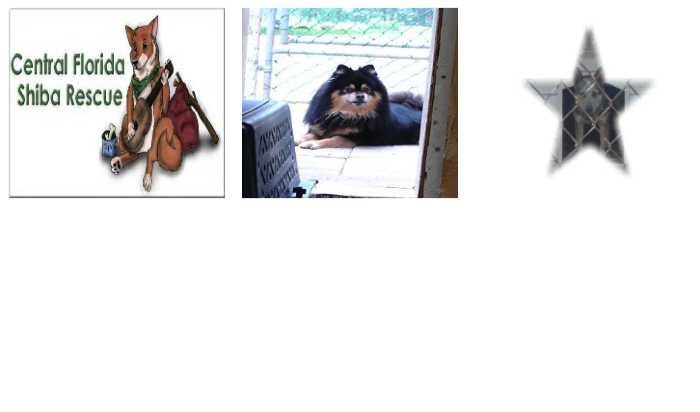
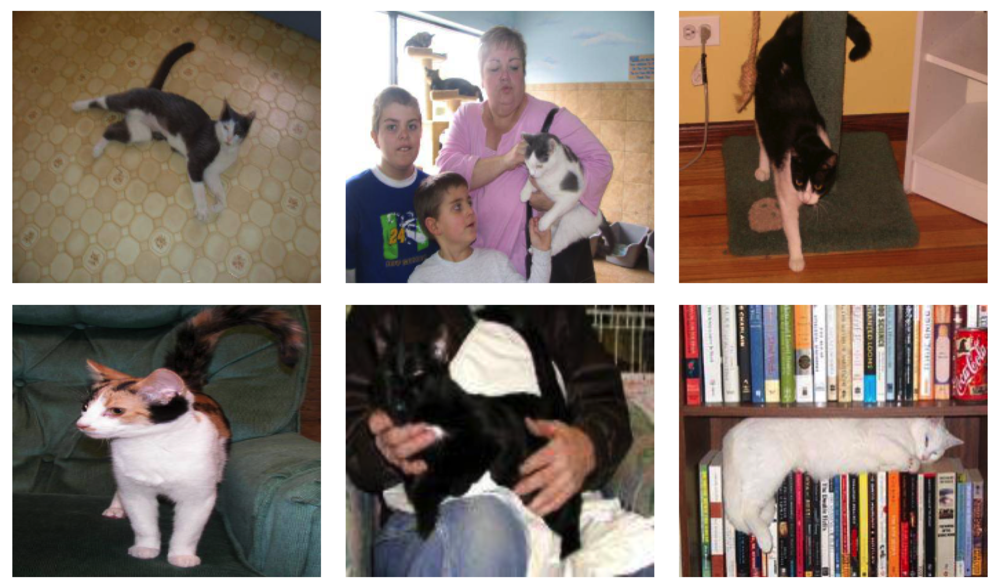
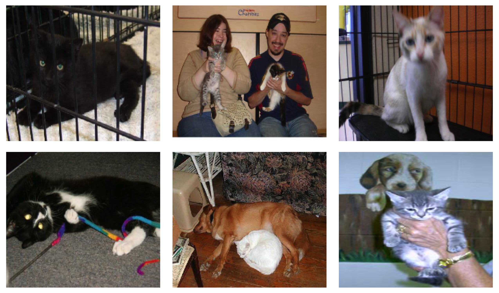
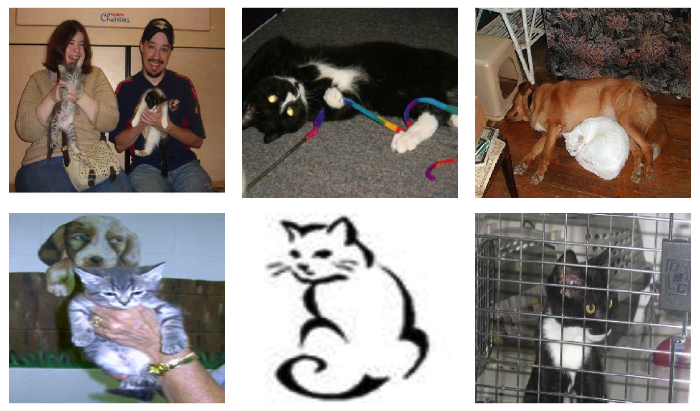
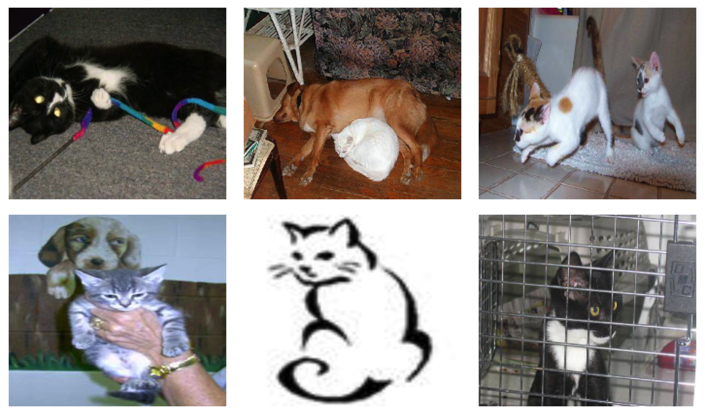
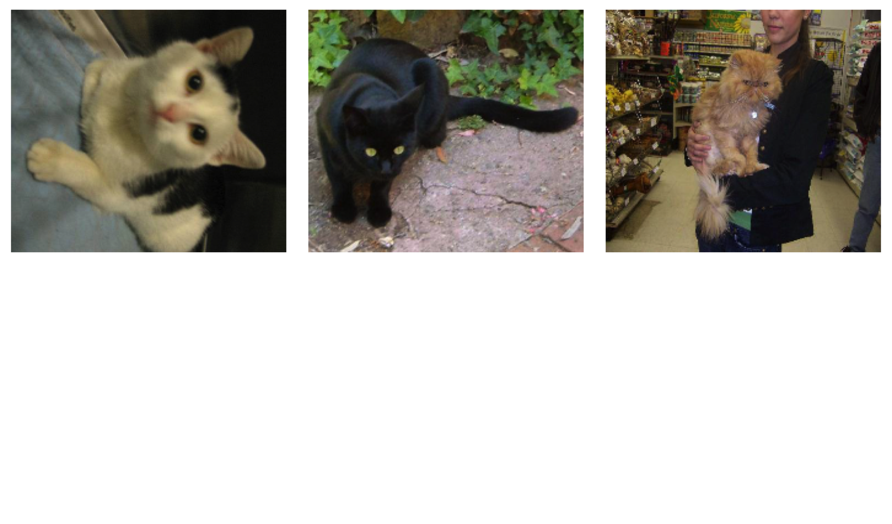


library(readr)
library(ggplot2)
library(dplyr)
library(methods)
library(keras)


## Classifying complex image - Transfer learning

We have already seen several examples of classifying image corpora. When
detecting whether our class photographs were taken inside or outside, the
algorithm primarily used color to detect the brightness and spectrum to
see if it looked like sunlight (more blue) or artificial light (more red).
With the flowers dataset we used color as well as texture to figure out
what type of flower was shown in the image. With the MNIST, Fashion MNIST,
and EMNIST datasets neural networks were used to detect and classify
more complex features such as shape and location in the image.

In the world of image classification, all of these tasks are fairly easy.
The first few only needed average values of pixels at a very low resolution.
The latter ones were zoomed in, centered, and standardized in size and
orientation. Most classification tasks out in the wild are much more complex.

How would we go about solving these types of problems? The simple answer is
that you need millions of images, a very deep and large convolutional
neural network, and a large computing cluster with access to many
expensive GPUs.

The good news is that there is a solution for all of us that do not have
access to such large datasets. Recall that a convolutional neural network
usually consists of several convolutional layers followed by a flattening
operation and dense layers. It turns out that if a deep neural network
is trained with a large corpus of images, the lower convolutional layers
pick out features that can be used for other image processing tasks. We
can actually think of the CNN layers as doing feature extraction, much
like we did with the textual data when counting tokens and character
shingles.

The reason this is so helpful is that many groups (those with access to
large computing resources) have published their trained models. We can
fit just lower levels of these models to new training data, and then use
the output of this in our own models. These could be more neural networks,
but there is nothing stopping us from using a different model on the
learned features. This process is called *transfer learning*. It
is one of the most important features of neural networks. Otherwise it
would only be possible for a limited number of research groups to make
real use of these techniques.

Today, we will apply transfer learning to two tasks: face detection in
our class dataset and detecting whether an image contains a dog or a
cat.

## VGG16

The **keras** package provides several pre-trained models for us to
use. At the current moment there are:

- `application_inception_v3`:  Szegedy, Christian, et al. "Rethinking the inception architecture for computer vision." *Proceedings of the IEEE Conference on Computer Vision and Pattern Recognition.* 2016.
- `application_vgg16`: Simonyan, Karen, and Andrew Zisserman. "Very deep convolutional networks for large-scale image recognition." arXiv preprint arXiv:1409.1556 (2014).
- `application_vgg19`: Simonyan, Karen, and Andrew Zisserman. "Very deep convolutional networks for large-scale image recognition." arXiv preprint arXiv:1409.1556 (2014).
- `application_mobilenet`: Howard, Andrew G., et al. "Mobilenets: Efficient convolutional neural networks for mobile vision applications." arXiv preprint arXiv:1704.04861 (2017).
- `application_resnet50`: He, Kaiming, et al. "Deep residual learning for image recognition." *Proceedings of the IEEE conference on computer vision and pattern recognition.* 2016.
- `application_xception`: Chollet, François. "Xception: Deep Learning with Depthwise Separable Convolutions." arXiv preprint arXiv:1610.02357 (2016).

These were all trained on the same corpus from the **ImageNet Challenge**,
which includes images from 1000 categories all scaled to 224 by 224 pixels.
The images look something like this:

For more information about the corpus, see the paper here:

- Olga Russakovsky, Jia Deng, Hao Su, Jonathan Krause, Sanjeev Satheesh, Sean Ma, Zhiheng Huang, Andrej Karpathy, Aditya Khosla, Michael Bernstein, Alexander C. Berg and Li Fei-Fei.  *ImageNet Large Scale Visual Recognition Challenge. IJCV,* 2015.

We are going to use the VGG16 model. It comes from the Visual Geometry
Group at Oxford. The 16 refers to their being 16 trainable layers in the
neural network. Let's load the model, which includes trained weights and
look at the architecture.


vgg16 <- application_vgg16(weights = 'imagenet', include_top = TRUE)
vgg16



## Model
## ___________________________________________________________________________
## Layer (type)                     Output Shape                  Param #     
## ===========================================================================
## input_1 (InputLayer)             (None, 224, 224, 3)           0           
## ___________________________________________________________________________
## block1_conv1 (Conv2D)            (None, 224, 224, 64)          1792        
## ___________________________________________________________________________
## block1_conv2 (Conv2D)            (None, 224, 224, 64)          36928       
## ___________________________________________________________________________
## block1_pool (MaxPooling2D)       (None, 112, 112, 64)          0           
## ___________________________________________________________________________
## block2_conv1 (Conv2D)            (None, 112, 112, 128)         73856       
## ___________________________________________________________________________
## block2_conv2 (Conv2D)            (None, 112, 112, 128)         147584      
## ___________________________________________________________________________
## block2_pool (MaxPooling2D)       (None, 56, 56, 128)           0           
## ___________________________________________________________________________
## block3_conv1 (Conv2D)            (None, 56, 56, 256)           295168      
## ___________________________________________________________________________
## block3_conv2 (Conv2D)            (None, 56, 56, 256)           590080      
## ___________________________________________________________________________
## block3_conv3 (Conv2D)            (None, 56, 56, 256)           590080      
## ___________________________________________________________________________
## block3_pool (MaxPooling2D)       (None, 28, 28, 256)           0           
## ___________________________________________________________________________
## block4_conv1 (Conv2D)            (None, 28, 28, 512)           1180160     
## ___________________________________________________________________________
## block4_conv2 (Conv2D)            (None, 28, 28, 512)           2359808     
## ___________________________________________________________________________
## block4_conv3 (Conv2D)            (None, 28, 28, 512)           2359808     
## ___________________________________________________________________________
## block4_pool (MaxPooling2D)       (None, 14, 14, 512)           0           
## ___________________________________________________________________________
## block5_conv1 (Conv2D)            (None, 14, 14, 512)           2359808     
## ___________________________________________________________________________
## block5_conv2 (Conv2D)            (None, 14, 14, 512)           2359808     
## ___________________________________________________________________________
## block5_conv3 (Conv2D)            (None, 14, 14, 512)           2359808     
## ___________________________________________________________________________
## block5_pool (MaxPooling2D)       (None, 7, 7, 512)             0           
## ___________________________________________________________________________
## flatten (Flatten)                (None, 25088)                 0           
## ___________________________________________________________________________
## fc1 (Dense)                      (None, 4096)                  102764544   
## ___________________________________________________________________________
## fc2 (Dense)                      (None, 4096)                  16781312    
## ___________________________________________________________________________
## predictions (Dense)              (None, 1000)                  4097000     
## ===========================================================================
## Total params: 138,357,544
## Trainable params: 138,357,544
## Non-trainable params: 0
## ___________________________________________________________________________


Notice that there are over 131 million weights that need to trained in
this model. Most of them, however, are in the last two dense layers.
The convolutions can be grouped into five blocks, defined by how large
a subset (in pixels) the convolution is looking at. Each successive
convolution is grabbed larger and more complex features than the previous
one. Very roughly, the five blocks can be thought of as capturing the
following aspects of the image:

- 2x2: double convolution, gradients
- 4x4: double convolution, edges
- 8x8: triple convolution, shapes and textures
- 16x16: triple convolution, objects and object textures
- 32x32: triple convolution, objects in context and entities

We will fit the convolutional parts of the VGG16 model to our images
and then use these learned features to detect faces and dogs.

## Faces in the Class Dataset

Now, let's load the dataset from class.


x224 <- read_rds("~/gd/ml_data_raw/output_image_data/f17_photos_2_x224.rds")


Before jumping into the transfer learning, we will briefly explore
what it really means to look at 2x2, 4x4, 8x8, 16x16, and 32x32 blocks
of the images. This function visualizes all five of these layers
centered around a particular point:


show_windows <- function(i, center_x, center_y) {
  par(mfrow = c(3, 4))
  par(mar = rep(0, 4L))

  for(j in 1:5) {
    # new xlim and ylim
    xlim <- c(center_x - 2^j, center_x + 2^j)
    ylim <- c(center_y - 2^j, center_y + 2^j)

    # trim if needed
    xlim[xlim < 1]   <- 1
    ylim[ylim < 1]   <- 1
    xlim[xlim > 224] <- 224
    ylim[ylim > 224] <- 224

    # plot original image with bounding box
    plot(0,0,xlim=c(1,224),ylim=c(1,224),axes= FALSE,type = "n")
    rasterImage(x224[i,,,],1,1,224,224)
    rect(xlim[1], ylim[1], xlim[2], ylim[2],
         col = "orange", density = 0)

    # plot just the bounding box
    plot(0,0,xlim=c(1,224),ylim=c(1,224),axes= FALSE,type = "n")
    rasterImage(x224[i,224 - ylim[2]:ylim[1],
                       xlim[1]:xlim[2],],1,1,224,224)
  }
}


Let's run it over two of the class images:


show_windows(700, 135, 140)
show_windows(500, 120, 170)


Hopefully you will agree that, roughly, these zoom levels correspond
to my descriptions in the prior section.

Now, we will load the VGG16 model in again, but this time will not
include the top layers. I then take three images from the `x224`
dataset and preprocess these (the function scales and rotates the
images in the same way that the VGG uses before putting their
images into the neural network). We then predict the fitted values
from the VGG16 model and look at the dimension of the output.


vgg16 <- application_vgg16(weights = 'imagenet', include_top = FALSE)
x224_pp <- imagenet_preprocess_input(255 * x224[c(821, 700, 500),,,,drop=FALSE])
features <- vgg16 %>% predict(x224_pp)
dim(features)



## [1]   3   7   7 512


The result is a tensor with 3 samples; for each sample we
have a 7 by 7 grid with 512 filters. Try to visulize this
by thinking of each image being chopped into a 7 by 7 grid.
Each box has now been summarized to a sequence of 512 numbers.

At this point we could probably flatten the resulting tensors into
a matrix with `7 * 7 * 512` (25088) columns and one row per image.
If we were patient, it is likely we could build a good model with
our data for whether an image contains a person or not.

Alternatively, we can simplify things and create a much smaller
dataset by apply the max function to each of the 512 filters. We
lose the positional information from this aggresive pooling, but
not have a very easy to use matrix with just 512 variables. To
do this quickly, I can use the following function:


X <- t(apply(features, 1, function(v) apply(v, 3, max)))
dim(X)



## [1]   3 512


And we now have 512 rows and three columns.

## Detecting faces with transfer learning

Now, we will actually apply transfer learning to our image dataset. I
have already applied the VGG16 model to the data and uploaded a csv
file with 512 columns from the max pooling over the 7 by 7 filters.


f17 <- read_csv("https://statsmaths.github.io/ml_data/f17_people_2.csv")
X <- as.matrix(read_csv("~/gh/ml_data/f17_people_2_vgg16_cnn.csv"))


At this point we can fit a normal, dense neural network on
our image data. First, we will construct the datasets:


y <- f17$class

X_train <- X[f17$train_id == "train",]
y_train <- to_categorical(y[f17$train_id == "train"], num_classes = 2)


And then build a neural network with two hidden layers, compile it,
and train on our training data:


model <- keras_model_sequential()
model %>%
  layer_dense(units = 256, input_shape = ncol(X_train)) %>%
  layer_activation(activation = "relu") %>%
  layer_dropout(rate = 0.25) %>%

  layer_dense(units = 256) %>%
  layer_activation(activation = "relu") %>%
  layer_dropout(rate = 0.25) %>%

  layer_dense(units = 2) %>%
  layer_activation(activation = "softmax")
model %>% compile(loss = 'categorical_crossentropy',
                  optimizer = optimizer_rmsprop(lr = 0.0005),
                  metrics = c('accuracy'))

history <- model %>%
  fit(X_train, y_train, epochs = 20)
plot(history)


The minimal tuning and tweaking, the results are fairly
convincing that transfer learning is good way of classifying
images:


y_pred <- predict_classes(model, X)
tapply(y == y_pred, f17$train_id, mean)



##      test     train     valid 
##        NA 0.9384384 0.9159159


The only false positive is this one photo:


id <- which(y_pred != y & y == 0 & f17$train_id == "valid")
par(mar = rep(0, 4L))
plot(0,0,xlim=c(0,1),ylim=c(0,1),axes= FALSE,type = "n")
rasterImage(x224[138,,,],0,0,1,1)


I know for a fact that Lily thinks she is a person, I'm not even 100% sure
this should count as a negative example. It also leads us right into the
second classification task for the day.

## Dogs versus cats

Next, lets look at a dataset of photos showing cats and dogs. The goal
is to classify which of the two a particular image is showing. I will
load the metadata, the learned VGG16 features, and the raw data. The
latter is only needed to create plots of the negative examples.


dogs_cats <- read_csv("https://statsmaths.github.io/ml_data/dogs_cats_2.csv")
X <- as.matrix(read_csv("https://statsmaths.github.io/ml_data/dogs_cats_2_vgg16_cnn.csv"))
x224 <- read_rds("~/gd/ml_data_raw/output_image_data/dogs_cats_2_x224.rds")


As an example, I will just use the same model I had above:


y <- dogs_cats$class

X_train <- X[dogs_cats$train_id == "train",]
y_train <- to_categorical(y[dogs_cats$train_id == "train"], num_classes = 2)

model <- keras_model_sequential()
model %>%
  layer_dense(units = 256, input_shape = ncol(X_train)) %>%
  layer_activation(activation = "relu") %>%
  layer_dropout(rate = 0.25) %>%

  layer_dense(units = 256) %>%
  layer_activation(activation = "relu") %>%
  layer_dropout(rate = 0.25) %>%

  layer_dense(units = 2) %>%
  layer_activation(activation = "softmax")
model %>% compile(loss = 'categorical_crossentropy',
                  optimizer = optimizer_rmsprop(lr = 0.0005),
                  metrics = c('accuracy'))

model %>%
  fit(X_train, y_train, epochs = 20)


Not a bad start, with a classification rate of around 97.7%,
with very little effort. Transfer learning is amazing!


y_pred <- predict_classes(model, X)
tapply(y == y_pred, dogs_cats$train_id, mean)



##      test     train     valid 
##        NA 0.9741667 0.9625000


Primarily just because they are cute, there are the dogs classified
as cats:


par(mfrow = c(2, 3))
id <- which(y_pred != y & y == 1 & dogs_cats$train_id == "valid")
for (i in id) {
  par(mar = rep(0, 4L))
  plot(0,0,xlim=c(0,1),ylim=c(0,1),axes= FALSE,type = "n")
  rasterImage(x224[i,,,],0,0,1,1)
}


And the cats classified as dogs:


par(mfrow = c(2, 3))
id <- which(y_pred != y & y == 0 & dogs_cats$train_id == "valid")
for (i in id) {
  par(mar = rep(0, 4L))
  plot(0,0,xlim=c(0,1),ylim=c(0,1),axes= FALSE,type = "n")
  rasterImage(x224[i,,,],0,0,1,1)
}


Do you see any patterns that show what might be difficult about
this classification task?

## A History of Image Processing with Neural Networks

### AlexNet (2012)

A model out of the University of Toronto, now known as AlexNet,
became the first CNN to produce state-of-the-art classification
rates on the ILSVRC-2012 dataset:

- Krizhevsky, Alex, Ilya Sutskever, and Geoffrey E. Hinton. "Imagenet classification with deep convolutional neural networks." In *Advances in neural information processing systems*, pp. 1097-1105. 2012.

AlexNet was the first to put together several key advances, many
of which we have already used or discussed in this class:
- relu units
- dropout
- data augmentation
- multiple GPUs
While not all invented by the AlexNet group, they were the first
to put them all together and figure out how to train a deep
neural network.

### Visualizing CNNs (2013)

Following the success of AlexNet, the year 2013 saw a much
larger number of neural network entrants into the ILSVRC
competition. The winning entry came about due to the
visualization techniques described in the following paper:

- Zeiler, Matthew D., and Rob Fergus. "Visualizing and understanding convolutional networks." *Computer vision–ECCV 2014*. Springer International Publishing, 2014. 818-833.

Their incredibly diverse set of techniques allowed the team
to tweak the AlexNet architecture to get even better results.

A demo of applying these techniques to the MNIST dataset with ConvNetJS:

- http://cs.stanford.edu/people/karpathy/convnetjs/demo/mnist.html

### OverFeat (2013)

The 2013 competition also brought about the very influential
OverFeat model from a team based at NYU:

- Sermanet, Pierre, David Eigen, Xiang Zhang, Michaël Mathieu,
   Rob Fergus, and Yann LeCun. "Overfeat: Integrated recognition, localization and detection using convolutional networks." arXiv preprint arXiv:1312.6229 (2013).

This won the image localization task, by trying to solve localization
and identification in a unified process. I'll give a very simplified
version of what they did (the paper is a great read, and I suggest
working through it if you are interested in computer vision).

### VGG-16, VGG-19 (2014)

One of the top entries from 2014, by an Oxford-based team, took
advantage of significantly deeper models.

- Simonyan, Karen, and Andrew Zisserman. "Very deep convolutional networks for large-scale image
   recognition." arXiv preprint arXiv:1409.1556 (2014).

### GoogLeNet (2014)

The winning entry from 2014, by Google, also took advantage
of much deeper architectures:
- Szegedy, Christian, Wei Liu, Yangqing Jia, Pierre Sermanet,
  Scott Reed, Dragomir Anguelov, Dumitru Erhan, Vincent Vanhoucke,
  and Andrew Rabinovich. "Going deeper with convolutions." In
  *Proceedings of the IEEE Conference on Computer Vision and
  Pattern Recognition*, pp. 1-9. 2015.
They called their model GoogLeNet in honor of the original LeNet
architecture.

## ResNet-50, -101, -152 (2015)

Finally, in the 2015 competition, Microsoft produced an model
which is extremely deeper than any previously used. These models
are known as ResNet, with their depth given as an suffix.
-  He, Kaiming, Xiangyu Zhang, Shaoqing Ren, and Jian Sun.
   "Deep Residual Learning for Image Recognition." arXiv preprint
   arXiv:1512.03385 (2015).

### Stochastic Depth Models (2016)

Another tweak on the ResNet architecture, which subsamples
layers in the network:
- Gao Huang, Yu Sun, Zhuang Liu, Daniel Sedra, Kilian Weinberger.
  "Deep Networks with Stochastic Depth", arXiv preprint arXiv:1603.09382 (2016).
Notice how this seems like an almost obvious thing to try
given the ResNet architecture, but less-so in a generic
neural network.

Microsoft's update to the past year's model:
- He, Kaiming, et al. "Identity Mappings in Deep
  Residual Networks." arXiv preprint arXiv:1603.05027 (2016).

### SqueezeNet (2016)

A new line of research involves looking at ways to produce near
state-of-the-art results with a minimal model size (or minimal
computational cost):
- Iandola, Forrest N., et al. "SqueezeNet: AlexNet-level accuracy with
  50x fewer parameters and <1MB model size."
  arXiv preprint arXiv:1602.07360 (2016).

