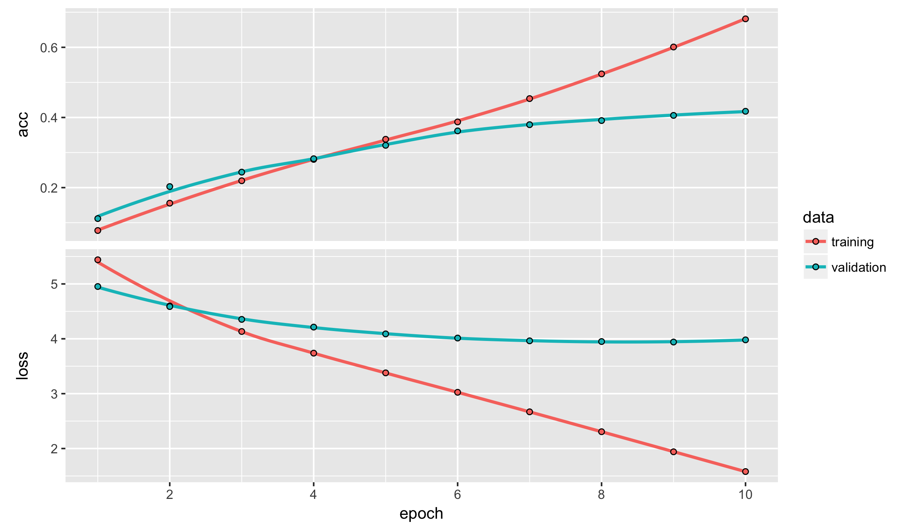
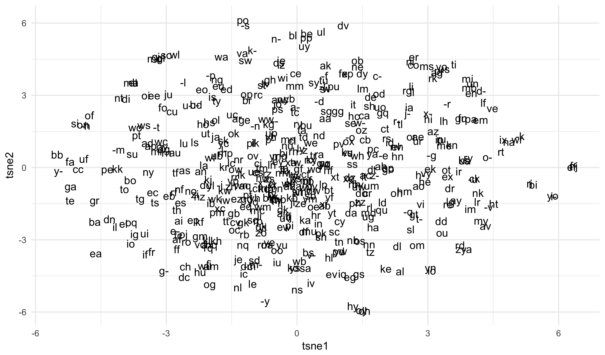
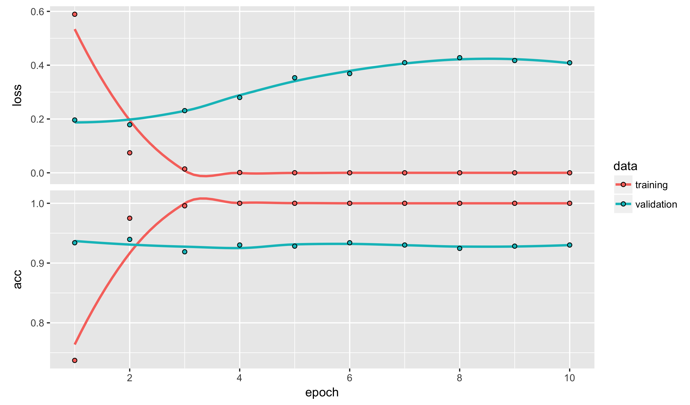
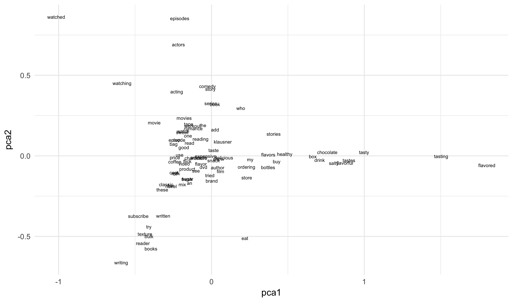


library(readr)
library(dplyr)
library(ggplot2)
library(stringi)
library(tokenizers)
library(smodels)
library(keras)
library(Matrix)
library(methods)


## Embeddings

Our initial approach to working with textual data involved counting
the occurrence of words, characters, or sequences of either. These
were summarized in a term frequency matrix, which we typically then
fed into an elastic net given the high-dimensionality of the dataset.
What subtleties are lost here?

- word placement in the text
- word forms
- negation
- context
- semantic meaning

We briefly tried to address some of these by using a text parser, but
these these amounted to simply creating more subtle versions of counting
the occurrence of things. We have not yet seen a real way of working
with the true order of the text.

How can we use a neural network to solve this problem? The output structure
is easy, and matches the one-hot encoding of the image processing tasks.
(from the idea that just one of the bytes is `hot', i.e. turned on.)
What about the input layer though? How do we feed a block of text into a
neural network?

Let's first simplify the problem and think about just a single word at a
time. How can we represent even a single word as an input to a neural
network? One approach is to determine a *vocabulary* of terms, these
are all of the words that we want to support in the classification task.
Usually we construct this by looking at all of the snippets of text and
taking the N-most commonly occurring words. Any words in the texts not
in this vocabulary are removed before further training. This is the same
thing we did with term frequency matrices, but now we are considering
just a single word.

Once we have this vocabulary, we can represent a single word by
an $N$-length binary vector with exactly one $1$:

$$ \text{apple} \rightarrow [0,0,0,\ldots,0,1,0,\ldots,0] $$

This is just another one-hot representation.

Suppose we use a one-hot representation as the first layer in a neural
network. If this is followed directly by a dense layer with p hidden
neurons, the weights in the layer can be defined as an N-by-p matrix
W. In this special case we do not need a bias term, because we already
know the scale of the previous layer (0's and 1's).

For a given set of weights W, because of the one-hot representation, the
values of the outputs from the first hidden layer will simply be row j
of the matrix W, where j is the index of the input word in the vocabulary.

A word embedding is nothing more than a compression of a one-hot
representation and a dense hidden layer in a neural network. There
is no need to actually create the one-hot vector, and multiply by
all of W. We can just go directly from the index of the word in
the vocabulary, and read off of the j-th row of W.

What are we doing here, really? The whole idea is to map a word as
a vector in a p-dimensional space:

$$ f(\text{word}) \rightarrow \mathbb{R}^p $$

This is very similar to the transfer learning we did with images,
where each image was projected into a 512-dimensional space.

This is great, but most of the time we want to work with
a collection of words (a document) all as one entity. A
simple way to do this is to apply the word embedding to
each term, and the collapse (flatten) these into a single
long vector.

So if we have T terms in a document and a word embedding
with p terms, the output from the embedding layer will be
of size T times p. To be clear, the embedding step is agnostic
to the position of the word, much like the shared weights in a
convolutional neural network. The word "apple" is matched to
the same vector regardless of where in the sentence it is
found.

### Simple example

Let's assume that we have the following word embeddings:

$$ \begin{align}
\text{the} &\rightarrow [1,0,0] \\
\text{cat} &\rightarrow [0,0.9,0]  \\
\text{is} &\rightarrow [0.8,0,0]  \\
\text{in} &\rightarrow [0.8,0,0]  \\
\text{and} &\rightarrow [1,0,0]  \\
\text{hat} &\rightarrow [0,0,0.75] \\
\text{sweater} &\rightarrow [0,0,0.9]
\end{align}$$

In this example we have a three-dimensional embedding; the first
component indicates whether this a common function word (article,
preposition, conj, ect.), the second whether its an animal, and the
third whether it is an article of clothing. We would map the
sentence:

- "The cat is in the hat and sweater"

To the array:

$$ \left[\begin{array}{ccc} 1 & 0 & 0 \\
                            0 & 0.9 & 0 \\
                            0.8 & 0 & 0 \\
                            0.8 & 0 & 0 \\
                            1 & 0 & 0 \\
                            0 & 0 & 0.75 \\
                            1 & 0 & 0 \\
                            0 & 0 & 0.9
                      \end{array}\right] $$

We can flatten this to an input dataset with 24 (8*3) inputs,
much as we did with the image data, or apply convultions that
respect the dimensionality of the input.

### Structure for today

We will persist in one simplification today: assuming that
each document has the same number of terms. This is done by
truncating at some small number of words (less than what
most of the movie reviews are) and filling in any trailing
space by a special embedding of zeros. Though as you will see,
this is easy to rectify for working with text of larger sizes.

## Predicting letter bigrams

As a starting example, let's look again at the Amazon dataset
predicting which category a review comes from. This time, however,
we will not be predicting the class of the item. We are just
using the text data as a good source of natural English language
usage.


amazon <- read_csv("https://statsmaths.github.io/ml_data/amazon_product_class.csv")


Instead of embedding entire words, we will initially consider
embedding character bigrams:

$$ f(\text{character bigram}) \rightarrow \mathbb{R}^p $$

Our prediction task will be to look at a window of 9 bigrams
(18 letters) within the text, using the first 4 bigrams and
last 4 bigrams to predict the middle two bigrams. For example,
if we consider the phrase:

> I was quite sleepy

We take the lower case version (removing punctuation marks)
and chop it up into bigrams:

> [I ][wa][s ][qu][it][e ][sl][ee][py]

The goal is to see the following:

> [I ][wa][s ][qu][??][e ][sl][ee][py]

And use the the context to predict that the missing piece is
the bigram "it".

As a first step we need to construct the dataset. We remove all
the non-letters and spaces, convert to lower case, and tokenize
by characters. We then paste together pairs from the first 20
letters to get the required bigrams (we only need the first 9
bigrams, but I grabbed more to illustrate the point).


txt <- stri_replace_all(amazon$text, "", regex = "[^a-zA-Z ]")
txt <- stri_trans_tolower(txt)
chars <- tokenize_characters(txt, strip_non_alphanum = FALSE)
chars <- Filter(function(v) length(v) > 200, chars)
chars <- lapply(chars, function(v) {
  apply(matrix(v[1:20], ncol = 2, byrow = TRUE), 1, paste, collapse = "")
  })
head(chars, n = 3)



## [[1]]
##  [1] "at" " s" "om" "e " "po" "in" "t " "i " "wo" "ul"
##
## [[2]]
##  [1] "jo" "hn" " c" "ro" "wl" "ey" " w" "ro" "te" "  "
##
## [[3]]
##  [1] "th" "e " "ne" "w " "yo" "rk" " p" "os" "t " "is"


Next we create a vector `char_vals` listing all of the possible
bigrams occurring in the dataset, and convert the bigrams into
integer codes mapping into these values.


char_vals <- unique(unlist(chars))
id <- lapply(chars, function(v) match(v, char_vals))
id <- matrix(unlist(id), ncol = 10, byrow = TRUE)
head(id)



##      [,1] [,2] [,3] [,4] [,5] [,6] [,7] [,8] [,9] [,10]
## [1,]    1    2    3    4    5    6    7    8    9    10
## [2,]   11   12   13   14   15   16   17   14   18    19
## [3,]   20    4   21   22   23   24   25   26    7    27
## [4,]    6   28   29   30   31   32   33   34   35    36
## [5,]   37   38   29   39   17    6   36   40   41    42
## [6,]   43   44   45   46   47   48   49   27   28    50


Now, the data matrix `X` consists of columns 1 through 4
and 6 through 9. The response `y` uses the 5th column, offset
by 1 to make the category ids match the zero-index used by
**keras**. We don't have a training and testing set here, so
I will construct one manually.


X <- id[,c(1:4,6:9)]
y <- id[,5] - 1
train_id <- rep(c("train", "test"), length.out = length(y))


Now, process the training data for the neural network.


y_train <- to_categorical(y[train_id == "train"],
                          num_classes = length(char_vals))
X_train <- X[train_id == "train",]


We proceed by constructing a `layer_embedding` in keras. We
supply the length of the vocabulary (`input_dim`), the size
of the embedding (`output_dim`) and the the number of terms
in the input (the columns of `X`, `input_length`). The output
will not be a matrix, so we flatten the embedding, apply a dense
layer, and the softmax the expected probabilities.


model <- keras_model_sequential()

model %>%
  layer_embedding(
    input_dim = length(char_vals),
    output_dim = 50,
    input_length = ncol(X)
    ) %>%
  layer_flatten() %>%
  layer_dense(256) %>%
  layer_activation("relu")%>%
  layer_dense(length(char_vals)) %>%
  layer_activation("softmax")
model



## Model
## ___________________________________________________________________________
## Layer (type)                     Output Shape                  Param #
## ===========================================================================
## embedding_1 (Embedding)          (None, 8, 50)                 25500
## ___________________________________________________________________________
## flatten_1 (Flatten)              (None, 400)                   0
## ___________________________________________________________________________
## dense_1 (Dense)                  (None, 256)                   102656
## ___________________________________________________________________________
## activation_1 (Activation)        (None, 256)                   0
## ___________________________________________________________________________
## dense_2 (Dense)                  (None, 510)                   131070
## ___________________________________________________________________________
## activation_2 (Activation)        (None, 510)                   0
## ===========================================================================
## Total params: 259,226
## Trainable params: 259,226
## Non-trainable params: 0
## ___________________________________________________________________________


Can you figure out where the number of parameters in the
embedding layer comes from?

From here, the compiling and training the model uses the
exact some code as with dense and convolutional neural networks.


model %>% compile(
  loss = "categorical_crossentropy",
  optimizer = optimizer_rmsprop(),
  metrics = "accuracy"
)
history <- model %>% fit(X_train, y_train, batch_size = 32,
              epochs = 10,
              validation_split = 0.1)
y_pred <- predict_classes(model, X) + 1
plot(history)


The validation error rate is around 40%, not bad considering that
this is classification with a categorical variable having 100s of
values.

We can put the predictions together to see what the neural network
predicts for some example bigrams:


prefix <- apply(matrix(char_vals[X[,1:4]], ncol = 4, byrow=FALSE),
                1, paste, collapse = "")
suffix <- apply(matrix(char_vals[X[,5:8]], ncol = 4, byrow=FALSE),
                1, paste, collapse = "")
y_char <- char_vals[y]
strs <- sprintf("%s[%s]%s", prefix, char_vals[y_pred],
                 suffix)
sample(strs[train_id == "test"], 100)



##   [1] "i bought[ t]hese can" "easy to [an]ke taste" "these ar[e ]the clos"
##   [4] "the pack[th]e states" "i receiv[ed] this as" "this cou[ i] case wa"
##   [7] "though t[hi]s film w" "the huma[e ]comedy i" "although[is] am a lo"
##  [10] "my docto[d ]recommen" "unbeliev[te]le as it" "these is[ a] very go"
##  [13] "boulder [ i]m is one" "its abou[e ]a boy wh" "if you h[av]e read a"
##  [16] "this boo[k ]ironical" "in coura[an] overcom" "not one [to] his bet"
##  [19] "i have u[ea]d bumble" "lets jus[ m]say your" "since i [e ]nt spend"
##  [22] "after th[e ]muses fa" "nominate[d ]for seve" "i though[t ]this boo"
##  [25] "i highly[ r]ecommend" "i dont k[no]w why th" "as of th[is] writing"
##  [28] "the sell[re] provide" "great ca[ a] great c" "as far a[s ]mustards"
##  [31] "now im a[s ]ie hard " "reading [in]rb johns" "so much [re]lling th"
##  [34] "the duke[e ]nows he " "i use th[is] inexpen" "writerac[is]ess cath"
##  [37] "even tho[ i]h ive be" "picard g[hi]s strand" "the orig[in]al flavo"
##  [40] "this was[ m]y first " "this is [a ]ch a cut" "one of t[he] greates"
##  [43] "this was[ o]ne of my" "once you[ t]earn how" "cigarett[nd] and a t"
##  [46] "i have t[o ]agree wi" "this ser[ie]s is jus" "after se[ei]ng the l"
##  [49] "i would [sa]t this a" "vincent [of]ice will" "this is [a ]terrific"
##  [52] "this is [a ]totally " "they are[ p]ashews b" "the secr[it]s of cri"
##  [55] "jury is [a ]ill out " "frederic[e ]knotts t" "jillian [co]lls it l"
##  [58] "mysterio[ng] artifac" "in  egyp[s ]logists " "while th[e ]words ov"
##  [61] "this was[ a] wonderf" "received[ t]he candy" "great fo[e ]what the"
##  [64] "while th[is] isnt th" "thomas m[l ]tons jou" "i found [th]is book "
##  [67] "i am in [a ]ve with " "another [ro]joyable " "although[ b]omorrow "
##  [70] "starting[e ]ith sara" "i would [wi]ther hav" "guardian[y ]of the l"
##  [73] "sometime[t ]you read" "in my ca[s ]free s i" "this is [th]e first "
##  [76] "in my th[e ]rade eng" "purchase[s ]these on" "alec gui[co]ess not "
##  [79] "well app[re]ently th" "for thos[e ]who have" "claire s[ i]s the fa"
##  [82] "this rel[on]se from " "the glas[ l]key is o" "it may n[ i] have be"
##  [85] "in paris[ho]urly bri" "the pric[e ]is high " "weve all[ b]eard the"
##  [88] "my yr   [an] old gra" "the best[ b]it of th" "charles [a ]dd mothe"
##  [91] "from the[ m]eviews i" "this pro[du]ction wa" "i saw th[is] in a he"
##  [94] "i was sc[as]ed to re" "this is [a ]good mov" "this ins[a ]llment c"
##  [97] "ordered [to]  march " "this is [a ]etty goo" "when ada[s ]westmore"
## [100] "friend o[n ]frenemy "


Perhaps more impressive than the correct response are the type of
human-like errors it makes.

The embedding layer consists of a 510-by-50 matrix. This gives the
projection of each bigram in 50-dimensional space. We can access
this projection with the function `get_layer`.


embed <- model$get_layer(index = 1L)$get_weights()[[1]]
dim(embed)



## [1] 510  50


Visualizing the embedding is hard because it exists in 50-dimensional
space. We can take the embedding and apply t-SNE to do dimensionality
reduction:


library(Rtsne)
tsne <- Rtsne(embed, dims = 2)
df <- data_frame(tsne1 = tsne$Y[,1],
                 tsne2 = tsne$Y[,2],
                 bgram = char_vals)
df$bgram <- stri_replace_all(df$bgram, "-", fixed = " ")
ggplot(df, aes(tsne1, tsne2)) +
  geom_text(aes(label = bgram)) +
  theme_minimal()


I did not see any particularly noticeable patterns, but we will see
that the word variant of this often shows off understandable patterns
in the data.

## Word embeddings

Now, let's use actual work embeddings to classify Amazon products.
As with the bigram embeddings, we first need to figure out the vocabulary
of terms we will allow in the model. Unlike with bigrams, there are too
many unique words to include them all. Instead, I will use just the most
frequently used 5000 words (it will actually be slightly more than this
because `top_n`, when faced with ties, will create a slightly larger
set rather than randomly selecting just 5000).


words <- tokenize_words(amazon$text)
vocab <- top_n(count(data_frame(word = unlist(words)), word), n = 5000)$word



## Selecting by n



head(vocab, 50)



##  [1] "0"     "02"    "1"     "10"    "100"   "11"    "12"    "13"
##  [9] "13th"  "14"    "15"    "16"    "17"    "18"    "19"    "1930"
## [17] "1932"  "1933"  "1934"  "1936"  "1939"  "1940"  "1942"  "1945"
## [25] "1947"  "1948"  "1950"  "1953"  "1960"  "1960s" "1968"  "1970"
## [33] "1970s" "1971"  "1972"  "1973"  "1974"  "1975"  "1980"  "1980s"
## [41] "1989"  "1990"  "1995"  "1996"  "1998"  "19th"  "1st"   "2"
## [49] "20"    "200"


With this vocabulary, we next create numeric indicies, throwing
away terms not in our vocabulary.


id <- lapply(words, function(v) match(v, vocab))
id <- lapply(id, function(v) v[!is.na(v)])
id[1:3]



## [[1]]
##  [1]  381 4189 3429 2298 5066 2695 4641 4731 3698 2930 4987 2045   62 3228
## [15] 3260 3257 3164   74 2298 1486 2753 3164  653 3817 3610 2298 3589 2075
## [29] 4034 3982   70 3228 1039 3257 3164   48 3188 2455   10 3228  719 3257
## [43] 3164    7 2444 2981 4160  680 2298 2695 2455 3124 2149 2038 4641  100
## [57] 3429 4977 2298 2148 2455 1872  622
##
## [[2]]
##   [1] 2498 5082 2722  533 2345 4558 5048 3164 2913  588 1501 3164 4558 4925
##  [15] 3461 4814  274  476 2455 2444 4558 2061 1729 3122 4173 1730 5080  684
##  [29]  270  261  274 2313 2890 4030 2153 4963 3188 4641 3931 2455 4924 3343
##  [43] 4558  521 3122 5080  684  270  261  243 5082 4558  100 1900 4891 4024
##  [57] 5024 4605  274  100 2103 4892 3164 2059 1900 4097  270 2354 3164 2219
##  [71] 4479 4572  336 2719 2933 3164  680 4845 4845 1773 3599 1729 5076  190
##  [85] 4613  108 1900 2286 3268 3164 4592 2298 1898 4572 2444 3677 3116 2191
##  [99] 4555 2444 3110 1107 2345 4558 3284 2714  109 1284 4558 3419  100  274
## [113] 2219 4830 5053 3188  100 4381 2345 5084 3093 2791 3669  243 2950 2444
## [127]  100 3419  274  100  911 3225 4551 5084 3328 2714 2012 4641  100 1251
## [141] 3402 5049 2148 3727 4558 4913 1551 4556 2455 4572 2444 3004 1122 3559
## [155] 4558 3153  680  530 4555 4572 2444  100 3472 3164 2326 4572  336 4830
## [169] 4410 3164 3225 2981 2411 3420  680 4576 3355 3232 2419 2695 1439 4796
## [183] 3455  381 4508 3818 2550 1560 3991 4641 2148 3004 3164 4558 1293 4641
## [197]  467 1128 2458 3890 4558 5056 3066 2981 1729  274 2666 3673  100 4927
## [211] 3164 2219 5107 2543 3664  274 3664 4899 1872 3004 4641 4807 2219 4481
## [225]  274 1393 4193 5024 4575  811  274 4975 2298 2035 4641 4558 1801  807
## [239] 2298 3675 2153 4924 3110 2021 4641  226 3164 2219 3225  590 2148 3394
## [253] 3188 3027 4592 3190 1548 2345 4558 2444 3677 3890 4924 3190 3164 3027
## [267] 1750  408 1872 2981 4551  100 1236 1872  100 2026 4628 3658 2722  533
## [281] 4417 2059 5049 3164 4628
##
## [[3]]
##   [1] 4558 3078 5099 3461 2444 3175 5024 2345 4558 4783 4298  364 2313 4936
##  [15] 3065 4193 3078 4555 4936 1093  481  158 4641 4936 1768 1872 2455 2695
##  [29]  100 4652 3164  274 3124 2933 3164 4805 3064 4641 1984 3230 1822 1187
##  [43] 2313 3110 2981 3175 1872 4596 3164 5100 1872 4989 3190 3597  100 1219
##  [57] 2527 2450 3613 1571 3374 4796  100 1773  590 4173 5102  248  467 3494
##  [71] 4558 3078 5099 3461  588 4024  336 2059 3192 4641 4290 5024 5024 3597
##  [85] 1337 3639 1929 4845 1485 4641 1336 1614 4558  521 1564  100 4119 3597
##  [99] 1929 4628 4641 4628 4576  336 3605 1571 4641 1393 1460  100  932  621
## [113]  274 4592  588  243 2803  100 3084 4292 3429 1872


Of course, not every review will contain the same number of words.
To deal with this we pick a particular reference length, truncating
longer sentences and padding shorter sentences with zeros. This is
all handled by the **keras** function `pad_sequences` (options
exist for whether truncation and/or padding is done as a prefix
or a suffix; the defaults are usually best unless you have a particular
reason for preferring an alternative).


X <- pad_sequences(id, maxlen = 100)
X[1:5,]



##      [,1] [,2] [,3] [,4] [,5] [,6] [,7] [,8] [,9] [,10] [,11] [,12] [,13]
## [1,]    0    0    0    0    0    0    0    0    0     0     0     0     0
## [2,] 3818 2550 1560 3991 4641 2148 3004 3164 4558  1293  4641   467  1128
## [3,] 4641 4936 1768 1872 2455 2695  100 4652 3164   274  3124  2933  3164
## [4,] 4558 3960 1400 1837 3232 4558  811 1571 1872  4805  4641  4727  5024
## [5,]    0 4975 4558 5006  567 4924  455 4799  270  1560  3122   108   270
##      [,14] [,15] [,16] [,17] [,18] [,19] [,20] [,21] [,22] [,23] [,24]
## [1,]     0     0     0     0     0     0     0     0     0     0     0
## [2,]  2458  3890  4558  5056  3066  2981  1729   274  2666  3673   100
## [3,]  4805  3064  4641  1984  3230  1822  1187  2313  3110  2981  3175
## [4,]  4562  1537  4572  2444  1571  3668  1426  2345  4189  3164  4558
## [5,]  1518  1560  1101  4985   100  3126  4913  3196  4641  1695  1021
##      [,25] [,26] [,27] [,28] [,29] [,30] [,31] [,32] [,33] [,34] [,35]
## [1,]     0     0     0     0     0     0     0     0     0     0     0
## [2,]  4927  3164  2219  5107  2543  3664   274  3664  4899  1872  3004
## [3,]  1872  4596  3164  5100  1872  4989  3190  3597   100  1219  2527
## [4,]   811  4641  4398  3837  3407  3613  4961   684  3292  2444   270
## [5,]  4558   588  4924  4736  2419   270   289  1755  5024   270   226
##      [,36] [,37] [,38] [,39] [,40] [,41] [,42] [,43] [,44] [,45] [,46]
## [1,]     0     0   381  4189  3429  2298  5066  2695  4641  4731  3698
## [2,]  4641  4807  2219  4481   274  1393  4193  5024  4575   811   274
## [3,]  2450  3613  1571  3374  4796   100  1773   590  4173  5102   248
## [4,]  2411   808   274  2219  1801  3939  5024  2219  3489  4997  2444
## [5,]  4284  4211  3021  1929  4558  2699  3164  3848   274   939  4641
##      [,47] [,48] [,49] [,50] [,51] [,52] [,53] [,54] [,55] [,56] [,57]
## [1,]  2930  4987  2045    62  3228  3260  3257  3164    74  2298  1486
## [2,]  4975  2298  2035  4641  4558  1801   807  2298  3675  2153  4924
## [3,]   467  3494  4558  3078  5099  3461   588  4024   336  2059  3192
## [4,]  2167   274   138  3746  4961   873  1400   639  1571  3668  2686
## [5,]  3037   100  1773  2458   100  2166  1793   480  4558   811   336
##      [,58] [,59] [,60] [,61] [,62] [,63] [,64] [,65] [,66] [,67] [,68]
## [1,]  2753  3164   653  3817  3610  2298  3589  2075  4034  3982    70
## [2,]  3110  2021  4641   226  3164  2219  3225   590  2148  3394  3188
## [3,]  4641  4290  5024  5024  3597  1337  3639  1929  4845  1485  4641
## [4,]  4641  2219  3339  2186  4936  2747   100  2752  3164  2334  2345
## [5,]  1837   274   585  2398  3164  4189  1458  1071  1788  2298  2208
##      [,69] [,70] [,71] [,72] [,73] [,74] [,75] [,76] [,77] [,78] [,79]
## [1,]  3228  1039  3257  3164    48  3188  2455    10  3228   719  3257
## [2,]  3027  4592  3190  1548  2345  4558  2444  3677  3890  4924  3190
## [3,]  1336  1614  4558   521  1564   100  4119  3597  1929  4628  4641
## [4,]  2219  1535  1349  3839  3093  4628  2345  4558  4861  2419  4558
## [5,]  3692  4592  1793   100  4726   901  2345  1620  1419   100  1080
##      [,80] [,81] [,82] [,83] [,84] [,85] [,86] [,87] [,88] [,89] [,90]
## [1,]  3164     7  2444  2981  4160   680  2298  2695  2455  3124  2149
## [2,]  3164  3027  1750   408  1872  2981  4551   100  1236  1872   100
## [3,]  4628  4576   336  3605  1571  4641  1393  1460   100   932   621
## [4,]  1928  4340   274  1299  4558  1197  4558  2992   336  1898  4592
## [5,]  3164  4592  3025  3981   901  4622  5024  3164  4558  1872  4558
##      [,91] [,92] [,93] [,94] [,95] [,96] [,97] [,98] [,99] [,100]
## [1,]  2038  4641   100  3429  4977  2298  2148  2455  1872    622
## [2,]  2026  4628  3658  2722   533  4417  2059  5049  3164   4628
## [3,]   274  4592   588   243  2803   100  3084  4292  3429   1872
## [4,]  3000  4641   467  2345  2463   680  4321  4924   684   2455
## [5,]   521   289  1939  2662  1755  2298  2148  1619  5027   4641


The zero index is treated specially by the embedding, and always mapped
to the zero vector. Now we process the data as usual:


y <- amazon$category
X_train <- X[amazon$train_id == "train",]
y_train <- to_categorical(y[amazon$train_id == "train"] - 1, num_classes = 3)


And construct a neural network with an embedding layer, a flatten
layer, and then dense and output layers.


model <- keras_model_sequential()
model %>%
  layer_embedding(
    input_dim = length(vocab) + 1,
    output_dim = 50,
    input_length = ncol(X)
    ) %>%
  layer_flatten() %>%
  layer_dense(256) %>%
  layer_activation("relu")%>%
  layer_dense(ncol(y_train)) %>%
  layer_activation("softmax")
model



## Model
## ___________________________________________________________________________
## Layer (type)                     Output Shape                  Param #
## ===========================================================================
## embedding_2 (Embedding)          (None, 100, 50)               255850
## ___________________________________________________________________________
## flatten_2 (Flatten)              (None, 5000)                  0
## ___________________________________________________________________________
## dense_3 (Dense)                  (None, 256)                   1280256
## ___________________________________________________________________________
## activation_3 (Activation)        (None, 256)                   0
## ___________________________________________________________________________
## dense_4 (Dense)                  (None, 3)                     771
## ___________________________________________________________________________
## activation_4 (Activation)        (None, 3)                     0
## ===========================================================================
## Total params: 1,536,877
## Trainable params: 1,536,877
## Non-trainable params: 0
## ___________________________________________________________________________


Finally, we compile the model and fit it to the data


model %>% compile(
  loss = "categorical_crossentropy",
  optimizer = optimizer_rmsprop(),
  metrics = "accuracy"
)

history <- model %>% fit(X_train, y_train, batch_size = 32,
              epochs = 10,
              validation_split = 0.1)
y_pred <- predict_classes(model, X) + 1
plot(history)


The model performs reasonably well, though not yet a noticeable
improvement over the elastic net models we built.


tapply(y_pred == amazon$category, amazon$train_id, mean)



##      test     train     valid
##        NA 0.9930096 0.9269122


The problem is that while in the elastic net models we entirely
ignore word ordering, here we go all the way to the other extreme.
The model treats the sentence "I thought this movie was really good"
entirely different than "This movie was really good" because weights
in the dense layer apply specifically to each position of the word.
Using a 1-dimensional variation of convolutions will solve this
issue.

## Convolutions again

It turns out we can think of the output of the word embeddings
as being similar to the multidimensional tensors in image
processing.

For example, consider a word embedding with p equal to 3. We can see
this as three parallel 1-dimensional streams of length T,
much in the way that a color image is a 2d-dimensional combination
of parallel red, green, and blue channels.

In this context, we can apply 1-D constitutional layers
just as before: shared weights over some small kernel. Now, however,
the kernel has just a single spatial component. We also apply max
pooling to the sequence, with a window size of 10 (windows in one
dimension tend to be larger than in 2).


model <- keras_model_sequential()
model %>%
  layer_embedding(
    input_dim = length(vocab) + 1,
    output_dim = 50,
    input_length = ncol(X)
    ) %>%

  layer_conv_1d(filters = 128, kernel_size = c(4)) %>%
  layer_max_pooling_1d(pool_size = 10L) %>%
  layer_dropout(rate = 0.5) %>%

  layer_flatten() %>%
  layer_dense(256) %>%
  layer_activation("relu")%>%
  layer_dense(ncol(y_train)) %>%
  layer_activation("softmax")

model %>% compile(
  loss = "categorical_crossentropy",
  optimizer = optimizer_rmsprop(lr = 0.003),
  metrics = "accuracy"
)

model



## Model
## ___________________________________________________________________________
## Layer (type)                     Output Shape                  Param #
## ===========================================================================
## embedding_3 (Embedding)          (None, 100, 50)               255850
## ___________________________________________________________________________
## conv1d_1 (Conv1D)                (None, 97, 128)               25728
## ___________________________________________________________________________
## max_pooling1d_1 (MaxPooling1D)   (None, 9, 128)                0
## ___________________________________________________________________________
## dropout_1 (Dropout)              (None, 9, 128)                0
## ___________________________________________________________________________
## flatten_3 (Flatten)              (None, 1152)                  0
## ___________________________________________________________________________
## dense_5 (Dense)                  (None, 256)                   295168
## ___________________________________________________________________________
## activation_5 (Activation)        (None, 256)                   0
## ___________________________________________________________________________
## dense_6 (Dense)                  (None, 3)                     771
## ___________________________________________________________________________
## activation_6 (Activation)        (None, 3)                     0
## ===========================================================================
## Total params: 577,517
## Trainable params: 577,517
## Non-trainable params: 0
## ___________________________________________________________________________


Fitting this model on the data shows that it performs better than
the original embedding model (I believe it also bests all of the
models we constructed previously for the Amazon data).


model %>% fit(X_train, y_train, batch_size = 32,
              epochs = 5,
              validation_split = 0.1)
y_pred <- predict_classes(model, X) + 1
tapply(y == y_pred, amazon$train_id, mean)



##      test     train     valid
##        NA 0.9756282 0.9082153


Let's see if we can do better by including longer sequences
of text.


X <- pad_sequences(id, maxlen = 300)
y <- amazon$category

X_train <- X[amazon$train_id == "train",]
y_train <- to_categorical(y[amazon$train_id == "train"] - 1, num_classes = 3)


I will replace the max pooling layer with a `layer_global_average_pooling_1d`.
This does pooling across all the nodes into one global number for each
filter. It is akin to what we did the VGG-16 transfer learning problem
where I took the maximum of each filter over the entire 7-by-7 grid.


model <- keras_model_sequential()
model %>%
  layer_embedding(
    input_dim = length(vocab) + 1,
    output_dim = 50,
    input_length = ncol(X)
    ) %>%

  layer_conv_1d(filters = 128, kernel_size = c(5)) %>%
  layer_global_average_pooling_1d() %>%
  layer_dropout(rate = 0.5) %>%

  layer_dense(256) %>%
  layer_activation("relu")%>%
  layer_dense(ncol(y_train)) %>%
  layer_activation("softmax")

model %>% compile(
  loss = "categorical_crossentropy",
  optimizer = optimizer_rmsprop(),
  metrics = "accuracy"
)

model



## Model
## ___________________________________________________________________________
## Layer (type)                     Output Shape                  Param #
## ===========================================================================
## embedding_4 (Embedding)          (None, 300, 50)               255850
## ___________________________________________________________________________
## conv1d_2 (Conv1D)                (None, 296, 128)              32128
## ___________________________________________________________________________
## global_average_pooling1d_1 (Glob (None, 128)                   0
## ___________________________________________________________________________
## dropout_2 (Dropout)              (None, 128)                   0
## ___________________________________________________________________________
## dense_7 (Dense)                  (None, 256)                   33024
## ___________________________________________________________________________
## activation_7 (Activation)        (None, 256)                   0
## ___________________________________________________________________________
## dense_8 (Dense)                  (None, 3)                     771
## ___________________________________________________________________________
## activation_8 (Activation)        (None, 3)                     0
## ===========================================================================
## Total params: 321,773
## Trainable params: 321,773
## Non-trainable params: 0
## ___________________________________________________________________________


Fitting this model shows a further, non-trivial improvement on the
model.


model %>% fit(X_train, y_train, batch_size = 32,
              epochs = 3,
              validation_split = 0.1)
y_pred <- predict_classes(model, X) + 1
tapply(y == y_pred, amazon$train_id, mean)



##      test     train     valid
##        NA 0.9667485 0.9444759


It should make sense that using more data perform better and that
the global position in the text of a sequence of words should not
matter much to the classifier.

## Visualize the word embedding

Once again, we can visualize the word embedding from this model.
There are over 5000 words though, making a full plot fairly noisy.
Instead, let's re-run the elastic net to find the terms the popped
out of the model as being important to the Amazon product classification
and look only at the projection of these.


library(glmnet)
token_list <- tokenize_words(amazon$text)
token_df <- term_list_to_df(token_list)
X <- term_df_to_matrix(token_df)
X_train <- X[amazon$train_id == "train",]
y_train <- y[amazon$train_id == "train"]
model_glmnet <- cv.glmnet(X_train, y_train, nfolds = 5, family = "multinomial")

beta <- coef(model_glmnet, s = model_glmnet$lambda.min)
beta <- Reduce(cbind, beta)

glmnet_words <- rownames(beta[apply(beta != 0, 1, any),][-1,])
glmnet_words



##  [1] "the"        "of"         "his"        "book"       "her"
##  [6] "an"         "my"         "who"        "movie"      "film"
## [11] "story"      "these"      "read"       "characters" "taste"
## [16] "books"      "flavor"     "use"        "dvd"        "reading"
## [21] "author"     "buy"        "product"    "films"      "movies"
## [26] "novel"      "watch"      "written"    "try"        "price"
## [31] "scenes"     "show"       "writing"    "stories"    "sweet"
## [36] "chocolate"  "free"       "add"        "amazon"     "sugar"
## [41] "tried"      "acting"     "classic"    "watching"   "cup"
## [46] "eat"        "cast"       "plays"      "reader"     "fresh"
## [51] "video"      "bag"        "delicious"  "store"      "tastes"
## [56] "romance"    "milk"       "actors"     "brand"      "drink"
## [61] "healthy"    "snack"      "episode"    "tasty"      "flavors"
## [66] "soup"       "watched"    "pasta"      "texture"    "butter"
## [71] "tasting"    "flour"      "tasted"     "cereal"     "tape"
## [76] "episodes"   "workout"    "ordering"   "subscribe"  "container"
## [81] "flavorful"  "packages"   "klausner"


We'll grab the embedding layer from `model` and filter to
just those words in the elastic net model.


embed <- model$get_layer(index = 1L)$get_weights()[[1]]
these <- match(glmnet_words, vocab)


Running PCA on the resulting data shows some interesting
patterns:


library(irlba)
pca <- prcomp_irlba(embed[these,], n = 2)
df <- data_frame(pca1 = pca$x[,1],
                 pca2 = pca$x[,2],
                 bgram = glmnet_words)
ggplot(df, aes(pca1, pca2)) +
  geom_text(aes(label = bgram), size = 2) +
  theme_minimal()


Notice that words associated with each category tend to
clump together in the PCA space. This is particularly
evident with the food data.

