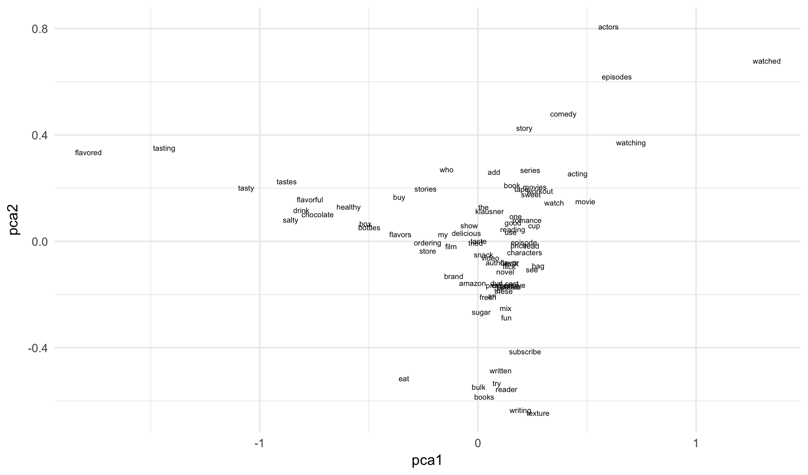


library(readr)
library(dplyr)
library(ggplot2)
library(stringi)
library(tokenizers)
library(smodels)
library(keras)


## Embeddings

## Predicting letter bigrams


#amazon <- read_csv("https://statsmaths.github.io/ml_data/amazon_product_class.csv")
amazon <- read_csv("~/gh/ml_data/amazon_product_class.csv")
amazon <- amazon[-c(3056, 7876),]



txt <- stri_replace_all(amazon$text, "", regex = "[^a-zA-Z ]")
txt <- stri_trans_tolower(txt)
chars <- tokenize_characters(txt, strip_non_alphanum = FALSE)
chars <- Filter(function(v) length(v) > 200, chars)
chars <- lapply(chars, function(v) {
  apply(matrix(v[1:20], ncol = 2, byrow = TRUE), 1, paste, collapse = "")
  })
head(chars, n = 3)



## [[1]]
##  [1] "at" " s" "om" "e " "po" "in" "t " "i " "wo" "ul"
## 
## [[2]]
##  [1] "jo" "hn" " c" "ro" "wl" "ey" " w" "ro" "te" "  "
## 
## [[3]]
##  [1] "th" "e " "ne" "w " "yo" "rk" " p" "os" "t " "is"



char_vals <- unique(unlist(chars))
id <- lapply(chars, function(v) match(v, char_vals))
id <- matrix(unlist(id), ncol = 10, byrow = TRUE)
head(id)



##      [,1] [,2] [,3] [,4] [,5] [,6] [,7] [,8] [,9] [,10]
## [1,]    1    2    3    4    5    6    7    8    9    10
## [2,]   11   12   13   14   15   16   17   14   18    19
## [3,]   20    4   21   22   23   24   25   26    7    27
## [4,]    6   28   29   30   31   32   33   34   35    36
## [5,]   37   38   29   39   17    6   36   40   41    42
## [6,]   43   44   45   46   47   48   49   27   28    50



X <- id[,c(1:4,6:9)]
y <- id[,5] - 1
train_id <- rep(c("train", "test"), length.out = length(y))



y_train <- to_categorical(y[train_id == "train"],
                          num_classes = length(char_vals))
X_train <- X[train_id == "train",]



model <- keras_model_sequential()
model %>%
  layer_embedding(
    input_dim = length(char_vals),
    output_dim = 50,
    input_length = ncol(X)
    ) %>%
  layer_flatten() %>%
  layer_dense(256) %>%
  layer_activation("relu")%>%
  layer_dense(length(char_vals)) %>%
  layer_activation("softmax")



model %>% compile(
  loss = "categorical_crossentropy",
  optimizer = optimizer_rmsprop(),
  metrics = "accuracy"
)
history <- model %>% fit(X_train, y_train, batch_size = 32,
              epochs = 10,
              validation_split = 0.1)
y_pred <- predict_classes(model, X) + 1
plot(history)



prefix <- apply(matrix(char_vals[X[,1:4]], ncol = 4, byrow=FALSE),
                1, paste, collapse = "")
suffix <- apply(matrix(char_vals[X[,5:8]], ncol = 4, byrow=FALSE),
                1, paste, collapse = "")
y_char <- char_vals[y]
strs <- sprintf("%s[%s]%s", prefix, char_vals[y_pred],
                 suffix)
sample(strs[train_id == "test"], 100)



##   [1] "they don[e ]taste ba" "read rat[ a] partly " "i give a[re] kudos t"
##   [4] "i feel l[on]e there " "i love t[hi]s produc" "if you l[ik]e sweet "
##   [7] "compelli[an] enlight" "benjamin[ f]ranklin " "looking [in]r a guid"
##  [10] "i was qu[th]e enthus" "such a g[re]at book " "some man[e ]actures "
##  [13] "i purcha[se]d this w" "alex van[ i]elsing t" "the othe[r ]reviews "
##  [16] "wow i ju[ly] tried l" "and alth[e ]gh these" "a longer[ l]ovel tha"
##  [19] "flashman[ i]s the ze" "i rememb[er] eating " "sahib th[e ]british "
##  [22] "leo hoff[ i]n has le" "i was re[al]ly disap" "this is [my] favorit"
##  [25] "here is [a ]film tha" "i liked [is] and i d" "i used t[o ]buy almo"
##  [28] "one of t[he] reasons" "this cer[le]ral and " "i bought[ t]his for "
##  [31] "this boo[k ]is very " "if youve[ r]ever tas" "this is [my] first e"
##  [34] "i found [th]ese to b" "mel gibs[is] is the " "the unbe[l ]able lig"
##  [37] "first pu[t ]ished in" "this fil[m ]had more" "the coff[ie] is good"
##  [40] "great fo[e ]what the" "richard [an]gner is " "loved th[is] movie w"
##  [43] "this boo[k ]is a gre" "we have [to]ways use" "a long b[ee]k but wo"
##  [46] "can arch[th]ecture b" "great sc[st]es of eu" "reason f[in] reading"
##  [49] "i never [th]ed white" "thanks t[o ]fox to r" "once pow[t ]ful shoc"
##  [52] "this is [th]e best c" "i keep t[o ]se in th" "yogi gin[ s]r tea is"
##  [55] "rough ma[is]c is a r" "as the s[bo]eam that" "though t[he] conceit"
##  [58] "this is [a ]pretty g" "i have b[ee]n using " "the weat[in]r of the"
##  [61] "before s[ad]ing this" "the pack[th]e states" "this is [a ]story of"
##  [64] "i am all[re]gic to s" "i got th[is] movie b" "be warne[ h]one of t"
##  [67] "sure thi[s ]imported" "this is [my] fifth c" "our offi[ly] drinks "
##  [70] "dan rein[g ]ld did a" "i recent[ly] found o" "from the[ p]uthor wh"
##  [73] "the real[ t]hing the" "i though[ t]wow bulk" "please b[ee]sure you"
##  [76] "i dont c[on]e if tit" "as you c[an] see i p" "consider[ly] by jane"
##  [79] "the  mov[ie] speechl" "as a tee[s ]ger evel" "i knew w[ri]drow cal"
##  [82] "its back[ t]o dried " "while on[am] hiatus " "the late[ i] were a "
##  [85] "note ove[an] of my m" "if youve[ e]njoyed w" "this pro[du]ct works"
##  [88] "i have a[lw]ays hear" "i dont k[no]w why th" "i discov[er]ed this "
##  [91] "finally [re]ad the t" "i saw th[is] there w" "like all[ o]f the th"
##  [94] "mysterio[ed] artifac" "this is [a ]great bo" "was hesi[ a]nt to pu"
##  [97] "wow i ha[ly] seen qu" "at  when[ t]hey ask " "well i w[an]ted to t"
## [100] "i like t[he]stock up"



embed <- model$get_layer(index = 1L)$get_weights()[[1]]
dim(embed)



## [1] 510  50



library(Rtsne)
tsne <- Rtsne(embed, dims = 2)
df <- data_frame(tsne1 = tsne$Y[,1],
                 tsne2 = tsne$Y[,2],
                 bgram = char_vals)
df$bgram <- stri_replace_all(df$bgram, "-", fixed = " ")
ggplot(df, aes(tsne1, tsne2)) +
  geom_text(aes(label = bgram)) +
  theme_minimal()


## Word embeddings


words <- tokenize_words(amazon$text)
vocab <- top_n(count(data_frame(word = unlist(words)), word), n = 5000)$word



## Selecting by n



head(vocab, 50)



##  [1] "0"     "02"    "1"     "10"    "100"   "11"    "12"    "13"   
##  [9] "13th"  "14"    "15"    "16"    "17"    "18"    "19"    "1930" 
## [17] "1932"  "1933"  "1934"  "1936"  "1939"  "1940"  "1942"  "1945" 
## [25] "1947"  "1948"  "1950"  "1953"  "1960"  "1960s" "1968"  "1970" 
## [33] "1970s" "1971"  "1972"  "1973"  "1974"  "1975"  "1980"  "1980s"
## [41] "1989"  "1990"  "1995"  "1996"  "1998"  "19th"  "1st"   "2"    
## [49] "20"    "200"



id <- lapply(words, function(v) match(v, vocab))
id <- lapply(id, function(v) v[!is.na(v)])
id[1:3]



## [[1]]
##  [1]  381 4190 3430 2299 5067 2696 4642 4732 3699 2931 4988 2046   62 3229
## [15] 3261 3258 3165   74 2299 1487 2754 3165  653 3818 3611 2299 3590 2076
## [29] 4035 3983   70 3229 1040 3258 3165   48 3189 2456   10 3229  719 3258
## [43] 3165    7 2445 2982 4161  680 2299 2696 2456 3125 2150 2039 4642  100
## [57] 3430 4978 2299 2149 2456 1873  622
## 
## [[2]]
##   [1] 2499 5083 2723  533 2346 4559 5049 3165 2914  588 1502 3165 4559 4926
##  [15] 3462 4815  274  476 2456 2445 4559 2062 1730 3123 4174 1731 5081  684
##  [29]  270  261  274 2314 2891 4031 2154 4964 3189 4642 3932 2456 4925 3344
##  [43] 4559  521 3123 5081  684  270  261  243 5083 4559  100 1901 4892 4025
##  [57] 5025 4606  274  100 2104 4893 3165 2060 1901 4098  270 2355 3165 2220
##  [71] 4480 4573  336 2720 2934 3165  680 4846 4846 1774 3600 1730 5077  190
##  [85] 4614  108 1901 2287 3269 3165 4593 2299 1899 4573 2445 3678 3117 2192
##  [99] 4556 2445 3111 1108 2346 4559 3285 2715  109 1285 4559 3420  100  274
## [113] 2220 4831 5054 3189  100 4382 2346 5085 3094 2792 3670  243 2951 2445
## [127]  100 3420  274  100  912 3226 4552 5085 3329 2715 2013 4642  100 1252
## [141] 3403 5050 2149 3728 4559 4914 1552 4557 2456 4573 2445 3005 1123 3560
## [155] 4559 3154  680  530 4556 4573 2445  100 3473 3165 2327 4573  336 4831
## [169] 4411 3165 3226 2982 2412 3421  680 4577 3356 3233 2420 2696 1440 4797
## [183] 3456  381 4509 3819 2551 1561 3992 4642 2149 3005 3165 4559 1294 4642
## [197]  467 1129 2459 3891 4559 5057 3067 2982 1730  274 2667 3674  100 4928
## [211] 3165 2220 5108 2544 3665  274 3665 4900 1873 3005 4642 4808 2220 4482
## [225]  274 1394 4194 5025 4576  812  274 4976 2299 2036 4642 4559 1802  808
## [239] 2299 3676 2154 4925 3111 2022 4642  226 3165 2220 3226  590 2149 3395
## [253] 3189 3028 4593 3191 1549 2346 4559 2445 3678 3891 4925 3191 3165 3028
## [267] 1751  408 1873 2982 4552  100 1237 1873  100 2027 4629 3659 2723  533
## [281] 4418 2060 5050 3165 4629
## 
## [[3]]
##   [1] 4559 3079 5100 3462 2445 3176 5025 2346 4559 4784 4299  364 2314 4937
##  [15] 3066 4194 3079 4556 4937 1094  481  158 4642 4937 1769 1873 2456 2696
##  [29]  100 4653 3165  274 3125 2934 3165 4806 3065 4642 1985 3231 1823 1188
##  [43] 2314 3111 2982 3176 1873 4597 3165 5101 1873 4990 3191 3598  100 1220
##  [57] 2528 2451 3614 1572 3375 4797  100 1774  590 4174 5103  248  467 3495
##  [71] 4559 3079 5100 3462  588 4025  336 2060 3193 4642 4291 5025 5025 3598
##  [85] 1338 3640 1930 4846 1486 4642 1337 1615 4559  521 1565  100 4120 3598
##  [99] 1930 4629 4642 4629 4577  336 3606 1572 4642 1394 1461  100  933  621
## [113]  274 4593  588  243 2804  100 3085 4293 3430 1873



X <- pad_sequences(id, maxlen = 100)
X[1:5,]



##      [,1] [,2] [,3] [,4] [,5] [,6] [,7] [,8] [,9] [,10] [,11] [,12] [,13]
## [1,]    0    0    0    0    0    0    0    0    0     0     0     0     0
## [2,] 3819 2551 1561 3992 4642 2149 3005 3165 4559  1294  4642   467  1129
## [3,] 4642 4937 1769 1873 2456 2696  100 4653 3165   274  3125  2934  3165
## [4,] 4559 3961 1401 1838 3233 4559  812 1572 1873  4806  4642  4728  5025
## [5,]    0 4976 4559 5007  567 4925  455 4800  270  1561  3123   108   270
##      [,14] [,15] [,16] [,17] [,18] [,19] [,20] [,21] [,22] [,23] [,24]
## [1,]     0     0     0     0     0     0     0     0     0     0     0
## [2,]  2459  3891  4559  5057  3067  2982  1730   274  2667  3674   100
## [3,]  4806  3065  4642  1985  3231  1823  1188  2314  3111  2982  3176
## [4,]  4563  1538  4573  2445  1572  3669  1427  2346  4190  3165  4559
## [5,]  1519  1561  1102  4986   100  3127  4914  3197  4642  1696  1022
##      [,25] [,26] [,27] [,28] [,29] [,30] [,31] [,32] [,33] [,34] [,35]
## [1,]     0     0     0     0     0     0     0     0     0     0     0
## [2,]  4928  3165  2220  5108  2544  3665   274  3665  4900  1873  3005
## [3,]  1873  4597  3165  5101  1873  4990  3191  3598   100  1220  2528
## [4,]   812  4642  4399  3838  3408  3614  4962   684  3293  2445   270
## [5,]  4559   588  4925  4737  2420   270   289  1756  5025   270   226
##      [,36] [,37] [,38] [,39] [,40] [,41] [,42] [,43] [,44] [,45] [,46]
## [1,]     0     0   381  4190  3430  2299  5067  2696  4642  4732  3699
## [2,]  4642  4808  2220  4482   274  1394  4194  5025  4576   812   274
## [3,]  2451  3614  1572  3375  4797   100  1774   590  4174  5103   248
## [4,]  2412   809   274  2220  1802  3940  5025  2220  3490  4998  2445
## [5,]  4285  4212  3022  1930  4559  2700  3165  3849   274   940  4642
##      [,47] [,48] [,49] [,50] [,51] [,52] [,53] [,54] [,55] [,56] [,57]
## [1,]  2931  4988  2046    62  3229  3261  3258  3165    74  2299  1487
## [2,]  4976  2299  2036  4642  4559  1802   808  2299  3676  2154  4925
## [3,]   467  3495  4559  3079  5100  3462   588  4025   336  2060  3193
## [4,]  2168   274   138  3747  4962   874  1401   639  1572  3669  2687
## [5,]  3038   100  1774  2459   100  2167  1794   480  4559   812   336
##      [,58] [,59] [,60] [,61] [,62] [,63] [,64] [,65] [,66] [,67] [,68]
## [1,]  2754  3165   653  3818  3611  2299  3590  2076  4035  3983    70
## [2,]  3111  2022  4642   226  3165  2220  3226   590  2149  3395  3189
## [3,]  4642  4291  5025  5025  3598  1338  3640  1930  4846  1486  4642
## [4,]  4642  2220  3340  2187  4937  2748   100  2753  3165  2335  2346
## [5,]  1838   274   585  2399  3165  4190  1459  1072  1789  2299  2209
##      [,69] [,70] [,71] [,72] [,73] [,74] [,75] [,76] [,77] [,78] [,79]
## [1,]  3229  1040  3258  3165    48  3189  2456    10  3229   719  3258
## [2,]  3028  4593  3191  1549  2346  4559  2445  3678  3891  4925  3191
## [3,]  1337  1615  4559   521  1565   100  4120  3598  1930  4629  4642
## [4,]  2220  1536  1350  3840  3094  4629  2346  4559  4862  2420  4559
## [5,]  3693  4593  1794   100  4727   902  2346  1621  1420   100  1081
##      [,80] [,81] [,82] [,83] [,84] [,85] [,86] [,87] [,88] [,89] [,90]
## [1,]  3165     7  2445  2982  4161   680  2299  2696  2456  3125  2150
## [2,]  3165  3028  1751   408  1873  2982  4552   100  1237  1873   100
## [3,]  4629  4577   336  3606  1572  4642  1394  1461   100   933   621
## [4,]  1929  4341   274  1300  4559  1198  4559  2993   336  1899  4593
## [5,]  3165  4593  3026  3982   902  4623  5025  3165  4559  1873  4559
##      [,91] [,92] [,93] [,94] [,95] [,96] [,97] [,98] [,99] [,100]
## [1,]  2039  4642   100  3430  4978  2299  2149  2456  1873    622
## [2,]  2027  4629  3659  2723   533  4418  2060  5050  3165   4629
## [3,]   274  4593   588   243  2804   100  3085  4293  3430   1873
## [4,]  3001  4642   467  2346  2464   680  4322  4925   684   2456
## [5,]   521   289  1940  2663  1756  2299  2149  1620  5028   4642



y <- amazon$category
X_train <- X[amazon$train_id == "train",]
y_train <- to_categorical(y[amazon$train_id == "train"] - 1, num_classes = 3)



model <- keras_model_sequential()
model %>%
  layer_embedding(
    input_dim = length(vocab) + 1,
    output_dim = 50,
    input_length = ncol(X)
    ) %>%
  layer_flatten() %>%
  layer_dense(256) %>%
  layer_activation("relu")%>%
  layer_dense(ncol(y_train)) %>%
  layer_activation("softmax")
model



## Model
## ___________________________________________________________________________
## Layer (type)                     Output Shape                  Param #     
## ===========================================================================
## embedding_2 (Embedding)          (None, 100, 50)               255900      
## ___________________________________________________________________________
## flatten_2 (Flatten)              (None, 5000)                  0           
## ___________________________________________________________________________
## dense_3 (Dense)                  (None, 256)                   1280256     
## ___________________________________________________________________________
## activation_3 (Activation)        (None, 256)                   0           
## ___________________________________________________________________________
## dense_4 (Dense)                  (None, 3)                     771         
## ___________________________________________________________________________
## activation_4 (Activation)        (None, 3)                     0           
## ===========================================================================
## Total params: 1,536,927
## Trainable params: 1,536,927
## Non-trainable params: 0
## ___________________________________________________________________________



model %>% compile(
  loss = "categorical_crossentropy",
  optimizer = optimizer_rmsprop(),
  metrics = "accuracy"
)

model %>% fit(X_train, y_train, batch_size = 32,
              epochs = 10,
              validation_split = 0.1)
y_pred <- predict_classes(model, X) + 1


## Convolutions again


model <- keras_model_sequential()
model %>%
  layer_embedding(
    input_dim = length(vocab) + 1,
    output_dim = 50,
    input_length = ncol(X)
    ) %>%

  layer_conv_1d(filters = 128, kernel_size = c(4)) %>%
  layer_max_pooling_1d(pool_size = 10L) %>%
  layer_dropout(rate = 0.5) %>%
  
  layer_flatten() %>%
  layer_dense(256) %>%
  layer_activation("relu")%>%
  layer_dense(ncol(y_train)) %>%
  layer_activation("softmax")

model %>% compile(
  loss = "categorical_crossentropy",
  optimizer = optimizer_rmsprop(),
  metrics = "accuracy"
)

model



## Model
## ___________________________________________________________________________
## Layer (type)                     Output Shape                  Param #     
## ===========================================================================
## embedding_3 (Embedding)          (None, 100, 50)               255900      
## ___________________________________________________________________________
## conv1d_1 (Conv1D)                (None, 97, 128)               25728       
## ___________________________________________________________________________
## max_pooling1d_1 (MaxPooling1D)   (None, 9, 128)                0           
## ___________________________________________________________________________
## dropout_1 (Dropout)              (None, 9, 128)                0           
## ___________________________________________________________________________
## flatten_3 (Flatten)              (None, 1152)                  0           
## ___________________________________________________________________________
## dense_5 (Dense)                  (None, 256)                   295168      
## ___________________________________________________________________________
## activation_5 (Activation)        (None, 256)                   0           
## ___________________________________________________________________________
## dense_6 (Dense)                  (None, 3)                     771         
## ___________________________________________________________________________
## activation_6 (Activation)        (None, 3)                     0           
## ===========================================================================
## Total params: 577,567
## Trainable params: 577,567
## Non-trainable params: 0
## ___________________________________________________________________________



model %>% fit(X_train, y_train, batch_size = 32,
              epochs = 10,
              validation_split = 0.1)
y_pred <- predict_classes(model, X) + 1
tapply(y == y_pred, amazon$train_id, mean)



##      test     train     valid 
##        NA 0.9887037 0.9305170



X <- pad_sequences(id, maxlen = 300)
y <- amazon$category

X_train <- X[amazon$train_id == "train",]
y_train <- to_categorical(y[amazon$train_id == "train"] - 1, num_classes = 3)



model <- keras_model_sequential()
model %>%
  layer_embedding(
    input_dim = length(vocab) + 1,
    output_dim = 50,
    input_length = ncol(X)
    ) %>%

  layer_conv_1d(filters = 128, kernel_size = c(5)) %>%
  layer_global_average_pooling_1d() %>%
  layer_dropout(rate = 0.5) %>%
  
  layer_dense(256) %>%
  layer_activation("relu")%>%
  layer_dense(ncol(y_train)) %>%
  layer_activation("softmax")

model %>% compile(
  loss = "categorical_crossentropy",
  optimizer = optimizer_rmsprop(),
  metrics = "accuracy"
)

model



## Model
## ___________________________________________________________________________
## Layer (type)                     Output Shape                  Param #     
## ===========================================================================
## embedding_4 (Embedding)          (None, 300, 50)               255900      
## ___________________________________________________________________________
## conv1d_2 (Conv1D)                (None, 296, 128)              32128       
## ___________________________________________________________________________
## global_average_pooling1d_1 (Glob (None, 128)                   0           
## ___________________________________________________________________________
## dropout_2 (Dropout)              (None, 128)                   0           
## ___________________________________________________________________________
## dense_7 (Dense)                  (None, 256)                   33024       
## ___________________________________________________________________________
## activation_7 (Activation)        (None, 256)                   0           
## ___________________________________________________________________________
## dense_8 (Dense)                  (None, 3)                     771         
## ___________________________________________________________________________
## activation_8 (Activation)        (None, 3)                     0           
## ===========================================================================
## Total params: 321,823
## Trainable params: 321,823
## Non-trainable params: 0
## ___________________________________________________________________________



model %>% fit(X_train, y_train, batch_size = 32,
              epochs = 6,
              validation_split = 0.1)
y_pred <- predict_classes(model, X) + 1
tapply(y == y_pred, amazon$train_id, mean)



##      test     train     valid 
##        NA 0.9851852 0.9577543


## Visualize the word embedding


library(glmnet)



## Warning: package 'glmnet' was built under R version 3.4.2



token_list <- tokenize_words(amazon$text)
token_df <- term_list_to_df(token_list)
X <- term_df_to_matrix(token_df)
X_train <- X[amazon$train_id == "train",]
y_train <- y[amazon$train_id == "train"]
model_glmnet <- cv.glmnet(X_train, y_train, nfolds = 5, family = "multinomial")



## Warning: from glmnet Fortran code (error code -65); Convergence for 65th
## lambda value not reached after maxit=100000 iterations; solutions for
## larger lambdas returned



## Warning: from glmnet Fortran code (error code -63); Convergence for 63th
## lambda value not reached after maxit=100000 iterations; solutions for
## larger lambdas returned



## Warning: from glmnet Fortran code (error code -63); Convergence for 63th
## lambda value not reached after maxit=100000 iterations; solutions for
## larger lambdas returned



## Warning: from glmnet Fortran code (error code -63); Convergence for 63th
## lambda value not reached after maxit=100000 iterations; solutions for
## larger lambdas returned



## Warning: from glmnet Fortran code (error code -63); Convergence for 63th
## lambda value not reached after maxit=100000 iterations; solutions for
## larger lambdas returned



beta <- coef(model_glmnet, s = model_glmnet$lambda.min)
beta <- Reduce(cbind, beta)

glmnet_words <- rownames(beta[apply(beta != 0, 1, any),][-1,])
glmnet_words



##  [1] "the"        "of"         "one"        "book"       "my"        
##  [6] "an"         "who"        "good"       "movie"      "film"      
## [11] "story"      "these"      "read"       "see"        "characters"
## [16] "taste"      "series"     "books"      "flavor"     "use"       
## [21] "dvd"        "reading"    "coffee"     "author"     "buy"       
## [26] "product"    "movies"     "fun"        "novel"      "watch"     
## [31] "written"    "try"        "price"      "show"       "writing"   
## [36] "stories"    "sweet"      "chocolate"  "add"        "amazon"    
## [41] "sugar"      "tried"      "acting"     "classic"    "watching"  
## [46] "cup"        "box"        "eat"        "cast"       "reader"    
## [51] "fresh"      "video"      "mix"        "bag"        "tastes"    
## [56] "delicious"  "store"      "comedy"     "romance"    "milk"      
## [61] "actors"     "drink"      "brand"      "healthy"    "snack"     
## [66] "episode"    "tasty"      "flavors"    "watched"    "texture"   
## [71] "expensive"  "tasting"    "tape"       "episodes"   "flick"     
## [76] "flavored"   "workout"    "subscribe"  "ordering"   "salty"     
## [81] "flavorful"  "bulk"       "bottles"    "klausner"



embed <- model$get_layer(index = 1L)$get_weights()[[1]]
these <- match(glmnet_words, vocab)



library(irlba)



## Warning: package 'irlba' was built under R version 3.4.2



pca <- prcomp_irlba(embed[these,], n = 2)
df <- data_frame(pca1 = pca$x[,1],
                 pca2 = pca$x[,2],
                 bgram = glmnet_words)
ggplot(df, aes(pca1, pca2)) +
  geom_text(aes(label = bgram), size = 2) +
  theme_minimal()


