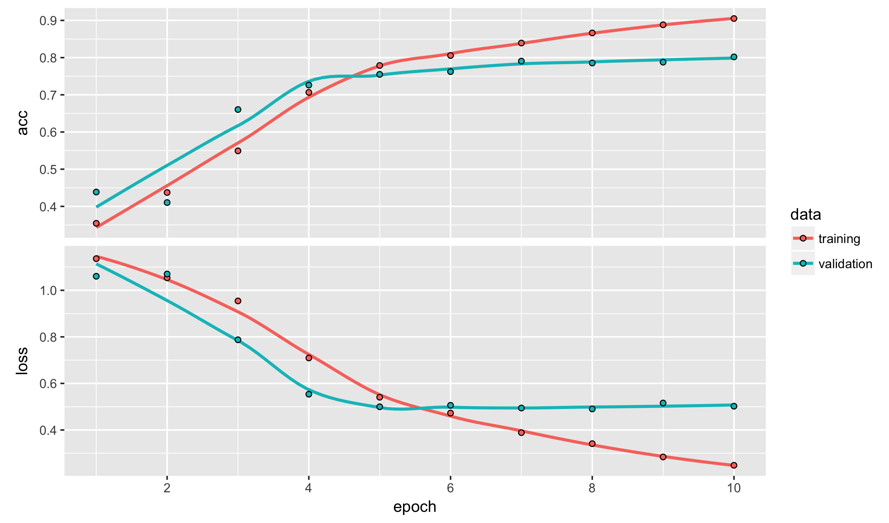
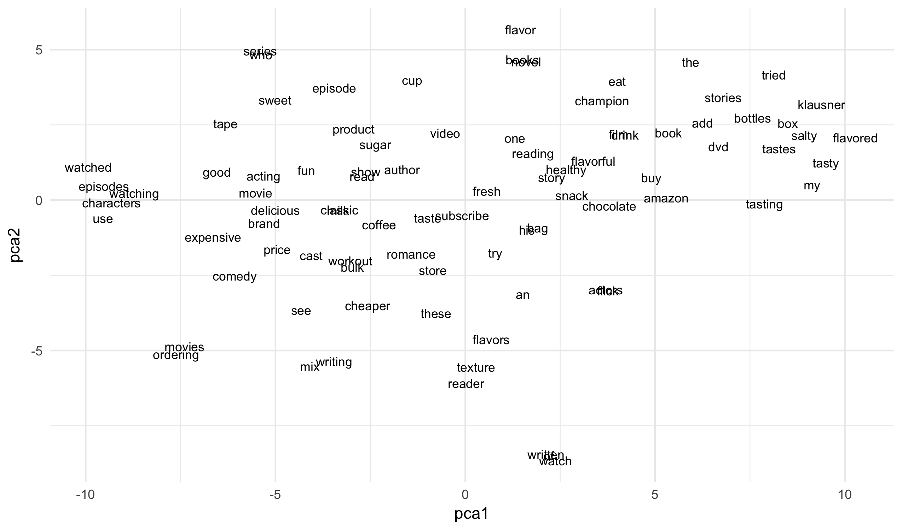
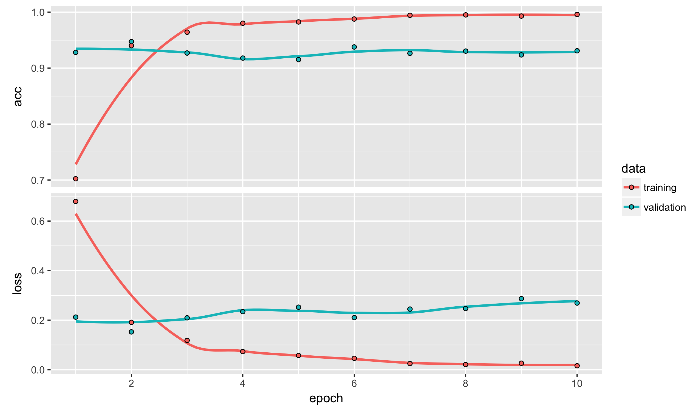
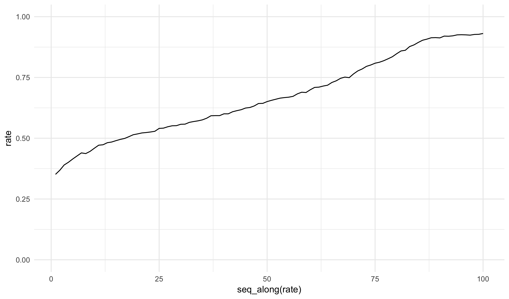
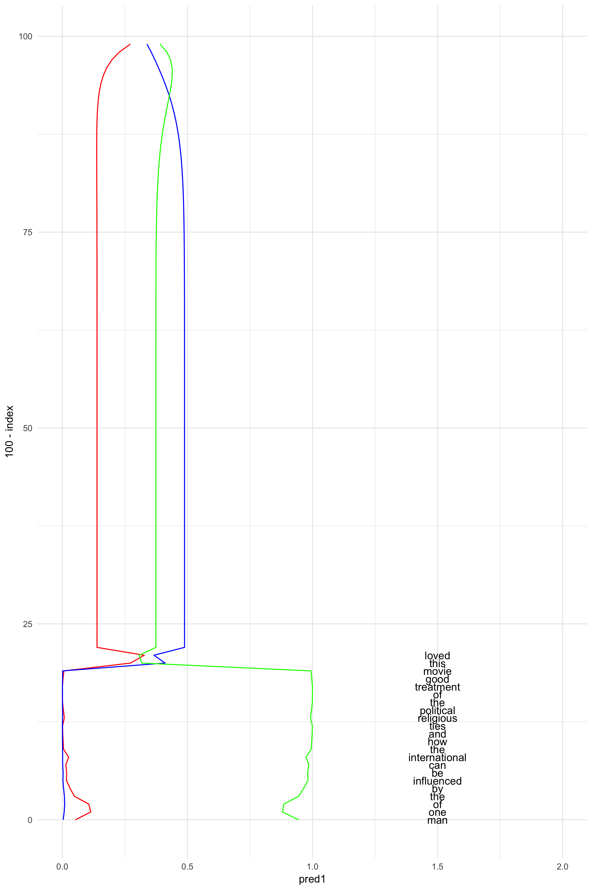
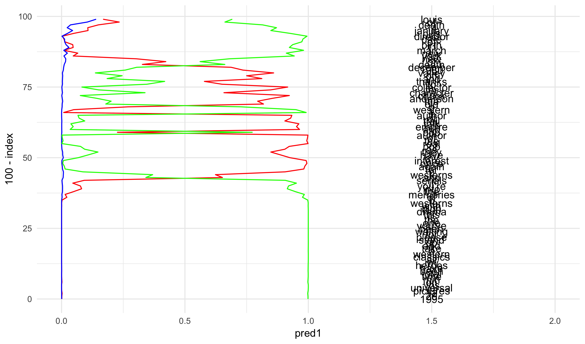
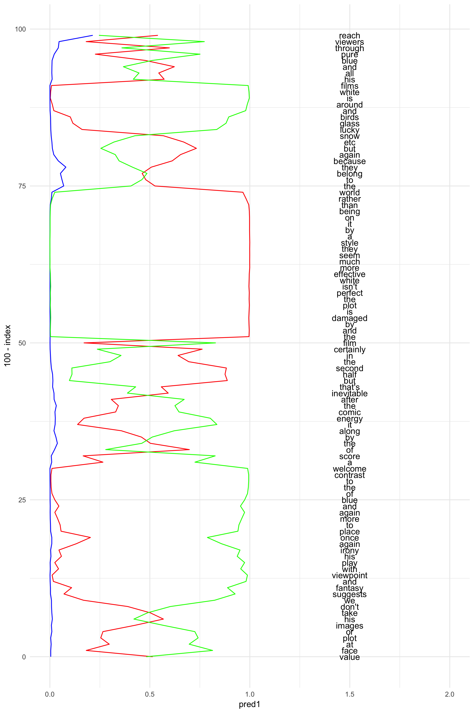
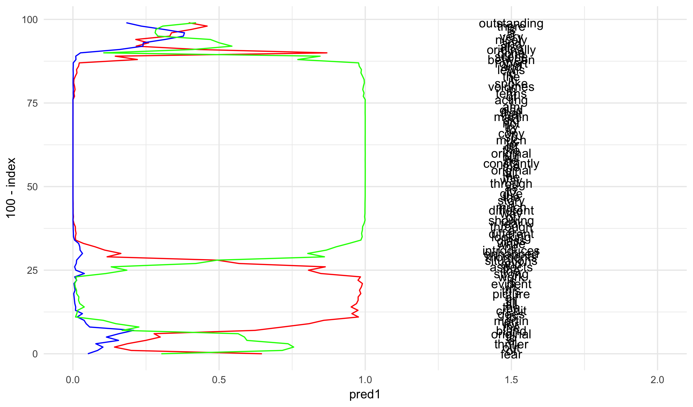
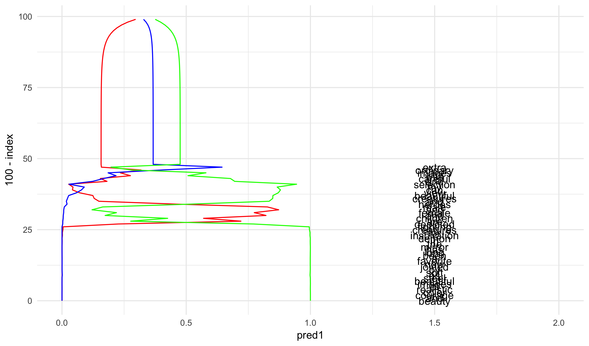
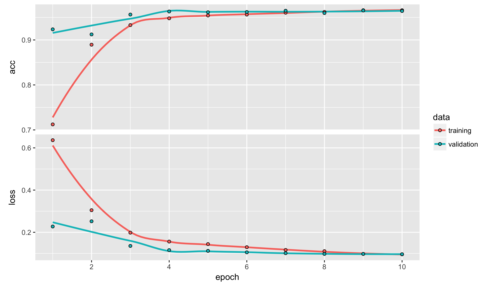


library(readr)
library(dplyr)



## Warning: package 'dplyr' was built under R version 3.4.2



library(ggplot2)
library(stringi)
library(keras)



## Warning: package 'keras' was built under R version 3.4.2



library(tokenizers)


## Recurent Neural Networks (RNN)

Recurrent neural networks address a concern with traditional
neural networks that becomes apparent when dealing with,
amongst other applications, text analysis: the issue of
variable width inputs.

This is also, of course, a concern with images but the
solution there is quite different because we can stretch and
scale images to fit whatever size we need at the moment. This
not so with words.

An equivalent framing of this problem is to think of a string
of text as streaming in over time. Regardless of how many words
I have seen in a given document, I want to make as good an
estimate as possible about whatever outcome is of interest at
that moment.

Using this idea, we can think of variable width inputs
such that each new word simply updates our current prediction.
In this way an RNN has two types of data inside of it:

- fixed weights, just as we have been using with CNNs
- stateful variables that are updated as it observes words
  in a document

We can also think of this as giving "memory' to the neural
network.

A third way of thinking about recurrent neural networks is to
think of a network that has a loop in it. However, the self-input
get's applied the *next* time it is called.

A fourth way of thinking about a recurrent neural network is
mathematically. We now have two parts to the update function
in the RNN:

$$ h_{t} = W x_t + b + U h_{t-1} $$

Notice that $U$ must always be a square matrix,
because we could unravel this one time further to yield:

$$ h_{t} = W x_t + b + U W x_{t-1} + U b + U^2 h_{t-2} $$

One confusing bit, at least for me the first time I saw RNNs, is
the relationship between time and samples. We typically restart
the state, or memory, of the RNN when we move on to a new sample.
This detail seems to be glossed over in most tutorials on RNNs,
but I think it clarifies a key idea in what these models are capturing.

In truth, an RNN can be seen as a traditional feedforward neural
network by unrolling the time component (assuming that there is
a fixed number of time steps).

While it is nice that we get a "running output" from the model, when
we train RNNs we typically ignore all but the final output to the
model. Getting the right answer after we have looked at the entire
document is the end goal, anyway. To do this, back-propogation can
be used as before.

While we could unroll the RNN into a FF network and apply the algorithms
for dense networks, for both memory consumption and computational
efficiency techniques exist to short-cut this approach.

## RNNs for product detection


amazon <- read_csv("https://statsmaths.github.com/ml_data/amazon_product_class.csv")



## Parsed with column specification:
## cols(
##   obs_id = col_character(),
##   train_id = col_character(),
##   category = col_integer(),
##   text = col_character()
## )



amazon <- amazon[stri_length(amazon$text) > 100,]
words <- tokenize_words(amazon$text)
vocab <- top_n(count(data_frame(word = unlist(words)), word),
                n = 5000)$word



## Selecting by n



id <- lapply(words, function(v) match(v, vocab))
id <- lapply(id, function(v) v[!is.na(v)])
X <- pad_sequences(id, maxlen = 100)
y <- amazon$category



X_train <- X[amazon$train_id == "train",]
X_valid <- X[amazon$train_id == "valid",]
y_train <- to_categorical(y[amazon$train_id == "train"] - 1, num_classes = 3)
y_valid <- to_categorical(y[amazon$train_id == "valid"] - 1, num_classes = 3)



model <- keras_model_sequential()
model %>%
  layer_embedding(input_dim = length(vocab) + 1,
                  output_dim = 128,
                  input_length = ncol(X)) %>%
  layer_simple_rnn(units = 64,
                   dropout = 0.2,
                   recurrent_dropout = 0.2,
                   return_sequences = FALSE) %>%
  layer_dense(units = 3, activation = 'softmax')



model %>% compile(loss = 'categorical_crossentropy',
                  optimizer = 'adam',
                  metrics = c('accuracy'))



history <- model %>% fit(X_train, y_train,
              batch_size = 32,
              epochs = 10,
              validation_data = list(X_valid, y_valid))
plot(history)



library(smodels)
library(glmnet)
token_list <- tokenize_words(amazon$text)
token_df <- term_list_to_df(token_list)
X <- term_df_to_matrix(token_df)
y <- amazon$category
X_train <- X[amazon$train_id == "train",]
y_train <- y[amazon$train_id == "train"]

model_glmnet <- cv.glmnet(X_train, y_train, nfolds = 5, family = "multinomial")
beta <- coef(model_glmnet, s = model_glmnet$lambda.min)
beta <- Reduce(cbind, beta)
glmnet_words <- rownames(beta[apply(beta != 0, 1, any),])[-1]



library(Rtsne)

embed <- model$get_layer(index = 1L)$get_weights()[[1]]
these <- match(glmnet_words, vocab)

tsne <- Rtsne(embed[these,], dims = 2, perplexity = 10)
df <- data_frame(pca1 = tsne$Y[,1],
                 pca2 = tsne$Y[,2],
                 bgram = glmnet_words)
ggplot(df, aes(pca1, pca2)) +
  geom_text(aes(label = bgram), size = 3) +
  theme_minimal()


## Long short-term memory (LSTM)

Because of the state in the model, words that occur
early in the sequence can still have an influence on
later outputs.

Using a basic dense layer as the RNN unit, however, makes it
so that long range effects are hard to pass on.

Long short-term memory was original proposed way
back in 1997 in order to alleviate this problem.

- Hochreiter, Sepp, and Jürgen Schmidhuber. "Long
  short-term memory." *Neural computation* 9, no. 8 (1997):
  1735-1780.

Their specific idea has had surprising staying power.
A great reference for dissecting the details of their
paper is the blog post by Christopher Olah:

- [Understanding-LSTMs](http://colah.github.io/posts/2015-08-Understanding-LSTMs/)

I will pull extensively from it throughout the remainder of
today's notes.

Some people consider LSTM's to be a bit hard to understand;
here is a diagram from the original paper that partially
explains where the confusion comes from!

In fact, though, basic idea of an LSTM layer is exactly
the same as a simple RNN layer.

It is just that the internal mechanism is just a bit more
complex, with two separate self-loops and several independent
weight functions to serve slightly different purposes.

The diagrams use a few simple mechanics, most of which
we have seen in some form in CNNs. The pointwise operation,
for example, is used in the ResNet architecture when creating
skip-connections.

A key idea is to separate the response that is passed back into
the LSTM and the output that is emitted; there is no particular
reason these need to be the same. The \textbf{cell state} is the
part of the layer that get's passed back, and is changed from
iteration to iteration only by two linear functions.

Next, consider the \textbf{forget gate}. It uses the previous
output $h_{t-1}$ and the current input $x_t$ to determine
multiplicative weights to apply to the cell state. We use a
sigmoid layer here because it makes sense to have weights
between $0$ and $1$.

Next, we have a choice of how to update the cell state. This
is done by multiplying an input gate (again, with a
sigmoid layer) by a tanh activated linear layer.

The cell state of the next iteration is now completely
determined, and can be calculated directly.

Now, to determine the output of the model, we want to
emit a weighted version of the cell state. This is done
by applying a tanh activation and multiplying by the
fourth and final set of weights: the output weights.
This passed both as an output to the LSTM layer as well
as into the next time step of the LSTM.

Over the years, variants on the LSTM layers have been given.
Confusingly, these are often presented **as** LSTM layers
rather than minor variants on the original technique. One
modification is to add *peepholes* so that the input,
forget, and output gates also take the current cell state
into account.

One natural extension is to set the input and forget
gates to be the negation of one another.

A more dramatically different alternative is known as
a Gated Recurrent Unit (GRU), originally presented in this
paper:

- Cho, Kyunghyun, Bart van Merriënboer, Dzmitry Bahdanau,
  and Yoshua Bengio. ``On the properties of neural machine
  translation: Encoder-decoder approaches."
  *arXiv preprint* arXiv:1409.1259 (2014).

One benefit is that is offers a slight simplification in
the model with no systematic performance penalty. Along
with LSTM, it is the only other model implemented in
keras, which should point to its growing popularity.

In short, in combines the input and cell states together,
and combines the forget and input gates. This results in
one fewer set of weight matrices to learn.

## LSTM and sequence visualization


words <-tokenize_words(amazon$text)
vocab <- top_n(count(data_frame(word = unlist(words)), word),
                n = 5000)$word



## Selecting by n



id <- lapply(words, function(v) match(v, vocab))
id <- lapply(id, function(v) v[!is.na(v)])
X <- pad_sequences(id, maxlen = 100)
y <- amazon$category

X_train <- X[amazon$train_id == "train",]
X_valid <- X[amazon$train_id == "valid",]
y_train <- to_categorical(y[amazon$train_id == "train"] - 1, num_classes = 3)
y_valid <- to_categorical(y[amazon$train_id == "valid"] - 1, num_classes = 3)



model <- keras_model_sequential()
model %>%
  layer_embedding(input_dim = length(vocab) + 1,
                  output_dim = 128,
                  input_length = ncol(X)) %>%
  layer_lstm(units = 64,
             dropout = 0.2,
             recurrent_dropout = 0.2,
             return_sequences = FALSE) %>%
  layer_dense(units = 3, activation = 'softmax')



model %>% compile(loss = 'categorical_crossentropy',
                  optimizer = 'adam',
                  metrics = c('accuracy'))



history <- model %>% fit(X_train, y_train,
              batch_size = 32,
              epochs = 10,
              validation_data = list(X_valid, y_valid))
plot(history)


## Outputting sequences


model_seq <- keras_model_sequential()
model_seq %>%
  layer_embedding(input_dim = length(vocab) + 1,
                  output_dim = 128,
                  input_length = ncol(X)) %>%
  layer_lstm(units = 64,
             dropout = 0.2,
             recurrent_dropout = 0.2,
             return_sequences = TRUE) %>%
  time_distributed(layer_dense(units = 3, activation = 'softmax'))

model_seq$set_weights(model$get_weights())

model_seq %>% compile(loss = 'binary_crossentropy',
                  optimizer = 'adam',
                  metrics = c('accuracy'))



pred <- predict(model_seq, X_valid)
dim(pred)



## [1] 1767  100    3



y_valid_num <- apply(y_valid, 1, which.max)
rate <- rep(NA_real_, dim(pred)[2])
for (j in seq_along(rate)) {
  y_pred <- apply(pred[,j,], 1, which.max)
  rate[j] <- mean(y_pred == y_valid_num)
}

qplot(seq_along(rate), rate, geom = "line") +
  scale_y_continuous(limits = c(0, 1)) +
  theme_minimal()



X_words <- matrix(c("", vocab)[X + 1], nrow = nrow(X))
pred <- predict(model_seq, X)
pred_class <- predict_classes(model_seq, X)
pred_class <- pred_class[,ncol(pred_class)]



see_text <- function(row_id) {

  df <- data_frame(pred1 = pred[row_id, , 1],
                   pred2 = pred[row_id, , 2],
                   pred3 = pred[row_id, , 3],
                   word = X_words[row_id, ],
                   index = 1:100)

  p <- ggplot(df, aes(y = 100 - index, x = pred1)) +
    geom_path(color = "red") +
    geom_path(aes(x = pred2), color = "blue") +
    geom_path(aes(x = pred3), color = "green") +
    scale_x_continuous(limits = c(0, 2)) +
    geom_text(aes(label = word), x = 1.5) +
    theme_minimal()
  plot(p)
}



see_text(200)



## Warning: Ignoring unknown parameters: linewidth



## Warning: Ignoring unknown parameters: linewidth



## Warning: Ignoring unknown parameters: linewidth



see_text(300)



## Warning: Ignoring unknown parameters: linewidth



## Warning: Ignoring unknown parameters: linewidth



## Warning: Ignoring unknown parameters: linewidth



see_text(1024)



## Warning: Ignoring unknown parameters: linewidth



## Warning: Ignoring unknown parameters: linewidth



## Warning: Ignoring unknown parameters: linewidth



misclass_ids <- which((pred_class + 1) != y)
see_text(misclass_ids[1])



## Warning: Ignoring unknown parameters: linewidth



## Warning: Ignoring unknown parameters: linewidth



## Warning: Ignoring unknown parameters: linewidth



see_text(misclass_ids[50])



## Warning: Ignoring unknown parameters: linewidth



## Warning: Ignoring unknown parameters: linewidth



## Warning: Ignoring unknown parameters: linewidth


## Transfer learning of embeddings


library(fasttextM)
ft_download_model("en")
ft_download_model("fr")



library(fasttextM)
ft_load_model("en")
ft_load_model("fr")



dim(ft_embed(c("horse", "dog", "cow")))



## [1]   3 300



ft_nn(c("cheese", "dog", "cow", "statistics"), lang_out = "fr")



##      [,1]           [,2]          [,3]        [,4]     [,5]
## [1,] "fromage"      "fromages"    "confiture" "beurre" "saucisson"
## [2,] "chien"        "chiens"      "chienne"   "chiot"  "chat"
## [3,] "vache"        "vaches"      "chèvre"    "cochon" "cochons"
## [4,] "statistiques" "statistique" "statistik" "stats"  "statistics"
##      [,6]              [,7]        [,8]            [,9]
## [1,] "confitures"      "pommes"    "babeurre"      "charcuterie"
## [2,] "lapin"           "dogue"     "cochon"        "caniche"
## [3,] "bétail"          "bœuf"      "chien"         "lapin"
## [4,] "statistiquement" "résultats" "statisticiens" "comptabilités"
##      [,10]
## [1,] "saucissons"
## [2,] "canin"
## [3,] "truie"
## [4,] "statistický"



X_embed <- ft_embed(as.vector(X_words), lang = "en")
X_embed[is.na(X_embed)] <- 0
X_embed <- array(X_embed, dim = c(nrow(X_words), ncol(X_words), 300))
X_embed[1:2,,1]



##          [,1]      [,2]     [,3]     [,4]     [,5]     [,6]      [,7]
## [1,]  0.00000  0.000000 0.000000 0.000000  0.00000  0.00000  0.000000
## [2,] -0.03628 -0.029467 0.050919 0.021199 -0.21341 -0.13952 -0.013758
##          [,8]      [,9]    [,10]    [,11]    [,12]    [,13] [,14]    [,15]
## [1,] 0.000000  0.000000  0.00000  0.00000  0.00000  0.00000     0 0.000000
## [2,] 0.048804 -0.065334 -0.13785 -0.21341 -0.25026 -0.04366     0 0.072622
##          [,16]    [,17]     [,18]     [,19]     [,20]     [,21]     [,22]
## [1,]  0.000000  0.00000  0.000000  0.000000  0.000000  0.000000  0.000000
## [2,] -0.065334 -0.32423 -0.037084 -0.062265 -0.027773 -0.031533 -0.080475
##         [,23]   [,24]    [,25]    [,26]   [,27]    [,28]     [,29]
## [1,] 0.000000 0.00000  0.00000 0.000000 0.00000  0.00000  0.000000
## [2,] 0.017906 0.11559 -0.21495 0.048804 0.10402 -0.13819 -0.025436
##         [,30]     [,31]    [,32]     [,33]     [,34]     [,35]    [,36]
## [1,]  0.00000  0.000000  0.00000  0.000000  0.000000  0.000000  0.00000
## [2,] -0.23227 -0.031533 -0.23227 -0.014772 -0.043457 -0.013758 -0.21341
##         [,37]    [,38]    [,39]     [,40]     [,41]     [,42]     [,43]
## [1,]  0.00000 0.084657 -0.10259 -0.422800 -0.400830 -0.171800  0.030817
## [2,] -0.18815 0.104020 -0.20356 -0.031533 -0.059967 -0.089165 -0.064206
##            [,44]     [,45]     [,46]     [,47]    [,48]     [,49]    [,50]
## [1,] -0.21341000 -0.068314 -0.139700  0.089866 -0.23417 -0.237600  0.00000
## [2,]  0.00030618  0.024987 -0.031533 -0.079192 -0.40083  0.039454 -0.21341
##          [,51]     [,52]    [,53]     [,54]    [,55]     [,56]    [,57]
## [1,] -0.014897 -0.058675 -0.30005  0.048804 0.000000 -0.400830 -0.44932
## [2,] -0.065334 -0.414520  0.17721 -0.400830 0.086397  0.014665 -0.11286
##           [,58]      [,59]    [,60]    [,61]     [,62]    [,63]    [,64]
## [1,]  0.0031471  0.0488040 -0.15571 -0.12156 -0.633940 -0.40083  0.15167
## [2,] -0.1016500 -0.0097697 -0.21341 -0.42965  0.048804  0.10402 -0.06144
##          [,65]    [,66]    [,67]     [,68]     [,69]    [,70]    [,71]
## [1,] -0.478240 -0.13239 -0.40255  0.000000 -0.014897 -0.24801 -0.30005
## [2,]  0.030644 -0.13952 -0.24864 -0.029945 -0.126860 -0.19964 -0.15975
##          [,72]   [,73]     [,74]     [,75]     [,76]     [,77]     [,78]
## [1,]  0.048804 0.00000 -0.029945 -0.336600  0.000000 -0.014897 -0.022498
## [2,] -0.012399 0.12367 -0.065334  0.035927 -0.053672  0.072622 -0.112860
##         [,79]    [,80]    [,81]     [,82]      [,83]     [,84]     [,85]
## [1,] -0.30005 0.048804  0.00000  0.035927 -0.0622650  0.141970 -0.079164
## [2,] -0.15975 0.048804 -0.12686 -0.214830  0.0079259 -0.043457 -0.062265
##         [,86]    [,87]     [,88]     [,89]   [,90]     [,91]     [,92]
## [1,] -0.40083 0.030817 -0.336600 -0.074474 0.00000  0.033184 -0.213410
## [2,]  0.10258 0.115590  0.024884 -0.043457 0.11559 -0.135470 -0.098853
##         [,93]     [,94]      [,95]    [,96]    [,97]    [,98]     [,99]
## [1,]  0.11559 -0.422800 -0.0095972 -0.40083 -0.13952 -0.33660 -0.043457
## [2,] -0.23338 -0.070176 -0.2314000  0.33092 -0.26762  0.10317  0.048804
##         [,100]
## [1,] -0.028108
## [2,] -0.098853



model <- keras_model_sequential()
model %>%
  layer_lstm(units = 64,
             dropout = 0.2,
             recurrent_dropout = 0.2,
             return_sequences = FALSE,
             input_shape = dim(X_embed)[-1]) %>%
  layer_dense(units = 3, activation = 'softmax')
model



## Model
## ___________________________________________________________________________
## Layer (type)                     Output Shape                  Param #
## ===========================================================================
## lstm_3 (LSTM)                    (None, 64)                    93440
## ___________________________________________________________________________
## dense_4 (Dense)                  (None, 3)                     195
## ===========================================================================
## Total params: 93,635
## Trainable params: 93,635
## Non-trainable params: 0
## ___________________________________________________________________________



model %>% compile(loss = 'categorical_crossentropy',
                  optimizer = 'adam',
                  metrics = c('accuracy'))



X_train <- X_embed[amazon$train_id == "train",,]
X_valid <- X_embed[amazon$train_id == "valid",,]
y_train <- to_categorical(y[amazon$train_id == "train"] - 1, num_classes = 3)
y_valid <- to_categorical(y[amazon$train_id == "valid"] - 1, num_classes = 3)

history <- model %>% fit(X_train, y_train,
              batch_size = 32,
              epochs = 10,
              validation_data = list(X_valid, y_valid))
plot(history)



amazon$pred_category <- predict_classes(model, X_embed) + 1
tapply(amazon$pred_category == amazon$category,
       amazon$train_id, mean)



##      test     train     valid
##        NA 0.9758491 0.9643463


## Resources

If you would like a good, comprehensive, and empirical
evaluation of the various tweaks to these recurrent
structures, I recommend this paper:

- Greff, Klaus, Rupesh Kumar Srivastava, Jan Koutník, Bas R. Steunebrink,
  and Jürgen Schmidhuber. "LSTM: A search space odyssey."
  *arXiv preprint* arXiv:1503.04069 (2015).

As well as this article:

- Jozefowicz, Rafal, Wojciech Zaremba, and Ilya Sutskever.
  "An empirical exploration of recurrent network architectures."
  In *Proceedings of the 32nd International Conference on Machine
  Learning* (ICML-15), pp. 2342-2350. 2015.

Though, once you fully understand the LSTM model, the
specifics amongst the competing approaches typically do not
require understanding any new big ideas.

